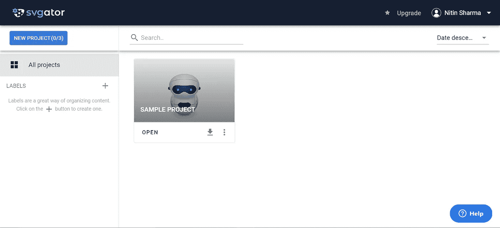
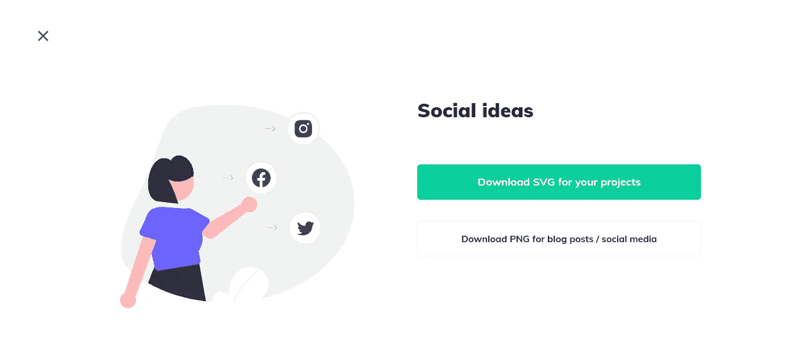
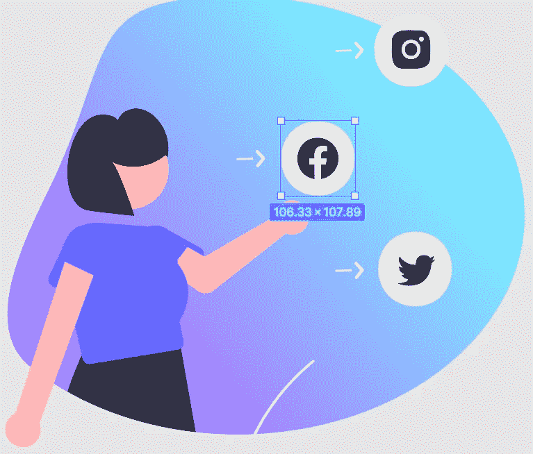
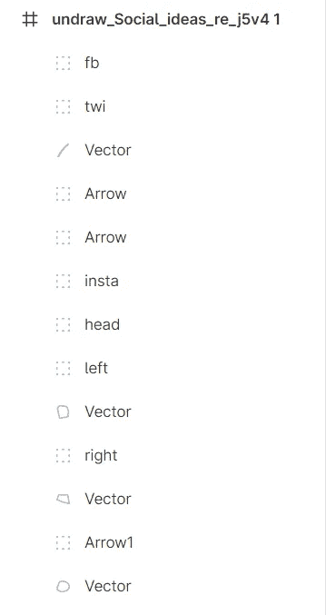
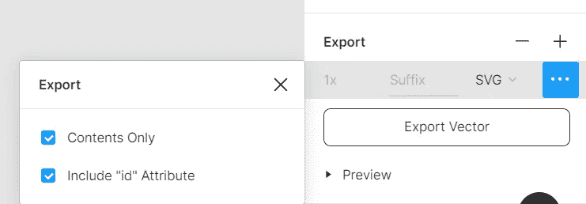
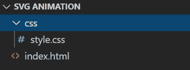
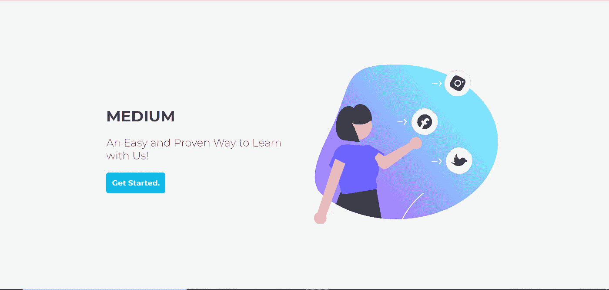

# 如何为你的网站创建一个 SVG 动画插图

> 原文：<https://javascript.plainenglish.io/how-to-create-an-svg-animation-illustration-for-your-website-d5a31ba2e712?source=collection_archive---------8----------------------->

## SVG 动画可以让网站更有创意

Source: Canva

你可能见过几个由上述动画或类似动画组成的网站。简直就是 SVG 动画。

大多数网站使用 SVG 动画来使他们的网站看起来更具交互性。

我写了一篇文章，解释如何使用 Figma 创建 SVG 动画——用 CSS 插图。但是我觉得不深入。这是一个快速学习者或有任何网页开发经验。

 [## 使用 Figma 创建一个 SVG 动画——带有 CSS 的插图。

### SVG 动画，有助于增强您的网站外观。

medium.com](https://medium.com/code-blog/create-an-svg-animation-illustration-with-css-using-figma-dda45ece81e6) 

所以我在这里写了一篇关于 SVG 和所有那些很酷的东西的深度文章。

我们开始吧。

SVG 动画是为[网站开发者](https://medium.com/code-blog/getting-started-and-earning-105-813-yr-as-a-web-developer-for-beginners-19b2cd26fcc2)准备的。如果你不是 Web 开发人员，不要紧张。我是来帮助你的，这里有超过 [80+的免费资源来学习网页开发](/80-free-resources-for-web-designers-and-web-developers-in-2021-f400be2875ea)。

除此之外，我们都在使用 YouTube。所以我们也可以从 YouTube 上学习网络开发。

现在我们来谈谈 SVG。

# 什么是 SVG？

SVG(可缩放矢量图形)只是一个允许我们在网站上显示矢量图像的代码。

更清楚地说，正如可缩放矢量图形这个名称所适用的那样:

1.  **可缩放**:你可以缩放你的图像而不损失质量，因为它不是像素化的。
2.  **矢量**:光栅图像由分辨率看起来很怪异的像素组成。为了解决这个问题，矢量图像应运而生。简单的矢量图像是由数学公式构建的。例如，Photoshop 基于像素，而 Illustrator 基于矢量。
3.  **图形**:图形是一个对象的图像、设计或视觉表现。

因此 SVG 由三个词组成——可伸缩、矢量和图形。

# 1.使用 SVGator 的 SVG 动画

在继续下一步之前，有多种方法可以创建 SVG 动画。

比如 [SVGator](https://www.svgator.com/) 是一个免费的制作 SVG 动画的网站。

这里有一个 YouTube 视频对此进行了更多的解释。

# 如何开始使用 SVGator

SVGator 对初学者来说是免费的，你可以每月创建 3 个项目。

你只需要注册就可以了。而且还有[几个入门教程](https://www.svgator.com/tutorials)。

注册后，你可以看到一个类似的屏幕。

Source: SVGator

你必须打开一个项目，继续做这些事情。

# 2.使用 Figma 的带 CSS 的 SVG

第二种方式是用 Figma 通过 CSS。

在这里，我将解释它的一切。基本上，我将使用 HTML 和 CSS 创建一个 SVG 插图。

我们开始吧！

## 下载插图

访问 [unDraw](https://undraw.co/) 获取您喜欢的网站插图。这是一个用于说明的开源平台。

我要拿一本名为《社会观念》的插图，去搜索一下。

Illustration from unDraw

你会看到上面的插图。去下载 SVG 格式的。

Source: unDraw

单击插图，然后单击“为您的项目下载 SVG”。

不知道为什么要下载 SVG 格式的？我是来帮你的。

简单来说，它是一个代码而不是一个图像，我们可以在 CSS 中控制它来添加动画。

## 打开 Figma 并修改它

如果我们根据需要修改 SVG 就足够了。所以我们尝试使用 Figma。Figma 是一个免费且易于使用的协作界面设计工具。

如果您没有帐户，请创建一个帐户并创建一个新文件，然后单击右上角的“+”图标。

现在，当文件打开时，拖放从 unDraw 下载的 SVG 图像。

玩它，设计和修改完整的插图。

我的 SVG 图片修改后是这样的。

如果你知道 Figma，那么使用 Ctrl+G 组合键初始化你要添加 CSS 动画的图标。

如下图所示。我们正在命名，这样我们就可以用 id 属性在代码中命名。我们都知道 id 属性帮助我们添加 CSS 代码。

可以看看下面。

我已经用类似的方式为脸书图标 fb 右为女孩的右手，左为左手。

现在让我们导出它。在右边向下滚动，你可以看到这样的导出选项。

使用 SVG，通过点击 3 个点选中“包含 id 属性”,然后导出它。

## 添加 HTML 代码

打开任何你使用的文本编辑器，比如 VS 代码或者 Sublime 文本。

创建一个名为 SVG 动画的文件夹和两个名为 index.html 和 style.css 的文件，如下所示。

Image from Author.

在 index.html 内粘贴下面的代码。

你可以看到<svg>并以</svg>结束，这实际上是我们在 Figma 中制作的插图。在这里你也可以粘贴你的 SVG 代码。

在这里，我们还链接了 CSS 文件夹，这样我们就可以很容易地访问它。

## 添加 CSS 代码

现在是时候添加 CSS 代码了，让它真的很棒。

这里我们导入了 Google 字体，然后编写了 CSS 代码。

使用动画来更有效地处理关键帧，仅此而已。

它将看起来像下面显示…显然与动画。

Image from Author

最后，您可以使用这个代码，并根据您的意愿进行更改。

有反应吗？是的，它完全响应。

## 结论

觉得这篇文章有用？如果有，一定要在评论里让我知道。也可以在 Medium 上关注我( [Nitin Sharma](https://nitinfab.medium.com/) )以后更多类似的内容。感谢阅读。再见！

*这半部分原本摘自* [*我的第二篇*](https://medium.com/code-blog/create-an-svg-animation-illustration-with-css-using-figma-dda45ece81e6) *。*

***如果你喜欢我的工作，想要支持，可以*** [***请我喝杯咖啡！***](https://www.buymeacoffee.com/nitinfab)

*更多内容请看*[***plain English . io***](https://plainenglish.io/)