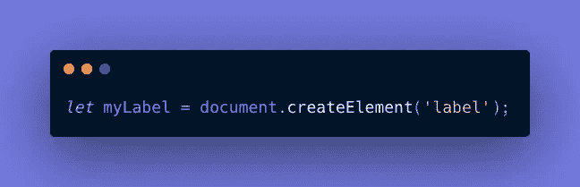
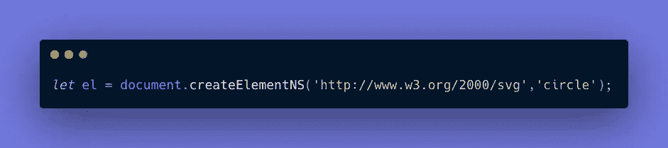

# 如何用普通 JavaScript 创建 SVG 元素

> 原文：<https://javascript.plainenglish.io/how-to-create-an-svg-element-with-vanilla-javascript-a6b140745196?source=collection_archive---------2----------------------->


Image by [vectorjuice](https://www.freepik.com/free-vector/designers-are-working-desing-web-page-web-design-user-interface-user-experience-content-organization_13450330.htm#:~:text=have%20to%20attribute-,vectorjuice,-Every%20time%20you) on [freepik.com](http://freepik.com)

在之前的教程[中，我描述了如何构建一个简单的 JavaScript 方法来动态地向页面添加 HTML 元素。在这个过程中，我们设置它的属性，比如`id`，以及它的属性，包括一个`onclick`事件监听器。在本教程中，我们将建立一个类似的方法来添加一个标量矢量图形(SVG)。](/how-to-build-complex-dom-elements-quickly-b3ead8e09647)

SVG 在某些方面类似于 HTML 元素。它们是为 web 构建的，它们有一个由分层部分组成的文档对象模型(DOM ),它们可以用 JavaScript 添加和调整，它们可以用 CSS 设计样式。

然而，如果您尝试使用完全相同的 JavaScript 语法来添加和整形 SVG 元素，那是行不通的！我们来调查一下原因。

# 比较语法

让我们比较一下用于添加和修改 HTML 元素的 JavaScript 语法和用于 SVG 元素的语法。然后，我们将使用这些知识来编写我们的 SVG 创建方法。

## 添加元素

添加 HTML 元素需要编写如下代码:



同时，创建一个 SVG 元素需要更多的努力，因为它需要一个名称空间声明。



请注意主要区别:

*   我们不使用`createElement`，而是使用`createElementNS`，它创建了一个命名空间元素。
*   我们包括了 SVG 的名称空间名称`http://www.w3.org/2000/svg`，而不是只有一个参数，作为第一个参数。

为什么 SVG 必须有名称空间？因为 HTML 元素有默认的名称空间，SVG 是可以出现在 HTML 页面上的两种 XML 方言之一——另一种是 MathML。由于有些属性，比如`title`，可能以任何一种类型出现，浏览器的用户代理必须知道它处理的是什么类型才能正确解析它。

## 设置类别

可以使用以下语法设置 HTML 元素的类名。

```
myLabel.className = 'quick-label';
```

相反，设置 SVG 元素的类涉及到设置类名的基值。

```
circle.className.baseVal = 'quick-circle';
```

`baseVal`属性用于将其与`animVal`区分开来，后者用于在 SVG 元素动画时指定属性。在应用任何动画之前使用`baseVal`属性。

## 设置属性

可以通过以下方法设置 HTML 元素的属性:

```
label.setAttribute('data-foo','bar');
```

虽然上面的方法似乎适用于 SVG，但是最好使用`NS`让您的方法“知道名称空间”这样，您可以避免使用冲突的标签或属性名称。

```
circle.setAttributeNS(null, 'fill','#f06d06');
```

请注意，在其他参数之前还有一个额外的参数，它被设置为`null`。

既然我们已经看到了 JavaScript 如何处理 HTML 和 SVG 的这些差异，那么让我们看一个样例用例，然后构建我们的方法。

# 创造我们的方法

让我们写一个叫做`createSVG`的方法，将 SVG 元素添加到网页中。以这种方式添加 SVG 允许我们用 JavaScript 和 CSS 以细粒度的方式控制它。

## 示例使用案例

我们应该能够使用它将 SVG 添加到一个简单的`<div>`元素中，得到下面的标记。

A sample circle

我们想使用我们的方法首先向 DOM 添加一个`svg`元素，然后向那个`svg`添加一个`circle`元素。

接下来，我们想在 SVG 父元素中添加一个圆。

在上面的例子中，我们调用了两次`createSVG`方法。这样做时，我们传入一个对象，该对象具有应该在结果元素中显示的属性。让我们写一个方法来处理这个问题。

## 起始代码

在我们的 HTML 中，让我们创建一个可以添加内容的`<div>`元素。

```
<div id="root"></div>
```

使用 JavaScript，让我们创建一个空对象。

```
let utils = {};
```

现在让我们创建一个初始包装器来确定我们方法的范围。

```
(function(context) { method goes here})(utils);
```

## 开始该方法

在我们的包装器中，让我们为`createSVG`编写一个方法外壳。注意，我们将使用一个单字母变量`o`来表示传入的对象。

```
context.createSVG = function(o) {};
```

为了声明 SVG 元素，我们使用了`document.createElementNS`，它有两个参数:

*   一个 SVG 指示器，`[http://www.w3.org/2000/svg](http://www.w3.org/2000/svg)`
*   SVG 的类型，默认为圆形。

这里我们初始化了 XML 名称空间的`xmlns`，以及`type`。然后我们将元素初始化为`el`。

```
context.createSVG = function(o) { let xmlns = "[http://www.w3.org/2000/svg](http://www.w3.org/2000/svg)"; let type = o.type || 'circle'; let el = document.createElementNS(xmlns, type);
};
```

## 设置类和属性

如果一个`className`作为一个对象属性通过，我们使用`className.baseVal`设置这个类。

```
if (o.className) {       
    el.className.baseVal = o.className;  
}
```

之后，只要`attrs`存在，我们就遍历对象的`attrs`属性中的键。

Iterating through object keys.

为了让我们可以对对象使用 camelCase，对 HTML 属性使用破折号语法，我们使用正则表达式`/[A-Z]/g`来查找任何大写字母，并用破折号(`-`)后跟相应的小写字母来替换每个字母。

之后，我们要做的就是返回追加的元素。

```
return el;
```

## 完整的代码和演示

下面是完整的方法。

最后，下面是一个展示 HTML 方法和 SVG 方法的演示。

## 建议的后续步骤

*   分叉上面的演示，并使用它来创建更复杂的 SVG 图形。
*   编写一个在 SVG 创建后改变其类名的方法。
*   一旦你创建了你的 SVG，试着用 CSS 或者 [GSAP](https://greensock.com/gsap/) 库来制作动画。

我希望这篇教程能让你更好地理解如何用 JavaScript 动态添加 SVG 图形。

# 在别处

下面的文章分解了我用来将字符串从 camelCase 转换成 dash 语法的逻辑。

[](/from-camel-case-to-dash-syntax-in-javascript-c685206ee682) [## JavaScript 中从骆驼大小写到破折号的语法

### 仔细看看一个概念丰富的代码片段。

javascript.plainenglish.io](/from-camel-case-to-dash-syntax-in-javascript-c685206ee682) 

下面的资源有一些关于`baseVal`和`animVal`的附加信息。

 [## 基本数据类型和接口- SVG 2

### 在这个规范中，属性是用一个属性定义表来定义的，它看起来像这样:在值…

www.w3.org](https://www.w3.org/TR/2015/WD-SVG2-20150709/types.html) 

下面的参考资料有更多关于 SVG 命名空间的信息。

[](https://developer.mozilla.org/en-US/docs/Web/SVG/Namespaces_Crash_Course) [## 名称空间速成班- SVG:可缩放矢量图形| MDN

### 作为一种 XML 方言，SVG 是命名空间的。理解名称空间的概念以及如何使用它们是很重要的，如果…

developer.mozilla.org](https://developer.mozilla.org/en-US/docs/Web/SVG/Namespaces_Crash_Course) 

*更多内容尽在*[***plain English . io***](http://plainenglish.io/)