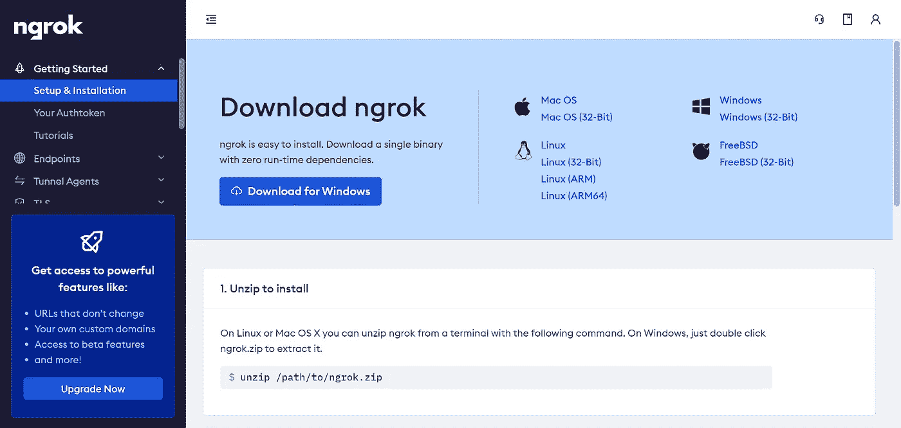
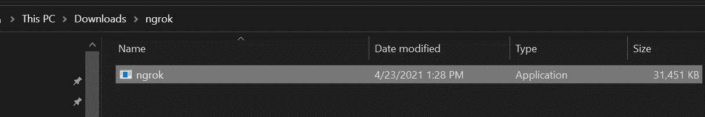
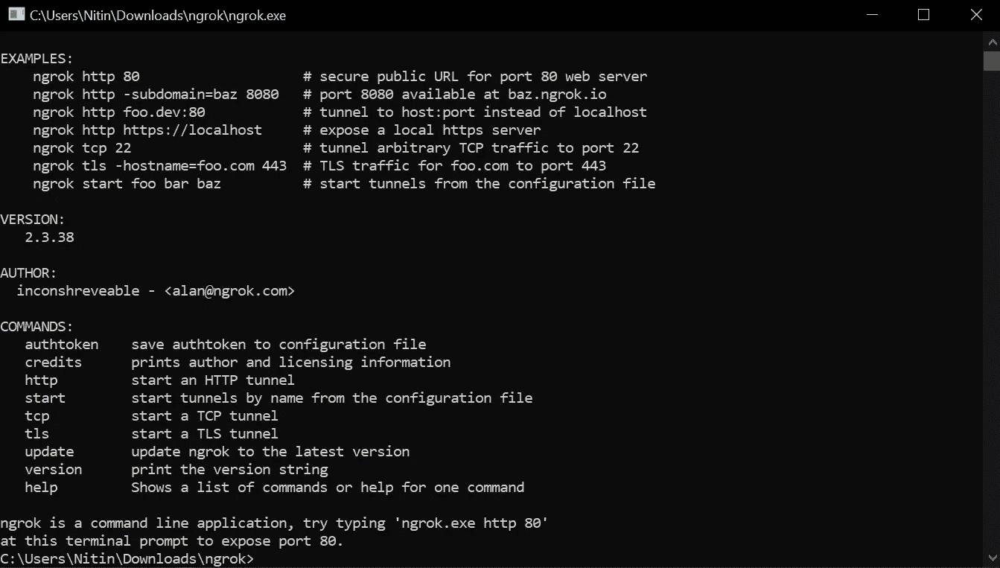
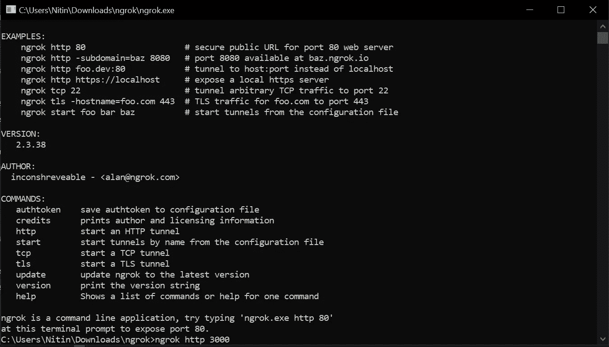
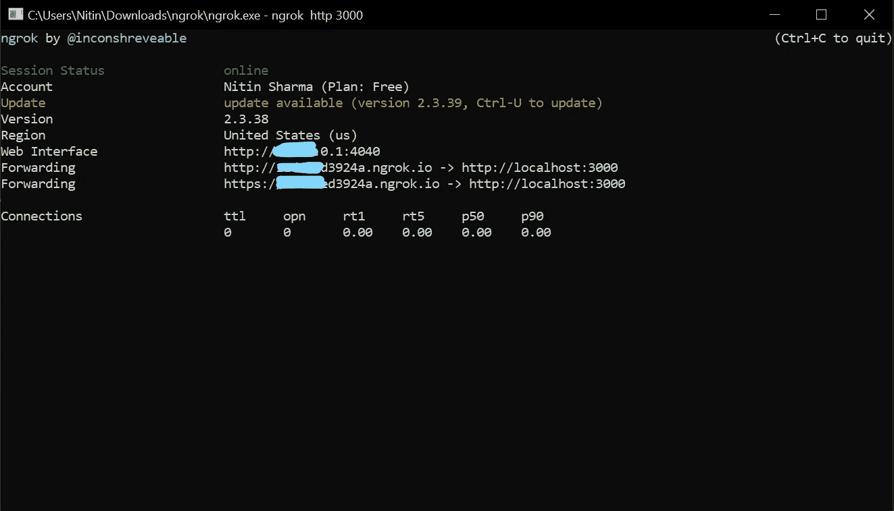

# 如何使用 Ngrok 在几秒钟内创建和本地托管您的网站

> 原文：<https://javascript.plainenglish.io/how-to-create-and-locally-host-your-websites-in-seconds-using-ngrok-44b5d94abbd9?source=collection_archive---------2----------------------->

## Ngrok 允许我们通过链接显示本地主机。简单来说，你可以通过 Ngrok 生成的链接向你的团队、客户或老板展示你的工作。


Photo by [Glenn Carstens-Peters](https://unsplash.com/@glenncarstenspeters?utm_source=medium&utm_medium=referral) on [Unsplash](https://unsplash.com?utm_source=medium&utm_medium=referral)

先说个例子。

假设我在为一家公司或初创公司工作，为他们创建网站。所以我将使用线框，模型，和其他一切。但是过了一段时间，我想给他们看看我的作品。

我该怎么做呢？这可能是通过与 Netlify 或 Heroku 托管。但 Heroku 需要时间来设置，Netlify 没有后端主机。

那我们该怎么办？使用 GitHub 库？这也需要时间，并且其他人必须克隆或下载存储库来运行它。

嗯，*然后*我们该怎么办？正因为如此，你需要 Ngrok。

我再举一个例子解释一下。我是一名自由职业者，使用 MERN (MongoDB，Express，React，Node.js)堆栈为客户创建网站。我的一个客户让我提供代码。

我给了他代码，但是他发消息给我说他对我的工作不满意。

后来，他用同样的代码建立了一个网站，却没有给我报酬。

在这些情况下我会怎么做？通常，我什么也做不了。

在这里，Ngrok 会帮助你。

怎么会？你可以给客户发送一个 Ngrok 链接，他/她就能完整地看到网站。

# 我是如何开始使用 Ngrok 的

当我们创建一个网站或应用程序时，我们都在本地开发工作。本地开发使得改变我们的代码变得很快。我们甚至使用实时服务器或热重装。

为了展示我们的网站，我们主要使用 Github pages、Heroku、Netlify。但是也有其他的软件。

让我们从头开始。

我正在和一家初创公司合作，他们想看看我的作品。几乎每次，我都要上传到 GitHub。

他们对 GitHub 不满意，因为他们必须克隆和使用它。

后来，他们问我是否有什么捷径可以看到我的作品。

我请他们给我一天时间，我会努力找出对我们俩来说最短的路。

那一天，我研究了很多，发现了 Ngrok。

它到底是什么？Ngrok 允许我们通过链接显示本地主机。简单来说，你可以通过 Ngrok 生成的链接向你的团队、客户或老板展示你的工作。

为此，您必须编写一行代码，仅此而已。

# **Ngrok 是什么？**

Ngrok 允许我们通过链接显示本地主机。简单来说，你可以通过 Ngrok 生成的链接向你的团队、客户甚至老板展示你的作品。

我们可以用 Ngrok 做什么？我们可以做很多事情。

例如:

根据 ngrok.com 的，我们可以创造:

1.  公开本地 web 服务器的公共 URL。
2.  用于在移动设备上测试的公共 URL。
3.  用于构建 webhook 集成的公共 URL。
4.  用于向客户端发送预览的公共 URL。
5.  用于 SSH 访问您的 Raspberry Pi 的公共 URL。
6.  用于测试聊天机器人的公共网址。

# 如何开始

Ngrok 的入门非常简单，几秒钟就能上手。

**第一步:从其官网下载 Ngrok】**

基于你的操作系统，点击从[下载 Ngrok。为此我将使用 Windows 操作系统。](https://ngrok.com/download)

**第二步:解压 Ngrok**

下载完 Ngrok 之后，就该解压了。我已经把它解压到我的下载文件夹里了。

**第三步:连接您的帐户**

最后一步是将您的帐户连接到 Ngrok。为此，你必须注册 Ngrok。

注册后，你会从仪表板上得到一个安装和使用 Ngrok 的清晰描述。



Source: Ngrok

在这里，您将获得您的 authtoken 以及:

```
ngrok authtoken 1rneiwnoe0o3rrniniqsfUXFcZ_5Hj6HjissbEPLG
```

上面的 authtoken 不起作用，所以不要使用它，而是使用您的。

现在让我们连接您的帐户。

双击解压后的 Ngrok 文件夹。



之后，双击 Ngrok 应用程序。

然后会弹出一个命令提示符。



在里面粘贴下面的命令和你的 authtoken，就这样。

```
ngrok authtoken <your_auth_token>
```

如需帮助，您可以使用此命令。

```
ngrok help
```

# 如何使用 Ngrok

假设我正在本地创建一个 React 项目。为了运行它，我将使用`npm start`在`localhost: 3000`中打开它。

现在我的 localhost 运行在端口 3000 上，所以我可以在 Ngrok 命令提示符下使用下面的命令来运行 Ngrok。

```
ngrok http 3000
```



它将允许我通过提供 url 向任何人显示我的本地主机。

如下图。



复制 Ngrok 提供的链接并发送给任何人。

今天就到这里，谢谢。

# 让我们结束吧

我希望你觉得这篇文章很有趣。这篇文章旨在帮助读者掌握关于 Ngrok 的有价值的信息，并在不太费力的情况下明确主题的基础。

不要犹豫留下反馈或张贴您的疑问。

目前就这些——谢谢！

*可以* [*关注我*](https://medium.com/@nitinfab) *或者看一些我的其他故事。*

[](/5-ways-to-earn-money-as-a-developer-1e42e694a078) [## 开发人员挣钱的 5 种方法

### 从新手到专家:成功的深度指南

javascript.plainenglish.io](/5-ways-to-earn-money-as-a-developer-1e42e694a078) [](/7-wealth-generating-ideas-for-web-developers-3cd9f1bf8718) [## 7 个为网络开发者创造财富的想法

### 最后一个是我的最爱！

javascript.plainenglish.io](/7-wealth-generating-ideas-for-web-developers-3cd9f1bf8718) [](/youtube-channels-that-helped-me-become-a-self-made-web-developer-8644621f4bfe) [## YouTube 频道帮助我成为了一名白手起家的网络开发者

### 一个白手起家的 web 开发人员的故事，他对编码没什么兴趣。

javascript.plainenglish.io](/youtube-channels-that-helped-me-become-a-self-made-web-developer-8644621f4bfe) [](/how-i-would-learn-front-end-web-development-if-i-had-to-start-over-again-24e6228050d0) [## 如果我必须重新开始，我将如何学习前端 Web 开发

### 一个白手起家的 web 开发者的故事。

javascript.plainenglish.io](/how-i-would-learn-front-end-web-development-if-i-had-to-start-over-again-24e6228050d0) 

[*更多内容尽在 plainenglish.io*](http://plainenglish.io/)