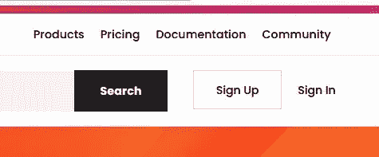
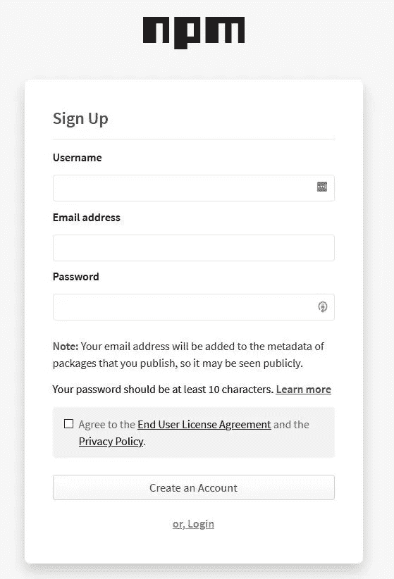
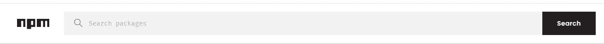
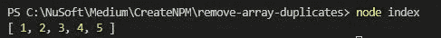
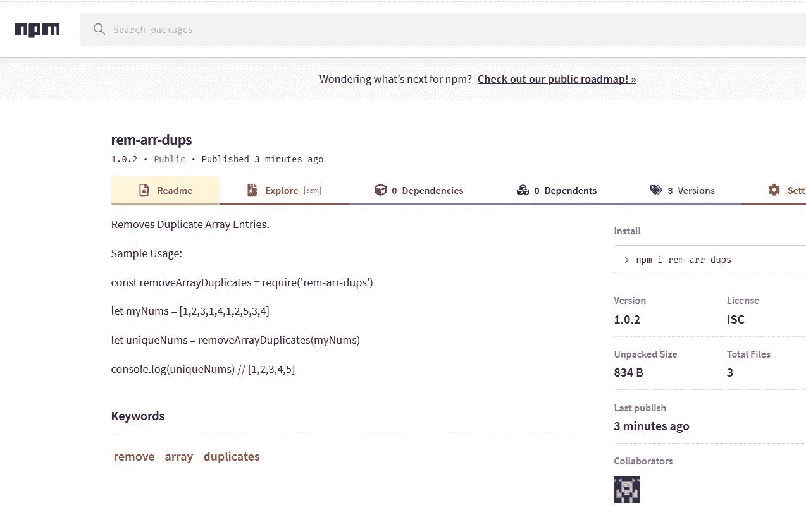

# 如何创建和发布您自己的 NPM 套餐

> 原文：<https://javascript.plainenglish.io/how-to-create-and-publish-your-own-npm-package-ce065fcd31db?source=collection_archive---------1----------------------->

## NPM 套餐

## 在 NPM 注册中心创建一个帐户，为你的包编写一些代码并发布


Photo by [Jess Bailey](https://unsplash.com/@jessbaileydesigns?utm_source=medium&utm_medium=referral) on [Unsplash](https://unsplash.com?utm_source=medium&utm_medium=referral)

你有没有想过你安装的那些 **npm** 软件包是从哪里来的？好了，不用再想了，它们来自像你这样的开发者！

# 我们将做什么

在本教程中，我们将使用以下步骤创建并向 NPM 注册中心发布一个 NPM 包。

*   创建 NPM [注册账户](https://www.npmjs.com/)。
*   写一些代码，这将成为你的 NPM 包。
*   在本地测试。
*   添加**模块。导出**将你的软件包中提供的内容导出给安装它的人。
*   将您的软件包发布到 NPM 注册中心。
*   使用 npm install 测试您的 NPM 软件包。

*我们将专注于流程，而非包装本身。因此，我们将保持包装简单。*

**我们将创建一个从阵列中剥离副本的包。**

一旦发布，如果用户安装我们的软件包，使用 npm install，他们可以很容易地从一个数组中删除重复项。

**重要提示:**NPM 注册中心的包名必须唯一。因此，您可能需要更改数据包的名称。在教程中，您会被提醒在适当的时候这样做。

或者您可以按照这些步骤创建您自己的包，除了从数组中删除重复项之外，还可以执行其他操作。

# 您需要什么

*   [节点安装](https://nodejs.org/en/download/)
*   NPM 命令行工具。这是在您安装 Nodejs 时安装的。
*   我建议您安装 git，并将它上传到远程存储库中。*我不会在本教程中添加这些步骤。*

我将使用 Visual Studio 代码(VSCode。)您可以在这里获得它[。](https://code.visualstudio.com/)

# 在 NPM 登记处开户

设置账户时，点击此处。

1.  点击**签约**按钮。



https://npmjs.org

2.输入用户名、电子邮件地址和密码。 ***用户名必须唯一。***

*一定要记住你的凭证，你会需要它们来发布。您还会收到一封确认您帐户的电子邮件。*



Sign up form

# 书写您的代码

1.  创建一个名为**的文件夹，删除数组副本**。
2.  打开 VSCode 并打开该文件夹，删除重复的数组。
3.  打开一个新的终端窗口。
4.  现在用默认值初始化您的**包。**

```
npm init -y
```

*您可以稍后在 package.json 中更改默认值。*

5.打开 package.json 文件。

```
{
 ** "name": "remove-array-duplicates",**
  "version": "1.0.0",
  "description": "",
 ** "main": "index.js",**
  "scripts": {
    "test": "echo \"Error: no test specified\" && exit 1"
  },
  "keywords": [],
  "author": "",
  "license": "ISC"
}
```

> 就创建和发布 NPM 包而言，Package.json 是最重要的**文件。没有它，你就不能出版。**

*在 **main** 键中命名的文件，在本例中是 index.js，在用户安装之后，它将成为您的包的入口点。一旦用户安装了软件包，您从该文件中导出的内容将为用户提供功能。*

***重要提示**:软件包名称在 NPM 注册表中必须是唯一的。因此，如果 **name** 键的**值**(在我们的例子中为**remove-array-duplicates**)已经存在于 NPM 注册表中，那么您的发布将会失败。*

***你可以通过[登录](https://www.npmjs.com/package/signin)在 NPM 注册表**中搜索这个名字。如果包存在，将 package.json 中的 **name** 字段改为惟一的。你很可能需要这样做。*

**

*Search the NPM registry for the name of your package*

*6.创建一个名为 **index.js.** 的新文件*

*7.在 index.js 中输入以下代码。*

```
*let uniqueArr = []function removeArrayDuplicates(arr){
// Accepts an array from which the duplicates
// will be removedif (!Array.isArray(arr)){

    arr = []
}let theSet = new Set(arr)let uniqueArr = [...theSet]return uniqueArr}*
```

# *在本地测试您的代码*

1.  *添加下面以粗体显示的代码进行本地测试。*

```
*let uniqueArr = []function removeArrayDuplicates(arr){
// Accepts an array from which the duplicates
// will be removedif (!Array.isArray(arr)){

    arr = []
}let theSet = new Set(arr)let uniqueArr = [...theSet]return uniqueArr}**// Testing Only
let myNums = [1,2,3,1,4,1,2,5,3,4]
let uniqueNums = removeArrayDuplicates(myNums)****console.log(uniqueNums)***
```

*2.在终端窗口类型中，*

```
*node index*
```

*3.您的输出应该类似于此。*

**

*Output of your future package*

# *发布您的包*

1.  *用**模块替换测试代码。导出**语句。*

*当其他人安装软件包时，您导出的内容将可供导入。*

```
*let uniqueArr = []function removeArrayDuplicates(arr){
// Accepts an array from which the duplicates
// will be removedif (!Array.isArray(arr)){

    arr = []
}let theSet = new Set(arr)let uniqueArr = [...theSet]return uniqueArr}**module.exports = removeArrayDuplicates***
```

*2.接下来让我们检查您的 package.json。*

*记住名称**在 NPM 注册表中必须是唯一的**。必要的话换一个。你可以在这里查看[和](https://www.npmjs.com/package/signin)。*

*您将看到我已经更改了 package.json 中的名称，添加了关键字和作者信息。*

```
*{
  **"name": "rem-arr-dups",**
  "version": "1.0.0",
  "description": "",
  "main": "index.js",
  "scripts": {
    "test": "echo \"Error: no test specified\" && exit 1"
  },
 ** "keywords": ["remove","array","duplicates"],
  "author": "gravity-well <**[**bobtomlin@gmail.com**](mailto:bobtomlin@gmail.com)**>",**
  "license": "ISC"
}*
```

*3.登录 NPM 注册中心。*

```
*npm login*
```

*您将被提示输入您的**用户名、密码和电子邮件。***

*4.现在我们可以出版它了。在终端类型中，*

```
*npm publish*
```

*您应该在终端中看到这样的通知，并收到一封确认成功与否的电子邮件。*

```
*npm notice 
npm notice package: rem-arr-dups@1.0.0
npm notice === Tarball Contents ===
npm notice 304B index.js    
npm notice 289B package.json
npm notice === Tarball Details ===
npm notice name:          rem-arr-dups
npm notice version:       1.0.0
npm notice package size:  484 B
npm notice unpacked size: 593 B
npm notice shasum:        77f1d53e8cb9f07318874706329c9e1c375f40fc
npm notice integrity:     sha512-VdzLzFcZVBgk+[...]rN7L2nfpRxr/w==
npm notice total files:   2
npm notice
+ rem-arr-dups@1.0.0*
```

# *测试软件包(npm 安装)*

1.  *创建要在其中进行测试的新文件夹。*
2.  *打开 VSCode 的新实例(不能在创建软件包的同一位置安装软件包。)*
3.  *打开一个终端窗口并安装软件包(使用发布时在 package.json 中使用的名称。)*

```
*npm install the-name-you-gave-your-package*
```

*一个 **node_modules** 文件夹已经被添加到您的项目中。*

*4.创建一个名为 **test.js** 的新文件，并输入以下代码。*

```
*// For the require statement, use the name you gave your published package
const removeArrayDuplicates = require('**rem-arr-dups**') 
let myNums = [1,2,3,1,4,1,2,5,3,4]
let uniqueNums = removeArrayDuplicates(myNums)
console.log(uniqueNums)*
```

*5.在终端中运行该文件。*

```
*node test*
```

## *维奥拉。*

*通常，我们必须**要求**包裹。例如，如果你已经编写了一个 React 组件或者其他 ES6 代码，你可以使用 **import** 语句来代替 require。*

*导入包后，我们可以使用导出的任何内容。在这种情况下， **removeArrayDuplicates** ()函数。*

# *做出改变*

*如果你需要改变，*

*   *做出改变。*
*   *打开 package.json，更改版本号。*
*   *登录到 npm 注册表并再次运行 NPM 发布。*

*如果不更改版本号，发布将会失败。*

# *结论*

*这里我们创建了一个简单的 NPM 包。任何人都可以安装和使用它。*

*一旦发布了包，就可以重构代码或添加功能。如果这样做，请在发布之前更改 package.json 中的版本号。*

*还建议您添加一个自述文件。MD，一个 markdown 文件，它给出了如何使用你的包的描述和一些例子。*

*这是我的在 NPM 登记处的样子。我加了一个 README.MD。*

**

*My rem-arr-dups NPM package*

***感谢您的阅读和编码！***

**尽情阅读，加入 Medium 帮我继续写**

*[](https://bobtomlin-70659.medium.com/membership) [## 通过我的推荐链接加入灵媒——重力井(罗伯·汤姆林)

### 作为一个媒体会员，你的会员费的一部分会给你阅读的作家，你可以完全接触到每一个故事…

bobtomlin-70659.medium.com](https://bobtomlin-70659.medium.com/membership)* 

## ***有用资源**:*

*   *[npm 文档](https://docs.npmjs.com/getting-started)*