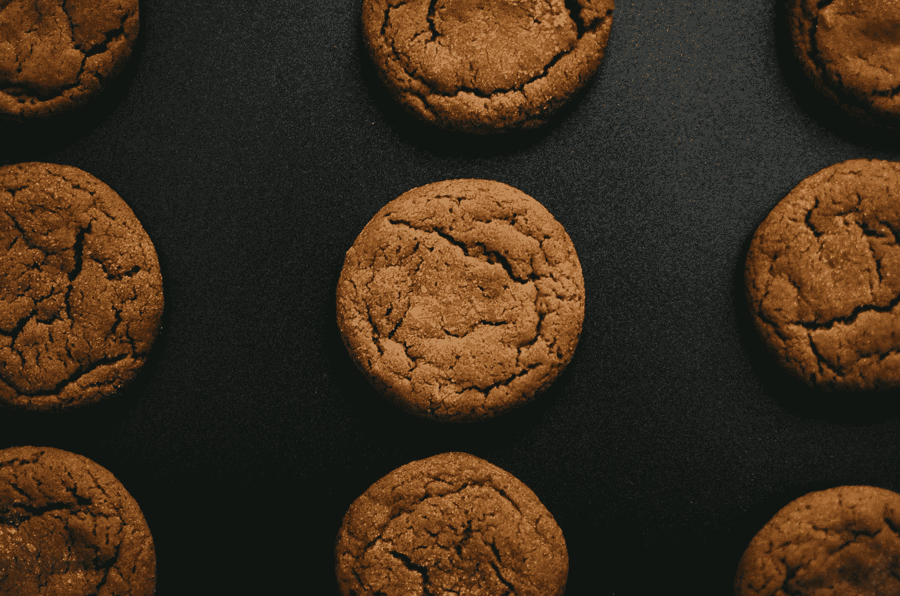

# 如何用 JavaScript 创建并读取 Cookie 中的值？

> 原文：<https://javascript.plainenglish.io/how-to-create-and-read-a-value-from-a-cookie-with-javascript-18a9e5cdc301?source=collection_archive---------8----------------------->



Photo by [Mollie Sivaram](https://unsplash.com/@molliesivaram?utm_source=medium&utm_medium=referral) on [Unsplash](https://unsplash.com?utm_source=medium&utm_medium=referral)

有时，我们可能希望用 JavaScript 创建并读取 cookie 中的值。

在本文中，我们将研究如何用 JavaScript 创建和读取 cookie 中的值。

# 创建 Cookie

我们可以通过用一个字符串设置`document.cookie`属性来创建一个 cookie，该字符串有一个键值对，其后附加了`expires`键值对。

例如，我们可以写:

```
const setCookie = (name, value, days = 7, path = "/") => {
  const expires = new Date(Date.now() + days * 864e5).toUTCString();
  document.cookie =
    name +
    "=" +
    encodeURIComponent(value) +
    "; expires=" +
    expires +
    "; path=" +
    path;
};
```

我们创建了带有`name`、`value`、`days`和`path`参数的`setCookie`函数。

`name`是饼干的关键。

`value`是 cookie 的键的对应值。

`days`是到期前的天数。

`path`是 cookie 的路径。

`expires`有到期日期的日期串。

`toUTCString`返回 UTC 格式的日期字符串。

然后我们用`name`设置`document.cookie`，用`=`设置`value`。

我们用分号后的`expires`键-值对将其连接起来。

然后我们在后面加上`path`。

# 得到一块饼干

没有简单的方法可以用本地方法获得 JavaScript cookie。

有了钥匙，我们必须自己去提取饼干。

为此，我们写道:

```
const getCookie = (name) => {
  return document.cookie.split("; ").reduce((r, v) => {
    const parts = v.split("=");
    return parts[0] === name ? decodeURIComponent(parts[1]) : r;
  }, "");
};
```

我们用`;`分割`document.cookie`字符串。

然后我们用`split`调用字符串数组上的`reduce`来拆分符号为`=`的部分。

然后我们检查数组的第一个条目是否与`name`相同。

如果是，那么我们用`parts[1]`调用`decodeURIComponent`来解码该值。

否则，我们返回`r`,它包含拆分后的 `document.cookie`字符串的剩余部分。

`reduce`的第二个参数是一个空字符串，是`reduce`的初始返回值。

现在当我们如下调用这两个函数时:

```
setCookie("foo", "bar", 10);
console.log(getCookie("foo"));
```

我们看到控制台日志应该返回`'bar'`。

# 结论

我们可以获取并设置`document.cookies`字符串属性，用 JavaScript 获取并设置 cookies。

*更多内容尽在*[***plain English . io***](http://plainenglish.io)