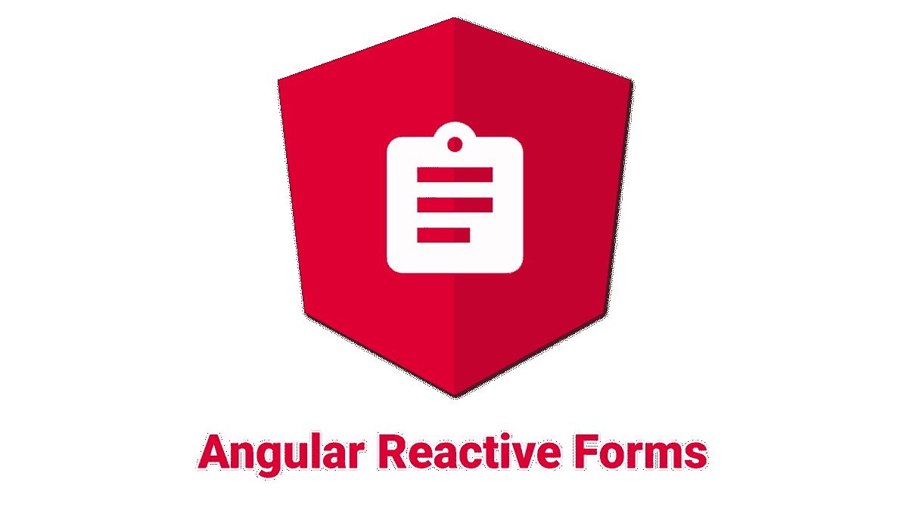

# 如何创建简单的定制验证器——反应式表单

> 原文：<https://javascript.plainenglish.io/how-to-create-angular-simple-custom-validators-reactive-forms-4890cc875a10?source=collection_archive---------8----------------------->

使用 Angular 的反应式表单的人都知道 Angular 团队给了我们一些预定义的验证器，比如 *Validators.required* 、 *Validators.min()* 、 *Validators.max()* 等等。

但是，当我们想要使用 Angular 中没有预定义的验证时，会发生什么呢？我们该怎么做呢？这就是这篇文章将要解释的内容，最后，我们会看到它有多简单。

让我们来看一个输入文本的用例，我们希望它是必需的，最小长度为 5，并且至少包含一个不是空格的字符(简单地说，我们需要我们的文本有一个值，而不仅仅是空格)。

在这种情况下，我们可以使用一些内置的角度验证器，如 *Validators.required* 和*Validators . minlength(5)*但是空白问题怎么办？

首先，我们必须使用 Angular FormGroup 和与表单相对应的 HTML 来创建表单。

我们的组件。ts 看起来会像:

我们的 HTML 代码是这样的:

正如你所看到的，现在，我们只使用了 *Validators.required* 和*validators . minlength(5)*，它们是角度内置的。

对于空白验证器，我们应该创建一个自定义的。为此，我们必须创建一个函数来接收一个 *AbstractControl* 对象，并在那里进行验证。

首先，我们创建一个包含以下代码的*空白验证器. ts* 文件:

如您所见，在这个自定义验证器中，我们首先检查表单值是否为 null。如果为 null，则不会引发任何错误。之后，我们从表单控件中获取值，修剪它(删除开始和结束空格)并计算值的长度。如果删除起始和结束空格后的长度为零，意味着我们的值只包含空格，我们的验证器应该抛出一个错误。

如你所见，我们更新了我们的 *hasErrors* 变量，如果为真，我们返回一个对象，表明控件无效，我们的表单有错误。

我们必须相应地更新组件:

正如我们所看到的，我们刚刚将自定义验证器 *WhiteSpaceValidator* 添加到表单控件定义中。

就是这样！我们刚刚创建了全新的自定义验证器。

**PS:** 这只是一个非常基本的例子，为了文章的简洁，我省略了错误检查和错误消息。

**PS2:** 如果你需要一个运行时间监控工具，只需检查一下 [RoboMiri](https://robomiri.com) 。最好的免费正常运行时间监测服务。

*更多内容请看*[***plain English . io***](http://plainenglish.io/)