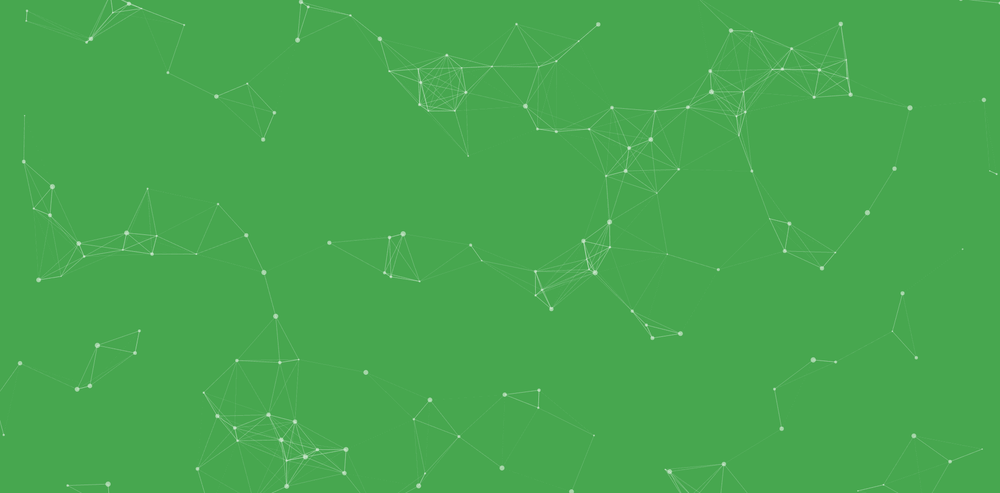
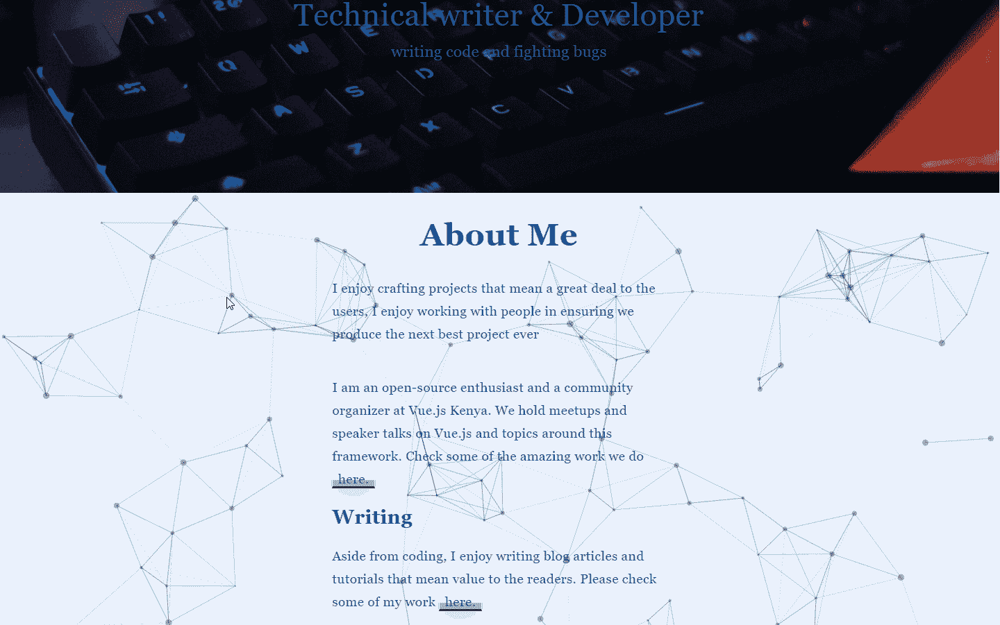

# 如何在 Nuxt.js 中用 tsParticles.js 创建动画背景

> 原文：<https://javascript.plainenglish.io/how-to-create-animated-backgrounds-with-particles-js-in-nuxt-js-6982df35f75c?source=collection_archive---------4----------------------->

## 为你的网站创建 JavaScript 粒子动画背景。



Particle.js sample overview: Photo by [John Philip](https://medium.com/u/c2cdb19c0977?source=post_page-----6982df35f75c--------------------------------)

tsParticles.js 是一个用于创建粒子的轻量级类型脚本库。无依赖(*)，浏览器就绪，兼容 React.js、Vue.js (2.x 和 3.x)、Angular、Svelte、jQuery、Preact、Inferno、Riot.js、Solid.js 和 Web 组件。来自[文档。](https://www.npmjs.com/package/tsparticles)

最近我发现了这个库，并很高兴尝试在 Nuxt.js 中实现它的使用。

如果你不熟悉 Nuxt.js，它是一个强大的框架，完全建立在 Vue.js JavaScript 框架之上。

在本文中，我们将了解如何在 Nuxt.js 应用程序中使用 particle.js。

你可以在这里查看更多关于 nuxt . js*[***的内容。***](https://nuxtjs.org/)*

## ***在项目中安装 particle.js。***

*首先，我们需要在 Nuxt.js 应用程序中安装 ***particle.js*** 库。您可以使用下面的命令，这取决于您首选的软件包管理器。*

## ***NPM。***

```
*npm i particles.vue*
```

## ***纱线。***

```
*yarn add particles.vue vue@2*
```

## ***注册为插件。***

*为了方便访问粒子库并将其集成到我们的 Nuxt.js 应用程序中，我们需要将粒子库注册为一个插件。*

*嗯，Nuxt.js 提供了这种神奇而有用的功能。*

*我们可以在应用程序中直接使用 particle.js，而无需注册它，但是如果我们想在其他组件中再次实现它，我们会有很多重复的代码。*

*因此，将它注册为插件是一种更好的方式，可以确保干净的代码和高效的代码重用，而不需要太多的麻烦。*

*现在转到应用程序实例根目录下的插件文件夹。*

*在 plugins 文件夹中，创建一个文件并将其命名为 particles.js。*

*现在在 ***particle.js*** 文件里面，你应该有下面的代码。*

*代码片段注释是不言自明的。*

*现在我们需要确保 ***particle.js*** 插件可以在我们的应用程序中使用，为此，我们需要将它包含在***nuxt . config . js***文件中。*

*导航到 Nuxt.js 应用程序的根目录，找到文件***nuxt . config . js***并包含插件，如下面的代码片段所示。*

***创建 Particle.js 组件。***

*现在我们需要创建 ***particle.js*** 组件，我们可以使用它来渲染任何我们想要应用粒子背景的路径或组件。*

*在组件目录中，创建一个组件，并命名为 ***粒子组件*** 。*

*在文件中，包含下面显示的代码片段。*

*这个粒子组件将使我们能够配置我们的粒子背景，并根据我们的喜好定制它。*

***我们可以定制什么。***

*根据您的喜好，您可以定制。*

*   *粒子的颜色。*
*   *粒子的背景颜色。*

*所有这些我们都可以在 ***粒子组件. vue*** 文件中定制。*

## ***为页面渲染背景。***

*现在是时候看看我们的粒子背景是什么样子了。有了这个，我们需要在页面/路线中渲染它，看看我们的粒子背景会是什么样子。*

*现在，如果您使用的是 Nuxt.js 版本，那么您可以直接包含这个粒子组件，它会自动导入这个组件。*

*当使用 Nuxt.js 版本时，您需要直接将文件导入您的应用程序，如下所示。*

*现在你只需要用 ***npm run dev*** 命令运行应用程序，就可以看到我们惊人的粒子背景。*

*这是我的演示，让你看一看它是什么样子。*

**

*My portfolio: Photo by [John Philip](https://medium.com/u/c2cdb19c0977?source=post_page-----6982df35f75c--------------------------------).*

## ***临终关怀。***

*粒子. js 是一个令人惊奇的库，可以给你的网站带来美丽的用户体验。我希望你学到一两件事。*

*感谢您抽出时间阅读本文。*

## ***更多阅读。***

*[](/tips-on-learning-code-using-tutorials-4aeeb12b0a31) [## 学习代码和使用教程的技巧

### 不要被困在教程循环中。

javascript.plainenglish.io](/tips-on-learning-code-using-tutorials-4aeeb12b0a31) [](/how-to-get-good-at-git-8f90daa544a8) [## 如何擅长 Git

### 先进但有用的 Git 技术和技巧。

javascript.plainenglish.io](/how-to-get-good-at-git-8f90daa544a8) 

*多内容见于* [***中***](http://plainenglish.io/)*