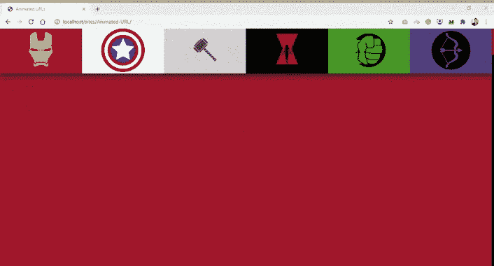
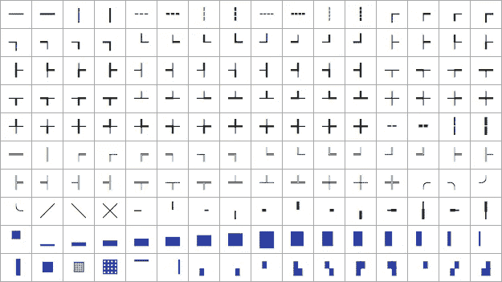
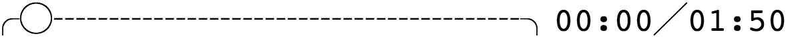

# 如何用 JavaScript 创建动画 URL

> 原文：<https://javascript.plainenglish.io/how-to-create-animated-urls-with-javascript-b624b4592c29?source=collection_archive---------17----------------------->

## 轻松制作 URL 中的字符和表情动画



您可以在 URL 中使用表情符号和其他图形 Unicode 字符。哇，这不是很棒吗？但似乎没有人去做。为什么？或许是因为表情符号对普通网络平台来说太过陌生？又或许是因为害怕触怒 SEO 大神而避之不及？

不管是什么原因，维恩图上“这是可能的”和“没有人在做”的重叠部分通常是我兴奋的地方。所以，我决定花一点时间研究 URL 中图形字符的可能性。具体来说，有可能通过一些 JavaScript 动画这些角色。

# 我们开始吧！

这些是产生令人敬畏的魔术的主要文件！

## index.html

## script.js

## style.css

# 环


首先，确保你页面的 JavaScript 代码被标记为 UTF-8，否则你将很难在代码中使用表情符号。这可以通过 HTTP 头或页面元标签来实现。很有可能你不用担心这个。

为了实现我们想要的结果，表情符号在地址栏中像糖李子仙女一样跳舞，我们需要一个循环。实际上，我们只需要一个循环。我们开始循环，它循环，我们很高兴。这是我们的第一个循环，一个旋转的表情符号月亮。我想当他们添加这个表情符号序列时，他们一定是有这个想法的，对吗？


```
var f = ['🌑', '🌒', '🌓', '🌔', '🌝', '🌖', '🌗', '🌘'];function loop() {
        location.hash = f[Math.floor((Date.now()/100)%f.length)];setTimeout(loop, 50);
    }loop();
```

运行月球代码:

您可以单击上面的切换复选框，在您的地址栏中查看此循环的结果。

如果你不喜欢旋转的月亮，你可以用任何你想要的表情符号来替换这个数组。像时钟一样:


```
var f = ['🕐','🕑','🕒','🕓','🕔','🕕','🕖','🕗','🕘','🕙','🕚','🕛'];
```

运行时钟代码:

这是一个非常简单的例子。真的太简单了。因此，让我们升级我们的循环，使其生成多个表情符号的字符串！这一次，我们利用表情符号“肤色修改器”来制作一些变色婴儿:


```
var e = ['🏻', '🏼', '🏽', '🏾', '🏿'];function loop() {
        var s = '',
            i, m;for (i = 0; i < 10; i ++) {
            m = Math.floor(e.length * ((Math.sin((Date.now()/100) + i)+1)/2));
            s += '👶' + e[m];
        }location.hash = s;setTimeout(loop, 50);
    }loop();
```

运行婴儿代码:

我们使用由时间和位置控制的正弦波来选择我们想要的颜色。这给了我们一个很好的循环变色效果！

或者我们重新看看我们的月球旋转器，把它展开，做一个类似装载指示器的东西怎么样？当然，我们开始吧:


```
var f = ['🌑', '🌘', '🌗', '🌖', '🌕', '🌔', '🌓', '🌒'],
        d = [0, 0, 0, 0, 0, 0, 0, 0, 0, 0],
        m = 0;function loop() {
        var s = '', x = 0;if (!m) {
            while (d[x] == 4) {
                x ++;
            }if (x >= d.length) m = 1;
            else {
                d[x] ++;
            }
        }
        else {
            while (d[x] == 0) {
                x ++;
            }if (x >= d.length) m = 0;
            else {
                d[x] ++;if (d[x] == 8) d[x] = 0;
            }
        }d.forEach(function (n) {
            s += f[n];
        });location.hash = s;setTimeout(loop, 50);
    }loop();
```

运行多月代码:

# 探索其他角色

但不仅仅是表情符号给了我们从地址栏中抽取图片的方法。我们的目标对一大堆 Unicode 字符感兴趣。

特别有趣的是[画盒子的人物](https://en.wikipedia.org/wiki/Box-drawing_character):



其中许多更适合二维输出。但是他们在我们必须玩的单线上仍然相当不错。例如，我们可以制作一串多种高度变化的方块字符，并构建一个漂亮的小波浪:


```
function loop() {
        var i, n, s = '';for (i = 0; i < 10; i++) {
            n = Math.floor(Math.sin((Date.now()/200) + (i/2)) * 4) + 4;s += String.fromCharCode(0x2581 + n);
        }window.location.hash = s;setTimeout(loop, 50);
    }loop();
```

运行波形代码:

我非常喜欢这个造型，我把它永久挂在了 wavyurl.com 的。

使用可变宽度字符，我们甚至可以在水平方向上摆动，创建类似进度条的东西:


```
function loop() {
        var s = '',
            p;p = Math.floor(((Math.sin(Date.now()/300)+1)/2) * 100);while (p >= 8) {
            s += '█';
            p -= 8;
        }
        s += ['⠀','▏','▎','▍','▌','▋','▊','▉'][p];location.hash = s;
        setTimeout(loop, 50);
    }
```

运行进度条代码:

进度条吗？这就像，几乎有用。这让我想到…

# 在地址栏中显示视频进度

为了减少我们小实验中的无聊，我想出了在 URL 中显示网络视频进度的主意。我只需附加一个函数，将我们的进度字符串呈现给视频的“timeupdate”事件，瞧！URL 中的视频进度指示器，包括时间和持续时间！



```
var video;function formatTime(seconds) {
        var minutes = Math.floor(seconds/60),
            seconds = Math.floor(seconds - (minutes*60));return ('0'+minutes).substr(-2) + ':' + ('0'+seconds).substr(-2);
    }function renderProgressBar() {
        var s = '',
            l = 15,
            p = Math.floor(video.currentTime / video.duration * (l-1)),
            i;for (i = 0; i < l; i ++) {
            if (i == p) s +='◯';
            else if (i < p) s += '─';
            else s += '┄';
        }location.hash = '╭'+s+'╮'+formatTime(video.currentTime)+'╱'+formatTime(video.duration);
    }video = document.getElementById('video');
    video.addEventListener('timeupdate', renderProgressBar);
```

运行视频进度条代码:

选中以上复选框后，您可以使用下面的视频来尝试一下。

我相当喜欢这些线条和圆形进度条，但如果你喜欢一些月亮表情符号，我可以满足你:


```
var e = ['🌑', '🌘', '🌗', '🌖', '🌕'],
        video;function formatTime(seconds) {
        var minutes = Math.floor(seconds/60),
            seconds = Math.floor(seconds - (minutes*60));return ('0'+minutes).substr(-2) + ':' + ('0'+seconds).substr(-2);
    }function renderProgressBar() {
        var s = '',
            c = 0,
            l = 10,
            p = Math.floor(video.currentTime / video.duration * ((l*5)-1)),
            i;while (p >= 5) {
            s += e[4];
            c ++;
            p -= 5;
        }
        s += e[p];
        c ++;while (c < l) {
            s += e[0];
            c ++;
        }location.hash = s+formatTime(video.currentTime)+'╱'+formatTime(video.duration);
    }video = document.getElementById('video');
    video.addEventListener('timeupdate', renderProgressBar);
```

好吧，称这个进度条“有用”有点夸张。但是如果我眯着眼睛，我几乎可以看到一个场景，在一个视频分享网址中有这个会很有用。比如 YouTube 可以选择在特定时间创建一个视频链接。包含一个视觉指示不是很酷吗？嗯嗯？

也许有一些我没有想到的更有用的“技术”实现。我会继续考虑的。嘿，也许你能想出点什么？

# 最后一件事

您可能想知道为什么我使用“location.hash ”,而不是更新更好的 HTML5 历史 API。两个原因。一个可解。另一个不太好。都不方便。

问题 1 也是历史 API 的一个特性:它实际上改变了整个 URL 路径，而不仅仅是散列。因此，如果我使用历史 API 并将我们的页面更改为"/🌑🌘🌗🌖🌕"，看起来会比加上#。但这也意味着我的 web 服务器必须能够响应"/🌑🌘🌗🌖🌕”，否则如果用户刷新或以其他方式导航到修改后的 URL，他们将会倒霉。这是可行的，但比使用“location.hash =”更棘手，因为它不需要我以任何特殊的方式准备服务器。

问题 2 更出乎意料。结果是，在我测试的 3 个浏览器中，有 2 个的历史 API 被抑制了。如果我将我的波浪形 URL 字符快速推送到地址栏，我最终会在 Chrome 中得到以下错误:

```
Throttling history state changes to prevent the browser from hanging.
```

Safari 非常好，可以给我们提供更多的信息:

```
SecurityError: Attempt to use history.pushState() more than 100 times per 30.000000 seconds
```

现在，如果我保持在这个限度以内，我就没事了。但是拜托，每秒 3 帧并不能满足我对 ooey-gooey URL 动画的需求。

另一方面，好孩子火狐似乎并不在乎我推了多少次新的历史或者多快。真是太体贴了。但是在两种主流浏览器中使用，再加上需要 web 服务器配置来修复问题 1，这让我愿意在 URL 中使用一点#符号。

# 结局？

我会把它留在那里。但是我会告诉你，我有一些想法来制作显示在地址栏中的小游戏。特别是考虑到我们还没有探索的盲文文字。敬请关注。

如果你有问题，评论，或者只是想了解我最新的修改，请跟我来。

再见了。

*更多内容尽在*[*plain English . io*](http://plainenglish.io/)