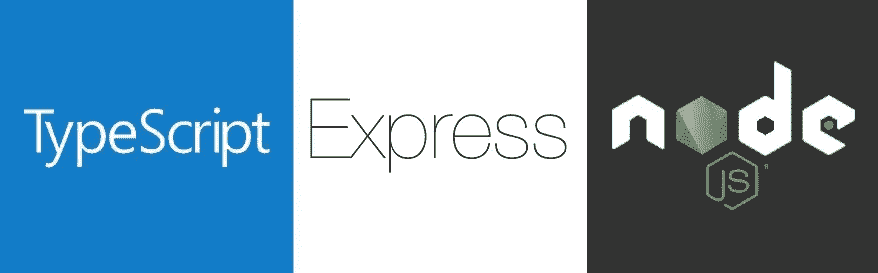

# 如何使用 Express 和 TypeScript 创建自定义标题

> 原文：<https://javascript.plainenglish.io/how-to-create-custom-headers-with-express-and-typescript-b964d3f0be89?source=collection_archive---------4----------------------->



最近，我不得不创建一个将一些数据存储在 PostgreSQL 数据库中的云函数。一旦我完成了所有的工作，或者至少完成了最小的功能，我必须为我的端点添加某种基本的认证。没什么新的，我们只是在这里使用了一个定制的标准头，“企业密钥”，它将告诉我哪个客户端正在执行请求。

你可能会认为这很简单，但是我花了将近 5 个小时的研究才弄明白如何实现它。因为我想帮助任何可能有同样问题的人，所以我决定写这篇文章。我们开始吧！

我假设您对 Node.js、Express、TypeScript 等有所了解。您需要做的第一件事是创建一个 **CustomRequest** 接口，该接口将从 Express 的 **Request** 接口扩展而来，如下所示:

到目前为止，一切顺利。此时，我们可以添加任意多的属性，但是它们必须是可选的(使用**？**运算符)，例如:

通过这样做，您将能够将`myAwesomeProperty`作为`request`对象的一个属性来访问。现在你可能认为下一步是创建一个名为 *headers* 的属性，并将其定义为一个对象，然后在那里添加我们的新属性，例如`customHeader`:

如果您使用上面的代码并试图从`headers`中访问`customHeader`属性，您的编译器将会出现一个巨大的错误，类似于:

```
No overload matches this call. (...)Types of property 'headers' are incompatible.Property 'customHeader' is missing in type 'IncomingHttpHeaders' but required in type '{ customHeader: string; }'.ts(2769)
```

我们到了，一切开始的地方。像往常一样，这是一个非常复杂和难以理解的错误，但我们可以解决它。您可能会注意到，这里重要的是`IncomingHttpHeaders`类型和我们的`customHeader`属性。如果你检查一下`Request`的定义，你会注意到它从`core.Request`接口扩展而来，而接口又从`http.IncomingMessage`类扩展而来，这个类有一个名为`headers`的属性，你猜怎么着，它的类型是`IncomingHttpHeaders`(来自`http`模块)。我们找到了！

所以现在我们知道`headers`来自某个类型，但是我们不能在 TypeScript 中扩展一个类型，对吗？嗯，从严格意义上来说，这可能是真的，但是有一种方法可以在 TypeScript 中“扩展”类型(更多信息请查看 [this](https://www.typescriptlang.org/docs/handbook/2/everyday-types.html#differences-between-type-aliases-and-interfaces) )。这样做的方法是通过使用**交集**，当我们交集两个或更多类型时，我们通过使用 **&** 操作符从它们创建一个新类型。因此，我们的下一步将是从`http`导入`IncomingHttpHeaders`，并将其与我们的自定义标题相交。

完事了吗？不完全是。如果你把这篇文章留在这里，你可能会面临和我一样的错误——每当我试图访问我的`customHeader`时，我都得到了未定义，没有任何明显的原因。在没有任何解释的情况下，您可能无法访问新的自定义页眉。但是有解决的办法！只需将`customHeader`属性更改为 snake case 就可以了:`custom-header`或`Custom-Header`就可以了，现在通过使用方括号(`req.headers['custom-header']`)你就可以访问自己的标题了。

我们为什么要这么做？为什么 Express 在使用 camel case 时似乎无法访问我们的自定义头？我不知道，但是如果你知道，请在这里随意评论为什么，我们都可以从你的回答中受益。

最后，有空的话，看看我的 npm CLI 工具， [simba.js](https://www.npmjs.com/package/@anthonylzq/simba.js) 。它有点像 [cra](https://create-react-app.dev/) ，但用于后端开发。它使用 MongoDB、Express 和 TypeScript。只需一个简单的命令，您就可以让服务器运行一些您可能会觉得有用的端点。

编码快乐！

*更多内容请看*[***plain English . io***](http://plainenglish.io/)