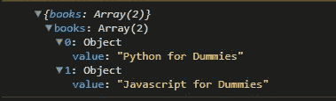
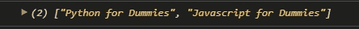

# 使用 React Hook 表单库创建动态表单

> 原文：<https://javascript.plainenglish.io/how-to-create-dynamic-forms-with-react-hook-form-2021-a3bccae35163?source=collection_archive---------4----------------------->

React Hook 表单教程:如何使用 react-hook-form 库构建动态表单。


Photo by [Christina @ wocintechchat.com](https://unsplash.com/@wocintechchat?utm_source=medium&utm_medium=referral) on [Unsplash](https://unsplash.com?utm_source=medium&utm_medium=referral)

在本教程中，我们将学习如何创建一个带有动态输入的表单，或者像有些人所说的那样，创建一个 expando/扩展表单。


Dynamic input form example

以上是我们今天要构建的一个例子，在第一部分，我将纯粹关注功能性，这意味着我们不会使用任何样式。这是为了让我们在混合样式元素和混淆自己之前，能够真正理解它是如何工作的。在第二部分中，我们将向现有项目添加样式，并使其组件可重用。

我们将使用以下库/包:

**第一部分**

*   react-v 17 . 0 . 2
*   [反应钩形](https://react-hook-form.com/get-started) — v7.11.0

**第二部分**

*   @ material-ui/core-v 4 . 12 . 1
*   @ material-ui/icons-v 4 . 11 . 2

一旦运行了 react 应用程序，我们将需要安装一些依赖项，您可以使用以下命令

```
## For react-hook-formmnpm install --save react-hook-form&&## (optional) material-uinpm install --save @material-ui/core @material-ui/icons
```

我使用[**NPM**](https://www.npmjs.com/)**来安装软件包，但是当然，你可以使用任何你喜欢的软件包管理器，比如 [**yarn**](https://yarnpkg.com/) 。**

**我们开始吧！**

1.  **我们需要从 react-hook-form-library 中导入`useform`、`useFieldArray` & `Controller`。**

**这是新导入的库的文件外观。在我继续之前，来自 [react-hook-form](https://react-hook-form.com/api) 的文档有非常详细的例子和解释，所以如果你面临任何大问题，请查阅文档或在评论中联系我，我很乐意帮助你。**

**2.接下来，我们将使用新导入的挂钩，并使用一些析构来提取一些字段。**

**当我们调用`useFieldArray`时，注意我们是如何传递一个对象的，记下您提供的`name`，并确保它是符合逻辑的，例如，我们今天构建的表单是一个图书列表，所以我为它提供了图书的名称。**

**我们还提供了`control`，从 ES6 开始我们可以使用一个叫做对象属性速记的小技巧，在这里了解更多。**

**3.我们现在可以开始使用之前获得的`fields`变量来显示我们的动态表单。基本上，`fields`是一个包含我们给定的任何输入的数组，由于我们没有提供任何输入，`fields`目前的长度为 0。**

**请确保您阅读了代码中的注释以完全理解，我也将在这里查看它们。**

*   **我们使用 JS map 方法将每个字段呈现为一个`item`，确保为每个项目添加一个唯一的键，这很重要。**
*   **默认情况下，每个`item`都是一个带有`id`属性的对象，我们可以很方便地使用它，react-hook-form 不支持平面数组。但是别担心，我们以后会处理的。**
*   **对于名称属性，我们使用[模板文字](https://developer.mozilla.org/en-US/docs/Web/JavaScript/Reference/Template_literals)，确保用您的字段数组的名称替换`books`，用存在于`item`中的属性替换`value`。这一点很快就会变得有意义。**
*   **在 render prop 上，我们传递一个返回输入组件的函数，如果需要，我们可以传递带有样式的自定义输入。**
*   **我们需要从这个函数中获得由`Controller`自动传递的`field`参数，并使用[扩展操作符](https://developer.mozilla.org/en-US/docs/Web/JavaScript/Reference/Operators/Spread_syntax)将这些属性传递给我们的输入。**
*   **append 按钮使用了`append`方法，这将在 fields 数组的末尾添加一个新的对象，但是，我们需要在这个对象中设置属性，正如我前面提到的，不支持平面数组，所以为了简单起见，我们在对象上只有一个 value 属性，前面提到的`id`属性是自动添加进去的。**

**解释有点冗长，但是它们可以帮助你理解如何正确地使用它，这样你就可以创建你自己的动态表单。**

**就像动态表单已经开始工作一样，我们还有最后一件事要处理。**

**现在我们的数组是一个对象数组，**

****

**Returned data**

**这是我们在 console.log 数据时得到的结果，记住这也是在一个表单中，所以不只是返回数组，而是返回整个表单数据。**

**我们的数组存储在我们之前使用钩子时提供的名称(books)下。**

**现在，如果我们想把它作为数组而不是对象存储在数据库中，我们只需要创建一个简单的函数来处理它。**

**我们创建了一个`handleOnSubmit`函数来处理数组数据，就像我说的，整个表单数据被返回，所以我们需要从数据对象中析构它。接下来，我们简单地映射数据并只返回每个`book`对象的值。**

****

**Returned data**

**这就是使用 react-hook-form 创建动态输入表单所需要做的全部工作。**

**希望你喜欢这篇教程以及冗长的解释，如果你有任何问题，请随时告诉我，我很乐意帮忙。请继续关注第 2 部分，学习如何使它成为一个可重用的组件，并添加样式使它变得更漂亮。👋**

**代码沙盒的链接在这里:[https://code sandbox . io/s/dynamic-form-use-field-array-db5sb？file=/src/App.js](https://codesandbox.io/s/dynamic-form-use-field-array-db5sb?file=/src/App.js)**

**查看一些以前的文章/教程！**

**[](https://jrpotatodev.medium.com/how-to-create-a-simple-web-server-using-node-js-2021-5c3e89833128) [## 如何使用 Node.js (2021)创建一个简单的 web 服务器

### 使用 Node.js 的简单 web 服务器(2021)

jrpotatodev.medium.com](https://jrpotatodev.medium.com/how-to-create-a-simple-web-server-using-node-js-2021-5c3e89833128) [](https://jrpotatodev.medium.com/how-to-use-import-aliases-in-react-with-craco-2021-aaa3b4893dd) [## 如何在 React with craco (2021)中使用导入别名

### 我们为什么需要这个？嗯，我们不一定要在 React 应用程序中使用导入别名。这只是为了让生活…

jrpotatodev.medium.com](https://jrpotatodev.medium.com/how-to-use-import-aliases-in-react-with-craco-2021-aaa3b4893dd) [](https://jrpotatodev.medium.com/create-a-country-select-component-with-react-2021-a259bd0350d5) [## 使用 React (2021)创建国家选择组件

### 在本教程中，我们将学习如何为所有国家创建一个简单的选择/下拉列表，因为逐个输入非常…

jrpotatodev.medium.com](https://jrpotatodev.medium.com/create-a-country-select-component-with-react-2021-a259bd0350d5) 

*更多内容尽在*[***plain English . io***](http://plainenglish.io/)**