# 如何在“从头开始”中创建表单

> 原文：<https://javascript.plainenglish.io/how-to-create-forms-in-react-from-scratch-ae140b67baa6?source=collection_archive---------9----------------------->

**在“反应”中创建交互式表单的完整指南。**

Photo by [Ferenc Almasi](https://unsplash.com/@flowforfrank?utm_source=medium&utm_medium=referral) on [Unsplash](https://unsplash.com?utm_source=medium&utm_medium=referral)

我们将利用 React 提供的 useState 钩子来管理 React 表单中的状态。

> **注意—** 要完全理解本课程，需要一些基本的反应知识。

首先，我们将使用 HTML 标记来创建输入并标记字段。

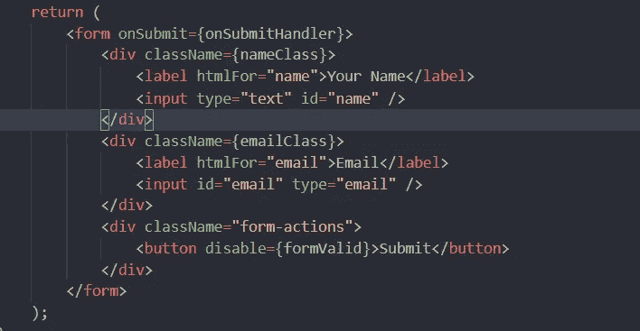

基本的表单结构是这样设置的。

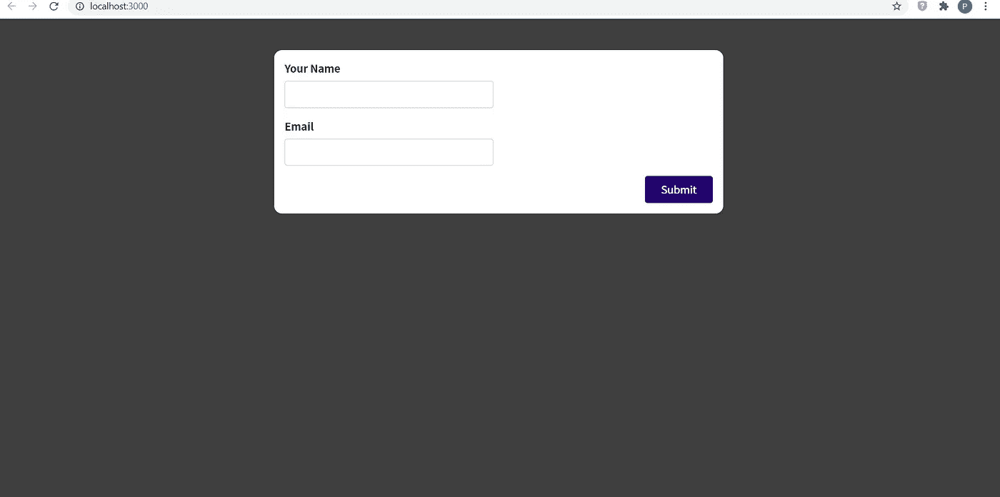

所以，在表单建立之后，我们将使它们发挥作用，并添加验证等功能。

我们将使用两个 useState 钩子来存储在表单字段中输入的数据，并使用空默认值启动输入名称和输入邮件。

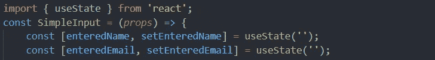

要更新输入的名称和输入的邮件值，我们将在输入中使用 onChange(这样，状态会随着输入字段中每一次击键的改变而改变)，并相应地更新状态，如下所示。

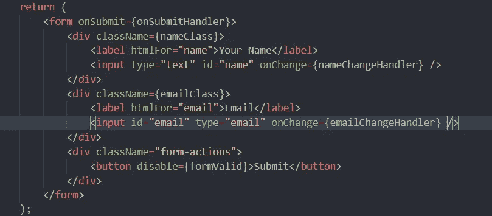

为了添加双向绑定，以便我们可以在状态改变时显式地改变输入字段，我们将使用输入 HTML 标记的 value 属性来调整输入中的值。这是为了确保当我们提交表单时，表单值恢复为空白。

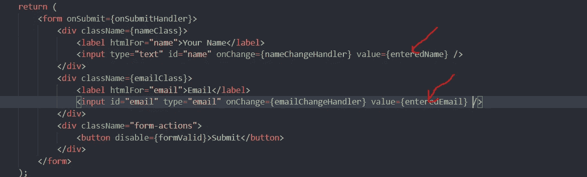

emailChangeHandler 和 nameChangeHandler 函数将隐式(自行)接收事件(表示为“e”，您可以使用任何变量名作为参数，但“e”通常是约定)对象作为参数，其值将输入到输入字段中。每当输入数据改变时，这个函数将自动启动。

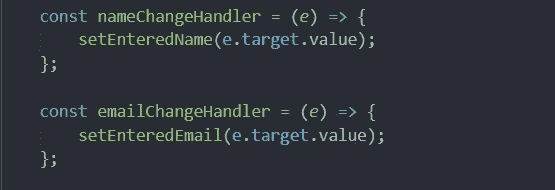

现在我们有了状态，即输入的名称和输入的邮件随着表单中输入数据的变化而变化。

一半的工作在这一点上完成了。现在，我们将处理表单的验证部分。通过验证，我的意思是验证数据，并向用户显示正在输入有效信息。例如，电子邮件应该包含“@”和”。com”以使表单中的电子邮件字段有效。

验证是更高级的代码，所以要仔细理解它。

因此，onBlur 事件可以与输入的 HTML 标记一起使用，只要我们单击表单，然后单击其他地方，就会触发该事件。

使用 onBlur 事件，如果用户输入了无效的内容，我们可以向用户显示错误消息。

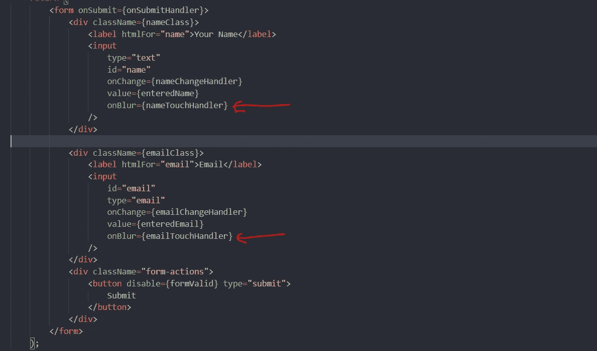

现在，由于 onBlur 事件已经设置好了，我们将了解当这个事件发生时将被激发的函数。

我们必须存储用户是否在表单中触摸或输入了什么。第一次，我们不能显示或验证，因为用户没有输入任何内容。但是从那时起，每当用户试图键入什么，我们就需要验证。

因此，默认情况下，对于表单的初始加载，我们将输入的名称和输入的邮件触摸设置为 false。

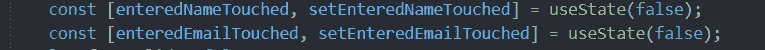

每当我们写了一些东西，然后在输入字段外单击时，onBlur 事件将触发 nameTouchHandler 和 emailTouchHandler，并将它们的值设置为 true，这样我们就知道用户输入了一些东西，我们应该验证输入。

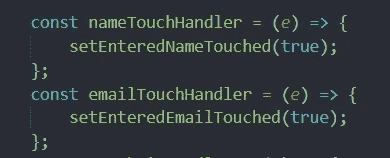

现在，我们知道用户已经在输入字段中输入了一些内容，是时候验证数据了。

为此，我们将为初始页面加载设置 formValid = "false"。

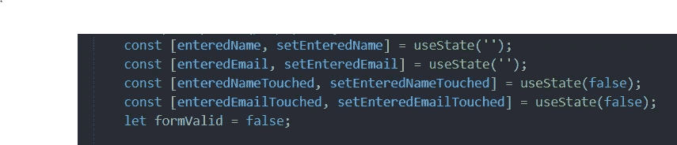

现在，为了验证输入，我们将检查在表单的输入字段中输入的数据。但是要向用户显示错误消息，我们应该记住，不应该在表单第一次加载时显示错误消息。因此，为此，我们必须检查两个条件—

1.  必须触摸表单(formTouched 设置为“true”)。
2.  表单中输入的数据必须无效。

为了检查这两个，我们将使用-

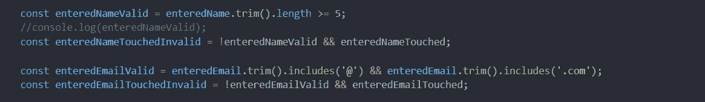

因此，当我们想要动态显示输入到输入字段中的用户数据是否有效时，我们将使用 enteredNameTouchedInvalid 和 enteredEmailTouchedInvalid，这将确保在显示错误消息之前检查上述两种情况。

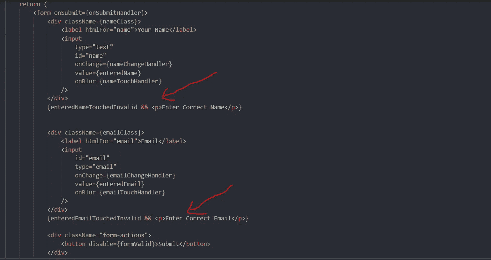

现在，由于显示了输入字段消息，我们还希望当数据无效时，表单颜色变为红色。因此，当数据无效时，我们将动态地改变应用于表单的类。

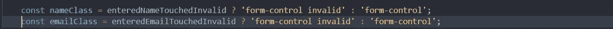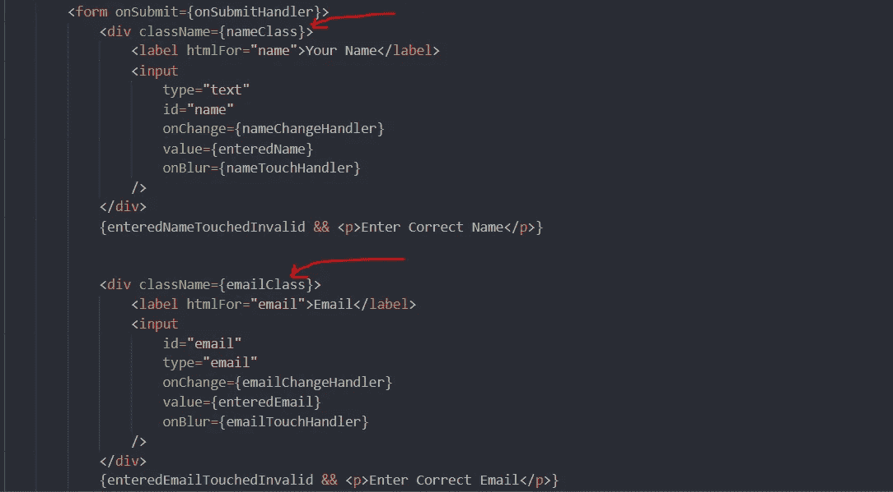

因此，当输入的数据无效时，表单将如下所示。

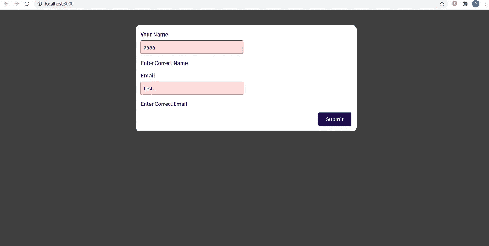

现在，表单已经被动态验证。此外，当输入的数据不正确时，它会显示一条错误消息(您可以自己检查数据的有效性；我使用了长度检查来检查名字，还有“@”和“”。com”检查电子邮件；您还可以使用正则表达式来实现更繁琐的检查)。

最后，当我们提交表单时，我们必须确保表单输入数据被重置为空白。为此，我们必须将 enteredName 和 enteredEmail 的值重置为空。

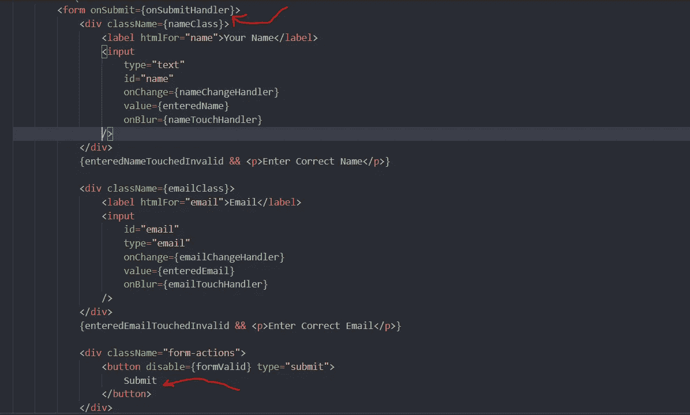

当单击提交按钮时，onSubmitHandler 函数将被触发。

如前所述，我们将通过该事件隐式接收一个事件对象，该函数如下所示。

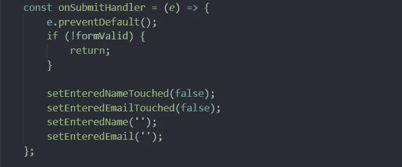

我们将检查表单是否有效，为了检查表单是否有效，我们将使用这个。

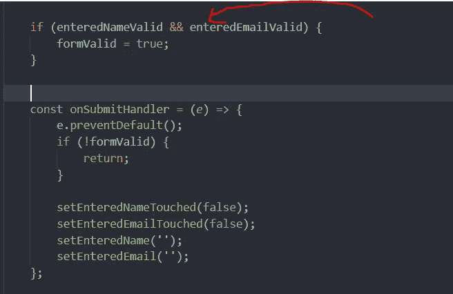

现在，如果表单数据无效，我们将简单地返回，从而终止函数的进一步执行。

但是如果数据有效，那么我们必须将输入数据字段重置为空白，并将 emailTouched 和 nameTouched 重置为 false。因此表单在提交后会返回到初始状态。

这是表单的工作方式-

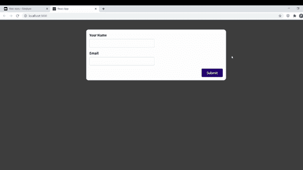

仅此而已。希望这篇文章对您有所帮助，现在可以开始创建和验证您自己的 React 表单了。谢谢你。

## 进一步阅读

 [## 如何构建自己的调查并使用定制的 JavaScript 扩展它们

### 这是一本关于如何使用自己的 JS 函数来扩充 SurveyJS 附带的条件逻辑和验证器的入门书。

javascript.plainenglish.io](/how-to-build-your-own-surveys-extend-them-with-custom-javascript-b4c7eb5648c4) 

*更多内容请看*[***plain English . io***](https://plainenglish.io/)*。报名参加我们的* [***免费周报***](http://newsletter.plainenglish.io/) *。关注我们关于*[***Twitter***](https://twitter.com/inPlainEngHQ)[***LinkedIn***](https://www.linkedin.com/company/inplainenglish/)*[***YouTube***](https://www.youtube.com/channel/UCtipWUghju290NWcn8jhyAw)*[***不和***](https://discord.gg/GtDtUAvyhW) *。***