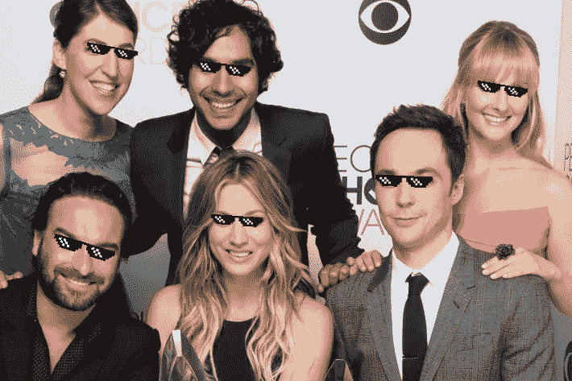
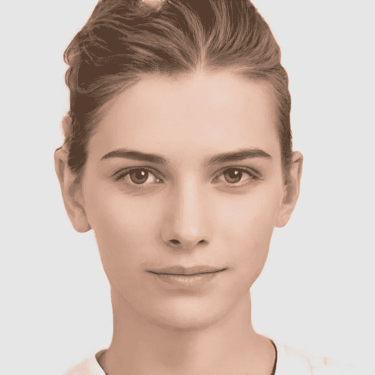
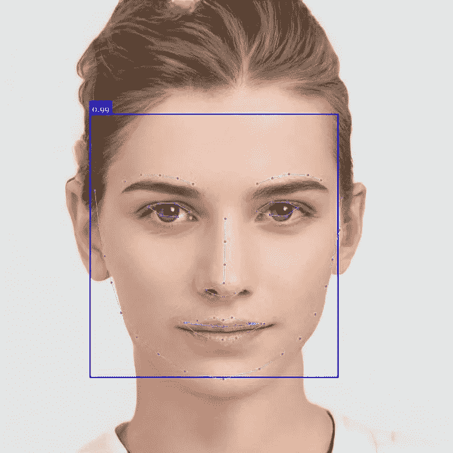
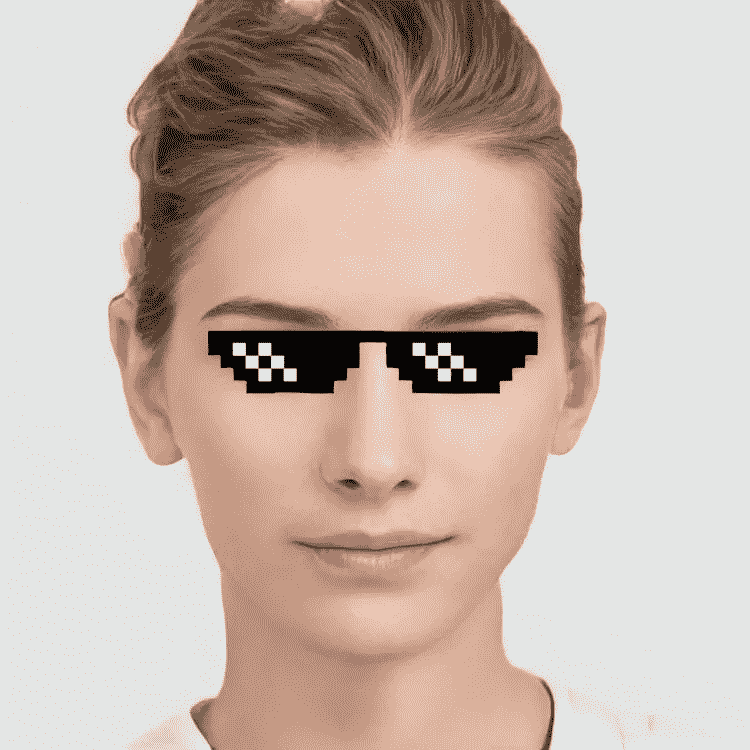
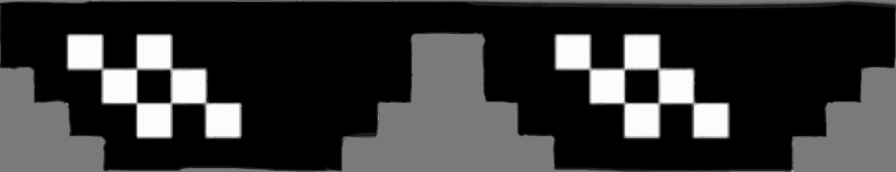
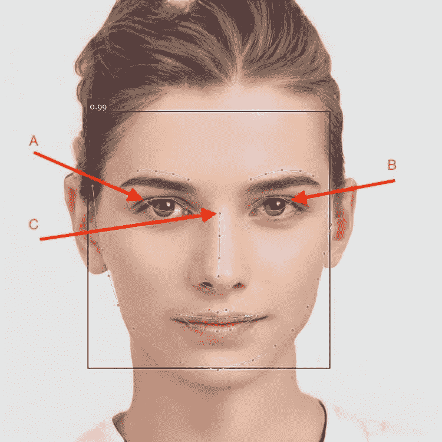
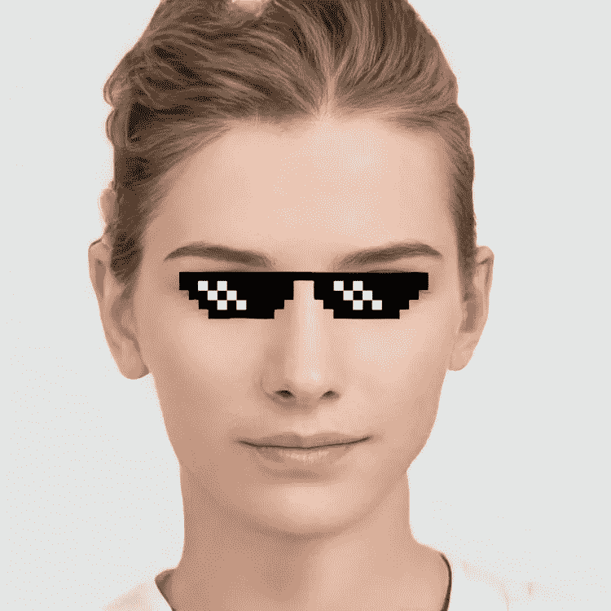
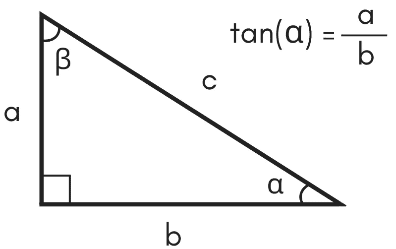
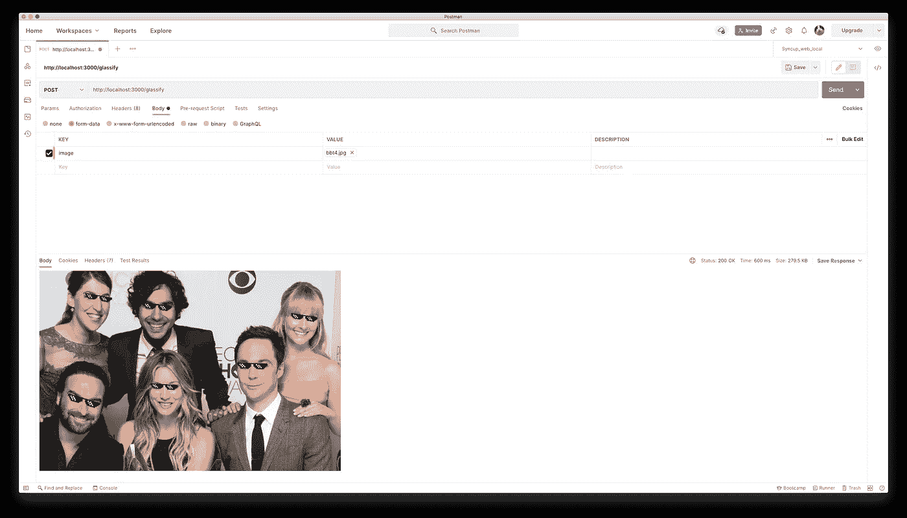

# 如何用 face-api.js 创建“glass ify”Faces API

> 原文：<https://javascript.plainenglish.io/how-to-create-glassify-faces-api-with-face-api-js-f2a11367db4f?source=collection_archive---------10----------------------->



[https://github.com/justadudewhohacks/face-api.js/blob/master/examples/images/bbt4.jpg](https://github.com/justadudewhohacks/face-api.js/blob/master/examples/images/bbt4.jpg)

> [Face-api.js](https://github.com/justadudewhohacks/face-api.js) 是一个 JavaScript API，用于浏览器和 Node.js 中的人脸检测和人脸识别，带有 [TensorFlow.js](https://github.com/tensorflow/tfjs)

有时，我们必须实现人脸识别或人脸标志。使用 face-api.js，我们只需几行代码就可以做到这一点。

在 [face-api.js](https://github.com/justadudewhohacks/face-api.js) 存储库中，我们可以找到浏览器和 Node.js 环境的例子。对我们来说，它们看起来很简单。让我们看看你能用它们做什么。

在这个故事中，我们将尝试实现一个完整的示例，它使用 face-api.js 和 face landmark 模型来“玻璃化”图像中的人脸。

# 用 face-api.js 面对地标

初始打字稿:

```
$ mkdir ts-faceapi-glassify
$ code ts-faceapi-glassify # Open directory with vscode$ npm init -y
$ npm install typescript -D
$ npx tsc --init
```

类型脚本配置文件:`tsconfig.json`

```
{
  "compilerOptions": {
    "target": "ES2018",
    "lib": [
      "DOM"
    ],
    "outDir": "./dist",
    "module": "CommonJS",
    "esModuleInterop": true,
    "skipLibCheck": true,
    "forceConsistentCasingInFileNames": true
  },
  "include": [
    "./src"
  ],
  "exclude": [
    "node_modules",
    ".git",
    "dist"
  ]
}
```

安装依赖性和开发依赖性

```
$ npm install @tensorflow/tfjs-core@1.7.4 @tensorflow/tfjs-node@1.7.4 canvas face-api.js jimp express express-uploaded -S$ npm install ts-node-dev @types/express [@types/express-fileupload](http://twitter.com/types/express-fileupload) -D
```

现在，`face-api.js`只是与`tfjs-core` v1.x 兼容，然后我们应该为`tfjs-core`和`tfjs-node`定义准确的版本。

下载人脸识别和人脸地标模型。

我们将使用`ssd_mobilenetv1_model`进行人脸识别，使用`face_landmark_68_model`进行人脸标志。

让我们从[https://github . com/justadudewhohacks/face-API . js/tree/master/weights](https://github.com/justadudewhohacks/face-api.js/tree/master/weights)下载 4 个模型文件

`face_landmark_68_model:`

*   [face _ landmark _ 68 _ tiny _ model-shard 1](https://github.com/justadudewhohacks/face-api.js/blob/master/weights/face_landmark_68_tiny_model-shard1)
*   [face _ landmark _ 68 _ model-weights _ manifest . JSON](https://github.com/justadudewhohacks/face-api.js/blob/master/weights/face_landmark_68_model-weights_manifest.json)

`ssd_mobilenetv1_model:`

*   [SSD _ mobilenetv1 _ model-shard 1](https://github.com/justadudewhohacks/face-api.js/blob/master/weights/ssd_mobilenetv1_model-shard1)
*   [SSD _ mobilenetv1 _ model-shard 2](https://github.com/justadudewhohacks/face-api.js/blob/master/weights/ssd_mobilenetv1_model-shard2)
*   [SSD _ mobilenetv1 _ model-weights _ manifest . JSON](https://github.com/justadudewhohacks/face-api.js/blob/master/weights/ssd_mobilenetv1_model-weights_manifest.json)

并将它们保存到`public/weights`。

按照这个[链接](https://github.com/justadudewhohacks/face-api.js/blob/master/examples/examples-nodejs/faceLandmarkDetection.ts)(来自 face-api.js 库的例子)我们创建一个类来支持从图像中检测和标记人脸。

`./src/glassifyLib.ts`

*   `glassify`:接收图像缓冲区作为参数。加载所有模型。我们使用 [canvas 包](https://www.npmjs.com/package/canvas)在 Node.js 环境中创建一个“canvas”对象。然后检测图像中的所有人脸，画出人脸检测线和人脸标志点。最后，返回新的图像缓冲区——检测人脸图像。
*   `loadModels`:尝试从我们的目录(public/weights)加载模型。

试着用演示图片调用`glassify`函数。

`./src/index.ts`

我们读取一个图像并获取图像缓冲区，将缓冲区传递给`glassify`函数，然后将结果保存到一个新的图像文件中(存储在`public/images`)。

以监视模式执行代码—当检测到对文件的保存操作时自动再次运行:

```
$ npx ts-node-dev --respawn --transpile-only ./src/index.ts
```

输入:`public/images/demo.jpg`



输出:`public/images/output_xxxxxx.jpg`



# 使用 Jimp 实现“玻璃化”

该部分的输出是为图像中的所有面部添加眼镜。



我们需要做的是:

*   准备眼镜图像以插入图像中的每张脸
*   循环浏览每张脸，将眼镜图像插入正确位置
    -调整眼镜图像大小以适合脸的尺寸
    -将眼镜图像插入正确位置

眼镜图像是一个带有透明背景的“大”png 文件



眼镜的尺寸将随着左眼(A)和右眼(B)之间的距离而相同。并且插入的位置是两眼之间的中心点(C)。



让更新`./src/glassifyLib.ts`

我们为眼镜图像设置了一个新的宽度，加上一个额外的距离 AB，以确保它覆盖所有的眼睛。`Jimp.AUTO`保持宽高比与原始眼镜图像相同。

```
const editedGlasses = glasses.clone().resize(newWidth + newWidth / 3, Jimp.AUTO);
```

使用`composite`功能设置调整后图像的位置:

```
source.composite(
  editedGlasses,
  nose.x - editedGlasses.getWidth() / 2,
  nose.y - editedGlasses.getHeight() / 2,
);
```

一幅图像将从`[0, 0]`开始，然后我们需要减少`x, y`一半的图像宽度和高度。确保眼镜图像的中心与 C 点(鼻子点)匹配。

结果:



让我们以倾斜的面孔来尝试


是的，我们需要旋转的眼镜图像，角度是相同的与眼睛角度与 Ox。



[https://www.inchcalculator.com/tangent-calculator/](https://www.inchcalculator.com/tangent-calculator/)

α是我们需要找出的角度。

```
const a = rightEye.y - leftEye.y;
const b = rightEye.x - leftEye.x;const tanAlpha = ab / ac;
const deg = Math.atan(tanAlpha) * 180 / Math.PI;const editedGlasses = glasses.clone()
        .resize(newWidth + newWidth / 3, Jimp.AUTO)
        .rotate((-ab * 1 / ab) * deg); // (-ab * 1 / ab) to support rotation direction
```


# 带 Express 的“glass ify”Api

我们将创建一个简单的 web 服务，该服务具有一个 api，该 API 支持从客户端上载一个图像并返回编辑后的图像。

覆盖索引文件`./src/index.js`

试试邮差:



# 摘要

如图所示，face-api.js 和预先训练好的模型对于 JavaScript 开发人员来说非常强大。我们可以用最少的努力和非常少的 JavaScript 代码行来完成一个复杂的机器学习任务。

本文使用的源代码发表在 [Github](https://github.com/codetheworld-io/ts-faceapi-glassify) 上。

感谢阅读！

*更多内容参见* [*通俗易懂。io*](http://plainenglish.io/)