# 如何在 Angular 9 中创建库

> 原文：<https://javascript.plainenglish.io/how-to-create-library-in-angular-tutorial-ef66cdee0eb5?source=collection_archive---------5----------------------->

在这篇教程文章中，我们将学习如何使用 Angular 9 创建一个库，并在不同的项目中使用它。

# 先决条件:

1.  [打字稿](https://www.tutorialspoint.com/typescript/index.htm)的先验知识。
2.  [JavaScript](https://developer.mozilla.org/en-US/docs/Learn/JavaScript/First_steps) 的先验知识。
3.  Visual studio 代码。
4.  安装了[节点 11.3 + & NPM 9.1.7+](https://nodejs.org/en/download/releases/) 的开发机。

# 使用 Angular 9 创建库的分步教程

# 步骤 1:安装 Angular CLI

第一步，我们必须安装最新版本的 [Angular CLI](https://cli.angular.io/) 。

```
$ npm install -g @angular/cli
```

# 步骤 2:创建 Angular 9 项目

*   在第二步中，我们将使用 Angular CLI 开始我们的 Angular 项目
*   转到 CMD 或终端，使用以下命令:

```
$ ng new custom-loader
```

*   此 CLI 将询问您"*是否要添加角度路由*？说**是。**
*   它将询问"*您希望使用哪种样式表格式*？"。选择 **CSS。**
*   现在你的项目已经准备好了，Angular CLI 将生成所需的文件和文件夹以及 NPM 包和路由。
*   现在，在 Visual studio 代码中打开您的项目，转到您的根文件夹，使用以下命令运行本地开发服务器:

```
$ npm start
```

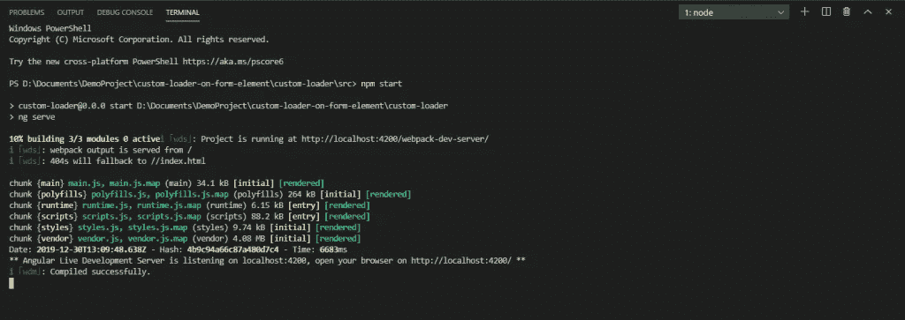

现在在浏览器中运行 localhost:4200/

# 步骤 3:创建库

库命令后跟您的库名称，用于创建库

使用此命令

```
$ ng generate library my-lib
```

这将在我们的演示项目中创建一个库项目。

具有库模块、服务、组件等的库。

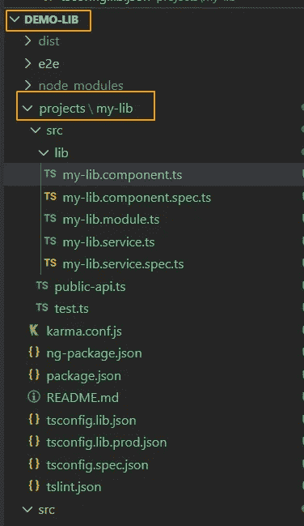

# 步骤 4:在库中创建一个功能。

*   正如你在图片中看到的，库有它自己的模块、服务和组件。我们可以根据需要添加更多的组件、服务、指令、管道和模块。

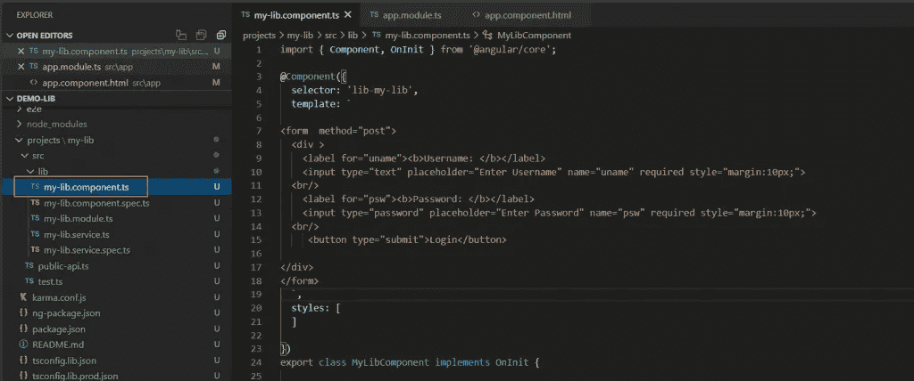

这里以登录模块为例。

# 第五步:构建并使用 Angular 库。

现在，让我们看看如何在我们的应用程序中构建、发布和使用这个库。

*   在这里，我将向您展示如何在我们上面创建的同一个应用程序(my-lib)中使用库。这是一种简单的使用库的方法，并且在本地有效。
*   要构建库，运行 ng build 命令，后跟库名。这里我们的库名是" **my-lib"** 。

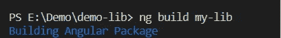

*   构建成功后，我们可以得到 2 条路径。
*   这将生成库**的 dist 文件夹**。

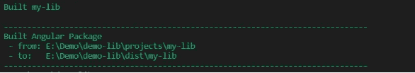

# 步骤 6:将库实现到当前项目中

*   在我们的主 app 中导入这个库( **Demo-lib** )。
*   在 app.module.ts 中导入如下库模块。

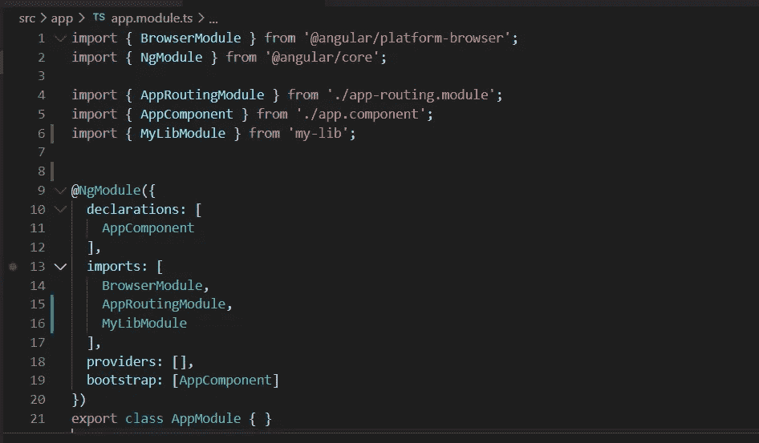

*   在 app.component.html 文件中导入库的选择器标签后，加载如下图所示的库。要找到库的选择器标签，请打开**projects/my-lib/src/lib/my-lib . component . ts**文件，在这里您可以在 **@component** decorator 中获得选择器。

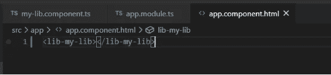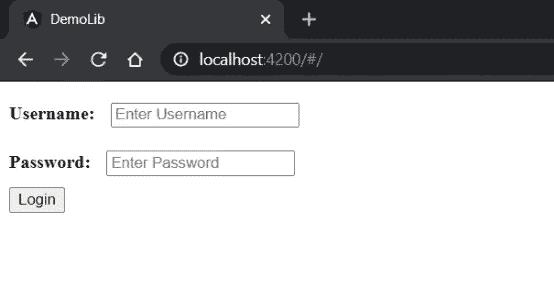

# 步骤 7:将库实现到另一个项目中

*   创建一个新项目，
*   这里我们正在创建一个新项目 **use-lib** 。

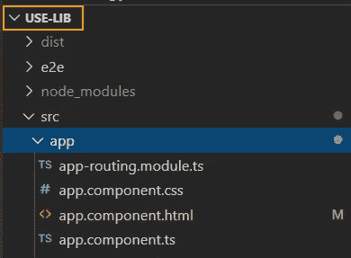

*   构建库并从 **demo-lib 项目**中获取路径。

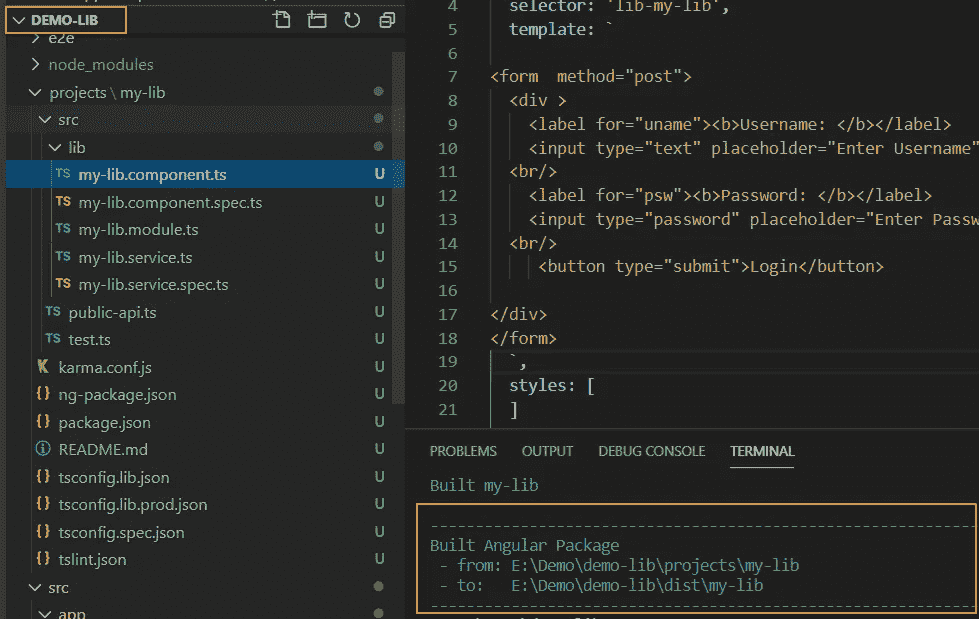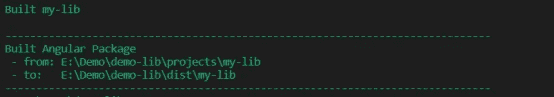

*   复制一个路径“**到:E:\ Demo \ Demo-lib \ dist \ my-lib**”。
*   打开 **use-lib** 项目的终端。
*   用这个命令将这个库安装到 **use-lib** 项目中。

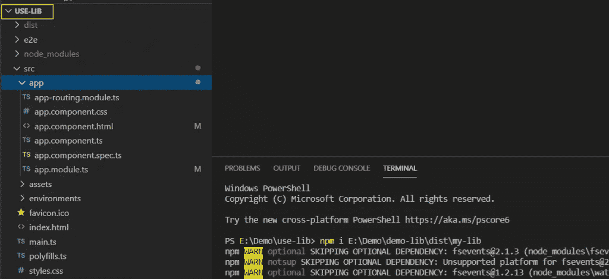

*   安装库之后。
*   将库导入到 **app.module.ts**

导入库模块后，我们可以轻松地使用服务、组件等。

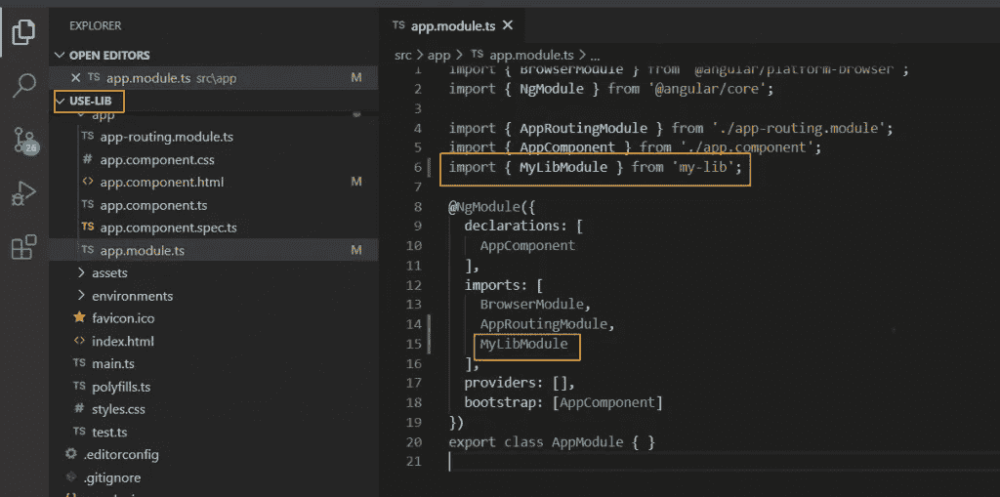

*   在这里，我们正在导入 app.component.html 图书馆的选择器标签
*   现在我们用不同的端口运行这个项目
*   在**默认端口 4200** 上运行的演示库项目

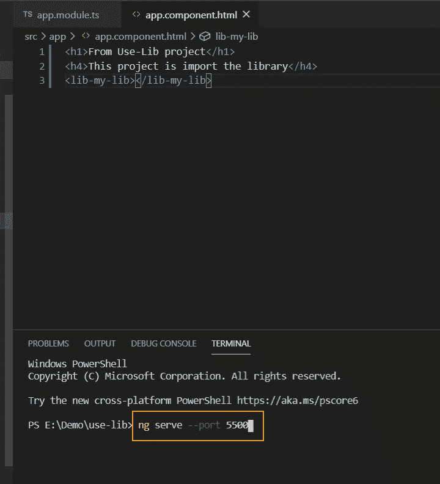

# 输出

*   **运行—创建库项目**

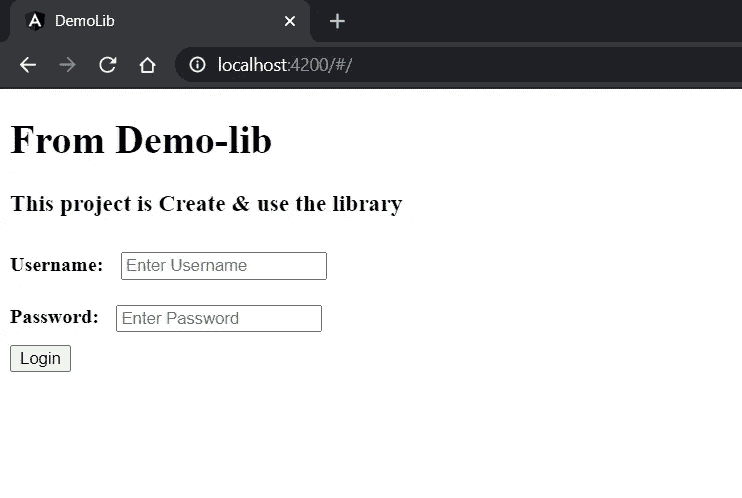

*   **运行—导入库项目**

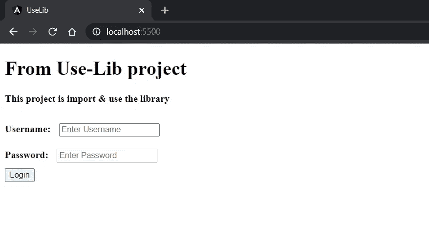

## 交给你了！

找一个*样本源代码*？给你: [GITHUB](https://github.com/sandipmalaviya07/create-library-in--angular.git) 。

*更多内容请看*[***plain English . io***](https://plainenglish.io/)*。报名参加我们的* [***免费周报***](http://newsletter.plainenglish.io/) *。关注我们关于*[***Twitter***](https://twitter.com/inPlainEngHQ)，[***LinkedIn***](https://www.linkedin.com/company/inplainenglish/)*，* [**， *YouTube***](https://www.youtube.com/channel/UCtipWUghju290NWcn8jhyAw) *，* [***不和***](https://discord.gg/GtDtUAvyhW) ****

***有兴趣规模化你的软件创业*** *？检查* [***电路***](https://circuit.ooo/?utm=publication-post-cta) *。*