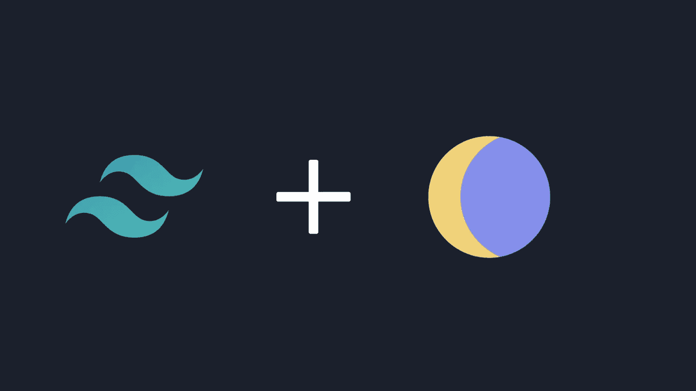

# 如何用顺风在 Next.js 中创建明暗模式切换

> 原文：<https://javascript.plainenglish.io/how-to-create-light-and-dark-mode-toggle-in-next-js-with-tailwind-61e67518fd2d?source=collection_archive---------1----------------------->

今天，我们将学习如何用 localStorage 在 Tailwind 中创建一个黑暗模式切换。所以，让我们直接开始吧。



首先，我们要用 Tailwind 建立一个 Next.js 应用程序。也可以使用 React。

你可以使用我创建的一个 [Next.js 顺风模板](https://github.com/avneesh0612/Nextjs-tailwind-starter-template)。自述文件中给出了安装步骤。如果你正在使用它，你可以跳到我们创建钩子的部分。

如果您想从头开始设置:

## 创建 Next.js 应用程序

```
npx create-next-app tailwind-darkmode
```

## 安装顺风

```
# If you're on Next.js v10
npm install -D tailwindcss@latest postcss@latest autoprefixer@latest

# If you're on Next.js v9 or older
npm install -D tailwindcss@npm:@tailwindcss/postcss7-compat postcss@^7 autoprefixer@^9
```

## 创建配置文件

```
npx tailwindcss init -p
```

## 将您的顺风配置文件更改为

这将启用清除您的文件，也启用黑暗模式。

最后，在 styles 文件夹中更改 globals.css

## 现在我们将创建我们的自定义挂钩。

创建名为 useDarkMode.js 的文件

那我们在这里做什么？

*   首先，我们从 React 导入`useState`和`useEffect`。
*   我们正在创建一个变量，它可以是亮的，也可以是暗的，我们将从 localStorage 中获取它的默认值，我们使用这个条件是因为服务器上没有 localStorage。
*   然后我们创建了一个`useEffect`钩子，当我们点击某个东西时，它会在黑暗模式和光明模式之间切换，我们也在本地存储中使用条件来设置主题。
*   最后是回归`colorTheme` 和`setTheme`。以便我们可以访问和编辑主题。

## 现在我们将创建两个用于切换的按钮

首先，我们需要像这样使用和导入我们的自定义钩子-

然后我将创建两个按钮图标。用于切换到亮模式的灯泡图标和暗模式的月亮图标，就像 index.js 中的一样。

如果你试着点击这些图标，你可以看到它们的变化。

现在我只是为这两个主题添加一个背景。

您的最终代码应该如下所示:

你的网站应该是这样的:

恭喜你！你用顺风 CSS 做了一个黑暗模式切换。🥳

我希望你从这篇教程中学到了什么。如果你面临任何问题，请随时查看我的回购或在我的任何社交网站上给我发信息。

## 有用的链接:

[该项目的 Github 库](https://github.com/avneesh0612/tailwind-darkmode-demo)

[顺风单据](https://tailwindcss.com/docs)

[Next.js 文档](https://nextjs.org/docs)

[联系我](https://avneesh-links.vercel.app/)

*更多内容看*[***plain English . io***](http://plainenglish.io/)