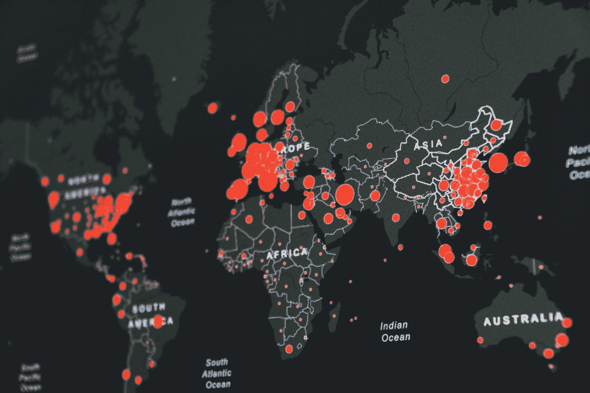

# 如何使用传单地图创建标记和标记簇

> 原文：<https://javascript.plainenglish.io/how-to-create-marker-and-marker-cluster-with-leaflet-map-95e92216c391?source=collection_archive---------2----------------------->

## 在活页地图架构中创建标记和图层，然后对标记进行聚类的方法。

Photo by [Martin Sanchez](https://unsplash.com/@martinsanchez?utm_source=medium&utm_medium=referral) on [Unsplash](https://unsplash.com?utm_source=medium&utm_medium=referral)

今天，我为你准备了一篇关于打字传单地图的文章。考虑到我们将在地图上显示的数据太多，这种过量会使我们的眼睛和地图的性能疲劳。

为了防止这种过度，我们使用 ***集群*** 结构。因此，map 在引导和运行时的性能得到了提高。

首先，我们将必要的模块添加到我们的 ***package.json*** 文件中。然后我们将导入这些模块。

`"dependencies": {`

`"leaflet":"^1.7.1",`

`"leaflet.markercluster":"^1.5.0" }`

之后，如果我们没有服务或 JSON 文件来使用我们的数据，我们准备自己的 JSON 文件。我准备了一个 JSON 文件，里面有在土耳其找到的 51 个省的坐标。

我们在 HTML 文件中用 id 定义了地图。

`

`

让我们开始建立我们的地图。首先，我们将为地图选择一个图层。用“OSM 图层、传单 OSM 图层、Openstreetmap 图层”等词搜索会遇到很多种地图。你可以选择你喜欢的或者使用它。

 [## 传单-用于交互式地图的开源 JavaScript 库

### 传单是一个现代的、轻量级的开源 JavaScript 库，用于移动友好的交互式地图。

leafletjs.com](https://leafletjs.com/)  [## 使用 WMS 和 TMS 服务-传单-用于交互式地图的 JavaScript 库

### ←教程 WMS，是 web 地图服务的缩写，是一种通过专业 GIS 软件(和…

leafletjs.com](https://leafletjs.com/examples/wms/wms.html)  [## 实用 OpenLayers 3 &传单

### 编辑 fleet . js，使其如下所示:var map = new L.Map('map '，{ layers: [ new L.TileLayer(…

astuntechnology.github.io](https://astuntechnology.github.io/osgis-ol3-leaflet/leaflet/00-OSM-MAP.html) 

我给你加了几个链接。我正在考虑一找到它就更新这个区域。

使用我们导入的`L`来创建图层，`L.tileLayer()`用这个方法添加我们的地图链接。您可以编写各种功能。我想让地图以最大 18 倍放大。如果你愿意，你可以给出最小值。现在，如果我们希望在开始坐标处看到地图，我们将它添加为中心。为此，我们使用`L.latLng()`。你可能认为我们在设定纬度和经度。

*我在这个例子中没有使用它，但是您可以通过使用* `*setLatLng(), getLatLng()()*` *方法在项目的任何部分给出纬度和经度来更新您的地图。*

我们创建了图层和地图中心。但是我们还没有地图。现在让我们创建它。我们将再次使用它们。`L.map()`我们在其中定义一个`id`。这个`id`将是我们添加到 HTML 页面的`id`。您仍然可以随意编辑属性。添加我为地图开口定义的中心点、开口缩放值和我们创建的图层。

我们将使用标记来创建`L.icon()`。对于`iconUrl`，如果您的系统上有自己的图标，您可以键入位置。传单默认图标位于`dist.`

`const markerCluster = new MarkerClusterGroup();`

使用它，我们创建一个标记集群。这样，标记就会聚集在一起。在一个循环中，我从我创建的 JSON 文件中调用纬度、经度和城市。

让我们用`L.marker`创建一个标记。我们添加坐标和图标。我们将标记`addLayer()`添加到我们创建的`markerCluster`中。除了循环之外，我们将`addLayer`和`markerCluster`添加到我们创建的`_map`中。

在这些操作之后，它将我们创建的标记添加到具有我们已有的聚类结构的地图中。

现在是有趣的部分。`_mar`我们想增加很多功能。`zoomend`、`click`、`mouseout,`、`popupopen`等等。最后，我们将向标记添加一个弹出窗口。

`_mar.bindPopup(city);`

我们只是用它来添加弹出窗口。

用`_map.getZoom()`我们可以看到地图的缩放值。同时我们可以用`_mapSetZoom()`给地图设置缩放值。

我们地图的最终版本如下。您可以通过 Stackblitz 更详细地检查它。

 [## 如何将角度组件样式与特殊选择器一起使用

### 在具有独立样式文件的组件的基础上，将样式添加到您的 Angular 应用程序有助于您创建一个更…

javascript.plainenglish.io](/how-to-use-angular-component-styles-with-special-selectors-dc877514372c)  [## 使用免费的 Vue.js 模板创建卡片设计

### 使用免费主题可能是开发设计和学习的最佳方式之一。

javascript.plainenglish.io](/create-a-card-design-with-the-free-vue-js-template-now-ui-kit-5676a738e518)  [## 使用角状星云在翻转卡中设计图表和日历

### 在活动卡片上创建一个快速、友好的图表和日历。

javascript.plainenglish.io](/chart-and-calendar-design-in-flip-card-using-angular-nebular-db0ffd434d5b)  [## 用 ClipPath 设计飘动主页

### 创建一个项目，一步一步设计。

bestte.medium.com](https://bestte.medium.com/flutter-home-page-design-with-clippath-3d89e9a1f9c5) 

*更多内容尽在*[*plain English . io*](http://plainenglish.io/)