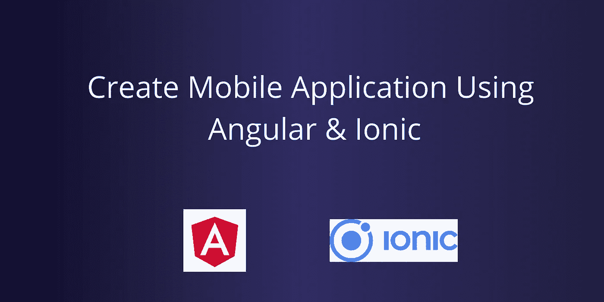

# 如何使用 Angular/React 创建移动应用程序

> 原文：<https://javascript.plainenglish.io/how-to-create-mobile-application-using-angular-react-b5a8cb019dc3?source=collection_archive---------1----------------------->

通过使用 Ionic 框架，你可以轻松地为 Android 和 iOS 创建一个移动应用程序。



是否可以使用 Angular/React 创建一个移动应用程序？

答案是“**是**”。

是的，我们可以使用 JavaScript 框架创建一个移动应用，比如 **Angular/ React / Vue** 。对于 **Android** 无需学习 **Java/Kotlin** 对于 **iOS** 无需学习 **Objective-C/Swift** 。您可以使用现有的 web 技术技能来构建移动应用程序。这是一个很酷的功能。不需要雇佣移动应用专家。我们可以使用我们现有的 **web** **开发**团队来创建一个移动应用程序。这有助于组织降低成本。然而，它也有优点和缺点。稍后我们可以更详细地了解它们。

**原生移动应用:**

如果我们正在使用 Java/Kotlin 创建 **Android** 应用程序，那么它被称为原生 Android 移动应用程序。

如果我们正在使用 Objective-C/Swift 创建 **iOS** 应用程序，那么它被称为原生 iOS 移动应用程序。

> 简单来说，如果我们使用组织声明的官方语言创建一个移动应用程序，就叫做原生移动应用程序。

**混合移动应用:**

如果我们使用 HTML、JavaScript 和 CSS 开发移动应用程序，那么我们称之为混合移动应用程序。

市场上有许多混合移动应用程序。下面列出了它们。

1.  **离子型**
2.  **反应原生**
3.  **PhoneGap**
4.  **颤动**
5.  **jQuery Mobile**
6.  **Xamarin**
7.  **等**。

我个人选择的是 **Ionic 框架。**


**我为什么选择离子型？**

> 为什么呢？因为 Ionic 通过为 Android 和 iOS 使用一个代码库来呈现原生的外观和感觉。

我来说说我的故事。2015 年，我被分配创建一个简单的移动应用程序。我已经会 Java 了。因此，创建 Android 应用程序对我来说没什么大不了。但是我不知道 Objective-C 创建一个 iOS 应用程序。我已经有很多作品在排队了。于是我上网搜了一下，找到了解决办法。那就是**混合移动应用**。那时候 PhoneGap 很流行。但是，我选择爱奥尼亚。为什么呢？因为 Ionic 通过为 Android 和 iOS 使用一个代码库(从 Ionic 版本 2 开始)来呈现原生的外观和感觉。

**为什么是离子框架？**

1.  自然的外观和感觉——这是选择 Ionic 的主要原因。
2.  支持 Angular、React、Vue 等多种 JavaScript 框架。
3.  您可以使用 Cordova 或电容器访问设备硬件
4.  学习曲线少。
5.  UI 搭建非常简单。它非常类似于 bootstrap。
6.  您可以使用标准网格功能轻松创建响应性布局。

理论够了。让我们看一个简单的例子，如何使用 Angular 创建一个简单的 Ionic 项目，并在 Android 和 iOS 中使用浏览器一步步预览它。

**安装需要的软件:**

我们需要 NodeJS。所以使用下面的链接安装 NodeJS。

```
[https://nodejs.org/en/download/](https://nodejs.org/en/download/)
```

接下来，我们需要使用 **npm** 安装 Ionic 框架。在命令行终端中运行以下命令，安装 Ionic CLI (ionic)。

```
npm install -g [@ionic/cli](http://twitter.com/ionic/cli) native-run cordova-res
```

1.  native-run = >用于在设备模拟器/仿真器上运行本机二进制文件
2.  cordova-res = >用于生成本地应用程序图标和闪屏:

**创建离子项目:**

要创建 Ionic 项目，请在终端上运行以下命令。

```
ionic start ionic-demo-app blank --type=angular --capacitor
```

1.  **离子启动** = >命令创建一个项目
2.  **ionic-demo-app** = >是项目名称。你可以用任何名字。
3.  **- -type=angular** = >我们正在强制 Ionic 框架创建角度相关的工作空间。为什么因为 Ionic 将支持 Angular、React、Vue 等三种 JavaScript 框架。
4.  **--电容器** = >我们定义使用电容器作为与设备硬件交互的媒介。我们也可以用科尔多瓦。

从网上下载所需的库需要一些时间。

**在浏览器上预览:**

您可以使用下面的命令轻松预览应用程序。

```
ionic serve --lab
```

上面的命令会在浏览器上显示出 **Android** 和 **iOS** 的输出，如下图所示。


**项目结构:**

项目结构与 Angular web 应用程序结构非常相似。


**数据绑定&点击事件等:**

数据绑定和单击与 Angular 中的相同。代码没有变化。您可以在 Ionic 项目中使用 Angular 的所有其他功能。

**登录页面:**

在这里，我将向你展示如何设计一个登录页面。这是一个**快速** **演示**。我不打算解释代码。只要复制粘贴，就可以了。主页组件是默认的登陆页面，在 **app.routing.ts** 文件中定义。

要创建输入字段，将以下代码粘贴到**home.component.html**文件中。

使用下面的代码创建一个密码字段。

使用下面的代码创建一个按钮。

当你保存代码时，它会自动重新加载页面。输出如下所示。


**获取完整源代码:**

```
[https://github.com/bharathirajatut/angular-examples/tree/master/ionic-demo-app](https://github.com/bharathirajatut/angular-examples/tree/master/ionic-demo-app)
```

**优点:**

1.  如果你是一名 web 开发人员，那么你可以使用现有的 **HTML** 、 **JavaScript** 和 **CSS** 知识轻松创建一个移动应用程序。
2.  您可以使用一个代码库创建 **Android** 和 **iOS** 应用程序。
3.  Ionic 渲染**原生**应用**观感**。所以混合应用看起来会像原生应用。
4.  无需雇佣原生移动应用开发者。它将**减少**组织的**成本**。
5.  您可以非常快速地创建应用程序。与本机应用程序相比，它减少了开发时间。
6.  我们可以访问设备的硬件，如摄像头、wifi、位置等。，使用**阿帕奇电容器**。
7.  最适合面向数据(将 web 应用程序转换为移动应用程序)的应用程序，如 ERP、CRM 等。

缺点:

1.  与原生移动应用相比，它在性能方面缺乏。
2.  如果您的应用程序严重依赖设备硬件，那么不要选择混合框架。为什么因为我们只有**有限** **支持**和有限定制。
3.  与本地移动应用程序相比，APK 的大小很大。我生成了一个页面的 Ionic 应用程序，它消耗了最少 4MB，而本地语言不到 1 MB。
4.  支付网关的整合非常困难。我们只有几个科尔多瓦图书馆。有时，支付网关库无法与 iOS 兼容。所以你在 iOS 中部署的时候会面临问题。
5.  Cordova 库不能与最新的 Android 版本一起编译。因此，当您升级目标 Android 版本或 Ionic 版本或 Apache Cordova 库版本时，您的应用程序可能无法生成分发文件。

**结论:**

在本教程中，您学习了如何使用 Angular 创建移动应用程序。您了解了本机应用程序和混合应用程序之间的区别。混合应用程序框架降低了组织的成本，减少了移动应用程序的开发时间。**我们需要两个开发人员来生成一个 Android 和 iOS 应用**。在这里，一个开发人员将创建两个应用程序。它最适合将 web 应用程序转换为移动应用程序。

希望你喜欢这个教程。如果你有任何疑问，请评论。

我计划写一系列关于 Ionic 框架的文章。这不是文章的结尾。**只是对 Ionic 框架**的介绍。请继续关注更多关于 Angular 的文章。最后，它是一个**开放**源**框架。**

谢谢你。