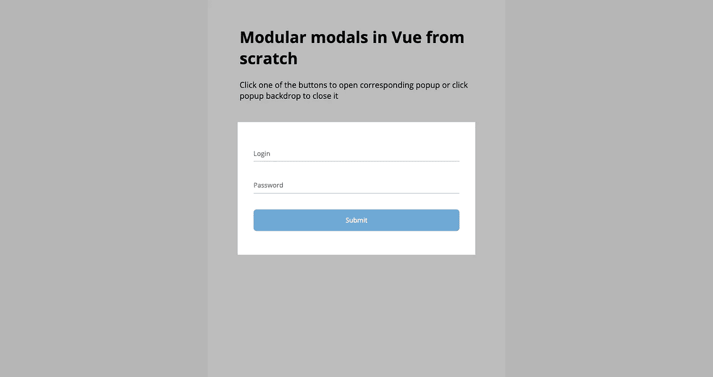
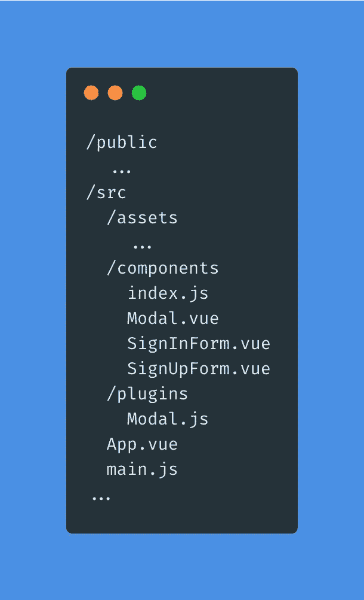

# 如何在 Vue.js 中创建模块化模态

> 原文：<https://javascript.plainenglish.io/how-to-create-modular-modals-in-vue-js-ef1289120a08?source=collection_archive---------8----------------------->

## 为什么我们需要模块化组件，如何制造它们？


Photo by [Glen Carrie](https://unsplash.com/@glencarrie?utm_source=medium&utm_medium=referral) on [Unsplash](https://unsplash.com?utm_source=medium&utm_medium=referral)

当我们需要添加公共 UI 组件(比如模态或通知吐司)时，我们经常从 npm 导入包。这种方法的模块化本质有助于我们理解一些重要的概念:可维护性、可伸缩性和可重用性。

JavaScript 生态系统为我们提供了大量可供选择的包，我们可以轻松地将它们插入到我们的项目中，无需任何复杂的设置，而且它们几乎总是*足够好。*

但是，如果提供的模块对我们的情况来说有点额外的开销呢？另一方面，如果我们需要显著地扩展它或者完全控制它呢？

好的一面是它足够简单，可以自己实现。本文讲述了我自己从头构建模态组件的经历。最终结果可在 [Github 页面](https://kotosha-real.github.io/vue-modular-modal/)获得。你也可以在这个 [Github repo](https://github.com/kotosha-real/vue-modular-modal) 中抓取源代码，使用这个[沙箱](https://codesandbox.io/s/modular-vue-modals-dbfoo)，或者自己编码。

# 引导项目

让我们用 [Vue CLI](https://cli.vuejs.org/) 创建一个简单的项目:

```
vue create my-project
```

出现提示时，选择默认 Vue 2 设置。

成功安装后，更改到项目目录:

```
cd my-project
```

现在我们可以开始研究我们的项目结构了。让我们删除默认组件并添加新组件，结果应该如下所示:


Basic project structure

让我们看看我们有什么:

1.  应用组件是我们应用的基础
2.  模态组件来创建我们的模态
3.  在模式组件中使用的 SignInForm 和 SignUpForm 组件
4.  只是为了对我们的组件有一个很好的单行导入

下面是应用程序组件最初的样子:

Boilerplate App component

注意，每种形式都有两个模态。这是我会使用的方法:一个模式——一个目的。此时，情态动词总是隐藏的。我们稍后将实现打开/关闭逻辑。

现在，让我们来看看模态分量:

Boilerplate Modal component

现在没有太多要说的，所以让我们继续形成组件:

Boilerplate Form components

他们几乎是一样的，此刻没有那么有趣。

最后，确保你的`index.js`看起来像这样:

Simple as it is

最后，你可以添加一些漂亮的字体。为此，只需将带有所需字体的`<link />`标签放入位于`/public`目录下的`index.html`文件中，并更改应用程序组件`<style />`标签中的`font-family`属性。我为这个项目选择了 [Open Sans](https://fonts.google.com/specimen/Open+Sans) ，但是你可以使用你喜欢的任何东西。

让我们看看我们的应用程序:

```
npm run serve
```

如果您跟着做，您应该会看到类似这样的内容:


Voila!

现在我们有了一个好看的应用程序，我们必须选择一种方法来处理模态。

# 自定义事件方法

第一种方法是向应用程序组件添加一些数据，以存储模态的可见性状态和更改它的控件。让我们开始吧:

App component with custom event approach

我们添加了`isSignInModalOpen`和`isSignUpModalOpen`标志来控制相应模态的可见性。我们可以通过单击登录/注册按钮来更改它们。此外，我们还向自定义事件添加了一个侦听器，该事件将由模态发出以关闭自身。

对模态组件做了一点小小的补充，使它能够自我关闭:

Modal component with custom events approach

注意，我们在 click 事件侦听器上使用了`self`修饰符，以确保我们只在单击背景时发出 close 事件。

现在，如果我们单击其中一个按钮，我们将看到相应的模态显示出来！



Here is our sweet modal

这看起来是一个好方法:我们添加了一个非常简单的逻辑来控制模态，而且我们做得非常快。什么会出错？

考虑这个例子:

We just added some more components and it got messy

如果我们把控制模态状态的按钮放在另一个组件中会怎么样？如果我们希望表单组件能够关闭它们所在的模态，该怎么办？在这两种情况下，我们都必须添加自定义事件，并且通常在我们想要改变嵌套组件内的模态状态的每种情况下都必须添加自定义事件。

虽然在上面的例子中看起来*相对来说没有那么糟糕*，但是当我们有深度嵌套的组件时，情况可能会糟糕得多。有两种方法可以解决这个问题:

1.  从最深层的子组件发出自定义事件，将模式状态更改为应用程序组件本身
2.  在子组件中使用`$root.$emit`来发出定制事件，在应用组件中使用`$root.$on`来监听它并对它做出反应

使用 `$root.$emit`和`$root.$on`可能是一个好的解决方案，但是有一个更好的方法，它不需要你添加任何定制的状态管理来控制模态。

# 插件方法

正如[官方文件](https://vuejs.org/v2/guide/plugins.html)所说:

> 插件通常会给 Vue.js 添加全局级的功能

这就是我们将要做的:写一个插件并把它附加到 Vue 原型上，这样我们就可以在任何地方使用它。事情是这样的:

1.  插件公开打开/关闭方法
2.  模态组件有自己的状态来决定是否显示自己
3.  模态组件监听插件事件来改变它们的状态

这种方法加强了处理模态的特定模式，也确保了我们应用程序中每个模态的完全独立性——我们引入错误的空间更小，我们不需要自己管理模态的状态。这是一个易于使用的、声明式的、真正模块化的解决方案，我们可以毫不费力地在另一个应用程序中重用。我们写一些吧！

首先，我们需要为插件添加另一个目录:



Add `plugins` folder to the src directory and create Modal.js file

插件应该是这样的:

Modal plugin

让我们来看看:我们实现了 [Singleton](https://refactoring.guru/design-patterns/singleton) 模式，创建了另一个 Vue 实例作为[事件总线](https://github.com/kotosha-real/event-bus-example)，并全局注册了模态组件。

下一步是在`main.js`文件中注册插件:

Plugin registration

之后，重构模态组件:

Modal component with plugin approach

现在，组件本身用`isOpen`标志控制自己的状态。每个组件实例监听插件事件，并根据它们决定它们的状态，这就是为什么我们必须为模型提供一个`name`道具。

最后，让我们重新连接应用程序组件:

App component with plugin approach

现在，我们要在 App 组件中存储的只是模态名。其他的都被插件本身覆盖了。我们所要做的就是使用插件，把模态组件放在一个地方，给它们命名，然后在我们应用的任何部分使用插件方法。你不需要做任何额外的步骤就可以在其他地方使用这个插件，安装过程是一样的。

# 结论

在本文中，我们介绍了在 Vue.js 中编写模块化模态组件的两种方法。模块化组件有助于我们编写更简洁、更易于维护、易于重用的代码。以模块化的方式思考代码可能需要一些时间来掌握，但从长远来看，这将为您节省大量时间，所以我强烈建议尝试一下。

如果你喜欢这篇文章，请告诉我！

祝你今天开心！玩的开心！

[*更多内容看 plainenglish.io*](http://plainenglish.io/)