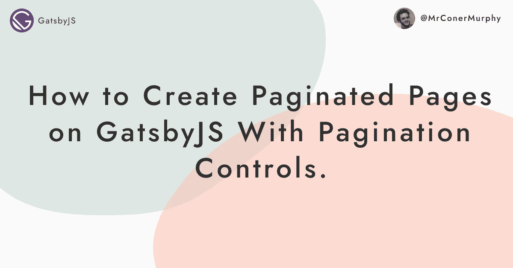
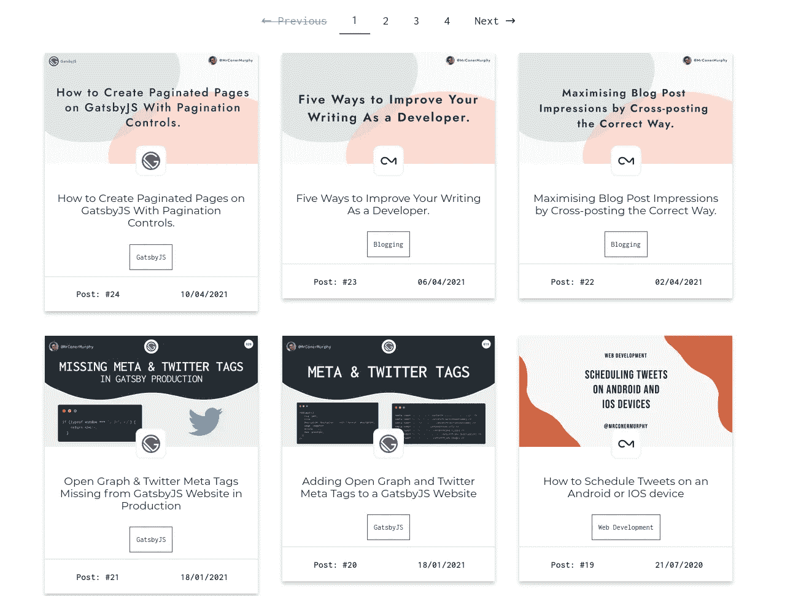
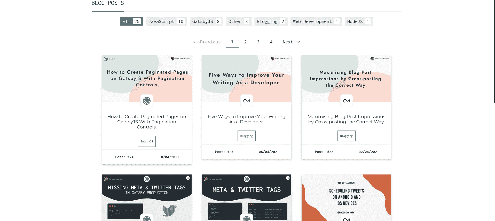

# 如何用分页控件在 GatsbyJS 上创建分页页面

> 原文：<https://javascript.plainenglish.io/how-to-create-paginated-pages-on-gatsbyjs-with-pagination-controls-49e3bb557030?source=collection_archive---------21----------------------->



欢迎回到博客！在这篇文章中，我们将看看如何在 GatsbyJS 网站上给页面添加分页。

在这篇文章的结尾:

1.  您的网站将能够根据需要创建页面来容纳您的所有内容。
2.  页面的数量将由我们希望每页的文章数量决定。
3.  最后，我们将添加控件来在页面之间导航，并能够跳到某个页面。

## 我们在创造什么？

下面是我的直播网站[conermurphy.com](https://conermurphy.com/blog/gatsbyjs-pagination-tutorial/)的截图。今天，我们将讨论允许我们指定我想要每页 X 个帖子，然后让 Gatsby 为我们创建页面的功能。出于本教程的目的，我将使用博客作为例子，但是这个逻辑可以应用于网站上的任何页面。比如我在网站上的笔记也是用的。

我们将以下面的 URL 结构结束:

*   yourURL.com/blog/
*   yourURL.com/blog/1
*   yourURL.com/blog/2
*   yourURL.com/blog/3

Check it out:



# Prerequisites

So, what do you need to have done already before working through this tutorial?

As long as you have a working blog with some posts on it you will be good to go. For the purposes of this tutorial, I won't be covering how to set up sourcing content into Gatsby. Or, how to create the individual blog posts using a template file. But, if you are interested in these tutorials please let me know.

As long as you currently have a single page that has all your posts on it, you'll be good to go. 😃

If you are looking to set up your blog for the first time, [log rocket 在这里有很棒的教程。](https://blog.logrocket.com/creating-a-gatsby-blog-from-scratch/)

# 盖茨比节点

好了，一切都结束了，让我们开始实际编写一些代码。

如上所述，我们应该已经在 gatsby-node.js 中将我们的帖子来源于 Gatsby。

如果您的个人文章页面生成已经设置好了，您应该有一个到 createPages API 的挂钩。如果不是，没关系，这里有一个快速概述。

## [创建页面](https://conermurphy.com/blog/gatsbyjs-pagination-tutorial/#createpages)

`createPages`是 Gatsby Node 的一个 API，允许你动态创建页面。这个 API 在节点的来源和转换以及 GraphQL 模式的创建完成之后运行。点击此处了解更多信息。

*在下面的代码示例中，我在我的 gatsby-node 文件中使用了 ES6 模块，这些模块在默认情况下是不启用的。你可以按照我在 Twitter 上做的一个教程来设置这些。*

为了开始设置`createPages` API 和分页页面的生成，我们需要添加下面的代码。

```
export async function createPages(params) {
  await Promise.all([turnBlogPostsIntoPages(params)]);
}
```

这允许我们挂钩到 createPages API。`Promise.all`不是必需的，你可以把所有的代码添加到这个函数中。但是，为了可读性，我将各个代分离到它们自己的函数中。

为了说明这一点，下面是我当前网站的一个直接副本:

```
export async function createPages(params) {
  // After the creation of the nodes create pages for each custom type.
  await Promise.all([
    // Blog Posts
    turnBlogPostsIntoPages(params),
    // Notes Pages
    turnNotesIntoPages(params),
    // Turn sourced Twitter Threads into pages.
    turnTwitterThreadsIntoPages(params),
    // Blog Tags Pages
    turnBlogPostTagsIntoPages(params),
    // Turn Notes Categories into pages
    turnNotesCategoriesIntoPages(params),
    // Turn Twitter Threads Tags Into Pages
    turnThreadsTagsIntoPages(params),
    // Turn Portfolio Tags into pages
    turnPortfolioTagsIntoPages(params),
    // Turn Read Categories into pages.
    turnReadsCategoriesIntoPages(params),
  ]);
}
```

如果我把所有这些函数放到`createPages`函数中，这个函数将超过 300 行。这对我们的可读性肯定不好。

无论如何，回到正题。接下来，我们需要创建我们声明的`turnBlogPostsIntoPages`函数。

所以，在这个`createPages`函数的上面添加一个新的函数，如下所示:

```
async function turnBlogPostsIntoPages({ graphql, actions }) {
  const { createPage } = actions;
}

export async function createPages(params) {
  await Promise.all([turnBlogPostsIntoPages(params)]);
}
```

现在，我们有了一个在`createPages` API 运行时被调用的函数。让我们更深入地研究这个函数，并开始让它做一些有用的事情。

这是完成的代码，我们马上就要分解它。

```
async function turnBlogPostsIntoPages({ graphql, actions }) {
  // 0: Destructuring out the action createPage which is used to create the pages.
  const { createPage } = actions;

  // 1: Query for all of blog post data. Most importantly the totalCount which we will use later on.
  const {
    data: {
      blog: { edges: blogPosts, totalCount: blogTotalCount },
    },
  } = await graphql(`
    query {
      blog: allMdx(filter: { fields: { contentCategory: { eq: "blog" } } }) {
        edges {
          node {
            fields {
              slug
              contentCategory
            }
            frontmatter {
              title
              date(formatString: "DD/MM/YYYY")
            }
          }
        }
        totalCount
      }
    }
  `);

  // 2: Create a page for every blog post node. (This is for indivual blog posts.)
  blogPosts.forEach(({ node }, index) => {
    createPage({
      path: node.fields.slug,
      component: path.resolve("./src/templates/Blog.js"),
      context: {
        slug: node.fields.slug,
        prev: index === 0 ? null : blogPosts[index - 1].node,
        next: index === blogPosts.length - 1 ? null : blogPosts[index + 1].node,
      },
    });
  });

  // 3: Create the main blog pages containing the posts..
  const blogTemplate = path.resolve("./src/pages/blog.js");

  const pageSize = 6; // Total number of posts on each page
  const pageCount = Math.ceil(blogTotalCount / pageSize); // Total number of pages required.

  // Loop through each page required (1 to x) and create a new blog page for each.
  Array.from({ length: pageCount }).forEach((_, i) => {
    createPage({
      path: `/blog/${i === 0 ? "" : i + 1}`,
      blogTemplate,
      // Context is passed to the page so we can skip the required amount of posts on each page.
      context: {
        skip: i * pageSize,
        currentPage: i + 1,
        pageSize,
      },
    });
  });
}
```

如果您已经在 GatsbyJS 上完成了一个博客的设置，那么您可能已经有了一些类似这样的代码。让我们分解每个步骤，看看发生了什么。

1.  这是我们析构 createPage 动作的地方。这是用来从我们提供的信息实际创建页面。
2.  我们查询与 GraphQL 中的帖子相关的所有信息。最重要的是`totalCount`这个数字，因为这是用来计算我们以后需要多少页的。
3.  这是使用我们在上面构造的 createPage 操作创建单个博客文章的地方。
4.  这是本教程中我们感兴趣的步骤。这是我们创建分页博客文章的地方。让我们在下面对此进行更详细的分析。

## 分解分页

下面是本教程中我们特别感兴趣的代码:

```
const blogTemplate = path.resolve("./src/pages/blog.js");

const pageSize = 6; // Total number of posts on each page
const pageCount = Math.ceil(blogTotalCount / pageSize); // Total number of pages required.

// Loop through each page required (1 to x) and create a new blog page for each.
Array.from({ length: pageCount }).forEach((_, i) => {
  createPage({
    path: `/blog/${i === 0 ? "" : i + 1}`,
    blogTemplate,
    // Context is passed to the page so we can skip the required amount of posts on each page.
    context: {
      skip: i * pageSize,
      currentPage: i + 1,
      pageSize,
    },
  });
});
```

让我们看看这里发生了什么。

```
const blogTemplate = path.resolve("./src/pages/blog.js");
```

首先，我们导入将用于创建所有分页页面的模板文件。请注意，这是 pages 目录中的实际博客页面。而不是用于创建位于 templates 文件夹中的单个帖子的文件。

```
const pageSize = 6; // Total number of posts on each page
const pageCount = Math.ceil(blogTotalCount / pageSize); // Total number of pages required.
```

接下来，我们创建另外两个变量来控制页面大小和我们需要多少页面。这是通过将`pageSize`变量设置为我们希望每页上的文章数量来实现的。然后我们用这个变量来计算出我们需要多少页。

我们通过从 graphQL 查询中取出`totalnumber`并将其除以页面大小来实现这一点。通过舍入这个结果，它告诉我们需要多少页。

然后我们进入有趣的部分:

```
// Loop through each page required (1 to x) and create a new blog page for each.
Array.from({ length: pageCount }).forEach((_, i) => {
  createPage({
    path: `/blog/${i === 0 ? "" : i + 1}`,
    blogTemplate,
    // Context is passed to the page so we can skip the required amount of posts on each page.
    context: {
      skip: i * pageSize,
      currentPage: i + 1,
      pageSize,
    },
  });
});
```

这是怎么回事？

其中最重要的部分是第 2 行发生的事情。这是使我们能够创建多个博客页面的部分。

```
Array.from({ length: pageCount }).forEach((_, i) => {});
```

我们有一个变量告诉我们需要多少页(`pageCount`)。但是，为了让这个对我们有用，我们需要能够循环所有通向这个点的数字。这将允许我们为每个号码创建一个单独的页面。

这就是上面这条线出现的地方。我们使用`Array.from({ length: pageCount })`来创建一个长度为我们需要创建的页数的数组。是的，数组项将是空白的，但这没关系，因为我们只对索引感兴趣。

为了访问索引，我们用一个`.forEach((_, i) => {})`链接到`Array.from()`，如上所示。因为我们只对索引感兴趣，所以我们可以跳过 forEach 的第一个参数。这将代表数组中当前索引的实际项目(空白)。然后，这允许我们访问第二个参数，它表示当前项的索引。

我们现在能够循环遍历一个可变长度的数组，以允许我们创建所需数量的页面。现在我们需要做实际的创作。

我们可以用下面的代码做到这一点:

```
createPage({
  path: `/blog/${i === 0 ? "" : i + 1}`,
  component: blogTemplate,
  // Context is passed to the page so we can skip the required amount of posts on each page.
  context: {
    skip: i * pageSize,
    currentPage: i + 1,
    pageSize,
  },
});
```

我们来分析一下这是怎么回事。

我们向`createPage`动作传递一系列参数，它们是:

*   路径:将为其创建页面的 URL。
*   组件:这是将用于模板化页面的文件。
*   context:包含传递给页面的数据的对象。
*   skip:我们传递它来告诉页面在 GraphQL 查询中跳过多少篇文章。我们通过将当前索引乘以页面大小来计算。所以第一页应该是:`0 * 6 = 0`，第二页应该是:`1 * 6 = 6`。这确保了我们为每个页面跳过正确的文章数量。
*   currentPage:告诉页面当前是什么页面，我们将在以后使用它进行导航。
*   pageSize:我们定义的页面大小。

在这篇博文的最后一节，背景数据会更有意义。这时，我们将研究如何创建分页控件，以便在我们创建的页面之间移动。但是，现在让我们看看我们需要对页面文件进行的更改，以便它可以使用我们传递的`skip`和`pageSize`上下文。

# 修改页面文件

现在，我们有了`gatsby-node.js`文件设置，并准备好为我们创建所有的页面。我们现在需要修改为我们列出所有帖子的页面文件。

## 更新 GraphQL 查询

首先，我们需要更新页面上运行的 GraphQL 查询。您应该已经有了如下所示的内容:

```
export const query = graphql`
  query {
    blog: allMdx(
      sort: {
        order: [DESC, DESC]
        fields: [frontmatter___date, frontmatter___id]
      }
      filter: { fields: { contentCategory: { eq: "blog" } } }
    ) {
      edges {
        node {
          fields {
            slug
          }
          frontmatter {
            date(formatString: "DD/MM/YYYY")
            tags
            title
            id
            image {
              childImageSharp {
                fluid(maxWidth: 400) {
                  ...GatsbyImageSharpFluid
                }
              }
            }
          }
        }
      }
      totalCount
    }
  }
`;
```

在这个查询中需要注意的重要部分是，我们正在获取所有的博客文章。此时，除了我用来选择所有博客内容的过滤器之外，对查询没有任何限制。

现在，让我们看看我们需要添加什么。

还记得当我们编辑`gatsby-node.js`文件时，我们将一些上下文传递给页面吗？最著名的是`skip`和`pageSize`。因为我们将它们作为上下文传递给页面，所以我们可以在 GraphQL 中使用它们作为变量。

让我们看一下修改后的查询，然后我们将对它们进行分解:

```
export const query = graphql`
  query($skip: Int = 0, $pageSize: Int = 6) {
    blog: allMdx(
      limit: $pageSize
      skip: $skip
      sort: {
        order: [DESC, DESC]
        fields: [frontmatter___date, frontmatter___id]
      }
      filter: { fields: { contentCategory: { eq: "blog" } } }
    ) {
      edges {
        node {
          fields {
            slug
          }
          frontmatter {
            date(formatString: "DD/MM/YYYY")
            tags
            title
            id
            image {
              childImageSharp {
                fluid(maxWidth: 400) {
                  ...GatsbyImageSharpFluid
                }
              }
            }
          }
        }
      }
      totalCount
    }
  }
`;
```

正如您在查询的第一行看到的，我们添加了两个变量作为上下文传递。让我们更深入地看看这一行:

```
query($skip: Int = 0, $pageSize: Int = 6 ) {
```

如果您不熟悉 GraphQL 语法。下面是正在发生的事情的快速概述。

*   $skip:这是变量的名称
*   Int:这是变量的数据类型
*   = 0:这是变量的默认值。

因此，在这一行中，我们接受两个都是整数的变量，并给它们一个默认值。

现在，让我们看看它们在查询中的使用位置:

```
query($skip: Int = 0, $pageSize: Int = 6 ) {
    blog: allMdx(
      limit: $pageSize
      skip: $skip
      sort: { order: [DESC, DESC], fields: [frontmatter___date, frontmatter___id] }
      filter: { fields: { contentCategory: { eq: "blog" } } }
    )
    // Rest of the query goes here...
}
```

如你所见，我们添加了`skip`和`pageSize`变量。它们被传递给查询的`skip`和`limit`属性。

如果我们将其转换为第 1 页的实际值，它看起来会是这样的:

```
query($skip: Int = 0, $pageSize: Int = 6 ) {
    blog: allMdx(
      limit: 6
      skip: 0
      sort: { order: [DESC, DESC], fields: [frontmatter___date, frontmatter___id] }
      filter: { fields: { contentCategory: { eq: "blog" } } }
    )
    // Rest of the query goes here...
}
```

这是因为我们希望将结果限制为 6 个值，并且我们跳过 0，因为我们在第一页上。如果我们以第 2 页为例，我们可以开始了解它是如何工作的。

```
query($skip: Int = 0, $pageSize: Int = 6 ) {
    blog: allMdx(
      limit: 6
      skip: 6
      sort: { order: [DESC, DESC], fields: [frontmatter___date, frontmatter___id] }
      filter: { fields: { contentCategory: { eq: "blog" } } }
    )
    // Rest of the query goes here...
}
```

唯一改变的是跳过值。现在，我们跳过前 6 个值，而不是跳过 0 个值。然后，我们从数据集中的第 7 项开始，最多返回 6 个值。

这是重复的每一页，我们产生，直到我们已经涵盖了所有的职位。

***注意:*** *如果你想让你的首页显示最新的帖子你需要在查询中使用* `*sort*` *属性。关于如何使用 frontmatter___date 字段进行排序，请参见我上面的示例。*

# 分页控件

让我们的帖子分页显示在几页上真是太好了。但是，如果我们必须在它们之间移动的唯一方式是通过改变 URL，我们将有问题。

这就是添加分页控件将帮助我们的地方。我们将添加几个专用按钮，允许在页面上下移动。我们还将在按钮中间添加一个页面列表，这样如果你愿意，你可以跳过页面。

## 创建分页组件

在我们可以在页面中实现它之前，我们首先需要创建我们的`Pagination`组件。现在让我们看一下代码。

```
export default function Pagination({ pageSize, totalCount, currentPage }) {
  const totalPages = Math.ceil(totalCount / pageSize);
  const prevPage = currentPage - 1;
  const nextPage = currentPage + 1;
  const hasNextPage = nextPage <= totalPages;
  const hasPrevPage = prevPage >= 1;

  const prevLink = prevPage === 1 ? "blog" : `blog/${prevPage}`;
  const nextLink = `blog/${nextPage}`;

  return (
    <div>
      <Link title="prev page" disabled={!hasPrevPage} to={prevLink}>
        &#8592; <span className="word">Previous</span>{" "}
      </Link>
      {Array.from({ length: totalPages }).map((_, i) => (
        <Link
          key={`blog-page-${i}`}
          className={currentPage === 1 && i === 0 ? "current" : ""}
          to={`blog/${i === 0 ? "" : i + 1}`}
        >
          {i + 1}
        </Link>
      ))}
      <Link title="next page" disabled={!hasNextPage} to={nextLink}>
        <span className="word">Next</span> &#8594;
      </Link>
    </div>
  );
}
```

代码并不复杂，我们有几个来自 Gatsby 的`Link`元素。然后是我们之前的另一个`Array.from()`特色菜。不过这次我们没有使用`.forEach()`，而是使用了`.map()`，因为我们想要返回元素。

我们来分析一下。

## 创建链接

我们要看的第一部分是根据我们传入的道具为我们生成链接的代码。代码如下:

```
export default function Pagination({
  pageSize,
  totalCount,
  currentPage
}) {
  const totalPages = Math.ceil(totalCount / pageSize);
  const prevPage = currentPage - 1;
  const nextPage = currentPage + 1;
  const hasNextPage = nextPage <= totalPages;
  const hasPrevPage = prevPage >= 1;

  const prevLink = prevPage === 1 ? "blog" : `blog/${prevPage}`;
  const nextLink = `blog/${nextPage}`;

  // ... Rest of the component here
```

那么，我们在这里做什么？

首先，我们传入一系列道具:

1.  pageSize:我们希望每页上的文章数量。
2.  totalCount:博客页面上来自 GraphQL 查询的博客帖子总数
3.  currentPage:这来自我们在`gatsby-node.js`中添加的上下文。它在页面上被析构出来，然后传递给组件。

在此之后，我们创建一系列变量，用于确定是否有另一个页面要导航到。如果有，URL 是什么。

1.  totalPages: Int:所需的总页数
2.  prevPage: Int:根据当前页计算出前一页的索引。
3.  Int:根据当前页面计算出下一个页面的索引。
4.  hasNextPage: Bool:检查`nextPage`是否小于等于`totalPages`。
5.  hasPrevPage: Bool:检查`prevPage`变量是否大于或等于 1。

这 5 个变量在整个组件中用来决定元素是否应该显示。但是，我们一会儿就会讲到。首先，我们需要创建下一个和上一个链接，这是我们最后的两个变量。

1.  prevLink: Str:检查`prevPage`变量是否等于 1。如果是这样，将变量设置为`'blog'`，这会将您重定向到主博客页面。如果不是，将变量设置为`blog/${prevPage}`。
2.  nextLink: Str:这个设置为`blog/${nextPage}`。这样做是因为我们有一个单独的变量来控制是否有另一个页面。

现在我们已经讨论了创建元素所需的所有变量，让我们看看如何制作按钮。

## 下一个和上一个按钮

“上一页”和“下一页”按钮的代码实际上是相似的，只是做了一些文字上的修改。出于这个原因，我将只分解其中一个，这样我们就可以了解它们是如何工作的。首先让我们看一下完整的代码，这样您就可以看到不同之处了:

```
<Link title="prev page" disabled={!hasPrevPage} to={prevLink}>
  &#8592; <span className="word">Previous</span>{' '}
</Link>

<Link title="next page" disabled={!hasNextPage} to={nextLink}>
  <span className="word">Next</span> &#8594;
</Link>
```

链接的结构是一个 Gatsby `Link`元素，包装一个描述按钮功能的`span`。让我们看看我们用它们做了什么:

1.  title: Str:我们在元素上设置了一个 title 属性，向用户声明每个链接的作用。
2.  disabled: Bool:这是两个变量`hasPrevPage`和`hasNextPage`出现的地方。如果变量表示下一页或上一页在可用页面之外，它将禁用链接。然后 CSS 对其进行样式化，以降低不透明度并防止用户点击它们。检查以下代码。
3.  to: Str:这是我们希望元素被点击时导航到的目的地。

这包括了功能，最后一部分是添加文本元素以在屏幕上标记它们。为此，我们使用一个`span`来包装相关的单词和一个取决于按钮的下一个/上一个箭头。

禁用链接的 CSS 代码:

```
&[disabled] {
      pointer-events: none;
      text-decoration: line-through;
      color: var(--black);
      opacity: 0.5;
    }
```

## 添加所有页面

分页组件就要完成了。我们只需要添加上一页和下一页按钮之间的链接。

下面是添加页面链接的代码:

```
{
  Array.from({ length: totalPages }).map((_, i) => (
    <Link
      key={`blog-page-${i}`}
      className={currentPage === 1 && i === 0 ? "current" : ""}
      to={`blog/${i === 0 ? "" : i + 1}`}
    >
      {i + 1}
    </Link>
  ));
}
```

它基于与我们过去在`gatsby-node.js`中生成每个页面相似的原理。然而，我们没有使用`.forEach()`来遍历每个索引，而是使用`.map()`来返回`Link`元素。

让我们来分析一下这个代码块中发生了什么:

1.  我们创建一个长度等于`totalPages`的数组，然后映射每个索引。
2.  我们创建一个`Link`元素，并向它传递 3 个属性:
3.  key: Str:从 map 返回元素时，React 需要标准键属性。
4.  className: Str:用于将“当前”类添加到元素中，如果我们在页面上允许样式化的话。
5.  to: Str:我们希望链接导航到的目的地。
6.  最后，我们将索引加 1 的文本添加到`Link`中，以否定 JavaScript 数组的 0 索引。

下面是我们添加的当前元素样式的 CSS:

```
&[aria-current],
&.current {
  color: var(--green);
  font-weight: 600;
  border-bottom: 2px solid var(--green);
}
```

# 添加到页面文件

我们现在已经创建了分页组件，是时候将它添加到我们的博客页面文件中了，如下所示:

```
return (
  <>
    <Pagination
      pageSize={6}
      totalCount={totalCount}
      currentPage={currentPage || 1}
    />
    <AllPostsContainer>
      {blogPosts.map((post) => (
        <BlogPostCard
          key={`blogPostCard-${post.node.frontmatter.id}`}
          post={post}
        />
      ))}
    </AllPostsContainer>
    <Pagination
      pageSize={6}
      totalCount={totalCount}
      currentPage={currentPage || 1}
    />
  </>
);
```

由于我们已经拆分了整个分页组件，现在的问题是传入所需的属性:

1.  pageSize: Int:每个页面上的文章总数
2.  totalCount: Int:来自 GraphQL 查询的帖子总数。
3.  如果不为 1，则从上下文获取当前页面的索引。

我们现在应该已经准备好了，可以开始了。

# 结论

如果一切都按计划进行，您应该有类似这样的功能:



除了一两个部分之外，我没有在本文中包括 CSS，以尽量减少帖子的长度。但是，如果你对所有的 CSS 感兴趣，可以在我网站的 [Github 上找到。](https://github.com/conermurphy/conermurphy.com)

有一件事我没有包括在这篇文章中，但是我建议你把你的`pageSize`变量存储在一个`.env`文件中。然后你可以用`parseInt(process.env.GATSBY_PAGE_SIZE)}`把它导入盖茨比。这意味着如果你想改变每页的文章数量，你只需要在一个地方改变它。

我希望这篇文章对你有所帮助，如果你有，我会非常感谢你在社交媒体上与他人分享，这样他们也可以从中受益。如果你有任何我想听的反馈，你可以通过推特[联系我。](https://twitter.com/MrConerMurphy)

感谢阅读。😃

*这篇文章最初发表在我的博客*[*conermurphy.com*](https://conermurphy.com/)*上。如果你有兴趣在我的帖子发布后立即阅读，请考虑在*[*Twitter*](https://twitter.com/MrConerMurphy)*上关注我。*

*更多内容尽在* [***说白了***](https://plainenglish.io/)