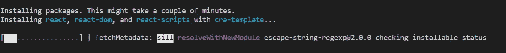
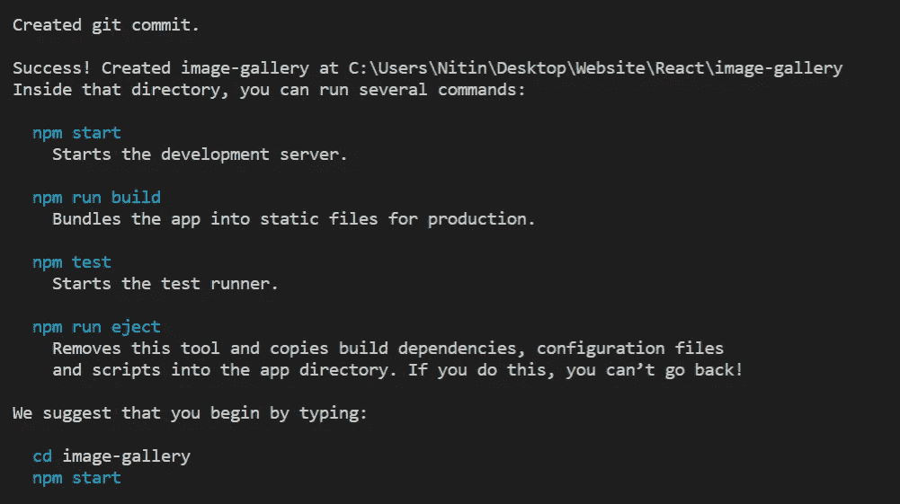
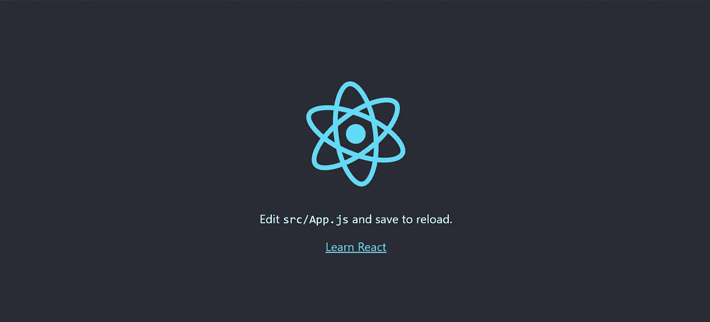
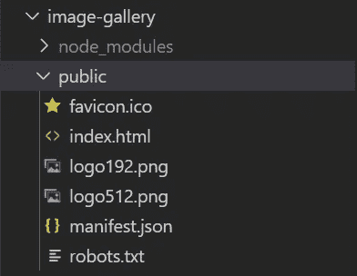
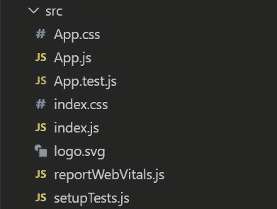
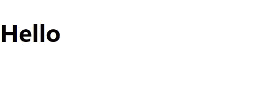
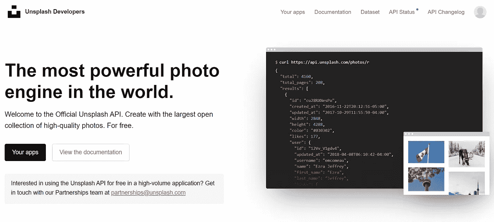
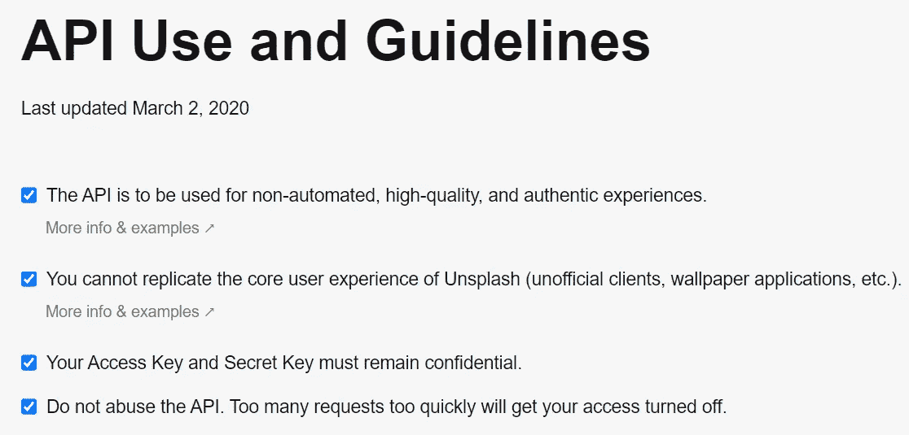
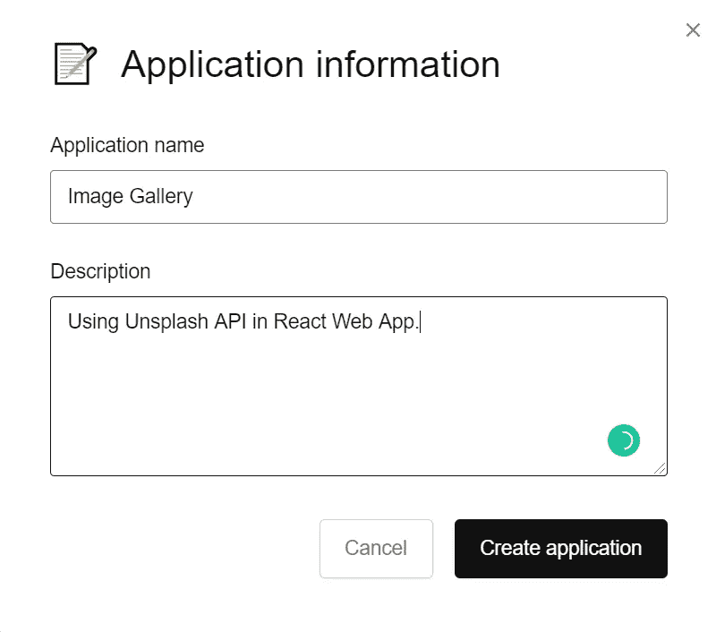
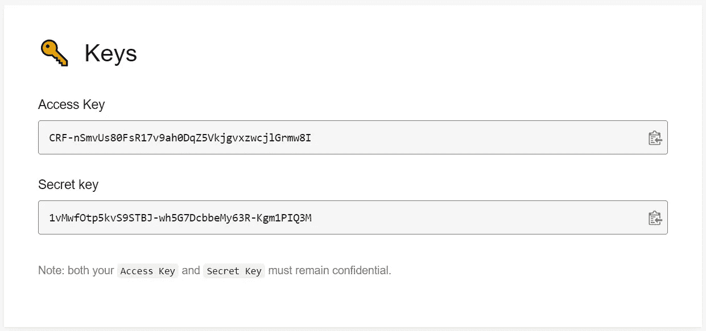

# 如何使用 Unsplash API 创建 React 图像库 Web 应用程序

> 原文：<https://javascript.plainenglish.io/how-to-create-react-image-gallery-web-app-using-unsplash-api-9eda5aa0f325?source=collection_archive---------2----------------------->

## 从头开始创建 React 项目。


Source: Unsplash

Unsplash 是一个下载免费图片并使用它们的网站。我们将使用 Unsplash API 做一个更加成熟的 React Web 应用程序。

本教程将使用 [Web 开发](https://medium.com/code-blog/getting-started-and-earning-105-813-yr-as-a-web-developer-for-beginners-19b2cd26fcc2)基础知识、[功能组件和 React 钩子](https://js.plainenglish.io/state-management-using-react-hooks-in-react-native-5f12895d29a8)以及 Axios。

Axios 只是一个 NPM 包，通过它我们可以访问其他网站的 API。它类似于 JavaScript 中的 Fetch。

为了运行 web 应用程序，你需要 Visual Studio 代码， [Node.js](https://medium.com/dev-genius/intro-to-nodejs-and-why-you-need-to-learn-it-b4b629741a4c) 来安装 NPM 软件包。

想学网页开发，有 [80+免费资源供网页设计师和网页开发者学习网页开发](https://js.plainenglish.io/80-free-resources-for-web-designers-and-web-developers-in-2021-f400be2875ea)。

此外，如果您没有足够公平的设置，您也可以在 Codesandbox.io 中运行。

这是演示。

Source: Youtube

我将使用 React.js 从头开始实现它，所以让我们开始吧。

# 1.创建一个空 React 项目

首先，您必须选择一个目录来创建一个 React 项目。为此，我将使用台式机。打开 Visual Studio 代码并运行以下命令。

```
npx create-react-app image-gallery
```

该命令将生成 React 代码和包，并创建一个名为 image-gallery 的文件夹。

根据你的网速，这需要时间。

您可以看到类似类型的命令，这意味着您正朝着正确的方向前进。



Source: Author

完成后，您可以看到几个带有快乐黑客消息的命令。



Source: Author

现在在 VS( Visual Studio)代码中的终端内使用 cd 命令。

```
cd image-gallery
```

好了，现在，您所要做的就是在终端或命令提示符中使用以下命令运行 React 应用程序。

```
npm start
```

打开你的网络浏览器，输入 [http://localhost:3000。你可以看到一个基本的 React 模板。](http://localhost:3000.)



Source: Author

现在我们已经创建了一个空的 React 项目，让我们稍微修改一下。要关闭应用程序，请在终端中按 ctrl+c。并终止您的应用程序。

# 2.修改图像库文件夹

我们为什么要做这些？嗯，我们不想要 React 标志和所有的东西，所以我们要删除它。



访问 image-gallery => public 文件夹并删除 favicon.ico，logo192.png，logo512.png。

注意删除我在这里写的任何东西。

现在是时候修改图片库应用程序中的 src 文件夹了。



Source: Author

访问 image-gallery => src 并删除 App.test.js、logo.svg 和 setupTests.js 文件。

我们正在删除这些文件，因为它们对我们毫无用处。

最后，打开 src 文件夹中的 App.js 文件。你可以看到相似类型的代码。

```
import logo from ‘./logo.svg’;
import ‘./App.css’;
function App() {
return (
<div className=”App”>
<header className=”App-header”>

<p>Edit <code>src/App.js</code> and save to reload.</p>
<a className=”App-link” href=”https://reactjs.org"
target=”_blank” rel=”noopener noreferrer”>
Learn React</a>
</header>
</div>
);
}
export default App;
```

因为我们删除了 logo.svg 文件，所以我们也必须从这里删除。

所以删除 App.js 中的每一行代码，将下面的代码粘贴到 App.js 中。

```
import ‘./App.css’;
function App() { 
return ( <h1>Hello</h1> );
}
export default App;
```

我们只是导入 App.js，用 localhost:3000 渲染 hello。



Source: Author

伙计们，祝贺你们，如果你们已经在浏览器中实现并渲染了 Hello。我知道这有点冗长，但我们必须这样做。

# 3.获取 Unsplash API

前往 [Unsplash developers](https://unsplash.com/developers) 并创建您的帐户。创建帐户很简单。

创建您的帐户后，您可以看到一个类似的屏幕。



Source: Unsplash

点击“你的应用”按钮，创建一个新的应用。



Source: Unsplash

接受条款和条件。请确保您的访问密钥和秘密密钥必须保密。

接受条款和条件后，写下您的应用程序名称及其描述。你可以根据你的选择写任何东西。并创建您的应用程序。



点击创建应用程序按钮后，向下滚动，您可以看到您的访问密钥和秘密密钥。我已经在 Unsplash API 里删除了 app，所以不要用这个访问键。这是行不通的。



Source: Unsplash

复制您的访问密钥，让我们跳转到创建 React Web 应用程序。

# 4.创建 React 应用程序

打开您已经创建的 React 文件夹(图像库)。

你必须安装一个名为 Axios NPM 软件包。打开您的 VS 代码终端或命令提示符。确保您在图像库文件夹中，并运行以下命令。

```
npm install axios
```

就是这样。

我们将在 src => App.js 内部工作。

```
import React from “react”;
import “./App.css”;
import axios from “axios”;
import { useState } from “react”;
```

我们正在根据需要导入 React 和 App.css。Axios 是一个 NPM API 包。

最后，我们在 React 和 React 挂钩中使用了一个功能组件，所以我们导入了 useState。

你可以通过下面的链接了解更多关于 React 钩子的知识。

[](https://js.plainenglish.io/state-management-using-react-hooks-in-react-native-5f12895d29a8) [## 在 React Native 中使用 React 挂钩进行状态管理

### 有了 React 钩子，我们可以使用 state、componentDidMount、componentDidUpdate 和其他 React 特性，而不需要使用 Class…

js .平原英语. io](https://js.plainenglish.io/state-management-using-react-hooks-in-react-native-5f12895d29a8) 

现在在 App.js 中添加下面的代码。

```
function App() {
return (<div className=”app”><div className=”heading”>
 <h1>React Image Search Using Unsplash API.</h1>
</div><div className=”input”>
 <input type=”text” name=”image” placeholder=”Search for images”/></div><button type=”submit”>Search</button></div>);
}
```

这里我们使用类似于 HTML 的 JSX。你可以理解每一行代码。

现在让我们在应用程序中定义 React 钩子和 const。

```
const [image, setImage] = useState(“”);
const clientId = “t_YxM0Taxyt2MhS4ve9lviN-EApwUOrVRjNIbJYD10w”;
const [result, setResult] = useState([]);
```

在这里，我们现在使用图像 empty 和 clientId 作为 Unsplash 访问键。所以在这里粘贴你的 Unsplash 访问键(一定要添加你的访问键，这个键不起作用)。

我们还将结果设置为空数组，并将对其进行修改。

将属性添加到输入和按钮标记中。只需将 onChange 和 onClick 属性添加到各自的标记中。

```
<input **onChange={handleChange}** type=”text” name=”image” placeholder=”Search for images”/> <button **onClick={handleSubmit}** type=”submit”>Search</button>
```

最后，我们正在创建 handleChange 和 handleSubmit 函数。

```
const handleChange = (event) => {
setImage(event.target.value);
};const handleSubmit = () => {const url = “https://api.unsplash.com/search/photos?page=1&query=" +
image + “&client_id=” + clientId;axios.get(url).then((response) => {
setResult(response.data.results);
});};
```

当用户输入内容时，它会存储在 handleChange 中的一个图像中。并且当用户点击按钮来搜索该图像时。我们使用 Axios 从 Unsplash API 获取照片。

这里我们使用了 const url 来添加带有客户端 id 的 Unsplash 链接。

现在我们将在一个 div 标签中呈现输出。

```
<div className="result">
  {result.map((image) => (
  <>
   <div className="card">
    
    <p className="username"> Photo by {image.user.name}</p>
    <p className="like">👍 {image.likes}</p>
   </div>
  </>
   ))}
</div>
```

我们正在映射一个地图功能内的一切，并用用户名和喜欢的数量渲染图像。

什么是`image.url.thumb`？Unsplash 帮助我们获得不同尺寸的图像，如常规、大、小。所以是它的一种类型。你可以`console.log()`了解一下。

完成 App.js 代码。

```
import React from "react";
import "./App.css";
import axios from "axios";
import { useState } from "react";function App() {const [image, setImage] = useState("");
const clientId = "Paste Your Unsplash API Acess Key Here";
const [result, setResult] = useState([]);const handleChange = (event) => {
 setImage(event.target.value);
};const handleSubmit = () => {
console.log(image);const url = "https://api.unsplash.com/search/photos?page=1&query=" + image + "&client_id=" + clientId;axios.get(url).then((response) => {
console.log(response);
setResult(response.data.results);
});
};return (<div className="app">
 <div className="heading">
   <h1>React Image Search Using Unsplash API.</h1>
 </div>

 <div className="input">
  <input onChange={handleChange} type="text" name="image"    placeholder="Search for images"/>
 </div> <button onClick={handleSubmit} type="submit">Search</button><div className="result">
  {result.map((image) => (
  <>
   <div className="card">
    
    <p className="username"> Photo by {image.user.name}</p>
    <p className="like">👍 {image.likes}</p>
   </div>
  </>
   ))}
</div></div>);
```

# 5.向 React 项目添加样式。

并且在 src => App.css 内，删除前面所有的代码，复制下面的代码。

```
* {
margin: 0;
background-color: rgb(236, 221, 226);
}.app {
display: flex;
padding-top: 50px;
flex-direction: column;
justify-content: center;
align-items: center;
}.input {
padding: 10px 20px;
}.input > input {
border: 1px solid black;
border-radius: 5px;
width: 300px;
padding: 10px 20px;
}button {
padding: 10px 20px;
margin-bottom: 20px;
width: 300px;
color: white;
border-radius: 5px;
border: none;
background-color: rgb(4, 100, 243);
}button:hover {
color: rgb(255, 255, 255);
background-color: rgb(58, 71, 90);
}button:active {
background-color: cornflowerblue;
width: 290px;
}.card {
padding: 5px;
width: auto;
height: auto;
}.result {
display: grid;
grid-column-gap: 5px;
grid-template-columns: auto auto auto;
width: auto;
height: auto;
}.result > img {
flex-wrap: nowrap;
margin: 5px;
}.username{
width: 200px;
}@media screen and (max-width: 700px) {
 .result {
  display: flex;
  flex-direction: column;
 }
}
```

您最终使用 API 创建了 React 项目。

恭喜你，继续学习新概念。您也可以在项目中使用代码并对其进行修改。

***如果你喜欢我的工作，想要支持，可以*** [***请我喝杯咖啡！***](https://www.buymeacoffee.com/nitinfab)

[*如果你喜欢看这样的故事，并想帮助我成为一名作家，可以考虑成为一名中等会员*](https://nitinfab.medium.com/membership) *。每月花费 5 美元，你可以无限制地访问媒体内容*[](https://nitinfab.medium.com/membership)**。如果你通过我的链接注册，我会得到一点佣金。**

*谢谢，再见。*

*[](https://js.plainenglish.io/getting-started-with-react-native-for-beginners-958d39fee16a) [## 面向初学者的 React Native 入门

### 学习所有你想知道的关于 React Native 的知识。

js .平原英语. io](https://js.plainenglish.io/getting-started-with-react-native-for-beginners-958d39fee16a) [](https://js.plainenglish.io/80-free-resources-for-web-designers-and-web-developers-in-2021-f400be2875ea) [## 2021 年为网页设计师和网页开发者提供 80+免费资源。

### 成为网页开发者的完整指南。

js .平原英语. io](https://js.plainenglish.io/80-free-resources-for-web-designers-and-web-developers-in-2021-f400be2875ea) 

*详见*[***plain English . io***](https://plainenglish.io/)*