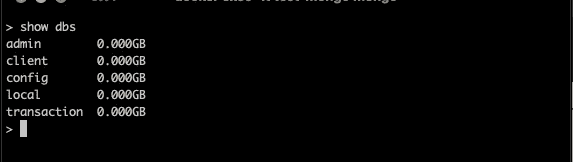
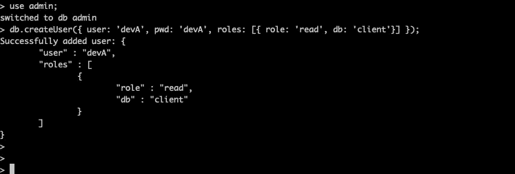
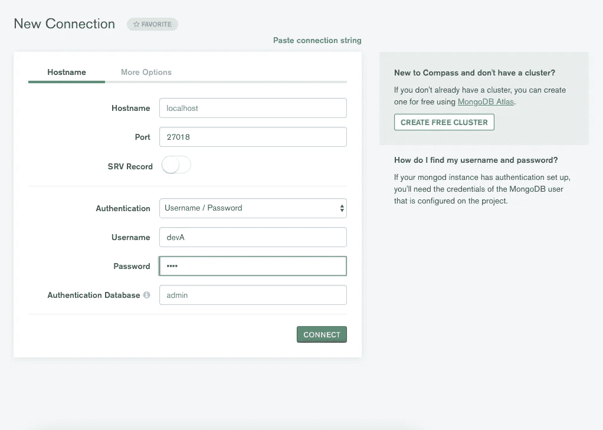
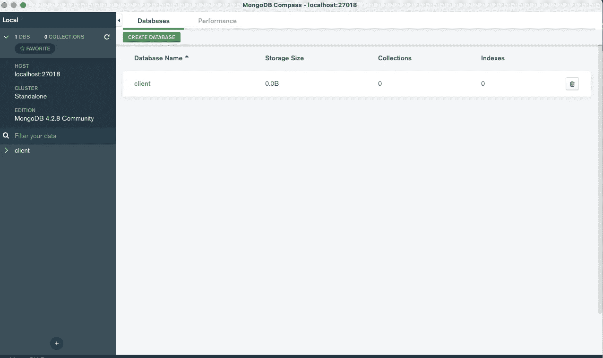
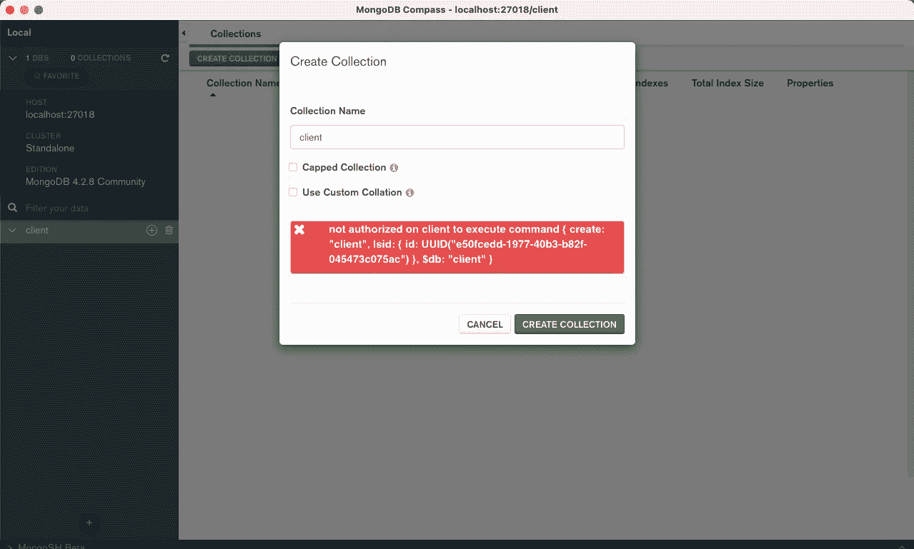
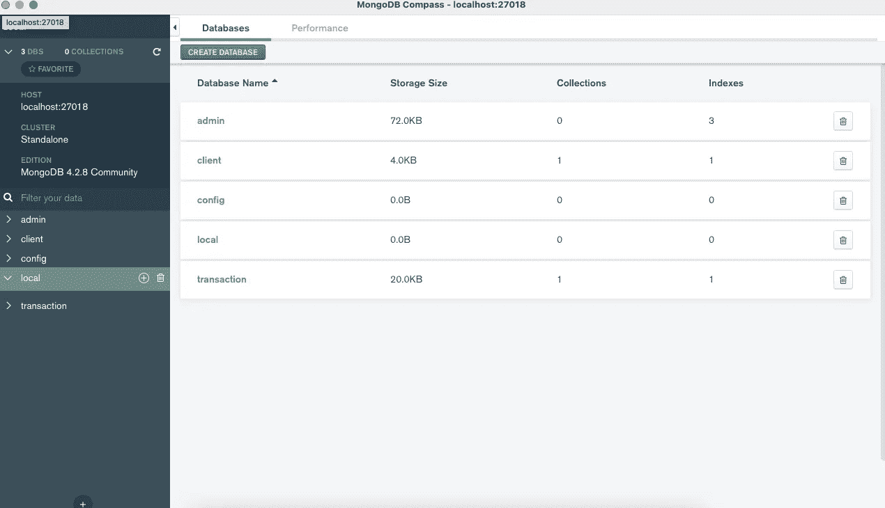
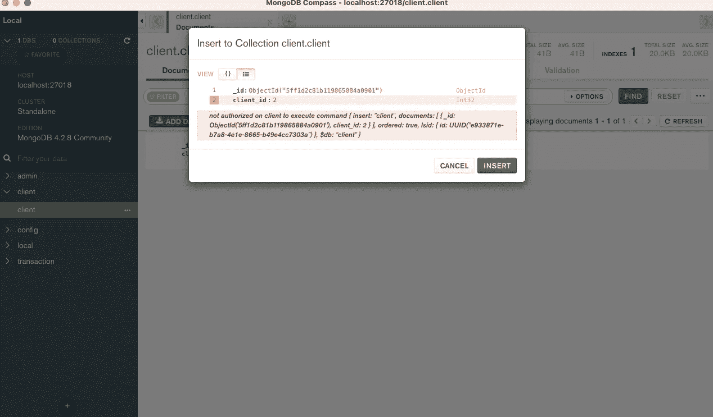

# 如何在 MongoDB 中创建只读角色

> 原文：<https://javascript.plainenglish.io/how-to-create-read-only-role-in-mongodb-b92efe7f1d43?source=collection_archive---------14----------------------->


Photo by [Luiza Braun](https://unsplash.com/@luizabraun?utm_source=medium&utm_medium=referral) on [Unsplash](https://unsplash.com?utm_source=medium&utm_medium=referral)

这篇文章讨论了如何在 MongoDB 数据库中创建一个只读角色。事不宜迟，我们开始吧。

# 方案

假设您是一名 DevOps 工程师或后端团队的团队领导，通常这些角色是授予数据库访问权限的角色。

有两个新雇用的开发人员刚刚加入您的团队，管理层决定只提供对暂存环境中数据库的读访问权限，以便简化调试工作流。我们姑且称他们为开发者 A 和开发者 b 吧。

这里是可用的 Mongo 数据库列表。



让我们总结一下这个场景，并将其分成两个教程。

方法 1 —为开发人员 a 创建一个对**客户端**数据库具有只读访问权限的用户。

方法 2 —为开发人员 B 创建一个对所有数据库具有只读访问权限的用户

# 方法 1

首先，我们必须创建一个用户来访问数据库。尽管您可以在任何数据库中创建用户。但是我建议在**管理**数据库中创建所有用户，这样更容易管理。因此，在未来，您可以雇佣一名数据库管理员，您只需授予他访问管理数据库的权限，这样他就可以帮助您管理数据库用户角色的创建，而无需公开任何其他数据库。

在本教程中，我们将使用 Mongo Shell 来创建用户。

```
use admin; // Make sure we go to the admin database // Create devA user and read access only to client DB. db.createUser({ 
  user: "devA", 
  pwd: "devA",
  roles: [ { role: "read", db: "client" } ] 
});
```

使用上面简单的命令，我们现在将拥有一个对客户端数据库只有读取权限的 **devA** 用户，您可以在下面的屏幕截图中看到该用户已成功添加。



让我们用 MongoDB Compass 来验证一下。下面的截图显示，我们正在尝试使用新创建的用户**“devA”连接到数据库。**

*   我们只能看到**客户端**数据库，尽管总共有 5 个数据库。
*   试图创建一个集合，得到一个“未授权”的错误，这正是我们想要的。只读访问。



# 方法 2

本教程比你想象的要简单得多。有一个名为 **readAnyDatabase** 的内置角色，您可以在其中授予用户

```
use admin; // Make sure we go to the admin database// Create devB user and provide read access all of the DB.
db.createUser({
  user: "devB",
  pwd: "devB",
  roles: ["readAnyDatabase"]
});
```

现在让我们验证一下新添加的用户， **devB** 可以访问所有的数据库。从下面的截图中，我们可以看到 **devB** 对所有数据库都有只读访问权限，创建新记录也被禁止。

从 MongoDB 3.4 开始，readAnyDatabase 不再提供对**本地**和**配置**数据库的读访问。

> 在除了`local`和`config`之外的所有数据库上提供与`[read](https://docs.mongodb.com/manual/reference/built-in-roles/#read)`相同的只读权限。该角色还在整个集群上提供`[listDatabases](https://docs.mongodb.com/manual/reference/privilege-actions/#listDatabases)`操作。— MongoDB [文档](https://docs.mongodb.com/manual/reference/built-in-roles/#readAnyDatabase)



# 结论

简而言之，这篇文章讨论了两种不同的场景:

*   创建对指定数据库的只读访问
*   创建除本地数据库**和配置数据库**之外的所有数据库的只读访问权限。

感谢您的阅读，下一篇文章再见。

# 参考

*   MongoDB createUser 手册[参考](https://docs.mongodb.com/manual/reference/method/db.createUser/)
*   用于[内置角色](https://docs.mongodb.com/manual/reference/built-in-roles/)的 MongoDB 手册