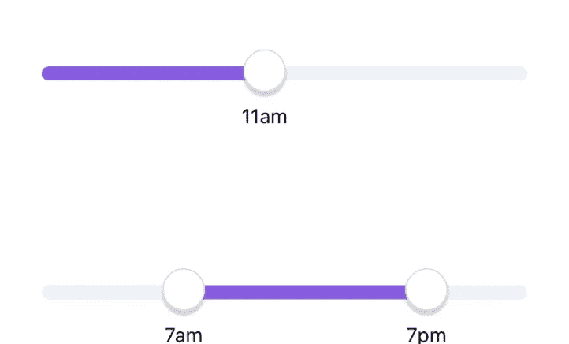
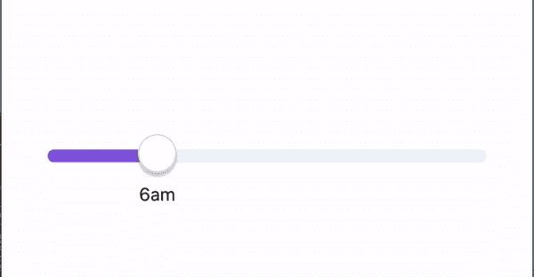
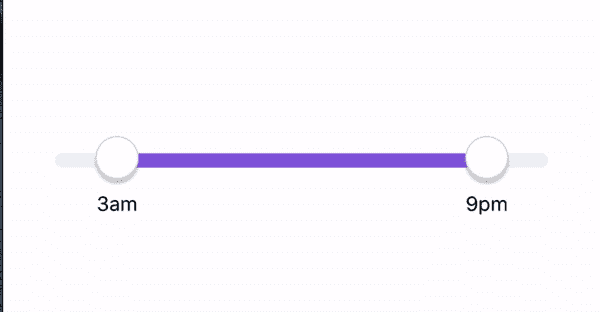

# 如何在 React Native 中创建时间滑块

> 原文：<https://javascript.plainenglish.io/how-to-create-time-sliders-in-react-native-9e6abc27563d?source=collection_archive---------2----------------------->



time-sliders

从我最近的代码阅读中，我学会了如何创建自定义的时间滑块。所有的荣誉都归于我的同事。我只是分享我的学习！让我们先看看我们想做什么。我们希望将滑块转换为时间滑块，用户可以选择单个时间或时间范围。

**单时间滑块:**



single time slider

首先，让我们为此设置组件。有了这个代码片段，我们就可以完成滑块的初始化了。对于我们的滑块组件，我使用的是[react-native-multi-slide](https://github.com/ptomasroos/react-native-multi-slider)r 包。有了这个包，你得到了一个单一的滑块和范围滑块，所以它是相当好的。

```
const TIME = {  min: 0,  max: 24 }
const SliderPad = 12;

// our time slider component
const SingleSlider = ({}) => {
  const { min, max } = TIME;
  const [width, setWidth] = useState(280);
  const [selected, setSelected] = useState(null);

  if (!selected) {
    setSelected([min]); // we are only selected min, since it is single slider
  }

  // Callbacks
  const onLayout = (event) => {
    setWidth(event.nativeEvent.layout.width - SliderPad * 2);
  };
  const onValuesChangeFinish = (values) => {
    setSelected(values);
  };

  return (
    <View onLayout={onLayout} style={styles.wrapper}>
        <MultiSlider
          min={min}
          max={max}
          allowOverlap
          values={selected}
          sliderLength={width}
          onValuesChangeFinish={onValuesChangeFinish}
          enableLabel={true}
          trackStyle={{
            height: 10,
            borderRadius: 8,
          }}
          markerOffsetY={3}
          selectedStyle={{
            backgroundColor: "#895CDF",
          }}
          unselectedStyle={{
            backgroundColor: "#EEF3F7",
          }}
        />
    </View>
  );
}
```

**范围时间滑块:**



range slider

范围滑块也是一样的，只是我们将值设置为最大和最小。

```
if (!selected) {
    setSelected([min, max]); 
  }
```

这样我们的初始设置就完成了。我们得到滑块，但滑块的工作方式和普通滑块一样，数值从 0 到 24。现在我们该把它转换成时间滑块了。

为了让我们拥有自定义标签，我们需要在我们的 slider 中传递道具***custom label****。我们将制作一个自定义标签组件，它将进行时间转换，并返回时间标签。*

*`customLabel={SliderCustomLabel(textTransformerTimes)}`*

*现在让我们看看最有趣的部分。*

```
*const width = 50;

*function* LabelBase(props)
{
    const { position, value } = props;

    return (
        <View
            style={[
                styles.sliderLabel, // this one is position absolute
                {
                    left: position - width / 2,
                },
            ]}>
            <Text style={styles.sliderLabelText}>{value}</Text>
        </View>
    );
}

export default *function* SliderCustomLabel(textTransformer: (value: number) => string)
{
    return *function* (props)
    {
       // these props are coming from the package
        const {
            oneMarkerValue,
            twoMarkerValue,
            oneMarkerLeftPosition,
            twoMarkerLeftPosition,
        } = props;

        return (
            <View>
                <LabelBase
                    position={oneMarkerLeftPosition}
                    value={textTransformer(oneMarkerValue)}
                />
                {twoMarkerValue ? 
                    <LabelBase
                        position={twoMarkerLeftPosition}
                        value={textTransformer(twoMarkerValue)}
                    /> : null
                }
            </View>
        );
    };
}

const styles = StyleSheet.create({
    sliderLabel: {
        position: 'absolute',
        justifyContent: 'center',
        top: 30,
        width: width,
        height: width,
    },
    sliderLabelText: {
        textAlign: 'center',
        lineHeight: width,
        flex: 1,
    },
});*
```

*对这里发生的事情做一点解释。*

*   ***SliderCustomLabel** 是一个采用 **textTransformer** 函数并返回自定义标签组件的函数。*
*   ***TextTransformer** 是一个将滑块值从 0 到 24 转换成时间值的函数。*
*   ***LabelBase** 是我们从中返回文本的组件。它还处理我们文本的位置。*

```
*const textTransformerTimes = (value) => {
  return value === 0 ? "12am" : (value < 13 ? value : value - 12) +    (value < 12 ? "am" : "pm");
};*
```

*如果你想看它的实际效果，可以看看 T21 的小吃。*

*感谢您的阅读。我希望您发现这很有用！*

**更多内容请看*[***plain English . io***](https://plainenglish.io/)*