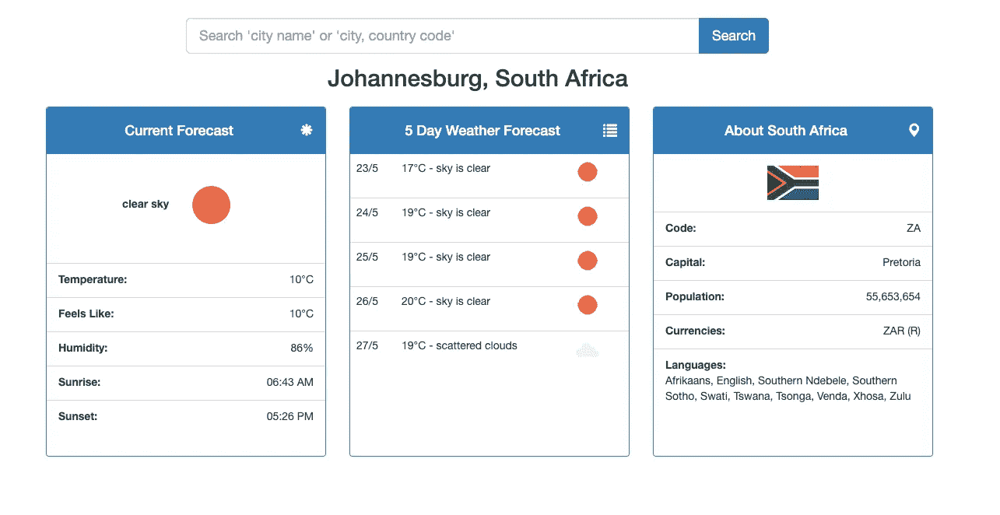

# 如何在 Node-RED 中创建您的第一个流

> 原文：<https://javascript.plainenglish.io/how-to-create-your-first-flow-in-node-red-4ceaeb2d296d?source=collection_archive---------13----------------------->

这篇文章介绍了一个深度视频教程，我会教你基本的 [Node-RED](https://nodered.org/) ，同时向你展示如何建立一个**天气预报仪表板**。为了让仪表板工作，我们需要集成 3 个在线 API，提供当前天气预报、5 天预报和与被搜索城镇或城市相关的国家信息。

这个视频教程一步一步地向你展示，我们如何在 **Node-RED** 中把这些 API 结合在一起，以 UI 仪表板的形式产生一个天气服务。一旦您完成了本教程，您将对 Node-RED 有足够好的理解，足以能够启动并运行您自己的流。

**注意:**这是我的第一个深度视频，我真的很希望得到诚实的反馈，了解这种内容是否有价值，如果有，我如何才能在未来的视频中做得更好。

**注:**也可参见下面提到的网站、在线工具以及 GitHub 资源的参考资料，用于**节点-红色天气仪表板**。

*更多内容请看*[***plain English . io***](http://plainenglish.io)

## 视频教程

## 参考

*   [天气仪表盘 GitHub Repo](https://github.com/bleedingcode/node-red-weather-dashboard)
*   [打开天气图](https://openweathermap.org/)
*   [安息国](https://restcountries.eu/)
*   [Postman API 测试工具](https://www.postman.com/)
*   MustacheJS
*   [启动并运行节点红色播放列表—出血代码](https://www.youtube.com/playlist?list=PLISqeoHsXJYBriF8VE_CrDvNGURq2c2m6)
*   [Node-RED 高级设置——出血代码教程](https://youtu.be/Xm35Xk5mnwg)
*   [节点-红色入门文档](https://nodered.org/docs/getting-started/)
*   [JSBin](https://jsbin.com/)
*   [Bootsnip](http://bootsnipp.com/)
*   [出血代码— YouTube 频道](http://youtube.com/bleedingcode)
*   [出血代码-推特](http://twitter.com/bleedcode)
*   [出血代码-脸书](https://www.facebook.com/bleedingcode)