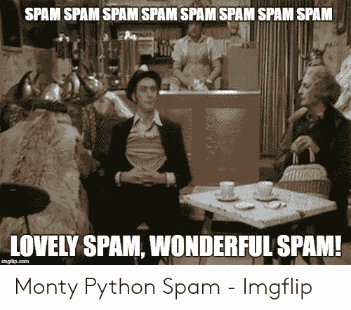

# 如何从 Node.js 创建自己的集成测试电子邮件#1

> 原文：<https://javascript.plainenglish.io/how-to-create-your-own-integration-test-email-1-from-node-js-386e7de77e8c?source=collection_archive---------14----------------------->

了解如何从 Node.js 轻松发送电子邮件


Photo Courtesy of Xavi Cabrera from Unspash

*原载于*[*https://fek . io*](https://fek.io/blog/how-to-create-your-own-integration-test-email-1-from-node-js/)*。*

像许多其他 HBO Max 订户一样，我收到了一封标题为“集成测试邮件#1”的电子邮件，发至我的 HBO Max 帐户。我决定写一篇关于如何从 Node.js 发送你自己的“集成测试邮件”的文章。



从服务器应用程序发送自动电子邮件是您需要小心的事情。电子邮件通常通过 SMTP 协议发送出去。互联网服务提供商很谨慎，不要让坏人利用他们的网络发送垃圾邮件。所以当编写发送电子邮件的软件时，我们需要确保我们不会做任何让自己被列入黑名单的事情。如果你不小心，这是很容易做到的。

# 节点邮件程序

我过去从 Node.js 发送电子邮件的方式是使用一个名为`Nodemailer`的 NPM 模块。您可以使用以下终端命令将其安装到您的项目中。

```
> npm i nodemailer --save
```

要发送我们的“集成测试电子邮件”,我们可以编写一个简单的程序来创建到 SMTP 服务器的网络连接。

如果你打算测试发送电子邮件，你可能想从使用一个假的 SMTP 服务开始。Mailtrap.io 提供一项免费服务，你可以用来测试你的电子邮件功能。在尝试对我数据库中的每个客户电子邮件帐户进行集成测试之前，我会使用这样的服务。

# 第三方服务

您可以使用第三方服务，如 [Sendgrid](https://sendgrid.com/) 和 [mailchimp](https://mailchimp.com/) 向客户发送电子邮件。这些服务的伟大之处在于，它们管理远离电子邮件黑名单的复杂性，并且它们提供了可用于发送电子邮件的 API，而不必管理自己的 SMTP 服务器。

这些第三方服务还允许您维护列表。当您发送大量电子邮件时，这些服务还可以管理那些不想接收更多电子邮件的用户。

# 结论

对于想要利用自动化电子邮件服务的 Node.js 开发人员来说，有很多很好的工具可供使用。正如我们的实习生在 HBO MAX 发现的那样，我们需要非常小心地使用这些工具，这样我们就不会向自己的客户发送“集成测试电子邮件”。我希望 HBO 能善待这位实习生，因为这似乎是一个诚实的错误。希望这位实习生能尽快对此一笑置之，就像我和我的朋友们今天早上一样。

**延伸阅读**

[](https://circuit.ooo/blog/the-key-ingredient-behind-high-newsletter-open-rates) [## 高简讯打开率背后的关键因素

### 在这篇文章中，我们将讨论我们 9 个月前的时事通讯《简明英语上周》是如何一直…

电路. ooo](https://circuit.ooo/blog/the-key-ingredient-behind-high-newsletter-open-rates) 

*更多内容看* [*说白了。报名参加我们的*](https://plainenglish.io/) [*免费每周简讯*](http://newsletter.plainenglish.io/) *。关注我们* [*推特*](https://twitter.com/inPlainEngHQ) ，[*LinkedIn*](https://www.linkedin.com/company/inplainenglish/)*，*[*YouTube*](https://www.youtube.com/channel/UCtipWUghju290NWcn8jhyAw)*，以及* [*不和谐*](https://discord.gg/GtDtUAvyhW) *。对增长黑客感兴趣？检查* [*电路*](https://circuit.ooo/) *。*