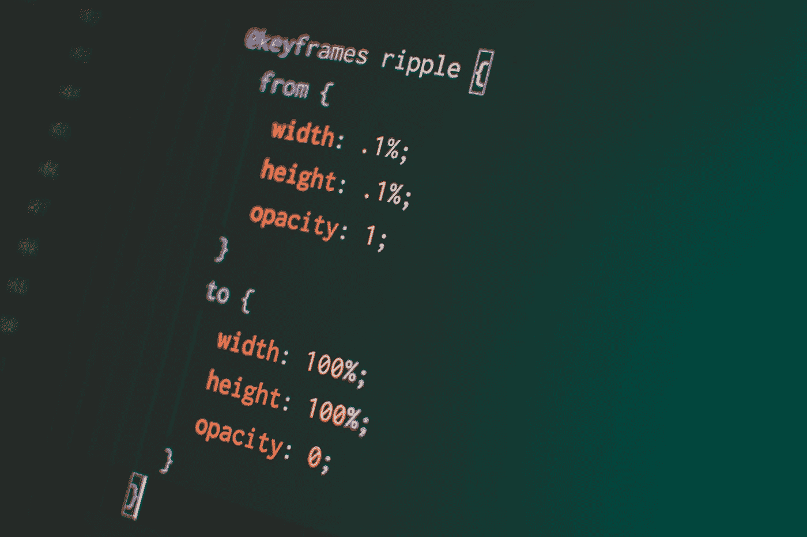
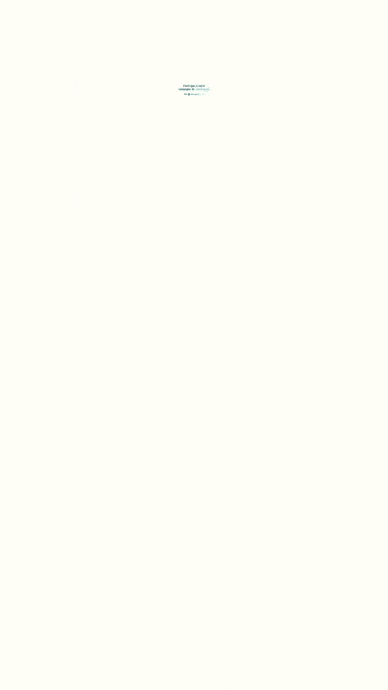

# 如何用 Remotion 创建一个简洁的弹出动画

> 原文：<https://javascript.plainenglish.io/how-to-created-an-pretty-pop-in-animation-with-remotion-ae0fac09a0e3?source=collection_archive---------12----------------------->

## 远程视频创作的简单介绍。



Photo by [Pankaj Patel](https://unsplash.com/@pankajpatel?utm_source=medium&utm_medium=referral) on [Unsplash](https://unsplash.com?utm_source=medium&utm_medium=referral)

本文是 JonnyBurger 基于 React 撰写的 Remotion 系列文章的一部分。一篇回顾文章和完整动画的代码链接在本文的末尾。

# 我们将创造什么


Remotion 在 React 代码中引入了临时的概念。它通过拼接截图来制作视频。这些截图是你的代码的输出。

React 负责组件组织和时间管理。所有的视觉动画将在 CSS 中完成。

## 将弹出的组件

因此，首先我们必须找到什么样的 CSS 属性，我们必须动画。这里很简单，我们将在第 29 行制作组件的**比例**动画。请记住，样式化的组件不是必需的。通过将样式对象传递给 div 组件，也可以达到同样的效果。所以没有比这更难的了。要获得反弹效果，需要制作 CSS 变换属性的动画。

更难的部分是计算作为 scale 值传递的值。

## 将控制反弹的功能

让我们深入到移动魔法出现的部分。欢迎入内 useAppearWithScaleAndBounce(很花哨的名字吧？)功能。

这里我们使用三个远程工具:spring、useCurrentFrame 和 useVideoConfig。

[useCurrentFrame](https://www.remotion.dev/docs/use-current-frame) ()在时间视频框架中是显而易见的。它会告诉你当前渲染的是哪一帧。

[useVideoConfig](https://www.remotion.dev/docs/use-video-config) ()返回包含待渲染视频参数的对象。这里我们只使用 fps，但是视频大小也可以在这里访问。

[spring](https://www.remotion.dev/docs/spring/) ()是一个动画原语。这需要:

*   动画开始的帧号
*   从和到一个值，该值将是动画中返回的开始和结束值
*   物理配置

# **那么这个挂钩用的是什么招数:**

## 允许增加一些延迟

```
frame = currentFrame-delay
```

*   因为 currentFrame 是一个从 0 到动画帧数的数字。
*   并且因为只有当帧值是正数时，弹簧才会返回值。
*   通过减去 currentFrame 的延迟，可以将一个负数传递给该帧，直到 currentFrame = delay。
*   所以你在 currentFrame = delay 开始动画

## 使用物理配置创建反弹

```
config: { damping: 10.5, stiffness: 160, mass: 0.6 }
```

这个配置将告诉 remotion 如何呈现弹簧的输出值。

但我不是一个天才，谁能猜出一个效果的正确的弹簧配置。这只是在使用[这个](https://springs.pomb.us/)的基础上的试错。

如果您想了解更多关于温泉的信息，请观看祝铭震·坎迪隆和约翰尼·伯格的精彩视频。

Learn more on springs with @jonnyBurger and Wiliam Candillons

有了这两个片段，您将能够创建自己的弹出动画！

这是关于如何使用 Remotion 创建动画的第一篇文章的全部内容！



您可以在以下链接找到关于动画系列的其他部分:

如果您有任何问题，请在评论中提出。

*   *通过* [*推特*](https://twitter.com/FlorentPergoud) 联系我
*   *或在* [*加入我们，重塑不和*](https://discord.com/invite/6VzzNDwUwV) *！*

*更内容于* [*浅显易懂的英语中*](http://plainenglish.io/)