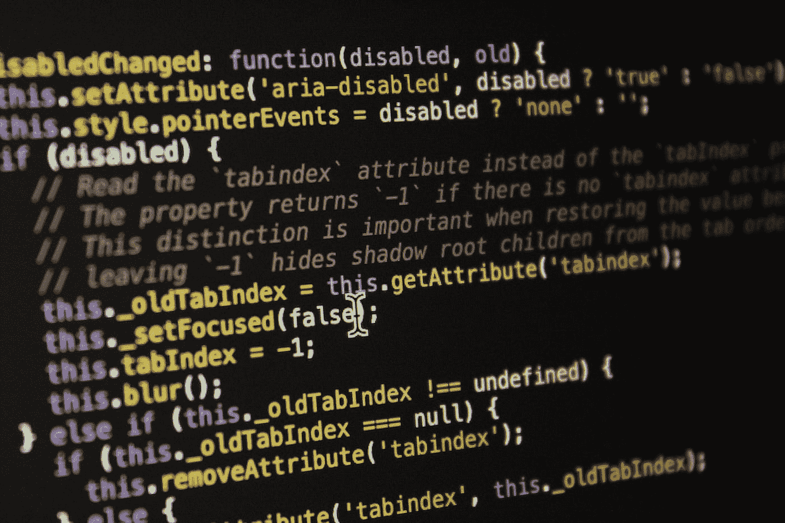

# 这就是你如何在 JavaScript 中运行函数

> 原文：<https://javascript.plainenglish.io/how-to-curry-functions-in-javascript-a609950fd73d?source=collection_archive---------14----------------------->

最近一直在涉猎函数式编程。如果你熟悉函数式编程，你会知道这是关于组成函数和重用它们，以便在你的源代码中实现更少的错误，并使代码更容易调试和测试。

应用函数式编程的程序员使用的实用函数之一是 curry 函数。在这篇简短的博客中，我想分享它到底是做什么的，以及如何使用它来改进你的代码库。

Photo by [Laine Cooper](https://unsplash.com/@laine23?utm_source=medium&utm_medium=referral) on [Unsplash](https://unsplash.com?utm_source=medium&utm_medium=referral)

维基百科对 Currying 的定义是:****currying****是将一个带多个参数的函数转换成一系列每个带一个参数的函数的技术**

*简单地说，你分解函数来一个接一个地传递它们的参数。*

*在 JavaScript 中，我们可以通过以下方式实现这一点:*

*让我们过一遍，这样你就会明白发生了什么。首先，我们定义最顶层的函数，它接受我们将要包装的函数和 arity。*

*函数 arity 是函数声明中参数的数量。在 JavaScript 中，当你调用' *function.length'* 时，你会得到函数期望的参数个数。*

*注意，这里我们使其可配置，因为默认参数不计入*‘function . length’，*这允许您用默认值配置函数的 arity 参数。*

*用函数调用这个最顶层的函数将返回一个自执行函数，该函数将返回 *'curried'* 函数。如果我们将第一个参数传递给 curried 函数，那么' *previousArguments* '将是一个空数组，我们将简单地将第一个参数添加到参数列表中。*

*然后我们用我们的参数返回 nextCurry 函数，每当我们传递一个新的参数时，这个函数将重新开始这个过程。*

*一旦我们传递了所有的参数，我们的 if 语句就会触发，函数就会执行。试着真正理解这一点。最终结果是，只要函数有参数，您就可以多次调用它:*

*你不必自己在代码库中实现这个，像 Lodash([https://lodash.com/docs/#curry](https://lodash.com/docs/#curry))这样的现有库已经为你提供了这种现成的功能。*

*但是我们怎样才能真正利用这个功能呢？假设我们有一个从 API 获取数据的函数。通常，该函数将接受 3 个参数；一个 URL、一些数据和一个请求完成后的回调。*

*在上面的代码片段中，我们通过向 API 传递 productId 来获取当前产品，并在回调函数中处理结果。*

*对于编写它的人来说，这看起来没什么问题，但是让随机的 ajax 语句贯穿整个代码库可能会让下一个读者搞不清楚所有这些 ajax 调用到底是做什么的。*

*相反，考虑一个更具声明性的例子:*

*在这里，在*第 2 行*上，我们从使用上面详述的 curry 函数来实现我们的函数开始。*在第 4 行*中，我们初始化了“`*productEndpoint*`*”*。您应该意识到，这个端点非常广泛，可能会在很多地方使用，因为您可能想要获取产品列表、详细信息、提要。*

*之后，在我们的产品细节上，我们可以定义一个更具体的函数，叫做`*getCurrentProduct*`，这个函数会用当前产品的 id 得到一个产品，叫做`*productEndpoint*`*‘*。现在，我们可以在多个其他函数中使用这个'`*getCurrentProduct*` *'* ，并对结果做不同的事情。*

# *结论*

*我希望你意识到这有多强大。在最后一个例子中，我们的产品细节不再需要担心我们的 API 的 URL 到底是什么了。相反，它应该只使用 productEndpoint 函数来获取它想要的数据。我们让一切都变得更具陈述性。*

*下一个阅读您的代码的人可能会更好地理解您的意图，花更少的时间来重新考虑重大变化，最终您的团队会变得更有效率，您的代码库会更有预见性。*

*我希望我启发了你去思考以一种更具声明性的方式工作，以及它会对你的代码产生什么影响。享受你的编码吧！*

**多内容于* [***通俗易懂***](http://plainenglish.io)*