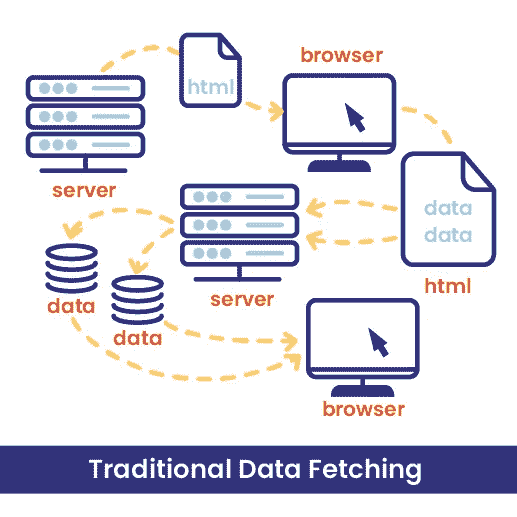
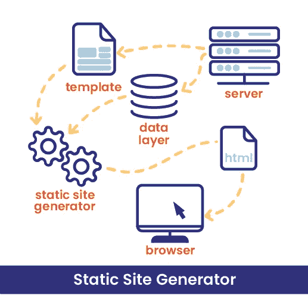
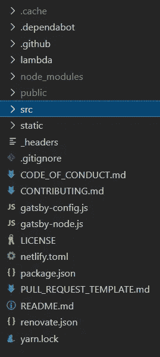
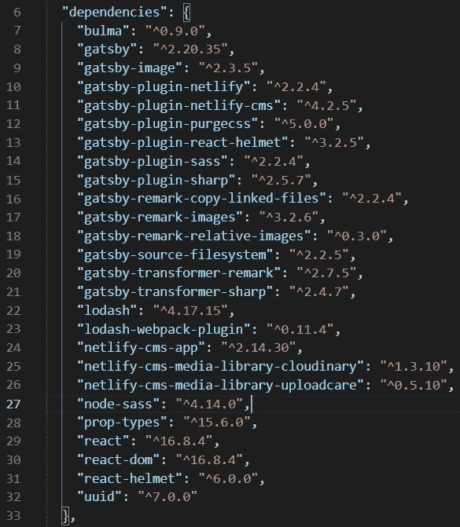

# 如何定制一个盖茨比 Netlify CMS 启动

> 原文：<https://javascript.plainenglish.io/how-to-customize-a-gatsby-netlify-cms-starter-3a78244a7b06?source=collection_archive---------7----------------------->

## 定制最终用户可访问的网站和 CMS 管理用户界面。


Photo by [Chris Lawton](https://unsplash.com/@chrislawton?utm_source=unsplash&utm_medium=referral&utm_content=creditCopyText) on [Unsplash](https://unsplash.com/s/photos/change?utm_source=unsplash&utm_medium=referral&utm_content=creditCopyText)

## 先决条件

在这篇文章中，我们将建立一个网站，它使用 [Gatsby](https://www.gatsbyjs.com/) 作为网站面向终端用户的部分，使用 [NetlifyCMS](https://www.netlifycms.org/) 作为网站面向管理员用户的部分。如果你还没有建立一个网站，你会在我的另一篇文章 [*中找到一些帮助，如何建立一个强大而免费的 JAMstack 网站*](https://medium.com/swlh/how-to-setup-a-free-and-powerful-jamstack-website-f9638ef7d4d7) 关于如何用 [GitLab](https://gitlab.com/) 建立一个网站来托管代码。

## 了解静态网站的全貌

了解 Gatsby Netlify CMS 网站是静态网站很重要。在传统的 CMS 中，例如 WordPress 数据(文本、图像等。)存储在数据库中，当用户访问网站时，需要将其转移到网站中。[“传统上，在 web 开发中，当用户登陆一个 URL 时，我们会给他们发回一个 html 文件。然后，html 文件发出请求，获取呈现内容所需的数据。”](https://www.samanthabretous.com/blog/adding-netlify-cms-widgets-to-gatsby-js/)



[Traditional Data Fetching Flow.](https://www.samanthabretous.com/img/adding-additional-widgets/traditional-data-fetching-flow.png)

NetlifyCMS 使用完全不同的方法。网站模板和数据存储在服务器上，通常用 Git 进行版本控制。每次模板或数据发生变化的网站被重建为一个静态网站的发电机。如果用户登陆一个 URL，就不需要请求/响应循环。内容会立即显示。Jamstack 中使用的这种方法有很多[好处](https://jamstack.org/why-jamstack/)。



[Static Site Data Fetching Flow.](https://www.samanthabretous.com/img/adding-additional-widgets/static-site-generator-flow.png)

## 了解定制的总体情况

最终用户网站几乎完全是在 Gatsby“空间”中实现的。面向 CMS UI 的管理员用户是用 Netlify CMS 特定代码实现的。这部分是关于管理特定的用户界面和网站数据。这意味着我们需要一些集成代码来将用户已经插入或将插入 CMS 的数据绑定到面向最终用户的 UI。

## 定制最终用户可访问的网站

当使用一个 Gatsby starter 时，就像我用它作为基础的[Gatsby-starter-neltify-CMS](https://github.com/netlify-templates/gatsby-starter-netlify-cms)当然，你必须用 Gatsby 来定制网站。建议在将变更推送到 GitHub、GitLab 等上托管的版本控制库之前，在本地开发最终用户可访问的网站。并与我们的网络账户相联系。现在让我们设置一个本地的 Gatsby 开发环境。

首先我们必须安装 Gatsby 和它所有的运行时依赖项(`nvm`、`node`、`npm`、`gatsby-cli`)。我使用 Linux 进行开发，并且[遵循这些安装说明](https://www.gatsbyjs.com/docs/how-to/local-development/gatsby-on-linux/)。如果您运行的是 Windows，请遵循[相应的安装说明](https://www.gatsbyjs.com/docs/how-to/local-development/gatsby-on-windows/)。MacOS 上的本地开发没有官方指导，但我很确定你在谷歌搜索上比我在 10 秒内更成功😏在 Linux 上，如果您获得了与下面类似的已安装工具的版本，您将为本地开发做好准备。用`yarn install`安装本地 NodeJS 环境后`gatsby`可用。我推荐用`yarn`代替`npm`进行环境创建。我在使用`npm`的 Linux 上正确设置环境时遇到了问题，这是由于[事件是仅在 MacOS 上受支持的依赖关系](https://stackoverflow.com/questions/46929196/how-to-solve-npm-install-throwing-fsevents-warning-on-non-mac-os) …总之，我最终放弃了调试这个问题，而是使用了`yarn`。

```
florian@xmg-fusion:~/gitlab/some-projec$ npm — version
6.14.4
florian@xmg-fusion:~/gitlab/some-projec$ node — version
v10.19.0
```

现在，让我们来看看一个 Gatbsy 项目 的 [**项目结构。对于面向网站定制的最终用户来说，有些目录是我们根本不应该关心的，它们是`/.cache`、`/public`和`/static`。我们对`gatsby-node.js`、`gatsby-browser.js`和`gatsby-ssr.js`也不感兴趣。**](https://www.gatsbyjs.com/docs/reference/gatsby-project-structure/)

如果我们想定制一个本地插件，我们会对`/plugins`感兴趣。然而，这将是插件特定的，我们不会在这篇旨在通用的帖子中解决这个问题。意味着我们最关心的是`/src`。


[Gatsby project structure](https://www.gatsbyjs.com/docs/reference/gatsby-project-structure/)

接下来，让我们看看 [Gatsby NetlifyCMS 示例项目](https://github.com/erquhart/gatsby-netlify-cms-example)和 [Gatsby 关于如何从 NetlifyCMS 获取数据的文档](https://www.gatsbyjs.com/docs/how-to/sourcing-data/sourcing-from-netlify-cms/)，以了解 Gatsby 如何与 NetlifyCMS 集成。这次我们对`gatsby-config.js`感兴趣，因为它定义了与 NetlifyCMS 集成所需的 Gatsby 插件以及我们可以用于定制的插件。

*   [Gatsby-plugin-React-Helmet](https://www.gatsbyjs.com/plugins/gatsby-plugin-react-helmet/):“为添加了 [React 头盔](https://github.com/nfl/react-helmet)的服务器渲染数据提供插件支持。”→用于渲染博客和标记相关页面。
*   [**Gatsby-plugin-Sass**](https://www.gatsbyjs.com/plugins/gatsby-plugin-sass/):“为 Sass/SCSS 样式表提供插件支持。”→增加对 [Sass](https://sass-lang.com/) 的支持，即“拥有超能力的 CSS”。这表明了我们如何使用 Sass 框架进行定制。我们稍后再讨论这个。
*   [gatsby-source-file system](https://www.gatsbyjs.com/plugins/gatsby-source-filesystem/):“一个 Gatsby 源代码插件，用于从您的本地文件系统向您的 Gatsby 应用程序提供数据。”→促进地方发展。
*   [gatsby-plugin-sharp](https://www.gatsbyjs.com/plugins/gatsby-plugin-sharp/) :"公开了几个建立在 [Sharp 图像处理库](https://github.com/lovell/sharp)上的图像处理函数。这是一个其他 Gatsby 插件普遍使用的低级助手插件。您通常不应该直接使用它，但是如果进行非常定制的图像处理，它可能会有所帮助。”→需要启用图像使用。
*   [gatsby-transformer-sharp](https://www.gatsbyjs.com/plugins/gatsby-transformer-sharp) :"从受 [Sharp](https://github.com/lovell/sharp) 图像处理库支持的图像类型创建`ImageSharp`节点，并在它们的 GraphQL 类型中提供字段，用于以各种方式处理您的图像，包括调整大小、裁剪和创建响应图像。"→功能 w.r.t .图像。
*   [Gatsby-transformer-Remark](https://www.gatsbyjs.com/plugins/gatsby-transformer-remark/):“使用 [Remark](http://remark.js.org/) 解析 Markdown 文件。”→要求能够定义载入相应(JSX)模板的页面特定`index.md`文件中的内容。
*   [Gatsby-remark-relative-images](https://www.gatsbyjs.com/plugins/gatsby-remark-relative-images/):“将 markdown/html/frontmatter 中的图像 src 转换为相对于其节点的父目录。这将帮助 [gatsby-remark-images](https://github.com/gatsbyjs/gatsby/tree/master/packages/gatsby-remark-images) 匹配节点文件夹外的图像。这是为与 NetlifyCMS 一起使用而构建的，在支持相对路径之前，应将其视为临时解决方案。→需要启用图像使用。
*   [gatsby-remark-images](https://www.gatsbyjs.com/plugins/gatsby-remark-images/) :“在 markdown 中处理图像，以便它们可以在生产构建中使用。”→需要启用图像使用。
*   [Gatsby-remark-copy-linked-files](https://www.gatsbyjs.com/plugins/gatsby-remark-copy-linked-files/):“将链接到/来自 Markdown ( `.md|.markdown`)文件的本地文件复制到根目录(即`public`文件夹)。”→需要启用图像和其他静态文件，如页面内容中引用的音频或视频文件。
*   [**Gatsby-plugin-Netlify-CMS**](https://www.gatsbyjs.com/plugins/gatsby-plugin-netlify-cms/):“自动生成一个`admin/index.html`，默认 Netlify CMS 实现。”→提供 NetlifyCMS 管理用户界面。
*   [gatsby-plugin-purgecss](https://www.gatsbyjs.com/plugins/gatsby-plugin-purgecss/) :"使用 [purgecss](https://github.com/FullHuman/purgecss) 从您的 gatsby 项目中的 css/sass/less/stylus 文件和模块中移除未使用的 css。"→需要 Sass 支持。
*   [**Gatsby-plugin-netlify**](https://www.gatsbyjs.com/plugins/gatsby-plugin-netlify/):“自动在公共文件夹的根目录下生成一个`_headers`文件和一个`_redirects`文件，在 Netlify 上配置 [HTTP 头](https://www.netlify.com/docs/headers-and-basic-auth/)和[重定向](https://www.netlify.com/docs/redirects/)。”→对于 NetlifyCMS 管理用户界面是必需的。

一个 Gatsby NetlifyCMS starter 项目的**项目结构稍有不同，将会锁定类似于下面显示的树。**



gatsby-starter-netlify-cms project structure (screenshot of the author).

让我们先看看`src`目录。


gatsby-starter-netlify-cms project structure /src directory (screenshot of the author).

`/cms`目录好像是 NetlifyCMS 专用来显示预览什么的。现在我们不关心 CMS 的具体内容。

目录`/components`包含 JavaScript 文件，这些文件包含用于呈现 HTML 的`React.Component`。[“概念上，组件就像 JavaScript 函数。它们接受任意输入(称为“道具”)，并返回描述屏幕上应该出现什么的 React 元素。如果你以前没有用过 React，你会奇怪为什么 JavaScript 文件中包含的有趣的标记语法既不是字符串也不是 HTML 这是](https://reactjs.org/docs/components-and-props.html) [JSX](https://reactjs.org/docs/introducing-jsx.html) 这是一个反应特定的语法。有关 JSX 的更多信息，请参考 [JSX 深度报道(React docs)](https://reactjs.org/docs/jsx-in-depth.html) 。这是我们肯定要关心的事情。

此外，`components`中的一些文件将包含用于从后端查询数据的代码。每当你看到一个`import {graqhl} from 'gatsby'`的时候，你就知道有一个集成点，我们以后在集成前端和后端的时候需要注意。

`/img`目录包含图像。也就是说，如果你想在网站的某个部分硬编码一张图片，你可以在这里引用文件。

`/pages`目录包含*情况下页面的结构(JSX)和逻辑( [React 函数或类组件](https://reactjs.org/docs/components-and-props.html))。js 文件。在*情况下。md 文件( [Gatsby Markdown pages](https://www.gatsbyjs.com/docs/how-to/routing/adding-markdown-pages/) )仅定义页面的内容。相关页面的样式在`/templates`目录的相应文件中定义。

`/templates`目录包含使用 [GraphQL](https://www.gatsbyjs.com/docs/why-gatsby-uses-graphql/) 的结构(JSX)和内容查询，或者在使用 Gatsby 和 NetlifyCMS 的情况下，将[文件系统作为数据源](https://www.gatsbyjs.com/docs/how-to/sourcing-data/sourcing-from-the-filesystem/)。

我们还不知道用的是什么 Sass 框架。让我们也来看看`packages.json`。



gatsby-starter-netlify-cms project package.json dependencies (screenshot of the author).

`"bulma":`引用了 [Sass 框架布尔玛](https://bulma.io/)，这是[在 GitHub](https://github.com/troxler/awesome-css-frameworks#general-purpose) 上最喜欢的通用 Sass 框架。唯一有更多星星的框架是 Bootstrap。然而，Bootstrap 是一个成熟的 HTML+CSS+JS。有一个 React 是为 Boostrap [react-bootstrap](https://github.com/react-bootstrap/react-bootstrap) 重建的。作为一个可能的选择，CSS 框架 [Tailwind CSS](https://tailwindcss.com/) 也应该[与 Sass](https://tailwindcss.com/docs/using-with-preprocessors#sass) 一起工作。然而，对于这个初学者，我建议继续使用 Sass 框架`bulma`。这意味着我们可以[布局](https://bulma.io/documentation/layout/)网站的结构，使用[磁贴](https://bulma.io/documentation/layout/tiles/)(类似于网格)，使用[组件](https://bulma.io/documentation/components/)，[应用样式等等。](https://bulma.io/documentation/overview/)通过对我们的 JSX 应用 CSS。

## 待续

我们现在有了关于如何定制网站面向最终用户部分的大图。我将继续深入研究 NetlifyCMS 小部件，并介绍使用 NetlifyCMS 定制管理用户 UI 以及与 Gatsby 的集成。

*更多内容请看*[***plain English . io***](https://plainenglish.io/)