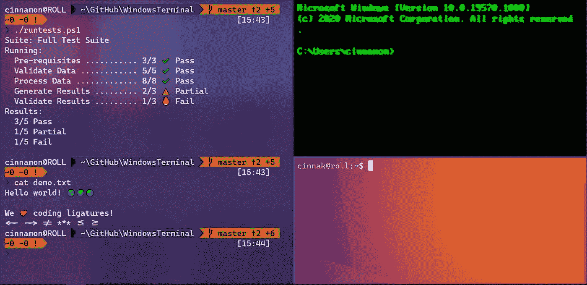

# 如何自定义 Windows 终端

> 原文：<https://javascript.plainenglish.io/how-to-customize-windows-terminal-e41954c878fd?source=collection_archive---------14----------------------->

## 自定义新的 Windows 终端，使您的工作流程更加顺畅



source: Screenshot of a [windows terminal](https://www.microsoft.com/en-us/p/windows-terminal/9n0dx20hk701?activetab=pivot:overviewtab#)

码头总是为了更伟大的事业而存在。几乎每个开发人员或程序员每天都使用它来执行一些任务。对于 GNOME、Hyper 等开发者来说有很多选择，Windows 终端就是其中之一。

对于使用基于命令的工具和 Shell(如 WSL、Cmd 和 PowerShell)的用户来说，新的 Windows 终端是一个现代、强大、快速和高效的终端。Windows 终端有一些扩展功能，使其脱颖而出，如它有多个标签，UTF-8 字符支持，GPU 加速文本渲染引擎，定制和配置。除了这些，它是开源的，这使它真的耐人寻味。

每个开发人员在某个阶段都必须修改工具，以充分利用它们。有定制和配置。今天我们将学习通过添加一些快捷键来定制我们的终端，使它看起来更好，工作效率更高。

# Windows 终端的安装

如果您已经安装了 windows 终端，那么您可以跳过这一部分，否则请到 windows 应用商店搜索“Windows 终端”并安装它。

## 怎么做？

你会在右上角看到一个带有“Get”字样的按钮。按下它，然后你会看到下一个按钮在同一个地方，上面有文字“下载”。按下该按钮，1-5 分钟后，Windows 终端将下载到您的机器上。


# 在 Windows 终端中更改默认配置文件

默认情况下，当您打开 Windows 终端时，会看到 PowerShell 作为默认配置文件。所以，我要把它改成 cmd。让我们看看如何改变它。

## 怎么做？

打开 windows 终端，通过按“ctrl+”进入设置，在 JSON 文件`"defaultProfile": "{Some hex code}"`中，将此文件的十六进制代码更改为 cmd guid 的十六进制代码，您可以在列表部分中找到。

# 在 Windows 终端中添加自定义配色方案

我是那种总被主题激动的人。为什么？因为这让我感觉更好。当我看到对我来说更好看的屏幕时，我更愿意在屏幕上工作更长时间而不会感到厌倦。这就是为什么我总是喜欢激动人心的主题。

windows 终端有许多可用的主题，其中一个我喜欢的是“贝壳”。

**还有很多其他选项，你可以在这里勾选**[](https://windowsterminalthemes.dev/)****。****

## **怎么做？**

**安装 windows 终端后，打开它，按“ctrl+，”进入设置。您将看到一个 JSON 文件，导航到`scheme`数组，在数组中粘贴配色方案的代码。**

**添加配色方案后，现在导航到列表并寻找 cmd 部分。你会看到一些代码，**

```
{"guid": "{0caa0dad-35be-5f56-a8ff-afceeeaa6101}","name": "Command Prompt","commandline": "cmd.exe","hidden": false,},
```

**找到这个代码后，添加`"colorScheme": "nameOfSceme"`。在我的例子中，我将添加像`"colorScheme": "seaShells"`这样的贝壳，现在，你已经改变了 Windows 终端的主题。**

**Windows 终端里有[配色的官方文档，你可以去看看更好的了解。](https://docs.microsoft.com/en-us/windows/terminal/customize-settings/color-schemes)**

## **奖金**

**如果你想给你的 Windows 终端增加一些透明度，你可以在`colorScheme`下面添加这些样式**

```
"useAcrylic": true,"acrylicOpacity": 0.75
```

****

# **添加一些自定义的*按键绑定***

**当使用 Windows 终端时，你将需要一些按键绑定来更快地执行你的任务，比如打开新窗口和关闭当前窗口等等。**

## **怎么做？**

**转到 settings 并在 JSON 文件中寻找`actions` array，你可能已经在那里看到一些键绑定。根据您的选择添加您喜欢的按键**

```
{"command": "closeTab","keys": "ctrl+w"},{"command": "newTab","keys": "ctrl+n"},
```

**根据需要，您可以将其他键绑定添加到您的列表中，如 tab shifting 和其他。基本语法是一样的。**

# **Windows 终端的官方文档**

**总是有一些可用的工具文档。同样，Windows 终端也有官方[文档](https://docs.microsoft.com/en-us/windows/terminal/)。如果你想了解更多关于 Windows 终端的知识，请随意阅读文档。**

**阅读文档将帮助您更深入地发现该工具，并了解该工具，这将帮助您发现哪个工具最适合您的问题。理解这个工具还可以帮助你发现一些缺陷，你可以通过为这个项目做贡献来修复这些缺陷，并被算作这个工具的贡献者。**

# **结论**

**这些是我做的一些改变，并与你们分享。为了简化工作流程，您还可以进行许多其他更改和配置。我通常会根据需要定制一些东西。否则，我就用默认的。你可以测试和做一些事情，也许你会做出更好的适合你的东西。**