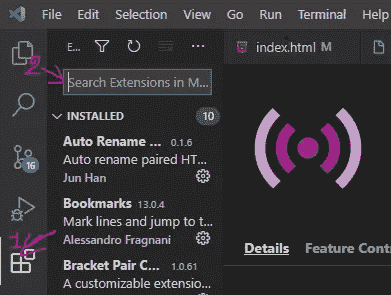
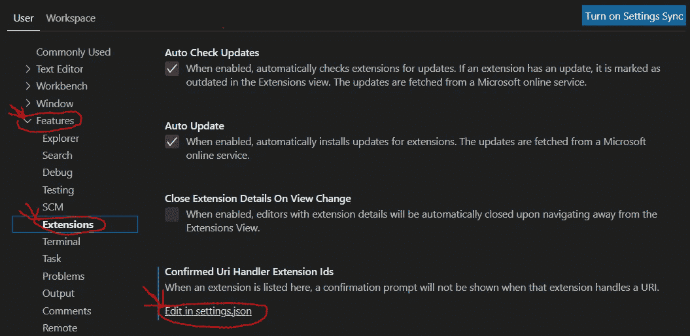

# 如何为前端 Web 开发定制 VSCode

> 原文：<https://javascript.plainenglish.io/how-to-customize-your-vscode-for-front-end-web-development-b80c8eb562d1?source=collection_archive---------13----------------------->

## 定制您的 VSCode，使其为您服务


Photo by [Sai Kiran Anagani](https://unsplash.com/@_imkiran?utm_source=medium&utm_medium=referral) on [Unsplash](https://unsplash.com?utm_source=medium&utm_medium=referral)

VS Code 是 web 开发中最流行的文本编辑器之一。它是免费的，可以在 Windows、Mac 和 Linux 的任何地方运行。它是开发者最喜爱的编辑器，因为它有一个易于使用和可定制的界面。

VS 代码附带了许多特性和扩展，您可以使用它们来简化开发过程。它是完全可定制的，你可以改变布局、颜色、图标等等。你也可以用它连接额外的服务，比如 Git。

在本文中，我们将看到如何通过添加扩展和编辑设置来定制 VS 代码。让我们开始吧。

# 添加扩展

当您第一次安装 VS 代码时，您将需要添加一些重要的扩展，这些扩展将有助于您的开发，并使您的工作流程更加简单。

在 Vs 代码中安装扩展非常容易。你所要做的就是点击扩展的图标，在那里搜索你要找的扩展。



Capture by author.

如图所示，您可以搜索扩展并将其安装在 VS 代码中。

下面是我作为前端 Web 开发人员使用的一些重要的 VS 代码扩展:

*   直播服务器。
*   自动重命名标签。
*   括号对着色 2。
*   ES7 React/Redux/graph QL/React-原生代码片段。
*   实时 Sass 编译器。
*   材料图标主题。
*   更漂亮。
*   书签。
*   素材主题(如果要换主题的话)。

如果你想了解更多关于这些扩展的内容，你可以看看我下面的文章。

[](/8-must-have-vscode-extensions-for-front-end-web-developers-69842a456f9c) [## 前端 Web 开发人员必备的 8 个 VSCode 扩展

### 8 个 VSCode 扩展，让您的生活更轻松。

javascript.plainenglish.io](/8-must-have-vscode-extensions-for-front-end-web-developers-69842a456f9c) 

# 编辑设置

既然您已经安装了重要的扩展。是时候根据自己的需求编辑 VS 代码设置了。

在 VS 代码中，包括扩展设置在内的所有设置都存储在一个名为`settings.json`的 JSON 文件中，您可以在编辑器中访问和修改该文件。

为了访问该设置文件，您需要转到设置，单击特性按钮，然后单击“编辑设置. json”。



Capture by author.

一旦你打开文件`settings.json`，你会发现你已经安装的扩展的一些设置。您可以在 JSON 对象中添加您想要的设置。

*   例如，如果要更改编辑器字体大小，请添加以下格式:

```
"terminal.integrated.fontSize": 18
```

*   您还可以通过添加以下格式在 react 代码中启用 emmet:

```
"emmet.includeLanguages": {
  "javascript": "javascriptreact"
}
```

*   将设置设为`afterDelay`、`onFocusChange`或`onWindowChange`，启用自动保存功能。

```
"files.autoSave": "afterDelay"
```

正如你所看到的，你可以自定义你的设置。

以下是我在文件`settings.json`中使用的所有设置:

```
{
  "editor.fontSize": 15,
  "files.autoSave": "afterDelay",
  "editor.tabSize": 1,
  "editor.wordWrap": "on",
  "terminal.integrated.fontSize": 26,
  "emmet.includeLanguages": {
    "javascript": "javascriptreact"
  },
  "editor.minimap.enabled": false,
  "prettier.jsxSingleQuote": true,
  "prettier.semi": false,
  "prettier.singleQuote": true,
  "javascript.updateImportsOnFileMove.enabled": "always",
  "editor.formatOnPaste": true,
  "editor.formatOnSave": true,
  "editor.defaultFormatter": "esbenp.prettier-vscode",
  "[javascript]": {
    "editor.defaultFormatter": "esbenp.prettier-vscode"
  },
  "editor.cursorBlinking": "expand",
  "window.zoomLevel": 1,
  "workbench.iconTheme": "material-icon-theme",
  "extensions.confirmedUriHandlerExtensionIds":[
    ]
}
```

如果愿意，您可以复制这些设置并将其粘贴到您的 JSON 设置中。

# 结论

VS Code 是 web 开发最好的文本编辑器之一。开发人员喜欢它，因为它易于使用，它有很多有用的扩展，并且您可以根据需要定制它。

感谢您阅读这篇文章。希望你觉得有用。

**更多阅读**

[](/8-javascript-features-to-know-before-learning-reactjs-aac8b7748b30) [## 学习 React 之前应该了解的 JavaScript 特性

### 在做出反应之前，先学习这些 JavaScript 特性

javascript.plainenglish.io](/8-javascript-features-to-know-before-learning-reactjs-aac8b7748b30) 

*更多内容尽在*[***plain English . io***](https://plainenglish.io/)