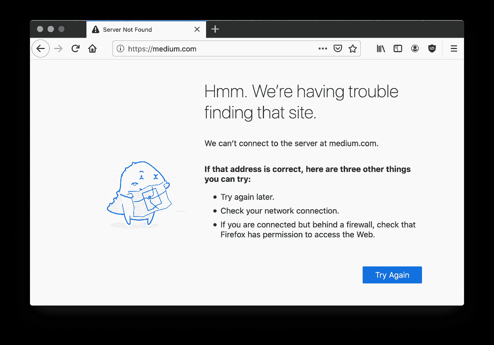

# 处理代码分割网络故障

> 原文：<https://javascript.plainenglish.io/how-to-deal-with-network-failures-from-code-splitting-13dd7fd3648?source=collection_archive---------4----------------------->

## 重新加载代码分割块以尝试从网络故障中恢复。



Network Failure

## 我的旅程

在我用动态导入和 React 惰性加载将我的[单页面应用包](/a-guide-to-react-lazy-loading-6bca6be7159)分割成多个块之后，我开始偶尔在生产中看到错误。某些东西导致了运行时错误，这将导致整个应用程序崩溃，并冒泡到我的 React 错误边界。查看日志，令人不快的错误是这样的:

```
Error: ChunkLoadError: Loading chunk 0 failed.
```

## 根本原因

经过一番挖掘，我意识到根本原因是网络。更多的块意味着更多的请求，这意味着更多的网络故障的机会。如果任何一个请求的块失败，就会触发上面的错误。但是我真的不能做任何事情来修复一个用户的网络。那么，下一个最好的是什么？

## 方法

如果网页加载失败，我该怎么办？我刷新页面，再试一次。这个相同的原理可以应用于代码分割块。如果失败，再次加载有问题的块，并希望它成功。虽然这肯定不能保证解决问题，但这是解决我们无法控制的事情的次佳选择。

## 组块重试

那么，这是如何用代码实现的呢？代码拆分是通过动态导入语法实现的。这将返回一个承诺，当块被成功加载时，这个承诺就会实现。我们需要一个实现重试机制的包装器，而不是直接将动态导入承诺传递给 React lazy。

```
// App.js
import importRetry from './importRetry';const Chunk = lazy(() =>
  importRetry(() => import('./Chunk'))
);// importRetry.js
async function importRetry(importFn, retries = 2, interval = 1000) {
  try {
    return await importFn();
  } catch (error) {
    if (retries) {
      await wait(interval);
      return importRetry(importFn, retries - 1, interval);
    } else {
      throw new Error(error);
    }
  }
}function wait(ms) {
  return new Promise(resolve => setTimeout(resolve, ms));
}
```

`importRetry`包装器将尝试进行动态导入。如果不成功，它将等待一小段时间，然后再次尝试，直到达到`retries`指定的次数。希望通过等待，网络问题得到解决。如果在所有的重试之后请求仍然不成功，我们别无选择，只能返回错误。

## 网络包

如果你想要一个更加自动化的方法来处理动态导入重试，有一个 npm 包可以满足你的需求——[webpack-retry-chunk-load-plugin](https://www.npmjs.com/package/webpack-retry-chunk-load-plugin)通过 web pack 实现了相同的功能。它提供了一个插件，可以在失败时自动注入代码来重新加载程序块。

```
// webpack.config.js
const { RetryChunkLoadPlugin } = require('webpack-retry-chunk-load-plugin');module.exports = {
  plugins: [
    new RetryChunkLoadPlugin({
      maxRetries: 3,
    })
  ];
};
```

这个插件提供的灵活性不如直接通过代码实现重试，但它将保证每个导入都有一个重试机制。

## 最后的想法

随着我的单页面应用程序变得越来越大，代码分割成为确保良好加载时间的必要工具。但由于糟糕的路由器、不稳定的连接和太阳耀斑，这些代码分割块上的网络故障是可以预料的。我们必须尽最大努力使我们的代码库对错误有弹性，并在错误出现时尝试自我修复。在这种情况下，我们必须再次尝试加载数据块。

## 资源

*   web pack-retry-chunk-load-plugin 的官方文档
*   [Github 回购本文](https://github.com/mjchang/medium/tree/master/chunk-retry)
*   [本文的 CodeSandbox】](https://codesandbox.io/s/github/mjchang/medium/tree/master/chunk-retry)