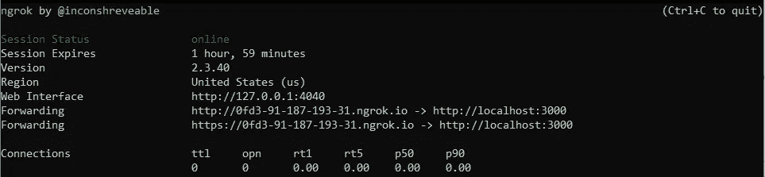

# 如何在本土发展的同时应对 SEO

> 原文：<https://javascript.plainenglish.io/how-to-deal-with-seo-while-developing-locally-f930652bbcec?source=collection_archive---------9----------------------->

## 允许在线搜索引擎优化审计工具在本地主机上测试你的网站


Photo by [Myriam Jessier](https://unsplash.com/@mjessier?utm_source=unsplash&utm_medium=referral&utm_content=creditCopyText) on [Unsplash](https://unsplash.com/s/photos/seo?utm_source=unsplash&utm_medium=referral&utm_content=creditCopyText)

我最近在做一个项目，在完成之前我不能在网上发布。由于商业协议，我不能在某个日期之前公开我正在做的网站。主要问题是我的客户最关心的是搜索引擎优化。他们想要一个在搜索引擎优化排名方面极具竞争力的网站。

网上有很多搜索引擎优化审计工具，但它们都要求你的网站可以通过互联网公开访问。换句话说，他们要求你的网站在线，并且当前可以被他们的软件访问。这可能代表一个问题，特别是如果你想提高网站的搜索引擎优化性能，但你必须在本地工作。幸运的是，有一个解决方案！

所以，让我们来学习一下如何让在线 SEO 审计工具访问你在`localhost`本地托管的网站。

# 使用 Ngrok 公开本地主机网站

由于问题是您的本地托管网站不可公开访问，因此解决方案是在`localhost`上运行时暂时将其暴露在互联网上。这可能看起来很难实现，但这并不是由于 [ngrok](https://ngrok.com/) 。

> ngrok 通过安全隧道将 NAT 和防火墙后面的本地服务器暴露给公共互联网—[ngrok—工作原理](https://ngrok.com/product)

你所要做的就是遵循这些步骤:

1.  用本地网络服务器托管你的网站，确保它在`localhost`域名下可用
2.  在此下载 ngrok [并解压](https://ngrok.com/download)
3.  通过启动以下命令，进入您在 run it 中解压缩 ngrok 的文件夹:

```
./ngrok http 80 
```

请注意，最后一个数字必须对应于本地主机上运行的 web 服务器所使用的端口，通常是 80、8080 或 3000。具体来说，通过启动该命令，将启动端口 80 上的 HTTP 隧道。



The result of the `ngrok http 3000` command

这是您的控制台在运行该命令后的样子。在我的例子中，我启动了`ngrok http 3000`命令，ngrok 告诉我，现在每个人都可以通过到达`[http://0fd3-91-187-193-31.ngrok.io](http://0fd3-91-187-193-31.ngrok.io)` URL 来访问我在`localhost:3000`上运行的网站。

换句话说，你的本地托管网站现在是公开的，你可以把链接传递给你最喜欢的搜索引擎优化审计工具。这也是让网站地图验证器在线工具检查您托管在`localhost.`的网站的好方法

请记住，HTTP 隧道速度很慢，您选择的 SEO 审计工具可能会就性能问题向您发出警告，尤其是在延迟时间方面。这与你如何将本地网站暴露在互联网上有关，你基本上可以忽略这些警告。

# 结论

在这里，我们学习了如何将一个托管在`localhost`上的网站暴露给互联网，使它可以被许多在线 SEO 审计工具访问。事实上，这些工具中的大部分都要求你的网站可以在互联网上公开访问，当你不能公开你的网站，而你必须在本地工作时，这就成了一个问题。令人欣慰的是，ngrok 是一个强大的工具，它可以让你毫不费力地将一个本地网站临时暴露在互联网上，并解释如何使用它，这就是本文的内容。

*更多内容尽在*[***plain English . io***](http://plainenglish.io/)