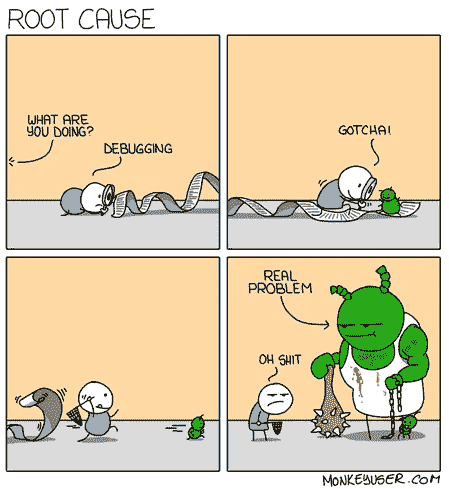
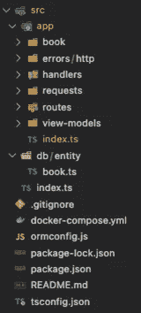
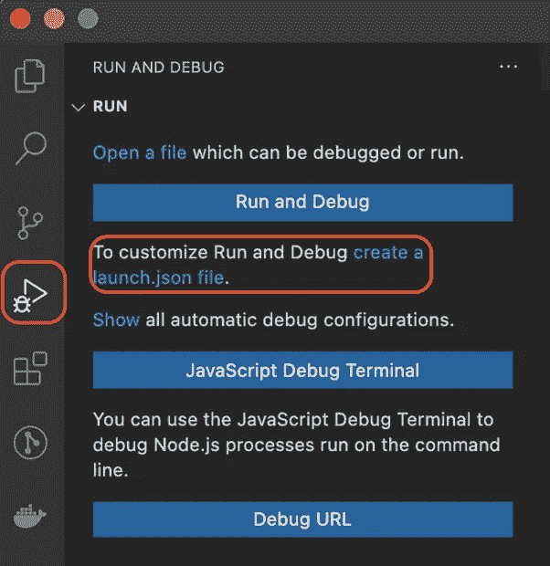
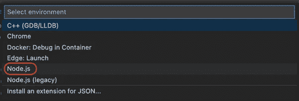
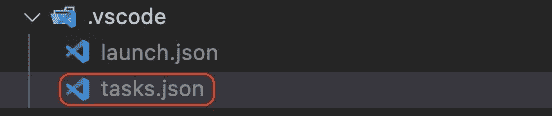
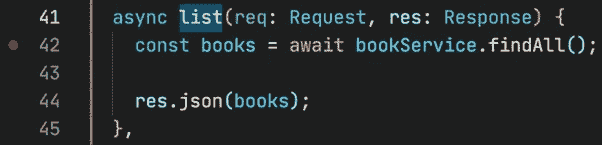
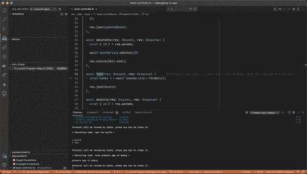
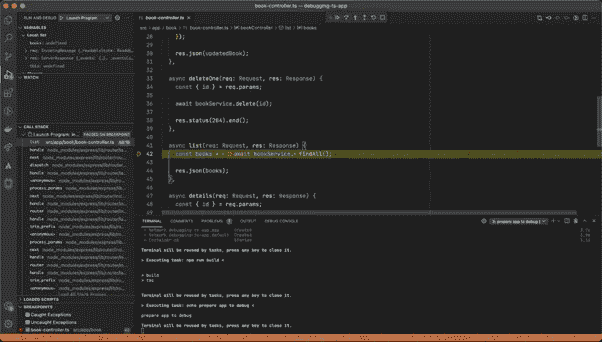
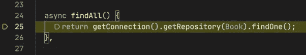

# 如何在 Visual Studio 代码中调试 TypeScript Node.js 应用程序

> 原文：<https://javascript.plainenglish.io/how-to-debug-a-typescript-node-js-app-in-visual-studio-code-13f507db28bd?source=collection_archive---------5----------------------->

## TypeScript 项目调试


Photo by [Almos Bechtold](https://unsplash.com/@almosbech?utm_source=medium&utm_medium=referral) on [Unsplash](https://unsplash.com?utm_source=medium&utm_medium=referral)

JavaScript 和 TypeScript 调试可能看起来像相似的过程，但是为了正确地完成它们，您需要知道如何处理差异。作为我的 Node.js 应用程序调试系列的一部分，我将重点介绍用 Visual Studio 代码调试 TypeScript 代码。

# 静态打字风扇的类型脚本调试

在写代码的时候，你迟早会产生一个 bug。只有在质量保证走进项目并发现令人讨厌的事情，或者集成测试通知您之后，您才会意识到它的存在。

当你想调试一个用 JavaScript 编写的项目时，你只需要稍微修改一下默认的配置文件`launch.json`，你就可以开始你的 bug 搜索了。



但是，如果您是静态类型的爱好者，并且您的项目是用 TypeScript (❤️)编写的，您将需要在调试过程中投入更多的工作。不过不要担心，今天我将向您展示一个优秀的 Visual Studio 代码类型脚本调试需要什么。

> [*在这里您可以找到我们将一起检查错误的项目*](https://github.com/b-dabrowski/debugging-ts-app) *。或者说，只有一个错误……*

为了能够在您的本地环境中运行这个项目，您需要以下东西:

*   从 Github 下载的应用程序代码，
*   已安装 Node.js(至少 12.0.0 版本)，
*   安装了 Docker 20.10.6 版本(至少这是我目前在用的)。

# 关于调试 TypeScript 应用程序项目


Photo by [Shahadat Rahman](https://unsplash.com/@hishahadat?utm_source=medium&utm_medium=referral) on [Unsplash](https://unsplash.com?utm_source=medium&utm_medium=referral)

该项目是一个用 TypeScript 编写的简单 API，使用 Express.js 框架和使用 TypeORM 的 Postgres 数据库。所有使用过的库都可以在`package.json`文件中找到。

想知道反射元数据库在这个文件中做什么？您将需要它来正确操作在具有 TypeORM 的模型中使用的 decorators。该 API 旨在提供一个简单的 CRUD 来处理书籍并将它们保存在数据库中。

本系列第一部分中的 API 是用 JavaScript 编写的，所以当您启动调试器时，您会仔细检查我们编写的代码。这里情况发生了变化，因为代码是用转换成 JavaScript 的 TypeScript 编写的。转换后的代码失去了可读性，并且很难检查错误，所以我打赌您更喜欢检查 TypeScript 代码。`tsconfig.json`文件的一个特性对我们很有帮助:

```
{ “compilerOptions”: { “lib”: [“es2020”], “target”: “es2020”, “outDir”: “build”, “module”: “CommonJS”, “esModuleInterop”: true, “emitDecoratorMetadata”: true, “experimentalDecorators”: true, “sourceMap”: true }}
```

得益于`sourceMap: true`属性，TypeScript 将生成`.js.map`文件，调试器将使用这些文件将 JavaScript 中的代码映射到 TypeScript 中的代码。

# TypeScript 项目的结构



*The structure*

上面，您可以看到一个简单的项目结构和主要目录的简要描述:

*   app -用 Express.js 写的应用程序代码，
*   用 TypeORM 编写的数据库实体代码，
*   docker-compose.yml -在容器中快速启动数据库的配置文件，
*   ormconfig.js -在 TypeORM 和数据库之间建立连接所需的配置文件。

# 如何启动 TypeScript 项目？


Photo by [Vince Fleming](https://unsplash.com/@vincefleming?utm_source=medium&utm_medium=referral) on [Unsplash](https://unsplash.com?utm_source=medium&utm_medium=referral)

步骤 1:在本地下载项目

```
git clone git@github.com:b-dabrowski/debugging-ts-app.git
```

步骤 2:进入项目目录后，安装 API 依赖项

```
npm i
```

步骤 3:API 将信息保存在数据库中，因此在运行 API 之前，您还需要运行数据库:

```
docker compose up
```

步骤 4:使用 npm 脚本运行应用程序:

```
npm start
```

完成最后一步，你应该从这里的 API 得到答案:[http://localhost:3000/books](http://localhost:3000/books)

目前，您的数据库是空的，API 没有返回任何内容。让我们添加一本书来检查是否一切正常。要添加一本新书，您需要向 API 发出请求:

```
curl — request POST \ — url [http://localhost:3000/books](http://localhost:3000/books) \ — header ‘Content-Type: application/json’ \ — data ‘{ “title”: “Lorem”, “authors”: “Ipsum”, “isbn”: “123456789”, “description”: “Lorem ipsum dolor sit amet.”}’
```

来自 API 的响应应该如下所示:

```
{ “authors”: “Ipsum”, “description”: “Lorem ipsum dolor sit amet.”, “isbn”: “123456789”, “title”: “Lorem”, “id”: “cc4d2288–8083–4197-b068–7c37a5b24a35”}
```

通过在浏览器中输入以下地址:[http://localhost:3000/books](http://localhost:3000/books)您应该会看到所有的书籍。或者，您可以使用您最喜欢的 HTTP 客户端向相同的地址发出 GET 请求，并获得数据库中所有书籍的响应。

如果您添加了几本书，并想全部显示出来，那么您现在可能已经注意到，您总是只得到一个 book 对象作为响应。


我认为是时候运行调试器并检查代码了。

# 让 Typescript 调试开始！

首先，您需要添加一个项目配置文件。在此基础上，调试器将运行:



*Run and Debug*



*Pick Node.js*

选择环境后，应该使用默认设置创建一个`launch.json`文件:

```
{    // Use IntelliSense to learn about possible attributes.    // Hover to view descriptions of existing attributes.    // For more information, visit: https://go.microsoft.com/fwlink/?linkid=830387    "version": "0.2.0",    
"configurations": [        {            
"type": "pwa-node",            
"request": "launch",            
"name": "Launch Program",            
"skipFiles": [                
"<node_internals>/**"            ],            
"program": "${workspaceFolder}/build/index.js"        
}    
]}
```

不幸的是，默认设置不足以进行 TypeScript 调试，因此您需要添加一些附加设置:

```
{  "version": "0.2.0",  "configurations": [    {      "type": "pwa-node",      "request": "launch",      "name": "Launch Program",      "skipFiles": ["<node_internals>/**"],      "program": "${workspaceFolder}/build/index.js",      "outFiles": ["${workspaceFolder}/build/**/*.js"],      "env": { "NODE_ENV": "development" },      "resolveSourceMapLocations": [        "${workspaceFolder}/**",        "!**/node_modules/**"      ],      "preLaunchTask": "prepare app to debug",      "postDebugTask": "clean app after debug"    }  ]}
```

这些属性中的大部分在上一篇文章中已经讨论过了，所以我在这里不再赘述。我将只描述新的属性:

*   outFiles——一个值，指定扩展名为`.js`的文件将被放置的路径模式，以便调试器可以将它们与扩展名为`.js.map`的映射文件相关联。
*   resolveSourceMapLocations —指定调试器可以在哪些目录中使用映射文件的值。在本例中，我们已经阻止它们在 node_modules 中使用，以加快映射速度。
*   preLaunchTask —指定在调试会话之前必须执行的任务的值。众所周知，TypeScript 代码必须转换成 JavaScript 代码(一个任务)。API 使用数据库，因此下一个任务将是运行数据库。
*   postDebugTask —指定调试会话后必须执行的任务的值。在我们的例子中，它将用 JavaScript 代码删除生成的文件并关闭数据库。

# 调试会话前后应该执行的任务在哪里？

在 `launch.json`文件的位置，您需要添加一个新文件(`tasks.json`，其中将包含上述任务。



将任务配置放在这个新创建的文件中:

```
{  "version": "2.0.0",  "tasks": [    {      "type": "npm",      "script": "build",      "group": "build",      "label": "npm: build - app",      "detail": "NODE_ENV=development tsc -p ."    },    {      "label": "start db",      "type": "shell",      "command": "docker compose up -d"    },    {      "label": "stop db",      "type": "shell",      "command": "docker compose down"    },    {      "type": "shell",      "label": "clean app",      "command": "rm -rf ./build"    },    {      "label": "prepare app to debug",      "type": "shell",      "command": "echo prepare app to debug",      "dependsOrder": "sequence",      "dependsOn": ["start db", "npm: build - app"]    },    {      "label": "clean app after debug",      "type": "shell",      "command": "echo clean app after debug",      "dependsOrder": "sequence",      "dependsOn": ["stop db", "clean app"]    }  ]}
```

如您所见，包含任务的文件并不复杂。您可以设置任务的类型，是 npm 脚本还是 shell。创建由几个相互依赖的子任务组成的任务是非常有帮助的。在这种情况下:

*   准备要调试的应用程序，
*   调试后清理 app。

现在一切都设置好了，是时候检查 API 中的 bug 藏在哪里了。

# Visual Studio 代码和发现 API 中的错误

问题出现在与列出所有书籍相关的代码中，所以您应该在负责返回所有书籍的控制器函数`book-controller.ts`中开始搜索。所以我们把断点放在控制器代码的第 42 行的`list`函数上。



设置断点后，可以启动调试器并跟踪代码的执行。

在 Visual Studio 代码中，转到“运行和调试”视图(Cmd ⌘ Shift ⇧ D ),然后单击“启动程序”旁边的绿色箭头。

启动调试器后，您应该看到以下视图:



现在你可以在浏览器里转到这个地址:[http://localhost:3000/books](http://localhost:3000/books)然后你就会被转到调试会话。



在更深入地进入控制器调用的服务函数之后，您可以看到错误隐藏在哪里:



我没有去找所有的书，而是用了错误的方法，把找到的第一本书退回去。

# Visual Studio 代码-类型脚本调试摘要


希望我说服您在代码中查找错误时使用调试器。当然，没有什么比过去的`console.log ("YOU ARE HERE !!!!!")`更好的了，但有时你只需要更彻底地分析我们的代码流，然后调试器就会来救你了！

我的系列将涵盖 Javascript 中的调试集成测试。敬请期待更多内容！

*更多内容请看*[***plain English . io***](http://plainenglish.io)