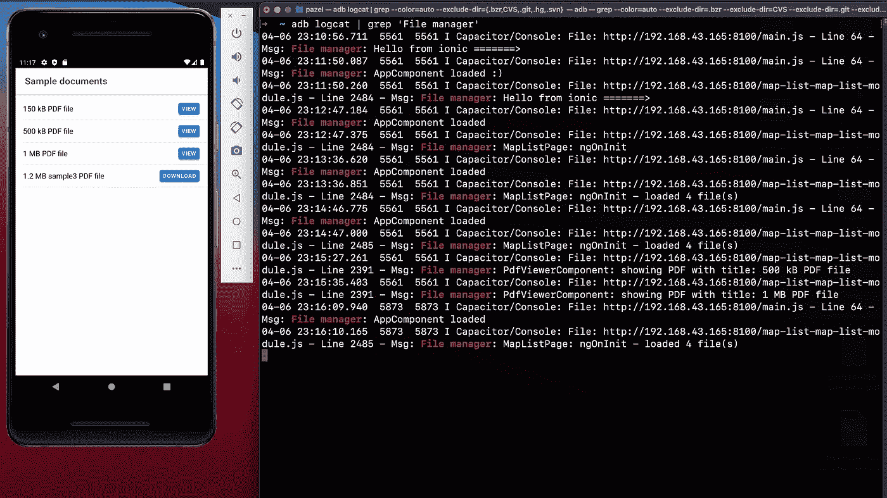
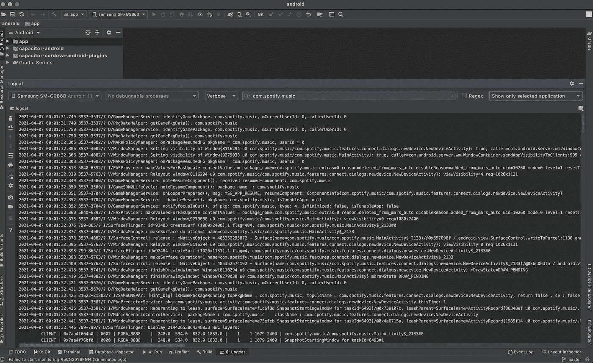
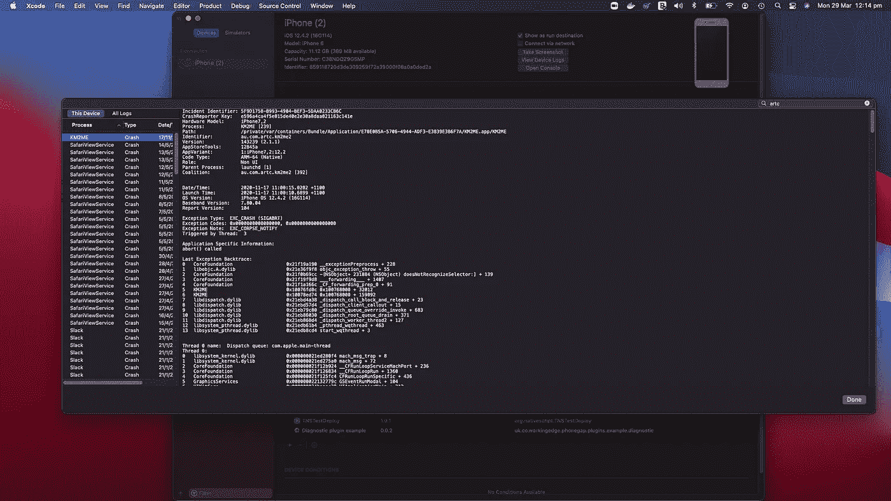
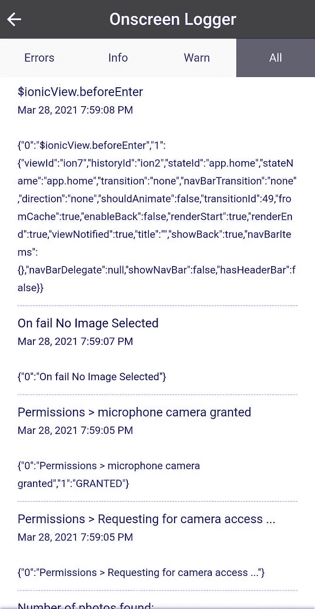
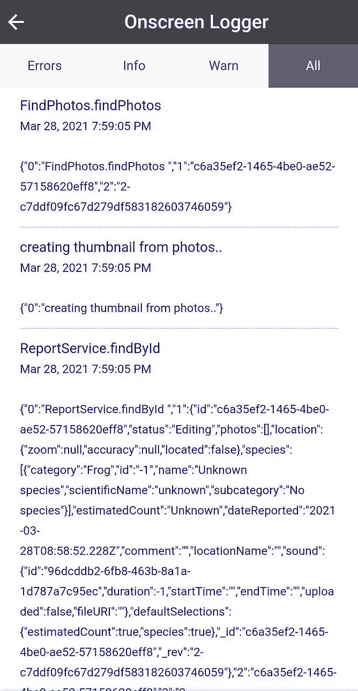
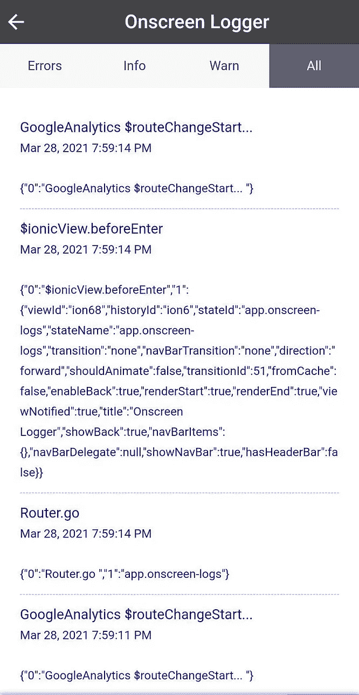
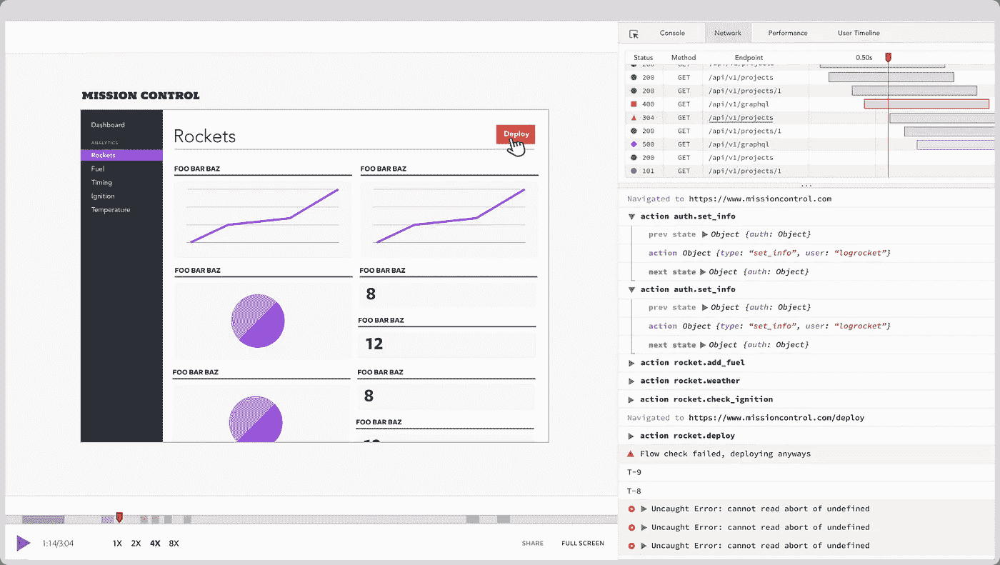

# 如何在生产中调试 Ionic 移动应用

> 原文：<https://javascript.plainenglish.io/how-to-debug-ionic-apps-in-production-202bb10f7c55?source=collection_archive---------5----------------------->

本文是关于如何调试 ionic 应用程序的两部分文章的第二部分[。如果你的应用程序处于发布模式，这里描述的技术是有帮助的。如果你正在寻找在开发过程中调试一个 app 的方法(调试版)，请看本文](https://pazel.medium.com/how-to-debug-ionic-apps-d73c6667c0e7)的[第一部分。](https://pazel.medium.com/how-to-debug-ionic-apps-during-development-19d5df51c6bf)

我在本文第一部分中解释的所有方法的缺点是，它们只有在应用程序处于调试模式时才可用(不是发布版本)。

当您对应用程序进行发布签名时，将无法再使用远程调试或本机 IDE 对应用程序进行调试。因此，您需要一种替代方法来查看您的应用程序日志。让我们探索一些选项。

## 1.使用设备日志

这种方法不是我最喜欢的，但有时查看设备日志会很方便。您可以将 iOS 或 Android 设备连接到电脑，以查看所有应用程序写入控制台的日志。

这不是最友好的调试体验，但有时它是一个不错的选择，因为一些问题可能是在操作系统级别，与代码无关，因此 WebView 可能没有太大帮助。

如果沿着这条路走下去，您需要学习如何过滤日志以查看与您的应用程序相关的日志。您可以使用您的应用程序捆绑 id 或一些特定的关键字来过滤日志并查看您的应用程序日志。
尽管如此，与你从 Chrome DevTools 获得的体验相比，这将是一个非常低级的调试体验。

下面是一个运行`adb logcat`命令的 Android 调试日志的例子。

提示:在应用程序日志中使用一致的结构。这样，您可以随时使用`grep`来过滤设备日志。
这里我使用`adb logcat grep | 'File manager'`来获取所有以那个关键字开始的日志。

Viewing Android debug logs using adb logcat

如果你决定走这条路，你应该使用 Android Studio，因为查看 adb 日志没有多大帮助。这样，您可以根据需要设置日志级别，并通过您知道的相关关键字进行过滤，比如您的 bundle id。

以下是捆绑包 id 为`com.spotify.music`的 Spotify 应用程序的 adb 日志示例。要访问日志打开 Android Studio，单击底部工具栏中的`logcat`，然后在 logcat 窗口中，选择您的设备并提供过滤选项和日志级别(信息，错误)。

Viewing Android debug logs using adb logcat in Android studio.

下面是一个使用 Xcode 的 iOS 调试日志的例子。您将获得大量日志，但您可以按应用程序过滤。好的一面是，你可以访问崩溃日志，了解应用程序崩溃的原因。要访问这些日志，请打开 Xcode，然后进入`window`菜单并选择`Device and Simulators`(或使用 cmd+shit+2 作为快捷键)，并从列表中选择您的设备或模拟器，以查看其相关日志。

Looking at device logs from the prod app using Xcode

其他一些限制是您需要访问设备。这可能会有问题，因为您的移动应用程序被分发到大量的 Android 和 iOS 设备上，而您实际上无法访问这些设备。

通常，当生产中出现问题时，您没有任何线索，直到一个不高兴的客户找上门来告诉您。

即使这样，考虑到您可能需要的所有环境设置，重现该问题也可能非常困难。(操作系统版本、设备型号、与用户设备上缺少内存或存储等资源相关的运行时问题以及糟糕的网络问题等等。)

你将得到的只是你的应用程序不起作用！如果你运气好，并且和一个有经验的用户打交道，你可能会得到导致问题的工作流程的更多细节。我想你同意这种调试是非常低效的，你可以和用户反复多次来找出问题所在。

## 2.创建屏幕记录器

这种方法与前面的解决方案非常相似，但是更容易访问日志。您可以在应用程序的调试页面上显示所有日志的人类可读版本，而不是将设备连接到计算机并查看运行时日志。这种方法很有帮助，尤其是在内部 QA 阶段，当你自己的 QA 内部将应用程序测试为合适的发布版本时。
这是我们较早的 Ionic 应用程序中的一个屏幕记录器示例，它使用 AngularJS。这些日志被分类以便于查找错误，并且具有特定的格式。

一开始可能看起来不明显，但是在一个了解应用程序工作流程的有经验的开发人员手中，这是调试的好信息。

此外，用户可以通过将转储文件发送到 API 或电子邮件地址来发送日志副本。

On-screen debugger page showing application logs

实现这一点最简单的方法是覆盖`console`方法，并将日志添加到一个数组中，这样就可以在页面上打印它们了。

即使这种方法也有其局限性。你只能在屏幕上写有限数量的日志，不容易通读或搜索。
此外，你不能在设备上保存太多日志，因为它会很快变成一个大文件。因此，可以把它看作是一个选项，您只想暂时启用它来调试特定的流。您可能会错过一些可能在工作流早期发生的错误。

那么，有没有更好的方法来有效地调试生产中的 Ionic 应用程序呢？

是啊！

## 3.可以记录整个用户会话的解决方案

所以这个想法是你记录用户做的任何事情(应用程序中的交互，如点击或访问页面),并将其发送到远程服务器。然后，您可以访问管理仪表板并重放用户的会话。一些平台提供了这种类型的解决方案。

## [LogRocket](http://logrocket.com)

LogRocket 可以让你回放用户在你的网站或混合移动应用上做了什么，帮助你更快地重现 bug 和修复问题。使用 LogRocket，您可以回放问题，就像它们发生在您自己的浏览器中一样。

LogRocket 允许您:

*   **会话回放**
    看到用户所见的像素级完美回放。LogRocket 可以在其管理控制台中为你重新创建应用程序的用户界面/UX。
*   **Redux** 随时检查动作和状态。
*   **网络活动** 查看每一个网络请求和响应，包括错误代码。快速找到讨厌的 CORS 错误或与 API 相关的错误。
*   **控制台和错误** 检查控制台日志和 JavaScript 错误

另外，您可以在日志中添加一个用户标识符，这样您就可以知道哪个会话属于哪个用户。这种方法在 UAT 测试中是有益的。此外，Logrocket 提供了与您喜欢的框架甚至 Redux 状态管理的简单集成(它有一个 NgRX 中间件)。因此，您可以看到状态的变化，就好像您可以在调试模式下访问浏览器一样。

听起来很棒！不是吗？嗯，有一些陷阱！

*   没有现成的离线支持。这意味着如果用户离线，LogRocket 无法保存设备的数据并在以后发送。
    您可以向您的应用程序添加一个服务人员，并代理 LogRocket 请求，以便自己提供离线存储。
*   如果你有一个相当大的 redux 状态，它会影响你的应用程序的性能，占用太多的带宽。如果您的状态太大，LogRocket 会向您显示一个警告，并让您有选择地忽略状态的报告部分。
*   LogRocket 有一个免费层和非常灵活的定价。所以如果你还没有尝试过，我强烈推荐。

我在很多 Ionic 应用中使用过 LogRocket，它让我们调试 prod 变得更加容易。为了避免不必要的数据捕获和尊重用户隐私，我们通常通过从发送到 LogRocket 的有效负载中删除敏感数据来避免发送敏感数据。

LogRocket 会话记录在我们的产品中默认是禁用的。我们只在调试特定的用户问题时启用它。

为特定用户启用 LogRocket 通常由用户通过访问应用程序中的调试菜单来触发。通过这种方式，用户可以控制何时记录他们的会话。

还有一个服务叫 [Fullstory](https://www.fullstory.com/) ，提供会话回放，我个人没用过。此外，价格似乎比 LogRocket 贵。

## 4.可以处理运行时错误的解决方案

有多种解决方案被称为 JS 错误跟踪器，它可以将 JS 运行时中的任何运行时错误发送到远程服务器。这些错误通常伴随着有用的环境和用户会话信息。像浏览器规范、错误的堆栈跟踪、时间、位置、用户 id 等等。

此外，您可以将它们与 Slack 等其他通知服务集成，这样您就可以从生产中获得实时反馈，并尽快修复用户问题。

我通常将 Sentry 作为我构建的大部分应用程序的一部分，以使我更容易主动解决用户问题。

## [哨兵 io](http://Sentry.io)

Sentry 提供自托管和基于云的错误监控，帮助所有软件团队实时发现、分类和优先处理错误。Sentry 很容易与所有主要的前端框架集成，并且有一个免费层供您开始使用。

Application Monitoring 101 with Sentry.io

## [TRACKJS](https://trackjs.com/how/)

TrackJS 的 JavaScript 错误记录功能可以监控您的 web 应用程序中的 JavaScript 错误，并向您提供关于用户、应用程序和网络如何陷入困境的极好的上下文信息。使用 TrackJS 快速找到并修复您的错误。下面是 Bas 的一个很好的视频，解释了 TRACKJS 是如何工作的。

Frontend Error Monitoring using TrackJS by Ali Basarat

## 5.使用谷歌分析跟踪异常

**谷歌分析**是由[谷歌](https://en.wikipedia.org/wiki/Google)提供的[网络分析](https://en.wikipedia.org/wiki/Web_analytics)服务，用于跟踪和报告网站流量。

Google Analytics 用于[跟踪](https://en.wikipedia.org/wiki/Web_tracking)网站活动，如[会话](https://en.wikipedia.org/wiki/Session_(web_analytics))持续时间、每次会话的页面数、[跳出率](https://en.wikipedia.org/wiki/Bounce_rate)等。个人使用网站和流量来源信息。

要使用 Google Analytics 进行异常报告，您可以发送您感兴趣的任何异常数据以及您定义的自定义指标。然后，您可以利用 Google Analytics 报告来了解发生了什么类型的异常，或者有多少用户遇到了特定类型的异常。

这种用例的一个例子是，如果许多用户在您的购物应用程序中搜索您不提供的产品。这个异常不一定是一个错误，但同时，它也是一个有价值的统计数据，可以让你改进 UI/UX，给用户一个更好的错误消息，或者甚至可以考虑将该产品添加到你的产品中。

## 结论

我希望你喜欢阅读这篇文章，并请检查这篇文章的第一部分。

如果您在 Ionic apps 调试中有任何问题或需要帮助，请留下您的评论。

*更多内容尽在*[***plain English . io***](https://plainenglish.io/)