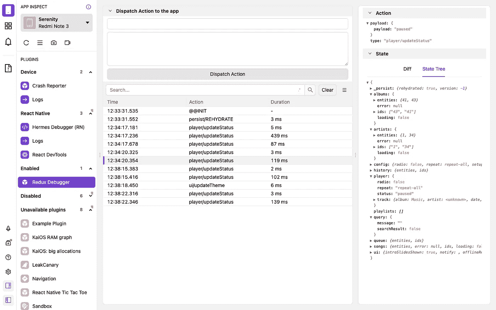
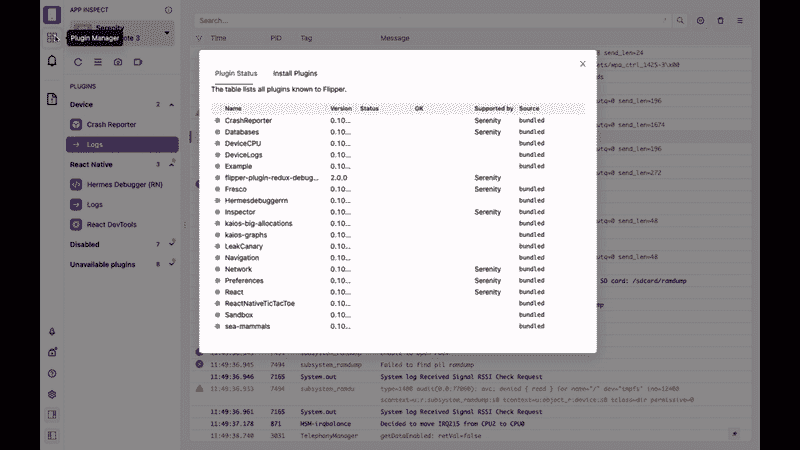
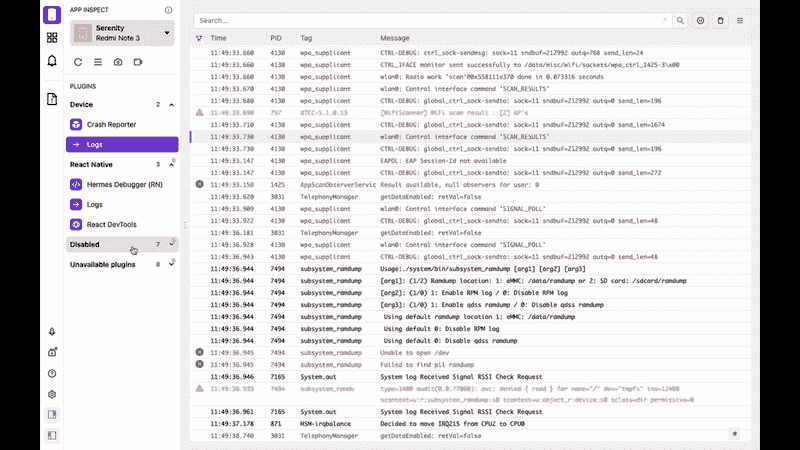
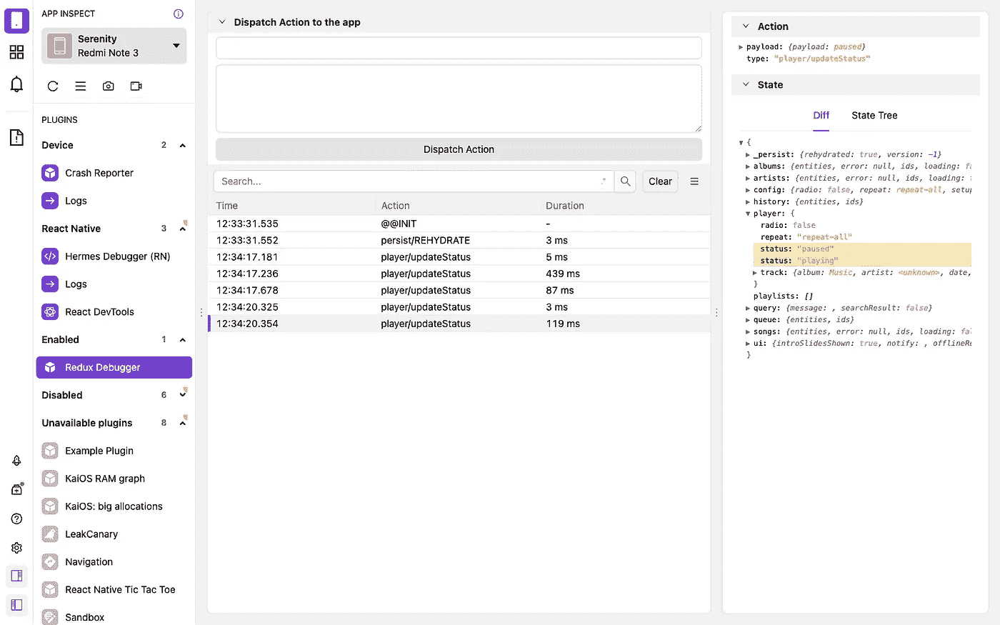

# 如何使用 Flipper 调试 React Native 中的 Redux

> 原文：<https://javascript.plainenglish.io/how-to-debug-redux-in-react-native-using-flipper-d785b46cf7bf?source=collection_archive---------2----------------------->

现在`[flipper-plugin-redux-debugger](https://classic.yarnpkg.com/en/package/flipper-plugin-redux-debugger)`允许你读取 [Flipper](https://fbflipper.com/) 里面的 React Native redux 日志:



redux-flipper

## 安装所需的软件包

在你的 React 原生 app 中安装`[redux-flipper](https://github.com/jk-gan/redux-flipper)`中间件和`react-native-flipper`:

```
yarn add --dev redux-flipper react-native-flipper
```

或者

```
npm i --save-dev redux-flipper react-native-flipper
```

## ios 的更新窗格

在 iOS 中为 React Native flipper 安装 pod:

`npx pod-install`或`cd ios && pod install`

## 配置 redux 存储

将中间件添加到您的 redux 存储中:

如果您使用 Redux toolkit:

## 安装 Redux 调试器插件

打开 Flipper 桌面客户端并安装`redux-debugger`插件

1.  `Plugin Manager > Install Plugins > search "redux-debugger" > Install redux-debugger`



## 启用 redux 调试器

`redux-debugger`插件将在禁用插件部分列出。启用插件以开始使用。

```
Disabled > Redux Debugger > Enable Plugin
```



## 启动应用程序，查看 Redux 调试器中的日志

`yarn android`和`yarn start`

**注**:点击动作查看状态



*更多内容看* [***说白了. io***](http://plainenglish.io/)