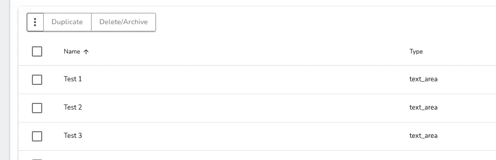

# 如何在 GraphQL 中删除多条记录

> 原文：<https://javascript.plainenglish.io/how-to-delete-multiple-records-in-graphql-ed76103e77de?source=collection_archive---------3----------------------->


Photo by [u j e s h](https://unsplash.com/@ujesh?utm_source=medium&utm_medium=referral) on [Unsplash](https://unsplash.com?utm_source=medium&utm_medium=referral)

我在 side hustle 项目的这个 GraphQL 服务器上使用了非常 [SDL 优先](https://medium.com/novvum/graphql-code-first-and-sdl-first-the-current-landscape-in-mid-2019-699f68b31a65)的方法，在用其他框架开发了几天之后，我决定切换到 [API 平台](https://api-platform.com/docs/core/graphql/)。

当你确定你的资源时，它允许所有的 CRUD 操作都准备好，这种方式很棒。但是我不想仅仅为了满足更多的功能需求而重写其中的一些。

其中之一是从数据表中批量删除记录，如下所示:



我使用的是 Vue Apollo 的 Composition API，它删除了一条记录:

```
const { mutate: someDeleteMutationCaller } = useMutation(gql`
  mutation deleteMyRecordMutation ($id: ID!) {
    deleteMyRecord (input: {id: $id}) {
      myRecord {
        id
      }
    }
  }`);someDeleteMutation({id: "id of the myRecord item"});
```

但是如果我想一次删除多条记录，这个逻辑对我没有帮助。

原因如下:

第一个也是非常糟糕的选择是多次调用突变:

```
someDeleteMutationCaller({id: "/my_record/1"});
someDeleteMutationCaller({id: "/my_record/2"});
someDeleteMutationCaller({id: "/my_record/3"});
...
someDeleteMutationCaller({id: "/my_record/100"});
```

但是正如您所看到的，这种方法效率不高，并且有可能遇到速率限制。

另一种选择是发送 ID 数组，而不是单个 ID:

```
const { mutate: someDeleteMutationCaller } = useMutation(gql`
  mutation deleteMyRecordsMutation ($ids: [ID]!) {
    deleteMyRecords (input: {ids: $ids}) {
      myRecord {
        id
      }
    }
  }`);someDeleteMutationCaller({ids: ["/my_record/1", "/my_record/2", "/my_record/3"]});
```

要实现这一点，您应该修改框架的原始/本机 *delete* 操作，或者添加另一个操作来处理多个删除，并保留原始的删除操作来处理单个删除。

更好的选择是让您的变异查询处理多次删除。

```
const { mutate: someDeleteMutationCaller } = useMutation(gql`
  mutation deleteMyRecordMutation {
    id_1: deleteMyRecord (input: {id: "/my_record/1"}) {
      myRecord {
        id
      }
    } id_2: deleteMyRecord (input: {id: "/my_record/2"}) {
      myRecord {
        id
      }
    }

    id_3: deleteMyRecord (input: {id: "/my_record/3"}) {
      myRecord {
        id
      }
    }
  }`);someDeleteMutationCaller();
```

这种方法的问题是，我们不再能够使用变量传递给我们的查询，因为突变调用必须在每个记录 ID 上重复。另外，我们不能在 Vue.js 的 setup 函数之外调用 useMutation 方法。

既然我们用的是 mighty Vue.js，当然可以克服这个问题:

```
setup() {
  const deleteMyRecordsMutationContext = ref([]);

  const { mutate: someDeleteMutation } = useMutation(() => {
    return gql`
      mutation deleteMyRecordMutation {
        ${deleteMyRecordsMutationContext.value.join('\n')}
      }`
    });return {
    deleteMutationCaller () {
      const myObjectIDsToDelete = [
        {_id: 1, id: "/my_record/1"},
        {_id: 2, id: "/my_record/2"},
        {_id: 3, id: "/my_record/3"},
        ...,
        {_id: 100, id: "/my_record/100"}
      ];

      deleteMyRecordsMutationContext.value = myObjectIDsToDelete.map((item) => {
        *return* `
          id_${item._id}: deleteMyRecord(input: {id: "${item.id}"}) {
            myRecord {
              id
            }
          }`
      }); someDeleteMutation();
    }
  } 
}
```

现在，变异查询的上下文将自动生成，您将能够删除数组中的所有记录，而无需更改任何一行后端代码。

这里的技巧是使用函数调用，而不是将 *gql* 调用直接放入 *useMutation* 中。

希望这能帮助到某个人。感谢您的阅读。

*更多内容请看*[*plain English . io*](http://plainenglish.io/)