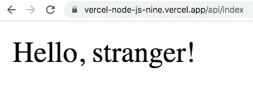

# 如何将 Node.js 无服务器函数部署到 Vercel

> 原文：<https://javascript.plainenglish.io/how-to-deploy-a-node-js-serverless-function-to-vercel-a0dc13cefa0e?source=collection_archive---------10----------------------->

## 开始使用无服务器功能


Photo by [Vlada Karpovich](https://www.pexels.com/@vlada-karpovich?utm_content=attributionCopyText&utm_medium=referral&utm_source=pexels) from [Pexels](https://www.pexels.com/photo/photo-of-man-using-computer-4050470/?utm_content=attributionCopyText&utm_medium=referral&utm_source=pexels)

Node.js 是一个开源的 JavaScript 运行时环境，可以在后端执行 JavaScript 代码。如果你是一名前端开发人员，想要探索后端开发，那么 Node.js 可以是一个很好的起点，因为你已经了解 JavaScript。

在本文中，您将了解如何将 Node.js 无服务器功能部署到 Vercel。Vercel 提供无服务器运行时，也称为功能即服务(FaaS)。无服务器功能的好处数不胜数，但最突出的一点是，您只在需要时才运行该功能。我们开始吧！

# 设置

在这篇文章中，我将使用 [GitHub](https://github.com/) 和 [Vercel](https://vercel.com/) 。我已经创建了一个 git 资源库，你可以从 [GitHub](https://github.com/lifeparticle/vercel-node.js) 中获得它，并将其与 Vercel 连接。

将代码下载到本地机器后，您可以在 **api** 文件夹中看到一个名为`index.js`的 JavaScript 文件。根据 Vercel 针对 Node.js 的[文档](https://vercel.com/docs/serverless-functions/supported-languages#node.js)，如果 api 目录中有一个 JavaScript 文件或 TypeScript 文件，包含一个默认的导出函数，那么 Vercel 会将其作为一个无服务器函数。

让我们来分解一下`index.js`文件的各个成分。

```
module.exports = (req, res) => {
   const name = req.query.name || 'stranger';
   res.status(200).send(`Hello, ${name}!`)
}
```

这里我们有一个 Node.js 函数。下面的代码在`req.query`中寻找一个名为`name`的键。如果键存在，变量`name`将包含`name`键的值，否则为`stranger`。最后，我将 HTTP 状态代码设置为 200，并返回字符串`Hello`，后面跟变量`name`和最后的`!`。你可以从[这里](https://vercel.com/docs/serverless-functions/supported-languages#advanced-node.js-usage)阅读更多关于高级 Node.js 用法的内容。

现在，让我们去 [Vercel](https://vercel.com/) 这样我们就可以[导入](https://vercel.com/import)我们的项目。


Click New Project

现在我将使用我的 git 存储库名称，即 **vercel-node.js** 。由于 vercel 找不到 git 存储库，我将点击**配置 GitHub App** 并添加 **vercel-node.js** ，以便 Vercel 可以访问它。添加存储库后，我可以从 Vercel 访问它。现在点击**导入**按钮。


Search and Import

现在，我将选择个人账户选项。选择 Vercel 示波器后，点击**继续**按钮。


Select and continue

最后，点击**部署**按钮。


Click Deploy

现在通过点击访问按钮访问您的无服务器功能。在这种情况下，我的无服务器函数的地址是由 Vercel 生成的[https://vercel-node-js-nine.vercel.app/](https://vercel-node-js-nine.vercel.app/)。我们需要在基本 URL 的末尾添加 **api/file_name** 来访问该函数。添加之后，我们有了一个看起来像 https://vercel-node-js-nine.vercel.app/api/index 的 URL。



No Query string vs. Query string

对于第一个[调用](https://vercel-node-js-nine.vercel.app/api/index)，我没有提供任何查询字符串。但是对于第二个[调用](https://vercel-node-js-nine.vercel.app/api/index?name=pineapple)，我已经提供了一个查询字符串。由于我已经将我的 GitHub 项目与 Vercel 链接起来，对主分支的任何更改都会触发生产部署。您可以选择不同的分支作为生产分支。为此，请遵循本[文档](https://vercel.com/docs/git#production-branch)。

# 结论

现在您知道如何将 Node.js 无服务器函数部署到 Vercel 了！去做些酷的东西吧！Vercel 使得部署 Node.js 函数变得非常容易，所以你不用担心基础设施的问题；相反，你可以专注于问题。编码快乐！