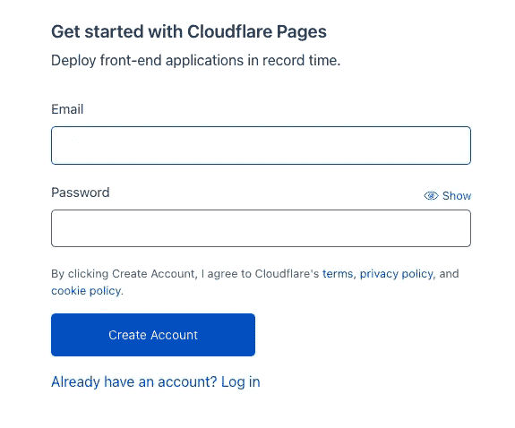
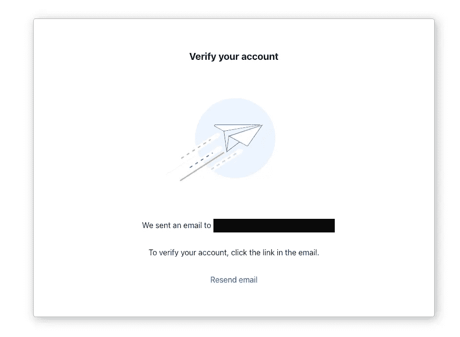
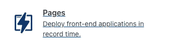
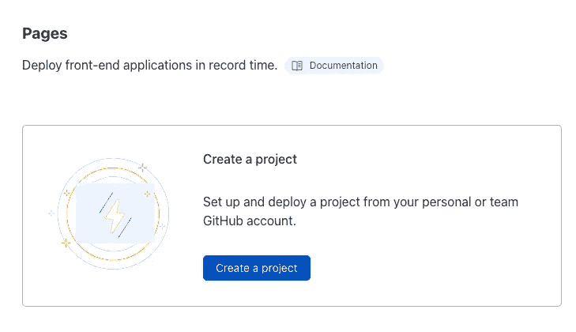
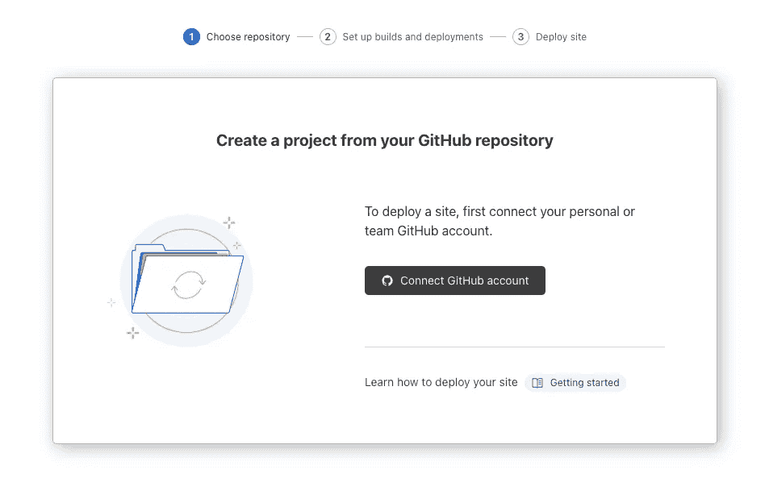
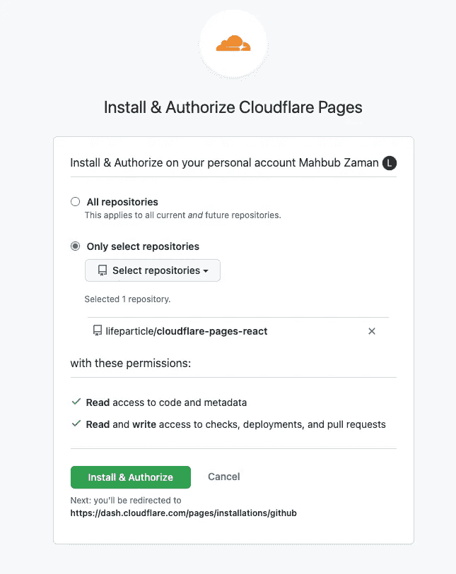
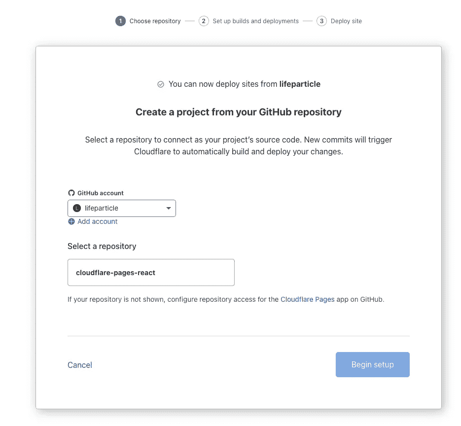
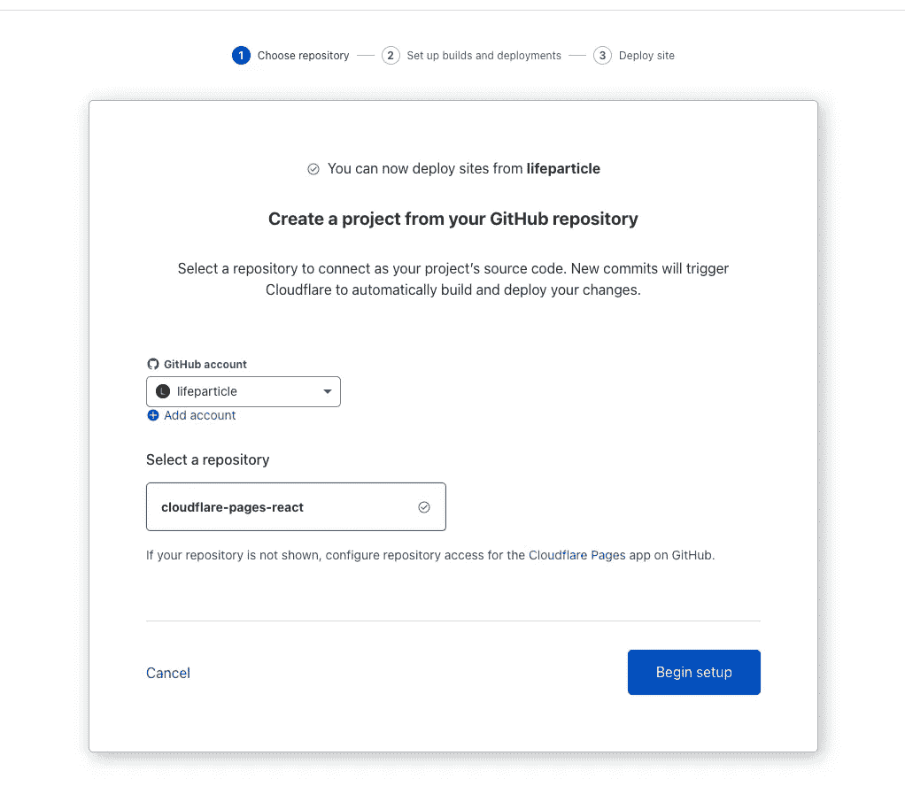
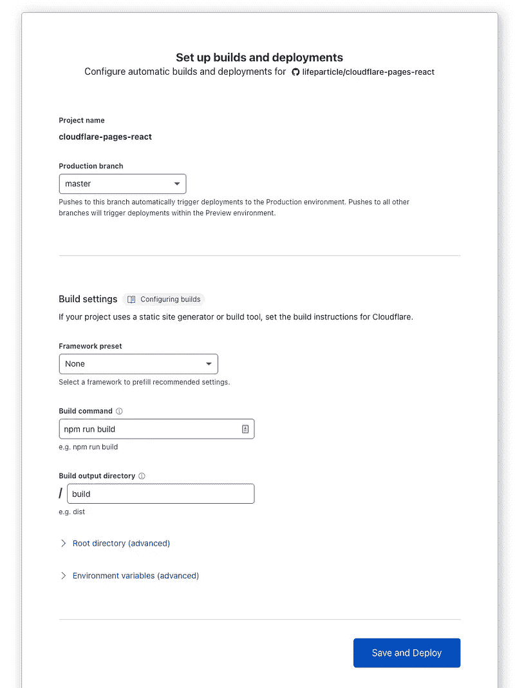
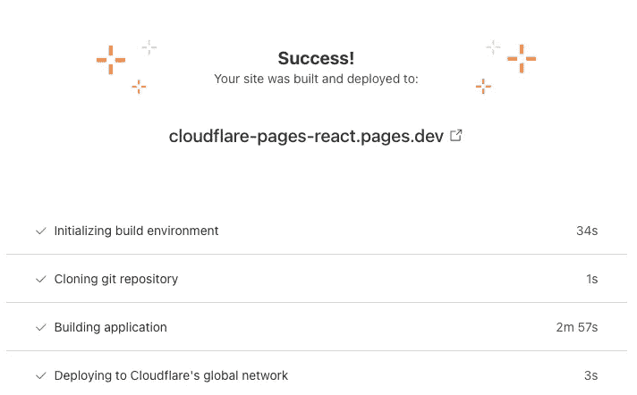

# 如何将 React 应用程序部署到 Cloudflare 页面

> 原文：<https://javascript.plainenglish.io/how-to-deploy-a-react-application-to-cloudflare-pages-e334466109c3?source=collection_archive---------11----------------------->

## 免费部署您的 React 应用

Photo by [Christian Wiediger](https://unsplash.com/@christianw?utm_source=medium&utm_medium=referral) on [Unsplash](https://unsplash.com?utm_source=medium&utm_medium=referral)

[Cloudflare Pages](https://pages.cloudflare.com/) 包含 git 集成、无限状态的高级协作、闪电般的性能以及使用 [Cloudflare Workers](https://workers.cloudflare.com/) 的无服务器功能。

在这篇文章中，我将向您展示如何将您的 React 应用程序从 GitHub 部署到这个 [JAMstack](https://jamstack.wtf/) 平台中。

# 设置

首先，我们需要创建一个 git 存储库，或者您也可以使用任何现有的 React 存储库。在这种情况下，我创建了一个新的回购协议，您可以从 [GitHub](https://github.com/lifeparticle/cloudflare-pages-react) 下载。

现在，如果您还没有帐户，请访问 [Cloudflare 页面](https://pages.cloudflare.com/)创建一个新帐户。我将向您展示创建帐户的步骤。首先，点击右上角的**注册**按钮。

Sign up

之后，填写邮箱和密码，点击**创建账户**按钮。您应该会看到以下屏幕，然后转到您的电子邮件帐户并单击验证链接。太好了，你现在应该可以访问[仪表盘](https://dash.cloudflare.com/)了。

Create and verify account

在仪表板上，点击位于右侧的**页面**。

Click pages

现在，点击**创建项目**按钮。在下一个屏幕上，我们需要连接我们的 GitHub 帐户。

在我的例子中，我选择了一个存储库，但是您可以访问所有或多个存储库。选择回购后，点击**安装&授权**按钮。现在，从下一个屏幕中选择存储库。

选择存储库后，点击**开始设置**按钮。这里我们必须填充构建设置。我选择了`master`作为生产分支，然后在**构建命令**选项下输入`npm run build`，在**构建输出目录**选项下输入`build`。最后，点击**保存并部署**按钮。

Select repo and set up builds and deployments

太棒了，现在应该需要一些时间来构建和部署站点。之后，您应该会看到一条成功消息，其中有一个[链接](https://cloudflare-pages-react.pages.dev/)到您的 React 应用程序！

Success

我们还可以部署其他网站，如 Next.js、Nuxt.js 等。您可以从 [Cloudflare 文档](https://developers.cloudflare.com/pages/framework-guides)中了解有关它们的更多信息。近年来，Jamstack 越来越受欢迎。我希望这篇文章能帮助你开始使用 Cloudflare 页面使用 Jamstack。编码快乐！

 [## 如何将 React 应用程序部署到 Netlify

### 在几分钟内部署您的 React 应用

javascript.plainenglish.io](/how-to-deploy-a-react-application-to-netlify-e120d2de2654) 

## 进一步阅读

 [## 如何构建可重用的 Cloudflare Worker 组件

### 生成和部署无服务器 Cloudflare worker 的过程非常简单:派生一个现有的 Cloudflare…

比特云](https://bit.cloud/blog/how-to-build-a-reusable-cloudflare-worker-component-l4bf0swo) 

*更多内容看* [***说白了。报名参加我们的***](https://plainenglish.io/) **[***免费周报***](http://newsletter.plainenglish.io/) *。关注我们关于*[***Twitter***](https://twitter.com/inPlainEngHQ)[***LinkedIn***](https://www.linkedin.com/company/inplainenglish/)*[***YouTube***](https://www.youtube.com/channel/UCtipWUghju290NWcn8jhyAw)***，以及****[***不和***](https://discord.gg/GtDtUAvyhW)**** ***对成长黑客感兴趣？检查出* [***电路***](https://circuit.ooo/) ***。*****