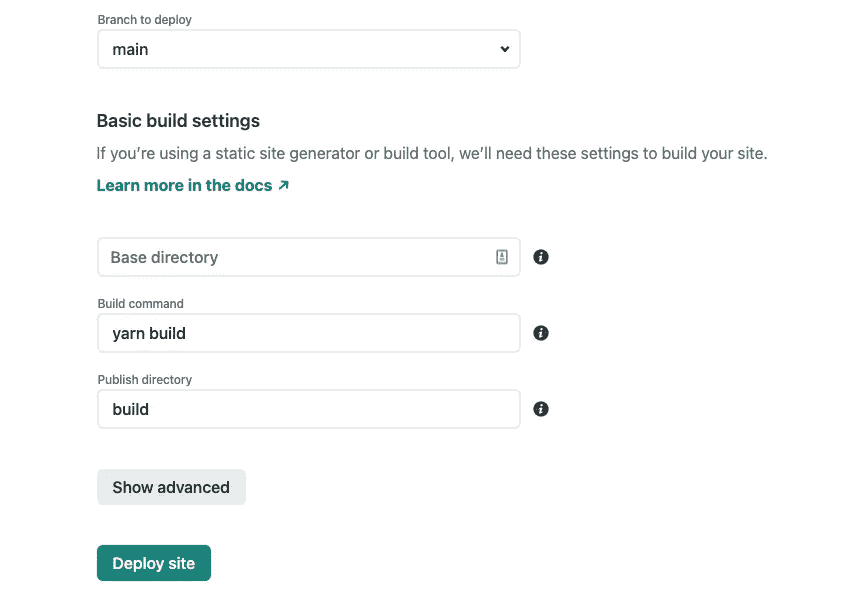

# 如何将 React 应用程序部署到 Netlify

> 原文：<https://javascript.plainenglish.io/how-to-deploy-a-react-application-to-netlify-e120d2de2654?source=collection_archive---------16----------------------->

## 在几分钟内部署您的 React 应用

Photo by [Nubelson Fernandes](https://unsplash.com/@nublson?utm_source=medium&utm_medium=referral) on [Unsplash](https://unsplash.com?utm_source=medium&utm_medium=referral)

React 是用于前端开发的最流行的开源 JavaScript 库之一。[脸书](https://opensource.fb.com/projects/)在 2013 年发布了这个项目。React 允许我们使用可重用的 UI 组件，使得维护和扩展 web 应用程序变得更加容易。

在这篇文章中，我将向您展示如何将 React 应用程序部署到 [Netlify](https://www.netlify.com/) 。Netlify 是一个允许我们从 Git 构建和部署站点的平台。此外，它还带有其他很酷的功能，如自定义域、HTTPS、部署预览、回滚，最重要的是，还有一个 [**免费**](https://www.netlify.com/pricing/) 层！

# 设置

对于这个帖子，我将使用 [GitHub](https://github.com/) 和 Netlify。首先，我们需要创建一个 git 存储库，这样我们就可以用 Netlify 连接它。

你可以从我为这篇文章创建的 GitHub 下载 git 资源库。现在，让我们从 Git 按钮点击 [**新站点，转到**](https://app.netlify.com/start) **[Netlify](https://app.netlify.com/) 创建一个新站点。**

Create a new site

现在，选择您更喜欢的 Git 提供者。就我而言，我选择了 GitHub。如果您看不到存储库，请单击**在 GitHib 上配置 Netlify 应用程序**链接。

Select the repository

选择存储库后，确保构建命令和发布目录字段类似于以下值。

Deploy site

最后，点击**部署站点**按钮。部署站点需要几分钟时间。部署后，您可以通过 Netlify 生成的 URL 访问它。就我而言，我的网址是[https://thirsty-stonebraker-77b897.netlify.app/](https://thirsty-stonebraker-77b897.netlify.app/)。

因为我们已经将 git repo 连接到 Netlify，所以对主分支的任何更改都将触发生产部署。

有许多方法可以使用 React 和 Netlify。例如，你可以用它来创建一个作品集网站。这里是 [React](https://reactjs.org/docs/getting-started.html) 和 [Netlify](https://docs.netlify.com/) 文档的官方链接。编码快乐！

*更多内容看*[***plain English . io***](http://plainenglish.io/)