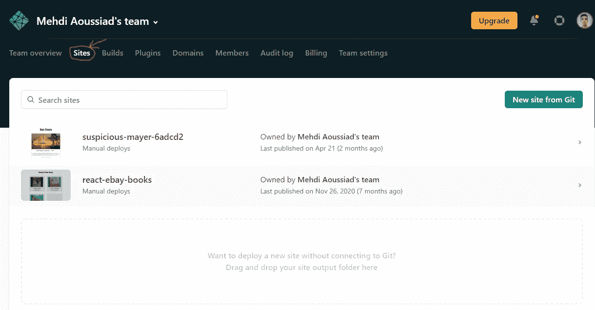
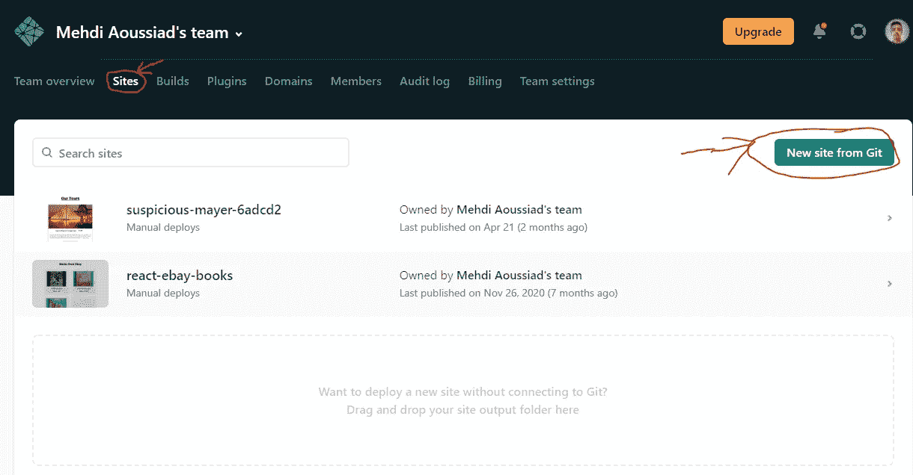

# 如何使用 Netlify 部署您的第一个静态网站

> 原文：<https://javascript.plainenglish.io/how-to-deploy-your-first-static-website-using-netlify-b87164633a94?source=collection_archive---------22----------------------->

## Netlify 使得部署静态网站和前端 web 应用程序变得更加容易。

Photo by [Kelly Sikkema](https://unsplash.com/@kellysikkema?utm_source=medium&utm_medium=referral) on [Unsplash](https://unsplash.com?utm_source=medium&utm_medium=referral)

Netlify 是目前免费部署静态网站的一个很好的解决方案。许多开发人员用 Netlify 托管他们的 web 项目，因为它更容易、更快。

Netlify 有很好的[文档](https://docs.netlify.com/)来帮助你部署和自动化现代 web 项目。然而，在本文中，我们将只了解如何将我们的第一个静态站点部署到 Netlify。我将向您展示两种方法。所以让我们开始吧。

# 1.使用拖放进行部署

将静态站点部署到 Netlify 的第一种方法是使用拖放选项。但在此之前，确保你去了[网络生活](https://www.netlify.com/)平台并创建了你的账户。如果你愿意，你也可以用你的 GitHub 账户登录。

登录您的帐户后，进入网站页面，如下图所示:

Capture by the author from [Netlify](https://www.netlify.com/).

之后，你所要做的就是使用你的鼠标拖拽你的项目文件夹。就是这样，他们会给你一个项目链接，你的网站就会上线。除此之外，如果您愿意，您还可以添加一个自定义域。

我建议部署一个缩小版的文件夹以获得更好的性能。

# 2.从 Git 部署

将静态站点部署到 Netlify 的另一个更好的方法是使用站点的 GitHub 存储库从 Git 进行部署。

我更喜欢这种方式，因为当你想在你的网站上更新一些东西时，你所要做的就是去你在 GitHub 上的仓库，修改你想要的东西。因此，Netlify 会自动选择您的存储库中的更改，并将它们应用到您的托管网站。

此外，请记住 GitHub 不是唯一的选择，如果您愿意，还可以使用 GitLab 或 Bitbucket 等替代品。

因此，为了在 Netlify 中从 Git 部署站点，您必须采取以下步骤:

1.  在 GitHub 或 GitLab 上为您的项目创建一个存储库。没关系，用你喜欢的任何平台。
2.  登录你的 Netlify 账户，点击“从 Git 新建网站”按钮。

Capture by the author from [Netlify](https://www.netlify.com/).

**3。选择您用来托管 Git 库的平台(GitHub 或 GitLab…)。**

4.选择项目的存储库，然后部署站点。

就是这样，现在你的网站将是活的，你可以添加一个自定义域，如果你想的话。现在，无论何时你想在网站上更新什么，只要去仓库并在那里更新就可以了。因此，更改将自动添加到 Netlify 中。

此外，如果你想避免任何可能的错误在您的网站上。如果你配置你的构建会更好。例如，如果您将 React 与 create-react-app 一起使用，您将必须更改文件`package.json`中的构建命令，特别是在脚本对象中。

所以你需要把脚本从`"build": "react-scripts build"`改成`"build": "CI= react-scripts build"`。

你可以阅读配置[文档](https://docs.netlify.com/configure-builds/common-configurations/)来了解这取决于你使用什么技术。

# 结论

如您所见，这是向 Netlify 部署静态网站或前端 web 应用程序的两种方式。就我个人而言，我更喜欢第二种，因为它对我来说更有效率。

感谢您阅读这篇文章。希望你觉得有用。

**更多阅读**

 [## 你需要避免的 5 个常见 CSS 错误

### 避免这些 CSS 错误来改进您的代码和样式。

javascript.plainenglish.io](/5-common-css-mistakes-that-you-need-to-avoid-53e51ed98d04) 

*更多内容请看*[***plain English . io***](http://plainenglish.io)