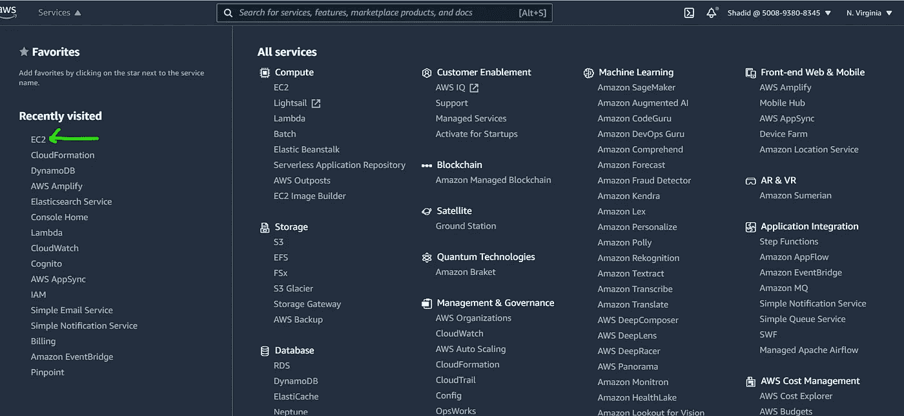
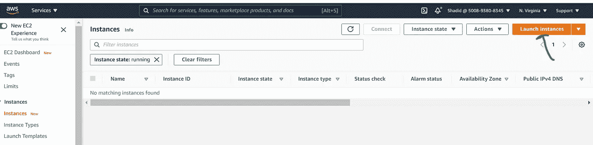
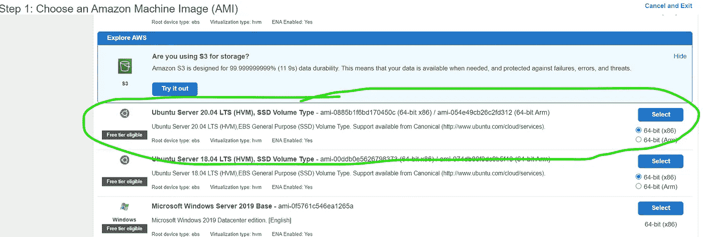
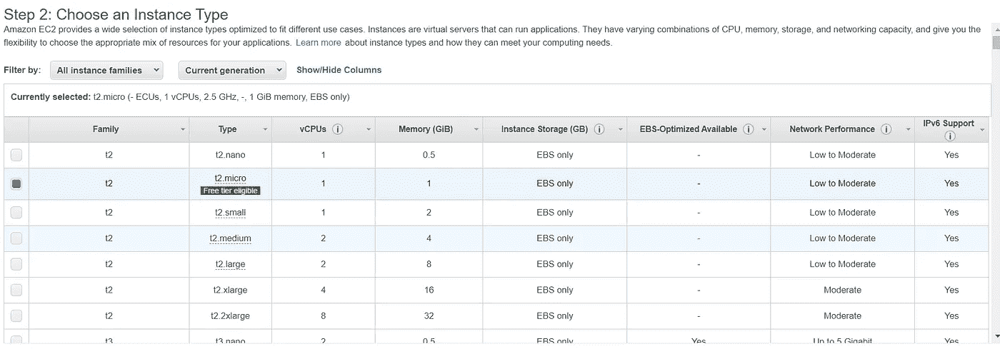
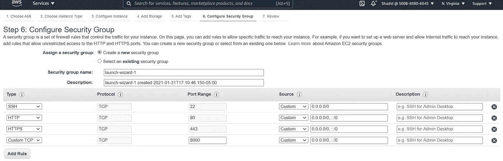
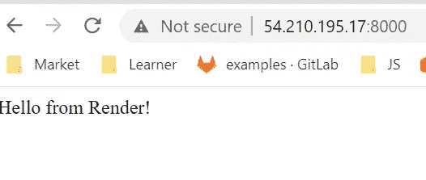
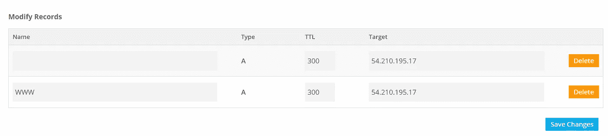
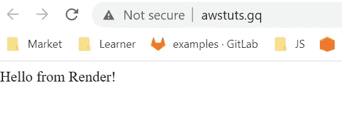
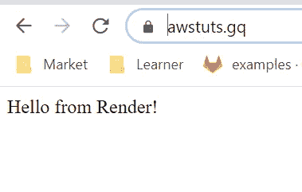

# 如何使用 NGINX 和 SSL 在 AWS 上部署 Node.js 应用程序

> 原文：<https://javascript.plainenglish.io/how-to-deploy-your-node-js-application-on-aws-with-nginx-ssl-and-custom-domain-6c64e0841cfb?source=collection_archive---------5----------------------->


Photo by [Bill Jelen](https://unsplash.com/@billjelen?utm_source=unsplash&utm_medium=referral&utm_content=creditCopyText) on [Unsplash](https://unsplash.com/s/photos/spacex?utm_source=unsplash&utm_medium=referral&utm_content=creditCopyText)

在本教程中，我们将简要回顾在 **AWS EC2 实例**上部署**Node.js/Express**应用程序的过程。让我们面对现实吧，服务器配置和应用程序部署可能是一项繁琐的任务。作为一名开发人员，你可能不知道网络安全的每一个细节，或者反向代理和负载平衡是如何工作的。第一次部署应用程序时，我浏览了大量关于堆栈溢出的信息和各种博客帖子。如果有一个循序渐进的指南来部署您的应用程序不是很好吗？我问自己。这个问题让我写了这篇博文。

在本文中，我们将涵盖:

1.  EC2 实例的配置(即网络配置、端口等)
2.  为反向代理安装和配置 **Nginx**
3.  将 EC2 指向自定义域(可选)
4.  使用 **LetsEncrypt SSL** 保护我们的网站

如果您正在使用其他云提供商，如 Azure、Google Cloud Platform、IBM 或 Digital ocean，您也可以遵循这些步骤。

# EC2 实例的配置

首先，我们需要创建一个虚拟机。为此，我们将转到 AWS 控制台，并从服务中选择 EC2，如下图所示。



pick EC2 from AWS console

这将带您到 EC2 仪表板。在这里，您可以通过单击“启动实例”按钮来选择创建一个新的 EC2 实例。



您可以选择在您的实例上运行哪个操作系统。我将使用 ubuntu 20.04。



接下来，系统会提示您选择实例类型。这里我将使用免费的 **t2 微**实例。



您可以接受步骤 3、4 和 5 的默认配置。在步骤 6 中，您可以选择安全组规则。这里我将选择 SSH、HTTP 和 HTTPS。我也选择自定义 TCP 端口 8000。我们将在 8000 端口上运行我们的节点应用程序。



如果我们愿意，我们可以在以后更改这些配置，所以如果您搞砸了，请不要担心😅。

创建实例后，继续 ssh 到您的实例中。我们首先需要设置 Node.js 本身。我将运行以下命令来获取实例中的节点。

```
curl -sL https://deb.nodesource.com/setup_12.x | sudo -E bash -
sudo apt install nodejs

node --version
```

一旦我们完成了节点设置，我们就可以克隆我们的存储库并在我们的云实例中运行代码。

```
git clone <project_repo>
cd yourproject
npm install
npm start (or whatever your start command)
# stop app
ctrl+C
```

我正在端口`8000`运行我的应用程序。我们可以通过访问公共 ip 地址和端口来测试我们的应用程序。所以对我来说是`[*http://54.210.195.17:8000/*](http://54.210.195.17:8000/)*`。*

接下来，我们将安装一个名为`pm2`的库，这将保持我们的节点应用程序在后台运行。运行以下命令，用 pm2 启动应用程序。

```
sudo npm i pm2 -g
pm2 start app 
```

这将启动我们的应用程序。我们可以再次访问带有端口的 ip 地址，并将看到应用程序正在运行。



running in browser

# 设置 NGNIX 和反向代理

接下来，我们将设置 **NGNIX** 并创建一个反向代理。这将使用默认端口 80 重定向我们的应用程序。我们还将通过 NGNIX 服务器添加 SSL。

我们运行以下命令来安装 **NGNIX:**

```
sudo apt install nginx
```

一旦安装了 NGNIX，我们就可以配置它来设置一个反向代理，并将我们的应用程序重定向到端口 80。为此，我们必须编辑以下文件

`sudo nano **/etc/nginx/sites-available/default**`

```
server_name yourdomain.com www.yourdomain.com;

    location / {
        proxy_pass [http://localhost:8000;](http://localhost:8000;) # your app's port
        proxy_http_version 1.1;
        proxy_set_header Upgrade $http_upgrade;
        proxy_set_header Connection 'upgrade';
        proxy_set_header Host $host;
        proxy_cache_bypass $http_upgrade;
    }
```

在 location 部分进行如上所示的更改。现在，如果您正在使用自定义域名，请到您的 DNS 提供商处添加一个`**A Record**` ，如下所示。



A record

在目标部分，我们将添加实例的公共 IP 地址。

完成后，跳回你的终端，重启 NGNIX。

```
# Restart NGINX
sudo service nginx restart
```

您需要给自定义域一些时间来传播。一段时间后，您可以进入您的自定义域，并看到应用程序运行。



# 使用 **SSL 加密保护我们的网站**

最后，这里剩下的唯一任务是用 SSL 加密来保护我们的 web 服务器。我们可以用 **LetsEncrypt** 库很容易地做到这一点。

首先，我们通过运行以下命令安装到 **certbot** 包

```
sudo add-apt-repository ppa:certbot/certbot
sudo apt-get update
sudo apt-get install python3-certbot-nginx
```

安装完成后，我们将使用 certbot cli 为我们生成一个 SSL 证书。运行以下命令，并在提示生成 SSL 证书时提供您的电子邮件信息。

`sudo certbot --nginx -d yourdomain.com -d [www.yourdomain.com](http://www.yourdomain.com)`

生成证书后，您应该能够通过 ***https 连接到您的应用程序。***



就是这样。现在，您有了一个在 EC2 实例中运行的安全 web 应用程序。👏