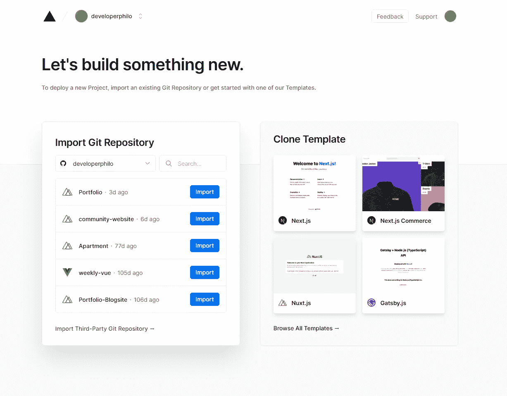
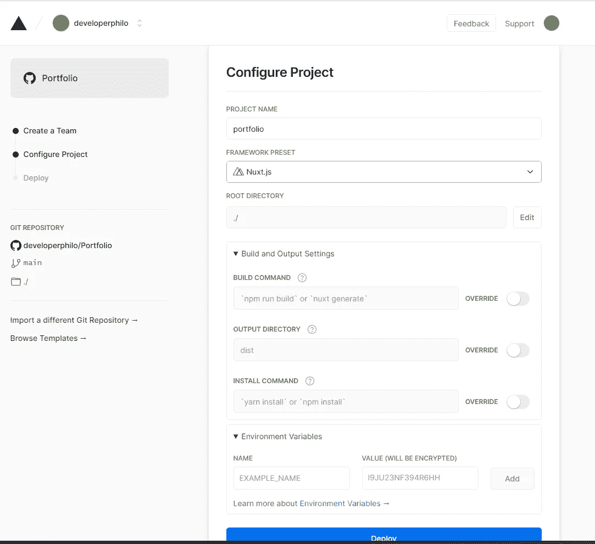
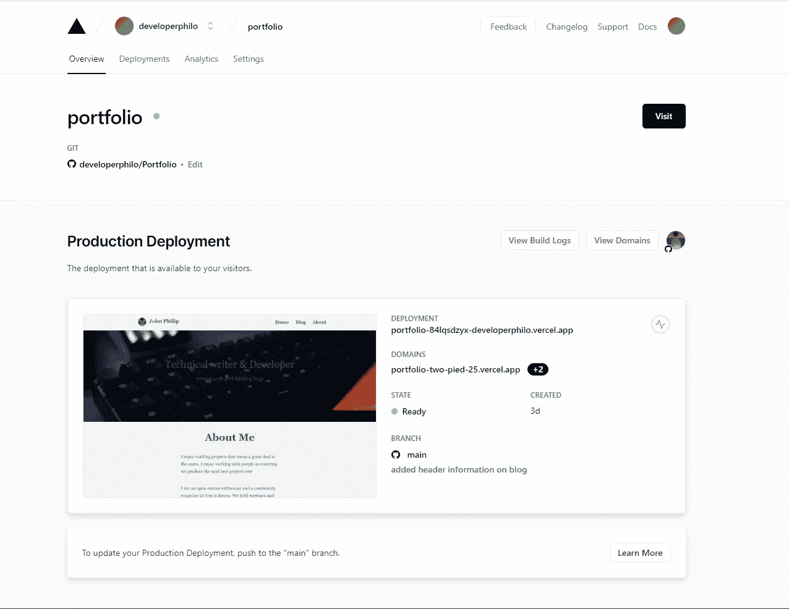

# 如何用 Vercel 部署 Nuxt.js 应用程序

> 原文：<https://javascript.plainenglish.io/how-to-deploy-your-nuxt-js-application-with-vercel-9501cc858c67?source=collection_archive---------10----------------------->

## 使用 Vercel 部署 Nuxt.js 应用程序的分步指南。

Photo by [SpaceX](https://unsplash.com/@spacex?utm_source=medium&utm_medium=referral) on [Unsplash](https://unsplash.com?utm_source=medium&utm_medium=referral)

Vercel 是一个类似于 Netlify 的部署平台。它使您能够根据您一直在使用的首选堆栈来部署应用程序。

Vercel 将最好的开发人员体验与对最终用户性能的专注结合起来。

Vercel 减少了您配置部署所需的工作，并且它直接从您的 GitHub 库部署您的项目。

在本文中，我们将研究如何使用 Vercel 部署 Nuxt.js 应用程序。

如果你不太清楚 Nuxt.js 是什么？Nuxt.js 是一个完全建立在 Vue.js JavaScript 框架之上的框架。

它有很多好处，比如在服务器端渲染之间的选择，改进的 SEO 以及其他好处。

如果你想深入研究 Nuxt.js，这里有一篇我写回来的文章，探讨了 Nuxt.js 的基础知识并帮助你快速入门。

 [## Nuxt 入门

### Nuxtjs 及其架构入门指南

javascript.plainenglish.io](/getting-started-with-nuxt-4652bc83ddc6) 

## **先决条件**

*   要在 GitHub 存储库中部署的项目。
*   韦尔塞尔账户

## **创建一个 Vercel 账户**

要使用 Vercel 部署您的项目，您需要拥有一个 Vercel 帐户。

同样，你可以通过使用你的 GitHub 帐户注册，将你的 GitHub 帐户直接链接到 Vercel。

Screenshot by Author

Vercel 也接受一些其他版本控制平台，如 GitLab 和 Bitbucket。登录后，您将看到一个类似于下图所示的控制面板。

Vercel Dahsboard- Snapshot by Author

从最新存储库的下拉列表中，您可以选择想要用 Vercel 部署的 Nuxt.js 项目。

对于我们这里的例子，我们将部署用 Nuxt.js 构建的 ***投资组合*** 存储库

接下来我们需要做的是配置 Vercel，以便它可以构建我们的应用程序并部署我们的项目。

如果您的项目是用 Nuxt.js 构建的，Vercel 会自动检测到这一点，并分配必要的构建命令。

Deploy Dashboard- Snapshot by Author

在仪表板上，您还可以提供必要的环境变量，以便在您的项目中使用，以防您的应用程序使用一些需要验证的数据。

接下来，您只需要单击 deploy 按钮，让 Vercel 为您完成这项工作。

Vercel 将为您构建应用程序并进行部署。您还将获得一些链接来预览您已经部署的项目。

Deployed Vercel Dashboards — Snapshot by Author

就是这样。很简单。

## **结论**

Vercel 使您轻松部署项目变得很容易，为您节省了为您配置一切的漫长且有时充满压力的时间。

感谢你花时间通读这篇文章，如果你觉得它有帮助，如果你与他人分享它，对我来说意义重大。

## **更多内容:**

 [## 如何在 Vue.js 中使用插槽

### 正确使用插槽—用一个例子解释。

javascript.plainenglish.io](/how-to-use-slots-in-vue-js-f509eec1fb39)  [## 作为软件开发人员，如何让你的生产力翻倍

### 根据这些建议，保持你的工作效率。

javascript.plainenglish.io](/how-to-double-your-productivity-as-a-software-developer-1431b69869b3) 

*更多内容看*[***plain English . io***](http://plainenglish.io/)