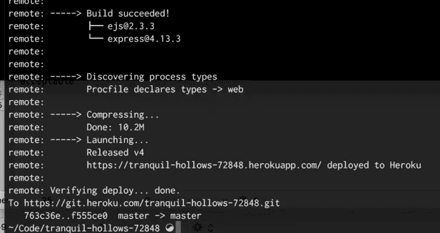

# 如何将 RESTful API 应用程序部署到 Heroku

> 原文：<https://javascript.plainenglish.io/how-to-deploy-your-restful-api-application-to-heroku-4d738226012c?source=collection_archive---------6----------------------->

## 了解如何将 REST API 部署到 Heroku。


Image by Author

Heroku 和其他平台一样，为我们的应用程序提供后端托管。根据您的偏好，他们还提供资源有限的免费层。

如果你想建立一个全功能的应用程序，那么建议加入他们的 pro-tier 付费计划。它们通过易于使用的命令行界面(CLI)提供了令人惊叹的用户体验。

从 CLI 中，我们可以将我们的更改推送到服务器，一切都将被捆绑在一起并为我们构建。这非常有效，因为您需要配置和担心一些事情。

在本文中，我们将了解如何从 CLI 向 Heroku 平台部署一个简单的 Expressjs 应用程序。

## **入门**

首先，我们需要安装 Heroku 命令行界面 CLI。要下载 CLI，您需要在终端上运行以下命令。根据您喜欢的软件包管理器选择一个。

**NPM**

```
npm install -g heroku
```

**纱线**

```
yarn add -g heroku
```

***-g*** 标志将确保您在系统上全局安装该命令。

成功安装 CLI 后，您需要导航到应用程序实例的根目录，并且需要登录到您的 Heroku 帐户。如果您还没有帐户，请在此处创建一个帐户，然后回来。

现在运行以下命令，输入您的电子邮件和密码登录到您的帐户。

```
heroku login
```

您将被提示登录您的 Heroku 帐户，输入您的电子邮件和密码。成功登录后，现在我们可以将我们的更改推送到 Heroku 服务器，它将为我们构建一切。

在应用程序的根目录下，创建一个文件，并将其命名为 ***Proctfile*** 。该文件将是一个 Heroku 配置文件，并且应该没有扩展名。

现在打开 ***Proctfile*** 并输入以下信息。

```
web: node src.index.js
```

这将确保运行您的基本条目文件。记住我的文件在 src 目录中，如果你的主入口文件在根目录中，你只需要提供它。

```
web: node index.js
```

现在我们可以用 git 将我们的应用程序推送到 GitHub，也可以将它推送到我们的 Heroku 帐户。

**创建您的 Heroku 应用程序**

现在我们已经有了 Heroku 并登录了我们的帐户，是时候创建我们的应用程序并给它命名了。

运行下面显示的命令来创建 Heroku 应用程序。系统将提示您输入应用程序名称。

```
heroku create
```

现在让我们继续推动我们的更改被 git 跟踪

```
//add all changes to files be tracked by git
git add .
```

提交您的更改

```
//make your initial commit
git commit -m “initial commit”
```

推动你的改变

```
git push heroku main
```

取决于你是使用 ***主*** 还是 ***主*** ，你可以提供，以避免冲突。这也会将您的更改推送到 Heroku 帐户并部署您的更改。

检查终端消息，查看关于如何部署应用程序的构建信息。成功部署后，您的终端将与下面的类似。



Successful Deploy with Heroku-Image by TrailHead.

## **结论**

Heroku 使在终端上部署应用程序变得更加容易，并且当您在构建 API 时，如果您希望其他人使用它，它确实非常有效。

感谢您花时间阅读这篇文章。

## **更读着**

[](/top-6-api-testing-tools-you-should-check-out-aada25913f1b) [## 你应该检查的 6 大 API 测试工具

### 你应该检查的 API 测试工具

javascript.plainenglish.io](/top-6-api-testing-tools-you-should-check-out-aada25913f1b) [](/top-5-javascript-animation-libraries-for-your-next-project-580d47827f03) [## 下一个项目的前 5 个 JavaScript 动画库

### 在你的下一个动画项目中使用的最佳 JavaScript 库

javascript.plainenglish.io](/top-5-javascript-animation-libraries-for-your-next-project-580d47827f03) 

*更多内容尽在*[***plain English . io***](http://plainenglish.io/)