# 如何将网页部署到 Firebase

> 原文：<https://javascript.plainenglish.io/how-to-deploy-your-webpage-to-firebase-7c6859ddce7b?source=collection_archive---------13----------------------->

# 可选先决条件

1.  结节

# 我们将遵循一些步骤来托管我们的代码到 firebase。

1.  安装消防基础工具
2.  使用您的 Google 帐户登录
3.  在项目目录中初始化 firebase
4.  最终部署

# 1.安装消防基础工具

我将使用 npm 来安装 firebase 工具，因为现在大多数开发人员都使用 node js，他们肯定会在自己的机器上安装 npm 和 node。

`npm i firebase-tools -g`

您必须在您的机器上全局安装 firebase，这样您就可以在其他项目上使用它，并且可以在您的机器周围全局使用它。

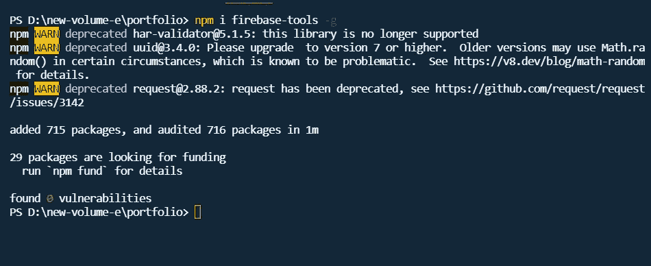

对于除 js 之外的 PHP 和开发者，我可以通过提供文档链接来帮助你。您可以学习如何在没有 npm 的机器上安装 firebase 工具。

【google.com 开始使用 Firebase 主机

# 2.使用您的 Google 帐户登录

我希望您已经在您的机器上成功安装了 firebase-tools。让我们通过登录我们的谷歌帐户继续前进。Firebase 是谷歌的一部分，你肯定需要一个谷歌帐户才能继续前进。

`firebase login`

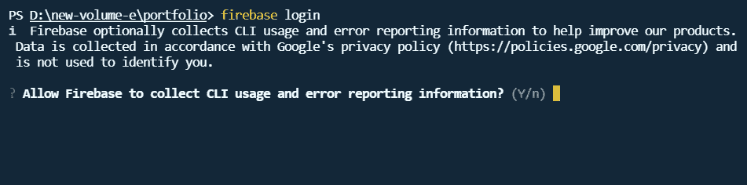

您将被要求允许 firebase 使用您的命令行。只要输入`Y`。

接受后，您将被重定向到 Google 登录页面。选择您想要用于 firebase 的邮件 id。

一个成功的流程应该是这样的。

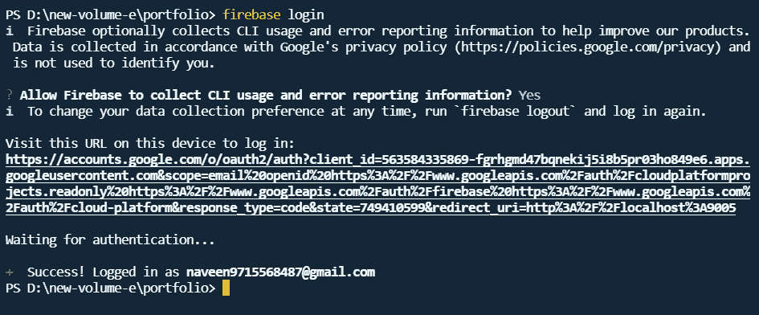

# 3.在项目目录中初始化 firebase

Firebase 工具已经安装，我们也用我们的谷歌帐户登录。下一步是初始化项目的 firebase。在项目目录中打开所需的命令行或终端，并输入下面的命令。

`firebase init`

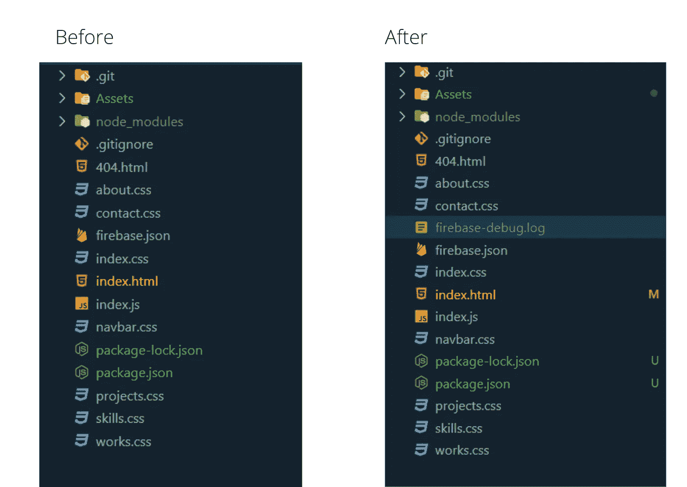

您可以清楚地看到，在该命令之后，创建了两个文件。一个是 firebase-debug.log，另一个是 firebase.json，这个 firebase.json 类似于 package.json，包含项目的详细信息，而 firebase.json 包含部署目录和与 firebase 相关的内容等详细信息。

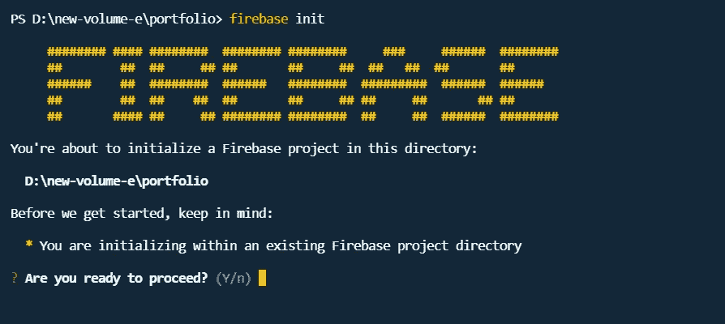

输入 Y 继续。在下一步中，您将被询问 firebase 中您要使用的特性。

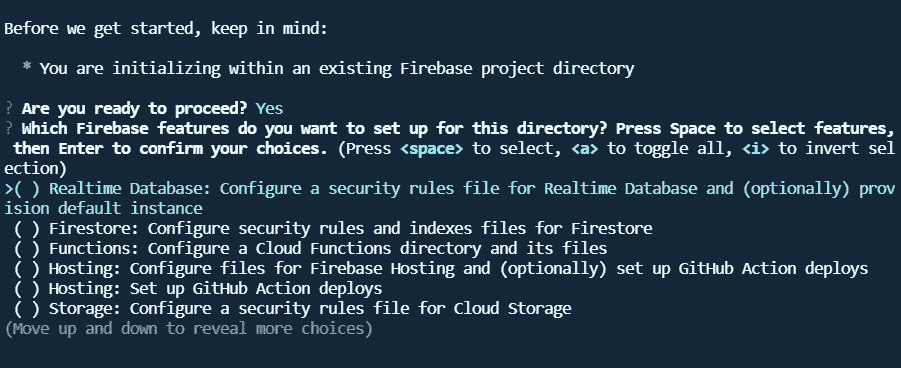

在这里，我们将使用 firebase 仅用于托管，所以使用箭头键移动光标到托管。现在，我们只从本地目录部署页面，而不使用 GitHub 自动部署。如果你想知道如何使用 GitHub auto deployments，就评论吧。

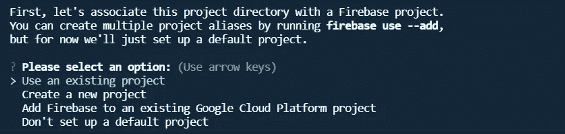

如果您已经使用 firebase 网站创建了一个 Firebase 项目，请选择“使用现有项目”。否则，请选择“创建新项目”

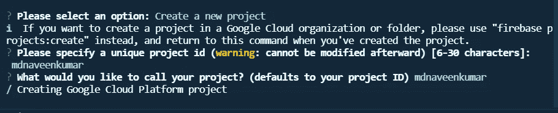

提供有效的项目 id(注意:它将包含在您的 URL 中)。所以要做相应的计划。接下来，输入项目名称，您可以随意命名。

在下一步中，将要求您提供目录。将只托管目录中的文件。当您使用任何 web 包时，您可以构建您的代码，并可以选择您的构建目录(用于 React、Vue 等)。但是这里我只是存放我的 HTML 代码。所以我用了“/”。斜线代表当前目录。

如果您在工作目录中有一个构建文件夹。

`/build`或简称为`build`

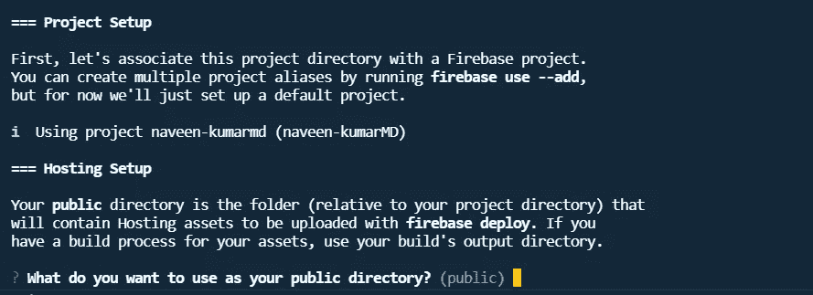

选择目录后，根据您的项目回答以下问题。

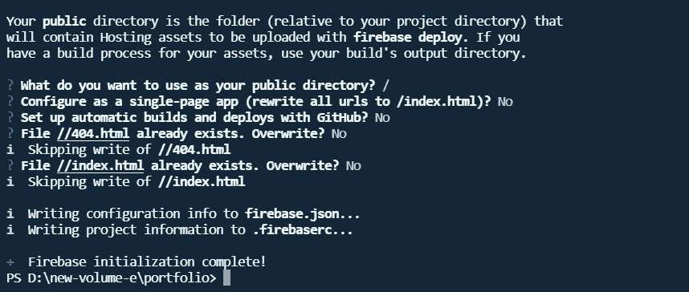

初始化成功。让我们部署它。

# 4.最终部署

`firebase deploy`

输入上面的命令，神奇的事情就会发生。坐在你的沙发上，听一首歌，等待它结束。

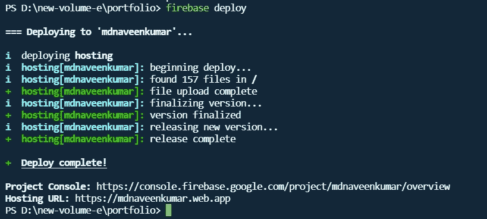

主机网址会给你。对我来说是的

[naveen Kumar MD(mdnaveen Kumar . web . app)](https://mdnaveenkumar.web.app/)

感谢您的阅读。如果你觉得这很有用，请在评论中告诉我。并关注未来的更多内容。

*更多内容请看*[***plain English . io***](http://plainenglish.io)