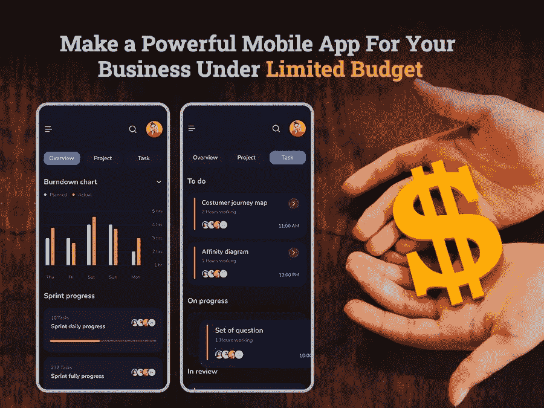

# 如何在有限的预算下开发一款手机 App？

> 原文：<https://javascript.plainenglish.io/how-to-develop-a-mobile-app-under-limited-budget-b837a67ec149?source=collection_archive---------11----------------------->

Image Source: Author

移动应用属于行业巨头或行业领先品牌的日子已经一去不复返了。随着预计 2023 年产生 9350 亿美元的收入，移动应用程序开发已经成为实体企业蓬勃发展的行业。

事实上，随着数字化浪潮的日益高涨，开发一款手机 app 已经成为商家的迫切需求。然而，当涉及到将您的业务迁移到在线平台时，应用程序开发预算总是一个严重的问题。因此，如果你正在寻找策略来开发一款移动应用，而又不需要倾家荡产，那么你就来对地方了。

根据调查报告，移动应用程序开发的平均成本从 3.7 万美元到 7 万美元不等，最高可达 10 万美元以上。另一方面，有移动应用程序开发公司提供为你开发一个 10，000 美元到 20，000 美元+之间的应用程序。

> 如果你注意到，这些数字之间有一个巨大的差距。

所有这些变化背后的简单原因是应用程序开发过程复杂而耗时，尽管它需要更高的预算。尽管如此，大多数公司认为在严格预算下生产的产品注定会失败。但那是神话！

说实话，你只需要密切关注一些策略，它们可以帮助你在不牺牲质量的情况下开发一个预算内的应用程序。

> 所以，让我们直接进入帮助你实现梦想应用的策略，而不需要倾家荡产。

## **1。了解你的应用开发目标**

当计算应用程序开发成本时，它直接与开发团队投入项目的小时数同步。因此，如果你任命了一个应用程序开发团队，却不知道你为什么要开发一个应用程序，你的竞争对手是谁，或者你的目标市场是什么，那么你的团队肯定需要在项目之间做出重大改变。最终，他们不得不花费比平均开发时间更长的时间。

> **解决方案:**因此，在你为你潜在的应用程序创建预算之前，决定它的功能集、项目的实际时间表和你需要的服务是很重要的。

简单、高效、快捷的方法是获得这些问题的答案:

*   谁将是您的最终用户？
*   谁是市场领导者？
*   *你的用户下载使用你的 app 应该做什么？*
*   *你的应用程序的独特卖点是什么？*
*   *你的应用提供了哪些特殊的功能和特性？*

> **对你的应用目标有一个清晰的愿景的好处是:**

*   *你将清楚地了解要提供的特性和功能。*
*   *保持开发过程简单、快速、容易。*
*   *让您了解自己想要哪种类型的应用。*
*   *让您创造更好的营销策略。*
*   *创造更好的货币化策略。*

## **2 .为项目确定正确的定价模式**

一旦你设定了目标，你就需要决定你的移动应用开发项目的预算。所以在你雇佣任何 [**移动应用开发公司**](https://www.xicom.ae/services/mobile-app-development/) 之前，要确定你是在寻找固定定价模式还是小时费率？最终决定将在很大程度上取决于项目的范围、复杂性和要求。

当您有一个应用程序想法，并且只想要一个团队通过减少花费时间来帮助您将其转化为解决方案时，灵活的参与模式就足够了。但是，如果您的预算有限，并且想雇佣一家能够处理端到端开发周期的应用开发公司，那么采用固定定价模式是值得的。这无疑是一种节省预算的潜在方法。然而，这个模型的缺点是它对项目的限制。

## **3 .永远不要急于构建成熟的应用程序**

根据开发成本和用户需求对每个功能进行优先排序是进行应用开发过程的最佳方式。因此，与其直接进入雇佣应用开发公司的过程，不如考虑 MVP。

当您的目标是降低应用程序开发成本时，选择最小可行产品(MVP)而不是匆忙开发一个成熟的应用程序总是有意义的。这一策略将有助于公司推出具有一套基本功能的应用程序，这些功能足以为您的应用程序添加所有必要的功能，并使您能够瞄准您的受众。

为了确保你的 MVP 概念能在真正的市场上有影响力地推广，最好先定义包含一些关键特性的功能。确保您 [**雇佣了一个能够理解您的需求并能将它们转化为完美解决方案的移动应用开发者**](https://www.xicom.ae/services/mobile-app-developers/) 。引入 MVP 应用程序将使您能够收集用户反馈，准确估计产品的市场需求，以最小的投资验证应用程序开发的完整想法。

一旦您评估了市场中最重要的分析，并在实际市场中测试了一个应用程序，那么您就应该使用高级功能集来扩展您的应用程序。基本上，MVP 消除了在开始时花费过多投资的风险，节省了开发时间和资源。

## **4。精确选择平台来启动您的应用程序**

无论你是选择 Android、iOS、可穿戴设备还是桌面应用程序开发项目，都要确保所选择的平台被广泛的目标受众所使用。

为了做出明智的决定，建议选择移动应用程序开发解决方案，因为技术团队会进行适当的市场研究，以评估每个平台的所有参数，并使您能够做出明智的决定。通过利用技术团队的专业知识，您可以更好地了解哪个平台非常适合您的目标受众，并帮助您保持构建应用程序的平均成本较低。

> **通常情况下，你有三个选择目标:**

**安卓:** [根据市场调查](https://leftronic.com/blog/android-vs-ios-market-share/#:~:text=Google%20Android%20and%20Apple%20iOS,share%20in%202019%20is%2022.17%25.&text=Between%202012%20and%202019%2C%20the,smartphone%20users%20grew%20by%2020%25.)，2022 年安卓的市场份额将达到 87%。Android 占据着最大的市场份额，预计未来其用户基数将超过 iOS。由于它提供了一个简单的应用程序批准过程，因此应用程序拒绝的范围较小。但是应用程序开发的成本主要取决于所选择的功能和业务需求。

**iOS:** 由于 iOS 在欧洲和美国市场占据着主导地位，并提供了付费能力更高的用户群，如果你的目标是这些市场中的任何一个，那么雇佣一名 iOS 应用开发者都是值得的。

**混合应用:**当你预算不足，想在一个预算内同时开发两个平台时，那么 [**雇佣一个跨平台应用开发者**](https://www.xicom.ae/services/hire-cross-platform-app-developers/) 。混合框架可以在不同的平台上以不同的集成方式无缝工作。通过使用相同的代码库，开发人员可以以比构建原生应用程序低 40%的价格为多个平台构建应用程序。最流行的混合应用程序开发平台是 React Native、Flutter、PhoneGap 等等。

## **5。保持你的应用简单、独特和创新**

你对优步、Instagram、脸书或塔拉巴特等应用程序印象深刻吗？想要建立一个像这些领先的应用程序一样的应用程序吗？在你花费大量金钱在应用程序开发过程之前，确保你仔细定义了应用程序的特性和功能。

毫无疑问，构建一个现代化的应用程序给你带来了一个机会，可以添加更多的特性来提供最佳的用户体验。然而，说实话，这些特性并不一定意味着更好的功能。另一方面，大量的特性和功能将提高复杂性，并为应用程序添加大量元素，用户会对此感到困惑，并大幅增加应用程序开发的成本。

不要创建一个多功能的应用程序或包含一个复杂界面的解决方案，要确保你的主要精力放在应用程序的关键特征上，帮助你从竞争对手中脱颖而出。包括独特、直观和简单的功能，这些功能可以以最低的成本开发，并使您能够满足最终用户的需求。

## **6。别忘了 App 维护费用**

应用程序开发流程不仅限于开发阶段，因为部署和维护也是预算的主要部分，你不能跳过。对于许多计划应用程序开发解决方案的公司来说，部署和维护成本经常被忽略，因为他们的主要焦点是计算开发阶段获得的成本。

然而，留出应用程序维护的预算是很重要的，因为不时升级你的应用程序以使其平稳运行是很重要的。

所以当你在为制作一个应用程序或者 [**雇佣应用程序开发人员**](https://www.xicom.ae/solutions/hire-developers/) 制定预算时，确保你知道应用程序维护的成本，这样你就可以相应地制定预算。

## **7。为您的项目带来最好的设计和开发团队**

无论你为这个项目选择了一个多么聪明的应用程序想法，也无论你选择集成什么样的功能，应用程序的成功主要取决于应用程序设计和开发公司投入到项目中的技能、天赋和能力。

但这并不意味着你需要为你的项目聘请最昂贵的专家。你所需要的就是雇佣那些拥有广泛技能的软件开发人员，他们能有效地相互交流，最重要的是，理解你分配给他们的任务。

此外，当你雇佣一个开发团队时，你需要深入评估开发人员的成本，因为它因地点不同而有很大差异。

根据市场调查报告，美国和欧洲是雇用应用程序开发人员最昂贵的地方，起始成本为每小时 100 至 150 美元，而印度和阿联酋是雇用预算友好型开发人员的首选地点，每小时成本为 15 至 18 美元以上。

在选择项目的设计和开发团队时评估质量和价格，这有助于您从最低的预算中获得最佳收益。

# **总结**

移动应用开发解决方案已经成为该镇的一个时髦词。随着新兴技术、工具和框架的出现，开发移动应用不再是一项艰巨的任务。通过雇佣顶级的 [**移动应用开发公司**](https://www.xicom.ae/services/mobile-app-development/) ，你可以很容易地为你的品牌建立一个数字化的存在。但真正的战斗是如何在不影响质量的情况下节省应用开发成本。

希望这个博客能回答你的问题，分享一些帮助你制作一个经济高效的移动应用的最佳策略。

*更内容于* [*通俗易懂*](http://plainenglish.io/)