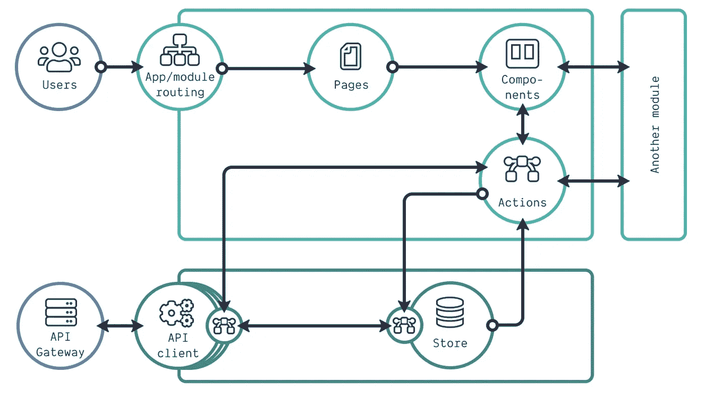
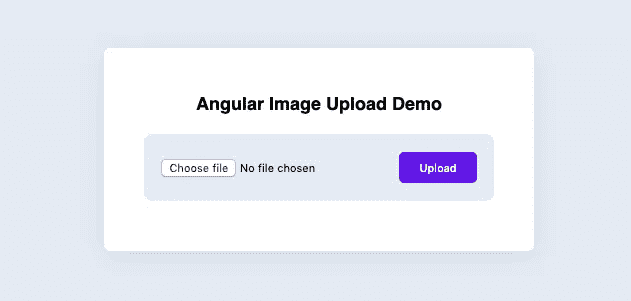

# 如何用 Angular +开发文件上传器？网络核心

> 原文：<https://javascript.plainenglish.io/how-to-develop-file-uploader-with-angular-net-core-b7844a5cea92?source=collection_archive---------13----------------------->

## 使用文件上传构建应用程序的指南


Photo by [Dollar Gill](https://unsplash.com/@dollargill?utm_source=medium&utm_medium=referral) on [Unsplash](https://unsplash.com?utm_source=medium&utm_medium=referral)

今天，我们将开发所有常见应用程序中最重要的一部分，用于制作用户注册表单。

应用程序有时会要求我们上传文件。我们如何在我们的应用程序上实现同样的实现呢？在这篇文章中，我们将使用 Angular +。文件上传应用程序开发。

上传文件是大多数项目不可或缺的一部分。但是，在考虑文件上传方法时，您应该仔细评估项目的需求。您可以使用 Angular 组件手动上传文件，如 FormData、HttpClientModule 和 reactive forms。这些组件中的每一个都有不同的用途。


Photo by [Sincerely Media](https://unsplash.com/@sincerelymedia?utm_source=medium&utm_medium=referral) on [Unsplash](https://unsplash.com?utm_source=medium&utm_medium=referral)

# 用例

我们可以在几个用例中使用文件上传。这些是开发者开发文件上传的常见地方。这些使用案例如下:

## 教师

*   上传讲座演示文稿
*   给学生张贴讲课大纲(并给硬拷贝)
*   上传教学大纲
*   发布下周的内容
*   每周发布阅读材料
*   在学期开始时张贴课程材料

## 学生

*   上传分配以供提交
*   上传个人文件，如图片，以供共享
*   上传课程笔记、文章、演示幻灯片、pdf 等。为了分享

## 教学设计师

*   在课程网站上为教师张贴材料

## 高级上传

*   上传多个文件
*   上传文件，不考虑文件类型
*   上传大文件
*   上传并解压缩 zip 文件
*   上传文档的新版本(替换或保留原始版本)


Photo by [Markus Winkler](https://unsplash.com/@markuswinkler?utm_source=medium&utm_medium=referral) on [Unsplash](https://unsplash.com?utm_source=medium&utm_medium=referral)

## 今天要讨论的要点:

*   将文件存储在服务器位置
*   批量文件上传
*   二进制文件转换
*   从服务器位置获取文件
*   下载文件
*   上传时控制文件类型

# 我们开始吧

尝试安装 VS 代码和 Visual Studio 进行这个项目开发。

*   VSCode:角度开发
*   Visual Studio:。净核心发展



# 项目目录

```
**<< *Angular Frontend* >>****__** fileUploader.component.html**__** fileUploader.component.ts **<< *.NET Server backend* >>****__** FileController.cs **<< File Upload Path >>****__** D:\Resources\Images
```

# 前端

应用程序的前端是用 Angular 编写的。要使用 angular，您只需**安装 npm** ，然后安装 **angular CLI。**

> 角度应用

## 【fileUploader.component.html 

**文件上传**

**获取所有文件&下载**

## 文件上传程序.组件. ts



# 后端

这个应用程序的服务器是用。网芯。的。NET Core 社区版足够这个开发了。

> 。网络核心服务器

## FileController.cs

# 测试应用程序

现在，您可以通过本地浏览器测试您的应用程序，以确保它按预期运行。

# 摘要


Photo by [Ethan Hoover](https://unsplash.com/@ethanchoover?utm_source=medium&utm_medium=referral) on [Unsplash](https://unsplash.com?utm_source=medium&utm_medium=referral)

# 结论

希望您现在有足够的信息来试验 Angular 文件上传组件。如果你是这个过程的新手，确保在一个测试环境中进行实验，或者任何你可以从错误中安全学习的地方。继续尝试和学习不同类型的方法，直到你找到最适合你的混合方法。

感谢您通读我的指南，用 Angular 实现这个应用程序。如果你有任何疑问，请在评论中提出。很快会在新的主题中见到你，再见！

*更多内容看*[***plain English . io***](https://plainenglish.io/)