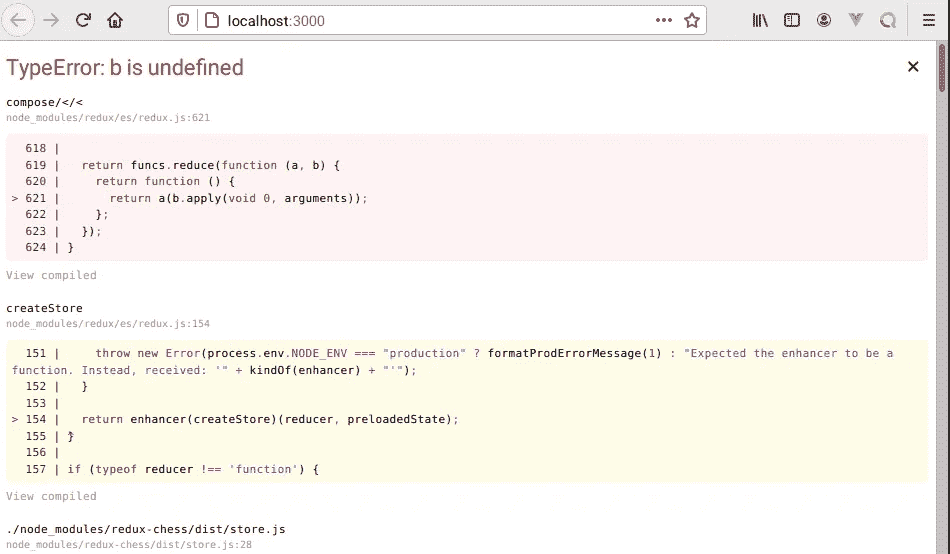

# 如何在生产中禁用 Redux DevTools

> 原文：<https://javascript.plainenglish.io/how-to-disable-redux-devtools-in-production-e07b7ed3142b?source=collection_archive---------3----------------------->

## 记得安装 Redux DevTools 扩展帮助器，以便进一步定制


Redux DevTools 是一个方便的浏览器扩展，可以拯救 React 开发者。它适用于 Chrome、Edge 和 Firefox，它确实有助于调试 React 应用程序的状态。

# 理论与实践

理论上，似乎你不需要安装任何额外的包就可以让 Redux DevTools 窗口显示在你最喜欢的浏览器上。

但是在实践中，一个叫做 [Redux DevTools Extension 的助手](https://www.npmjs.com/package/redux-devtools-extension)的包也必须安装在你的应用程序中，以便进一步定制，因为否则你将不可避免地遇到令人烦恼的浏览器问题。

这件事发生在我身上:

> 没有安装 Redux DevTools 扩展的浏览器刚刚在尝试运行我的 React 应用程序时报错。

例如，在 Chrome 上安装了 Redux DevTools 之后，我在 Firefox 上运行我喜欢的 React 应用程序时出现了以下错误。



**Figure 1**. TypeError: b is undefined

```
×
TypeError: b is undefined
compose/</<
node_modules/redux/es/redux.js:621618 | 
  619 |   return funcs.reduce(function (a, b) {
  620 |     return function () {
> 621 |       return a(b.apply(void 0, arguments));
  622 |     };
  623 |   });
  624 | }createStore
node_modules/redux/es/redux.js:154151 |     throw new Error(process.env.NODE_ENV === "production" ? formatProdErrorMessage(1) : "Expected the enhancer to be a function. Instead, received: '" + kindOf(enhancer) + "'");
  152 |   }
  153 | 
> 154 |   return enhancer(createStore)(reducer, preloadedState);
      | ^  155 | }
  156 | 
  157 | if (typeof reducer !== 'function') {./node_modules/redux-chess/dist/store.js
node_modules/redux-chess/dist/store.js:2825 | // See [https://github.com/programarivm/testing-redux-chess](https://github.com/programarivm/testing-redux-chess)
  26 | 
  27 | 
> 28 | var store = (0, _redux.createStore)(_rootReducer2.default, (0, _redux.compose)((0, _redux.applyMiddleware)(_reduxThunk2.default), window.__REDUX_DEVTOOLS_EXTENSION__ && window.__REDUX_DEVTOOLS_EXTENSION__()));
  29 | 
  30 | exports.default = store;__webpack_require__
/home/standard/projects/testing-redux-chess/webpack/bootstrap:851848 | 
  849 | __webpack_require__.$Refresh$.init();
  850 | try {
> 851 |  modules[moduleId].call(module.exports, module, module.exports, hotCreateRequire(moduleId));
      | ^  852 | } finally {
  853 |  __webpack_require__.$Refresh$.cleanup(moduleId);
  854 | }fn
/home/standard/projects/testing-redux-chess/webpack/bootstrap:150...(anonymous function)
[http://localhost:3000/static/js/main.chunk.js:1:91](http://localhost:3000/static/js/main.chunk.js:1:91)
This screen is visible only in development. It will not appear if the app crashes in production.
Open your browser’s developer console to further inspect this error.  Click the 'X' or hit ESC to dismiss this message.
```

你听起来熟悉吗？

所以，理论是这样的:

实际上，这就是如何在生产中禁用 Redux DevTools:

```
npm install --save redux-devtools-extension
```

# 解决方案:引导 Redux 存储

如前所述，确保从 npm 安装`redux-devtools-extension`包。记住，它可能看起来像一个可选的包，但实际上是引导 Redux 存储所必需的。

商店应该根据应用程序运行的环境进行不同的初始化——您最不希望的就是拥有一个如下所述的商店。

让我们回顾一下。

实际上，Redux DevTools 仅在安装了扩展的浏览器上才在开发环境中激活，然而该应用程序也可以在没有扩展的浏览器上运行。

有趣的是，你可能也想在产品中包含这个扩展，在这种情况下，我推荐你阅读 Mihail Diordiev 的[在产品中使用 Redux DevTools](https://medium.com/@zalmoxis/using-redux-devtools-in-production-4c5b56c5600f)。其他作者如 [Daniel Bugl](https://medium.com/u/5b3c1d134ac8?source=post_page-----e07b7ed3142b--------------------------------) 建议 [Redux DevTools 应该被排除在产品](https://www.oreilly.com/library/view/learning-redux/9781786462398/004b5cd2-7934-44d0-aec5-80f50154a476.xhtml)之外。

有人可能会认为，这是现代 JS 对逻辑思维提出的又一个有趣的挑战。

放心吧！一切都会好的。

## 您可能还对以下内容感兴趣:

[](https://medium.com/geekculture/are-ancient-web-apps-better-than-modern-javascript-b055386cf8db) [## 古代的 Web Apps 比现代的 JavaScript 好吗？

### 让我们回到 90 年代来找出答案

medium.com](https://medium.com/geekculture/are-ancient-web-apps-better-than-modern-javascript-b055386cf8db) [](/only-a-genius-developer-can-answer-this-question-2edc92e39617) [## 天才开发者知道这个问题的答案

### 与其他开发者分享一个具有启发性的悖论

javascript.plainenglish.io](/only-a-genius-developer-can-answer-this-question-2edc92e39617) [](https://medium.com/geekculture/tdding-a-react-app-with-jest-the-easy-way-8ddb64aeaba6) [## t 用 Jest 以最简单的方式开发 React 应用程序

### 毕竟，TDD 是关于坚持一种帮助你节省大脑能量的做事方式

medium.com](https://medium.com/geekculture/tdding-a-react-app-with-jest-the-easy-way-8ddb64aeaba6) 

*更多内容看*[***plain English . io***](http://plainenglish.io)