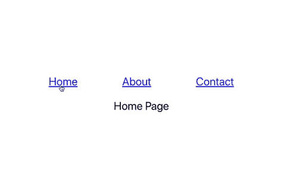
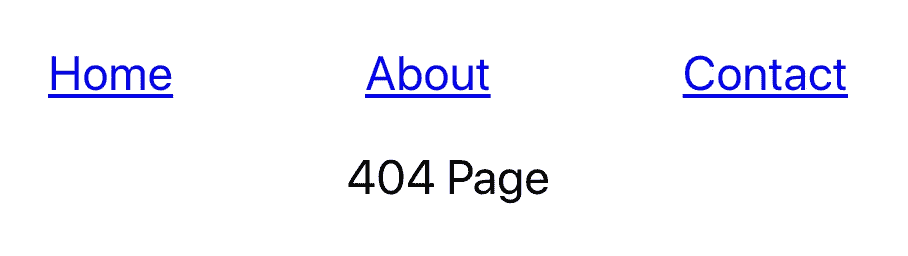

# 如何用 React 和 React 路由器显示 404 页面

> 原文：<https://javascript.plainenglish.io/how-to-display-a-404-page-with-react-and-react-router-d16d66703e5e?source=collection_archive---------2----------------------->

## 用 404 页面捕捉所有未知路线


Photo by [Erik Mclean](https://unsplash.com/@introspectivedsgn?utm_source=medium&utm_medium=referral) on [Unsplash](https://unsplash.com?utm_source=medium&utm_medium=referral)

404 错误是浏览互联网时遇到的最容易识别的错误之一。它来自 HTTP 响应状态代码错误。如果用户试图访问断开的或不存在的链接，网站托管服务器将生成“404 未找到”错误。

你访问的所有网站都可能有某种形式的 404 页面。例如，在 Medium 上，404 页看起来像这样。


在本文中，我们将了解如何创建一个 404 页面，并使用 React 路由器捕获所有不存在的路由。

如果您是 React 路由器的新手，请查看下面的文章开始使用。

[](/tutorial-and-beginners-guide-to-react-router-ee19ca31d7d) [## React 路由器教程和初学者指南

### 如何在 React web 应用程序中使用客户端路由

javascript.plainenglish.io](/tutorial-and-beginners-guide-to-react-router-ee19ca31d7d) 

# 创建导航栏

第一步是使用`create-react-app`创建一个基本的 React 应用程序。然后你需要在你的项目中运行`npm install react-router-dom`来安装 [React 路由器](https://www.npmjs.com/package/react-router-dom)。

我们想要从`react-router-dom`导入一些组件到`App.js`文件中。

```
import { Route, Switch, Link } from 'react-router-dom';
```

首先，我们将创建一个导航栏。我们的导航将有三个链接到*主页、关于*和*联系*页面。为了创建这个导航，我们将使用来自`react-router-dom`的`Link`组件。

```
export default function App() {
  return (
    <div *className*="App">
      <ul>
        <li>
          <*Link* *to*="/">Home</*Link*>
        </li>
        <li>
          <*Link* *to*="/about">About</*Link*>
        </li>
        <li>
          <*Link* *to*="/contact">Contact</*Link*>
        </li>
      </ul>
    </div>
  );
}
```

我还添加了一点样式，使应用程序看起来更好一点。当我们运行我们的项目时，这将导致下面的输出。


# 处理路线

接下来，我们将添加路线。现在，我们将只添加描述我们所在页面的文本。为此，我们将使用来自`react-router-dom`的`Switch`组件和`Route`组件。

```
<*Switch*>
  <*Route* *path*="/contact">Contact Page</*Route*>
  <*Route* *path*="/about">About Page</*Route*>
  <*Route* *path*="/" *exact*>Home Page</*Route*>
</*Switch*>
```

通过在`Switch`组件中添加路线，它将呈现第一条匹配的路线。请注意，我们还在“/”路线上添加了*精确的*道具。这很重要，因为我们希望主页只呈现在“/”路径上。如果没有*精确的*属性，这实际上会匹配所有的路线，这是我们不想要的。

现在，如果我们回到我们的应用程序，我们将看到当我们单击一个链接时，相关的文本呈现在页面上。



如果我们碰巧去了一个不存在的路由，我们会看到一个空页面。例如，如果我们转到[*http://localhost:3000/hello*](http://localhost:3000/hello)，屏幕上将不会呈现任何内容。让我们通过添加一个 404 页面来解决这个问题。

# 404 页

最后，我们将添加一个 404 页面，并捕获所有不存在的路由。为此，我们将在我们的`Switch`组件中添加一条最终路线作为子路线。

```
<*Switch*>
  <*Route* *path*="/contact">Contact Page</*Route*>
  <*Route* *path*="/about">About Page</*Route*>
  <*Route* *path*="/" *exact*>Home Page</*Route*>
  **<Route>404 Page</Route>**
</*Switch*>
```

如果我们添加没有路径的路由，它将总是匹配的。因此，此路线必须放在最后一个孩子。任何不匹配上述路由之一的路由都将呈现 404 页面。

如果我们回到我们的应用程序，去一个未知的路线，我们会看到一个 404 页面。例如，如果我们回到[*http://localhost:3000/hello*](http://localhost:3000/hello)*，*我们现在会看到下面的页面。



# 结论

感谢阅读！我希望这篇文章对您在 React 应用程序中设置 404 页面有所帮助。

当用户访问一个不存在的路由时，显示一个 404 页面比什么都没有要好的多。

404 页是展示你创造力的好机会。好好享受吧！查看这个[链接](https://www.canva.com/learn/404-page-design/)获得一些有创意的 404 页面想法。

**更多阅读**

[](https://blog.devgenius.io/the-easiest-way-to-deal-with-forms-in-react-ad6bc1250829) [## React 中处理表单的最简单方法

### 使用 React 钩子形式来提高应用程序的性能

blog.devgenius.io](https://blog.devgenius.io/the-easiest-way-to-deal-with-forms-in-react-ad6bc1250829) [](/introduction-to-testing-in-react-with-jest-and-react-testing-library-c1c32bb11739) [## React with Jest 和 React 测试库中的测试介绍

### create-react-app 中的 App.test.js 和 setupTests.js 文件是用来做什么的？

javascript.plainenglish.io](/introduction-to-testing-in-react-with-jest-and-react-testing-library-c1c32bb11739) 

*更多内容请看*[***plain English . io***](http://plainenglish.io/)