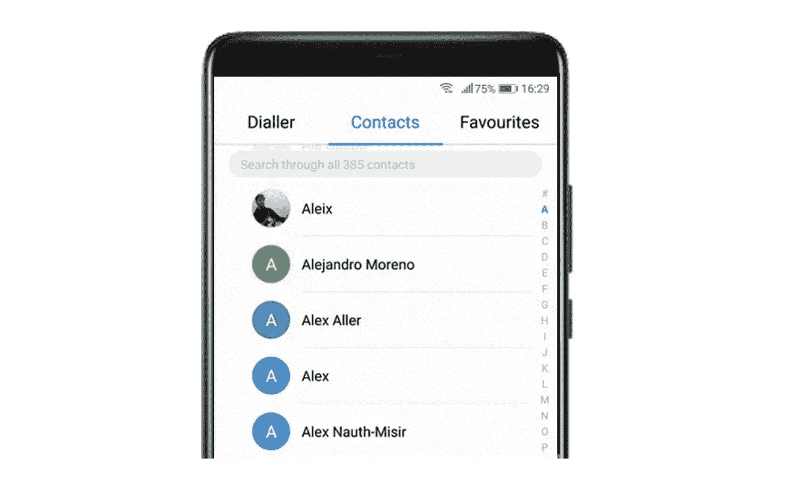
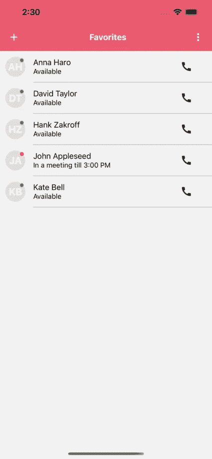

# 如何在 React Native 中使用 FlatList 显示联系人

> 原文：<https://javascript.plainenglish.io/how-to-display-contacts-using-flatlist-in-react-native-a0a558602144?source=collection_archive---------1----------------------->



Contact list ([Source](https://www.justinmind.com/blog/prototyping-a-mobile-contact-list-5-ui-design-tips/))

# 介绍

在这篇文章中，我将带您了解在 React 本地应用程序中显示大型联系人列表的过程。有很多例子可以说明如何做到这一点，但这篇文章应该是真实应用程序场景中联系人列表非常大的完整例子。我将在这篇文章中讲述以下内容:

*   获取并显示设备中的所有联系人
*   使用 Redux 在本地缓存联系人列表
*   使用`FlatList`,仅加载屏幕上当前可见的元素。它允许你加载一个大的联系人列表，而不用担心性能。

# 先决条件

在我们进入代码之前，您需要安装几个 npm 包，并为 Android 和 iOS 设置读取联系人权限。

## 安装 NPM 软件包

安装这些用于获取联系人并将其保存在本地存储中的包。

```
npm install react-native-contacts react-redux redux-persist
```

## 更新权限

**安卓**

更新`AndroidManifest.xml`以添加`READ_CONTACTS`权限。

```
<uses-permission android:name="android.permission.READ_CONTACTS" />
```

**iOS**

更新 iOS app 文件夹中的`Info.plist`添加以下键值。

```
<key>NSContactsUsageDescription</key>
<string>This app requires access to the contact list</string>
```

在这篇文章中，我们将使用`react-native-contacts` npm 包从设备中获取联系人。有关如何配置软件包的更多详细说明，请参考他们的文档。

[](https://github.com/morenoh149/react-native-contacts) [## GitHub-morenoh 149/React-Native-Contacts:React 本地联系人

### 要投稿，请阅读 CONTRIBUTING.md。在 stackoverflow 上提问，而不是在问题跟踪器上提问。getAll 是一个数据库…

github.com](https://github.com/morenoh149/react-native-contacts) 

# 反应组分

让我们为联系人`Avatar`和`ListItem`创建单独的组件，我们将在稍后实现联系人列表页面时使用它们。

## 为用户头像创建一个反应组件

只需用下面的代码片段创建一个新的`Avatar.js`文件来渲染联系人头像。

## 为 ListItem 创建 React 组件

接下来，让我们创建一个`ListItem`组件，它将用于呈现列表中的联系人项目。您可以修改组件以满足应用程序的要求。

现在，我们已经创建了助手组件，让我们在开始联系人列表页面的实际实现之前完成 redux 设置。

# Redux 设置

联系人需要几秒钟才能从设备中获取，因此最好获取一次，将其保存在应用程序存储中，并定期同步。

为了存储联系人，我们将使用`Redux`和`Redux-persist`。按照以下步骤，设置 redux 动作，减少和存储。

## 创建 Redux 操作

首先，让我们创建一个 redux 动作来同步联系人。

## 创建一个 Redux Reducer

接下来，添加一个通过更新`state`来处理`SYNC_CONTACTS`动作的`contactsReducer`。

## 根部减速器

接下来，让我们创建一个根 reducer，它可以用来在应用程序中组合多个 reducer。在这个示例中，我们只有一个减速器，但是将来您可能想要添加多个减速器，以便可以预先设置它。

## Redux 持久存储

最后，创建一个`store`和一个`persistedStore`，它们使用我们上面创建的 root reducer。我们将`AsyncStorage`用于持久化，它将使用应用程序的本地存储来保存应用程序会话间的状态。

# 实施联系人列表页面

现在我们有了助手组件和 redux 设置，是时候最终实现联系人列表页面了。

## 在联系人列表页面中使用 Redux

让我们创建一个准系统，联系人列表类组件，用于同步和显示联系人。注意，我们使用`mapStateToProps`和`mapDispatchToProps`来连接 Redux。

## 检查联系人权限

接下来，让我们实现`syncContacts`方法，它将检查权限并加载联系人。我们只需要在 Android 上进行明确的权限检查。iOS 会自动处理它，如果尚未授予权限，会提示用户授予权限。

## 获取和加载联系人

我们刚刚实现的`syncContacts`方法调用`loadContacts`方法从设备中获取联系人。

我们发出一个`Contacts.getAll`调用来获取联系人，然后整理结果，只保留相关信息。查看 npm 包的[文档](https://github.com/morenoh149/react-native-contacts#example-contact-record)以查看样本联系项目。

一旦获取了联系人，我们调用`syncContacts` redux 动作，这将触发 reducer 更新状态。

## 使用平面列表呈现联系人

最后，让我们在 UI 上呈现联系人。我们将使用平面列表来显示联系人，而不是使用`ScrollView`,因为它在处理大型列表时更有效。它支持拉刷新，滚动加载和许多其他很酷的功能，可以用来进一步定制列表。查看[文档](https://reactnative.dev/docs/flatlist)了解更多详情。

注意，我们使用了一个助手方法`getAvatarInitials`作为联系人的占位符，它不包含缩略图。下面是该方法的代码。

## 在应用程序中使用持久存储

最后，让我们在`App.js`文件中连接持久存储，并在其中呈现`ContactList`组件。

注意:

*   我们将`react-navigation`和`react-native-paper`一起用于导航和应用程序栏，但它是完全可选的。如果你对集成这些库感兴趣，可以看看这个教程。
*   我们将`persistor`传递给`PersistGate`，它将为我们连接持久存储。

就是这样。运行应用程序，看看神奇！联系人列表应该显示在你的应用程序中，它应该工作得相当顺利。`ListItem`组件可以随意定制。这里有一个这样的定制截图。



Contact List using React Native

# 结论

在这篇文章中，我们学习了如何在 react-native 应用程序中显示一个大的联系人列表，并在本地缓存条目以实现快速重载。Github 上有完整的源代码可供参考。感觉感觉分叉/克隆应用程序以获得一个工作解决方案，您可以使用它作为您的应用程序的入门模板。

[](https://github.com/bakshiutkarsha/react-contacts-flat-list) [## GitHub-bakshiutkarsha/react-联系人-平面列表

### 在 GitHub 上创建一个帐户，为 bakshiutkarsha/react-contacts-flat-list 开发做出贡献。

github.com](https://github.com/bakshiutkarsha/react-contacts-flat-list) 

考虑成为中级会员[继续阅读我所有的优质文章以及数千篇其他故事。](https://utkarshabakshi.medium.com/membership)

你可以在这个[列表](https://utkarshabakshi.medium.com/list/react-native-development-0d5f690f6585)中找到我关于 React Native development 的其他文章。

*更多内容看* [***说白了. io***](http://plainenglish.io)