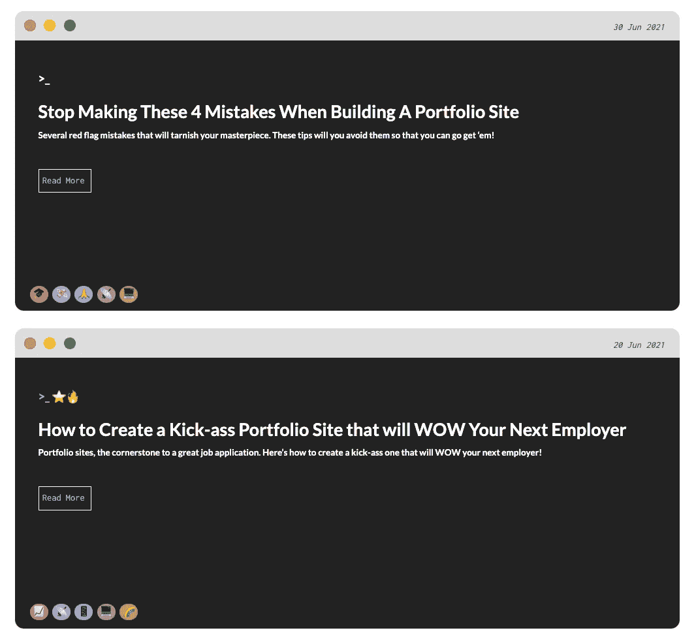
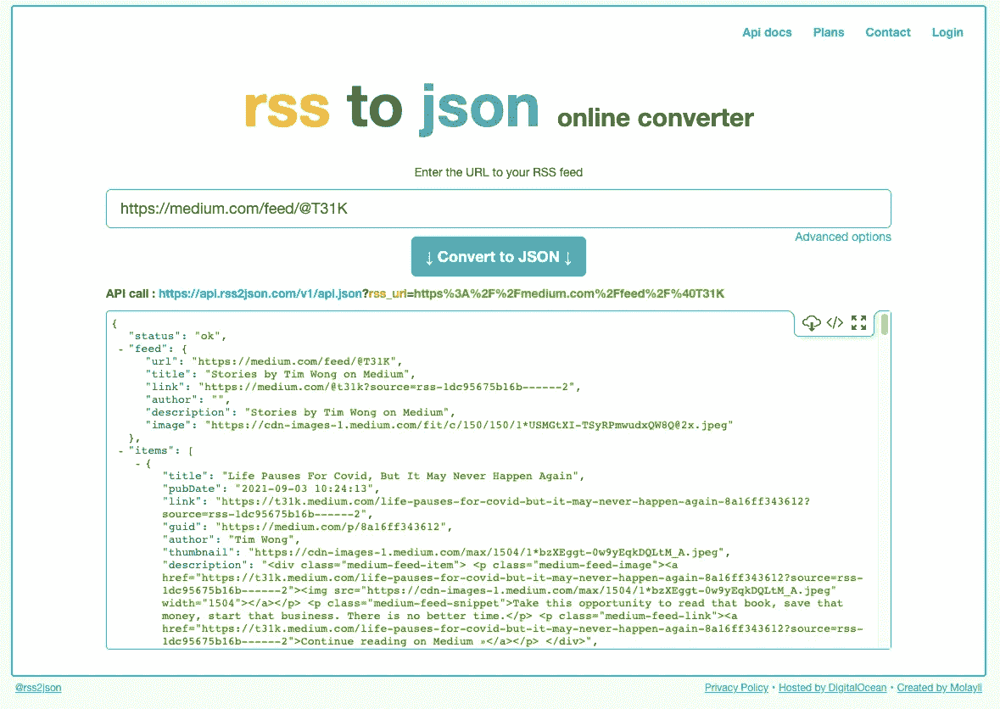

# 如何在你的网站上显示中型文章

> 原文：<https://javascript.plainenglish.io/how-to-display-medium-posts-on-your-website-1be84713b4ce?source=collection_archive---------12----------------------->

博客提升了你的开发者组合网站，使其在其他几个普通网站中脱颖而出，所以今天我将分享如何在你的网站上展示你的媒体文章。我将它们显示在这些用 CSS 绘制的小终端窗口中。当然，您可以随意复制和修改代码。

我们将使用下面的:
✅ HTML
✅ CSS
✅ jQuery(为什么不呢？)
✅date-fns
✅RSS 2 JSON
✅有些耐心😜

❗️注意到，这种方法只限于检索你的 10 篇(最新的)文章

## **第一步**

Medium 为我们提供了一个 RSS 提要来检索您的帖子(限于 10 个)，但我们需要将其转换为 JSON，以便我们可以更容易地操作它。

转到 [*rss2json*](https://rss2json.com/#rss_url=https%3A%2F%2Fnews.ycombinator.com%2Frss) 并粘贴你的媒体源 URL。应该是`[https://medium.com/feed/@](https://medium.com/feed/@){username}/`的格式

## 第二步

使用提供的这个 API 端点，我们可以发出一个简单的请求，但是首先让我们初始化这两个变量，以便以后方便地访问。

## **第三步**

使用 jQuery，我们发出 GET 请求来检索我们的帖子。如果响应正常，我们将把整个对象放入变量`res`

注意，之后的步骤都在`.map`函数中，如第 8–10 行所示。

## 第四步

`.map`函数将*将函数*映射到对象中的每一项，所以本质上我们将为每一篇文章做一组东西。

因为我们要为每篇文章制作一个终端窗口，所以我制作了这个函数`addWindow`，为每篇文章在我的文档中添加一个`div`。

❗️制作这个终端窗口的 CSS(以及里面的一切)可以在这里找到*。*

*当然，我们希望帖子动态地包含信息。所以我们给每个窗口一个`id`,这样我们就可以用 jQuery 轻松定位它们。每个窗口还会有一些带`class`的文本。这些信息是:*

1.  *标题*
2.  *描述*
3.  *日期*
4.  *链接到文章(在介质上)*
5.  *类别标签(可选)*

## ***第五步***

*现在让我们在每次迭代中提取这些数据，并将它们添加到我们的博客文章窗口中。我们将使用 [*对象析构*](https://developer.mozilla.org/en-US/docs/Web/JavaScript/Reference/Operators/Destructuring_assignment) 以获得更清晰的语法。这是代码，让我们一个一个来看。*

***5.1*。标题***
抢标题。有些标题被用`&amp`而不是`&`弄乱了，所以我们用`replace`清理它，然后我们把它附加到标题标签上。*

****5.2。描述***
没什么花里胡哨的，就是抢了标题追加一下。*

***5.3*。日期***
我们将使用 [*date-fns*](https://date-fns.org/) 将日期格式化为我们想要的格式，然后当然会将它附加到日期标签上。*

****5.4。链接*** 由于帖子不包含实际内容，用户仍需前往 Medium 阅读完整帖子。我们可以使用提供的链接，并通过`href`属性将它附加到我们的锚标签上。*

***5.5*。Categories(可选)***
这是一个可选步骤，但是因为 Medium 为文章提供了 categories 标签，所以我们也可以添加它。这里我们可以使用一个简单的 for 循环来遍历数组，并将它们添加到我们的标签列表中。*

*当我使用表情符号时，我添加了工具提示，让用户可以将鼠标悬停在表情符号上，以查看标签实际上是什么(第 23 行)。*

## ***第六步***

*敬畏你的杰作，因为如果你做对了一切(没有错误😜)，它看起来应该是这样的:*

**

## *最后的想法*

*希望这个简短但简单的教程对您有所帮助&再次请随意修改它，根据您的个人喜好进行定制。你也可以看现场@[*t31k.dev/blog*](https://t31k.dev/blog)。*

*像往常一样，保重，下次再见。
~蒂姆*

*请考虑给我买一杯☕️咖啡。
加入我的媒体邮件列表[这里](https://t31k.medium.com/subscribe/)📪
当我[发帖](https://t31k.dev/newsletter)(非中等会员)时收到邮件💌*