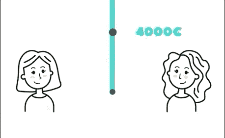
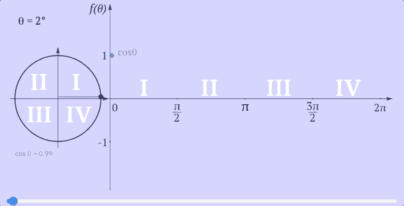
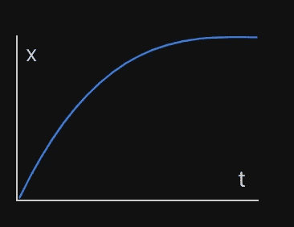
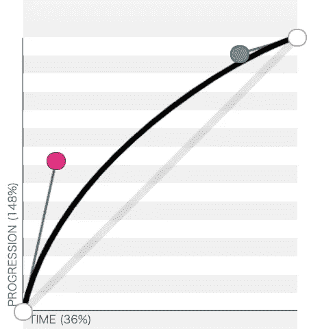

# 如何用 JavaScript 和 Remotion 创建振荡动画

> 原文：<https://javascript.plainenglish.io/how-to-do-an-oscillation-animation-with-remotion-f6aeb313f6a9?source=collection_archive---------7----------------------->

## 或者如何使用数学函数来制作跳转循环动画


Photo by [Benjamin Lizardo](https://unsplash.com/@benji3pr?utm_source=medium&utm_medium=referral) on [Unsplash](https://unsplash.com?utm_source=medium&utm_medium=referral)

本文是远程系列文章的一部分。由 [JonnyBurger](https://medium.com/u/a6c9cee7d1f2?source=post_page-----ae0fac09a0e3--------------------------------) 使用 React 和 FFmpeg 创建的视频创建库。

你可以在这篇文章的末尾找到这篇文章的摘要和完整的动画。

# 我们将在本文中创建什么



我们将需要动画的图像沿垂直轴创建一个跳跃的动画。

和前面的文章一样，我们将文章分解成三个部分:

*   要制作动画的 React 组件；
*   一些 CSS 样式和转换组件；
*   一个处理所有动画 JavaScript 代码的函数。

# React 和 CSS

让我们使用一个带有 transform translateX 值的图像组件。

```

```

正如您在这个代码示例中看到的，Remotion 提供了一个 react 组件。

下面是[文档](https://www.remotion.dev/docs/use-img-and-iframe)的陈述:“*更喜欢移除* `[**](https://www.remotion.dev/docs/img)` *和* `[*<IFrame />*](https://www.remotion.dev/docs/iframe)` *标签，而不是本地 HTML 元素。这将确保渲染暂停，直到所有资源都被实际加载。您最不希望看到的就是您的视频出现闪烁的画面！”*

transform 属性将允许我们沿着垂直轴移动图像。

因此，让我们深入研究将使我们的 **verticalTranslateValue** 动画化的代码

# 跳转动画挂钩

The jump animation code

这是代码。我们可以把它分成三部分:

*   框架
*   跳跃循环
*   translateY 返回值

## 框架

Remotion 独立渲染每一帧，并且可以并行渲染。

所以每个动画都需要基于帧数，而不是基于时间。

我们使用钩子 useCurrentFrame 来知道当前帧，然后知道在整个动画中的位置。

## 跳跃循环

好，让我们从余弦数学函数开始



[https://www.mathwarehouse.com/animated-gifs/trigonometry.php](https://www.mathwarehouse.com/animated-gifs/trigonometry.php)

当您增加传递给余弦函数的输入值时，它将从[-1，1]的值开始无限循环。

因此，将帧编号值传递给 cos()将导致获得一个循环值:

```
Math.cos(frame) ∈ [-1, 1]
```

因为`Math.cos()`每 2 个 **π做一个“完整的循环”。**跳转动画会太快。

我发现跳跃动画的速度很快，系数为 0.4。因此，它可以使用 fps 和我想要的完整跳跃周期的帧持续时间来计算。

现在让我们添加一些延迟:

```
const jumpingAnimation = frame > delay ? Math.cos(frame * 0.4) : -1;
```

您可以将延迟值视为我希望动画开始之前的帧数。

由于 *Math.cos()* 返回一个从[-1；1]当当前帧低于我们的延迟值时，我选择返回-1。

我们现在可以控制跳跃动画的开始和速度。我们仍需设定跳跃的幅度，并通过放松来增加一些真实感。

## 转换为垂直平移值

来自[-1；1]值，我们希望从[0；-50].

是的，您可能猜对了，我们将使用[插值函数](https://www.remotion.dev/docs/interpolate):

```
interpolate(jumpingAnimation, [-1, 1], [0, -50])
```

[JonnyBurger](https://medium.com/u/a6c9cee7d1f2?source=post_page-----f6aeb313f6a9--------------------------------) 在插值函数上做了一个[很棒的视频](https://www.youtube.com/watch?v=sff_CdWw_-c)。如果您想了解更多直观的解释，请查看。

我也在本文中解释了插值设置的一部分:

[](https://florentpergoud.medium.com/how-i-successfully-created-a-simple-fade-out-animation-with-remotion-da92815ea26e) [## 我如何成功地用 Remotion 创建了一个简单的淡出动画

### 基于帧数的插值函数示例

florentpergoud.medium.com](https://florentpergoud.medium.com/how-i-successfully-created-a-simple-fade-out-animation-with-remotion-da92815ea26e) 

## **模拟重力**

然后，我们将把我们的线性动画转换成轻松的动画。是的，让我们模拟重力。

插值函数接受一个配置对象作为第三个参数。我们使用上一篇文章中的设置对象来剪辑动画。

```
interpolate(
  ...firstTwoParameters,
  {
    extrapolateLeft: 'clamp',
    extrapolateRight: 'clamp',
  }
);
```

该参数对象还接受[宽松](https://www.remotion.dev/docs/easing)参数。

*[*easy API*](https://www.remotion.dev/docs/easing)*与* [【T21 反应原生】](https://reactnative.dev/docs/easing) *完全相同，文档已被复制过来。这一出色的 API 归功于他们。(* [*拆卸单*](https://www.remotion.dev/docs/easing/) *)**

*让我们回到我们的动画。我们需要模拟一次跳跃。可能有很多数学和科学计算出模拟 if 的最佳方式。*

*但是，当我创作这个动画的时候，我没有想到这一点。(呜呜)*

*我直接去了 https://easings.net/，试着想象什么是跳跃:*

**

*easeOutCubic from [https://easings.net/](https://easings.net/#easeOutCubic)*

*   *接近跳跃开始时最大的垂直速度*
*   *在跳跃的最高点，垂直速度几乎为零*
*   *秋天也是一样，但相反*

*放松立方体似乎是一个很好的起点。*

*我通过一些尝试和错误稍微调整了一下，然后我决定:*

```
*cubic-bezier(.12,.55,.79,.94)*
```

**

*[https://cubic-bezier.com/#.12,.55,.79,.94](https://cubic-bezier.com/#.12,.55,.79,.94)*

*然后我们使用 [Remotion Easing.bezier()](https://www.remotion.dev/docs/easing#bezier) 函数来缓和我们的值。*

```
*{
  easing: Easing.bezier(0.12, 0.55, 0.79, 0.94)
}*
```

*仅此而已！*

*The jump animation code*

*现在，您只需调用组件中的钩子，并将 translateY 值传递给组件！*

*你可以在下面找到这个系列关于动画的另一部分:*

***第一部分:动画中的 Pop***

*[](https://florentpergoud.medium.com/how-to-created-an-pretty-pop-in-animation-with-remotion-ae0fac09a0e3) [## 如何用 Remotion 创建一个整洁的弹出动画

### 远程视频创作的简单介绍

florentpergoud.medium.com](https://florentpergoud.medium.com/how-to-created-an-pretty-pop-in-animation-with-remotion-ae0fac09a0e3) 

**第二部:淡出动画**

[](https://florentpergoud.medium.com/how-i-successfully-created-a-simple-fade-out-animation-with-remotion-da92815ea26e) [## 我如何成功地用 Remotion 创建了一个简单的淡出动画

### 基于帧数的插值函数实例

florentpergoud.medium.com](https://florentpergoud.medium.com/how-i-successfully-created-a-simple-fade-out-animation-with-remotion-da92815ea26e) 

**全系列文章:【即将推出】**

如果您有任何问题，请留下您的评论，或随时通过 [Twitter](https://twitter.com/FlorentPergoud) 联系我，或加入我们的 [Remotion Discord](https://discord.com/invite/6VzzNDwUwV) ！

*更多内容请看*[***plain English . io***](https://plainenglish.io/)*