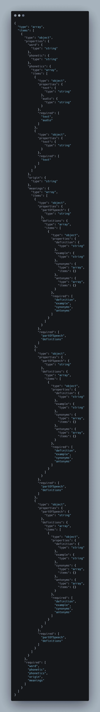
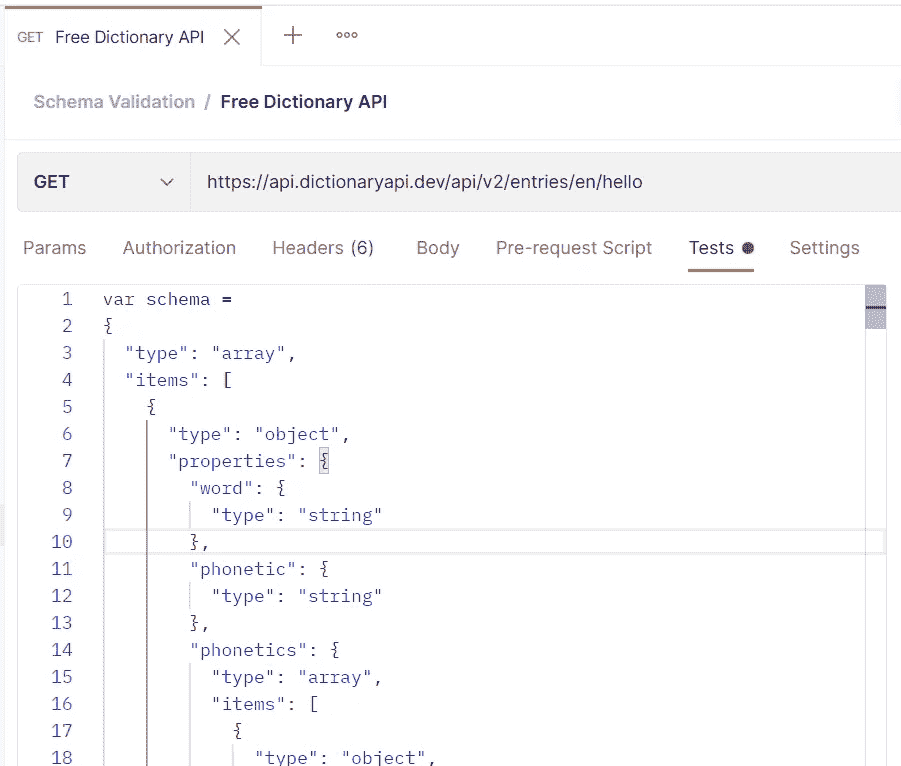

# 如何在 Postman 中执行模式验证

> 原文：<https://javascript.plainenglish.io/how-to-do-schema-validation-in-postman-d7209f4159d0?source=collection_archive---------1----------------------->

## REST API 指南

## JSON 模式验证的定义以及如何在 Postman 中断言。

# 什么是 JSON 模式？


JSON (JavaScript Object Notation)是一种简单、轻量级的基于文本的数据格式。JSON 模式是一种基于 JSON 的格式规范，用于定义 JSON 数据的结构。它是根据 2011 年到期的 IETF 草案编写的。


简而言之，JSON 模式的主要用途是描述 JSON 文档的结构和验证约束。与允许创建自定义方言的 XML 相比，JSON 没有那么通用和灵活，然而，它也不想这样。JSON 旨在以简洁的方式描述分层数据结构，由于冗长的语法，XML 通常被认为不如 JSON 合适。

我们在 JSON 模式中使用了不同的关键字。让我们来看看几个常用且重要的关键词，它们是关于什么的:

*   ***$schema*** :声明该模式是根据草案 v4 规范编写的。
*   ***$id*** :定义基本 URI 以解析模式中的其他 URI 引用。
*   ***标题*** :描述模式的意图/标题。
*   ***描述*** :给出模式的简短描述。
*   ***类型*** :定义数据的类型。它定义了 JSON 数据的第一个约束。
*   ***属性*** :定义 JSON 文档中的各种键及其值类型。
*   ***最小值*** :定义数值数据类型的最小可接受值。
*   ***最大值*** :定义数值数据类型可接受的最大值。
*   ***项*** :枚举数组中可以出现的项的定义。
*   ***必需*** :列出必需和强制的按键。

JSON 模式的一些优点是:

*   它描述了现有的数据格式。
*   它是清晰的，人和机器可读的。
*   完成结构验证并在自动化测试中有用。
*   有助于验证客户提交的数据。

关于 JSON 模式的更多细节，请访问[json-schema.org。](https://json-schema.org/)

我们知道 JSON 是目前 REST API 调用中广泛使用的格式。基于此，我们需要检查响应模式是有效还是无效。当然，这是《邮差》中的论断之一。

让我们详细看看如何在 Postman 中处理模式验证。我们将使用内置的 JavaScript 库( [AJV](https://ajv.js.org/) )来验证 JSON 模式。

步骤 1:根据我们从文档/开发人员那里得到的样本响应，我们需要生成模式。对于简单的响应，您可以通过理解响应来手动创建，对于较大的 JSON 响应，我们可以选择使用在线 JSON 模式生成器工具，如下所示。

https://www.jsonschema.net/

[https://www . liquid-technologies . com/online-JSON-to-schema-converter](https://www.liquid-technologies.com/online-json-to-schema-converter)

第二步:我们将继续进行[https://www.jsonschema.net/](https://www.jsonschema.net/)。

一旦您登录并打开链接，它将如下所示。

这里显示了示例 JSON 和模式。


步骤 3:您可以将从 developer/API 文档中收到的 API 响应示例粘贴到左侧面板中。通过点击“提交”,您将在右侧面板看到 JSON 模式。



第 4 步:用端点[https://api.dictionaryapi.dev/api/v2/entries/en/hello](https://api.dictionaryapi.dev/api/v2/entries/en/hello)创建一个集合和一个请求。我们将使用这个公共 API，因为嵌套数组的响应很复杂。


步骤 5:导航到“Tests”部分，创建一个变量“schema ”,并用 JSON schema generator 工具中生成的值进行赋值。

```
var schema = 
{
  "type": "array",
  "items": [
    {
      "type": "object",
      "properties": {
        "word": {
          "type": "string"
        },
        "phonetic": {
          "type": "string"
        },
        "phonetics": {
          "type": "array",
          "items": [
            {
              "type": "object",
              "properties": {
                "text": {
                  "type": "string"
                },
                "audio": {
                  "type": "string"
                }
              },
              "required": [
                "text",
                "audio"
              ]
            },
            {
              "type": "object",
              "properties": {
                "text": {
                  "type": "string"
                }
              },
              "required": [
                "text"
              ]
            }
          ]
        },
        "origin": {
          "type": "string"
        },
        "meanings": {
          "type": "array",
          "items": [
            {
              "type": "object",
              "properties": {
                "partOfSpeech": {
                  "type": "string"
                },
                "definitions": {
                  "type": "array",
                  "items": [
                    {
                      "type": "object",
                      "properties": {
                        "definition": {
                          "type": "string"
                        },
                        "example": {
                          "type": "string"
                        },
                        "synonyms": {
                          "type": "array",
                          "items": {}
                        },
                        "antonyms": {
                          "type": "array",
                          "items": {}
                        }
                      },
                      "required": [
                        "definition",
                        "example",
                        "synonyms",
                        "antonyms"
                      ]
                    }
                  ]
                }
              },
              "required": [
                "partOfSpeech",
                "definitions"
              ]
            },
            {
              "type": "object",
              "properties": {
                "partOfSpeech": {
                  "type": "string"
                },
                "definitions": {
                  "type": "array",
                  "items": [
                    {
                      "type": "object",
                      "properties": {
                        "definition": {
                          "type": "string"
                        },
                        "example": {
                          "type": "string"
                        },
                        "synonyms": {
                          "type": "array",
                          "items": {}
                        },
                        "antonyms": {
                          "type": "array",
                          "items": {}
                        }
                      },
                      "required": [
                        "definition",
                        "example",
                        "synonyms",
                        "antonyms"
                      ]
                    }
                  ]
                }
              },
              "required": [
                "partOfSpeech",
                "definitions"
              ]
            },
            {
              "type": "object",
              "properties": {
                "partOfSpeech": {
                  "type": "string"
                },
                "definitions": {
                  "type": "array",
                  "items": [
                    {
                      "type": "object",
                      "properties": {
                        "definition": {
                          "type": "string"
                        },
                        "example": {
                          "type": "string"
                        },
                        "synonyms": {
                          "type": "array",
                          "items": {}
                        },
                        "antonyms": {
                          "type": "array",
                          "items": {}
                        }
                      },
                      "required": [
                        "definition",
                        "example",
                        "synonyms",
                        "antonyms"
                      ]
                    }
                  ]
                }
              },
              "required": [
                "partOfSpeech",
                "definitions"
              ]
            }
          ]
        }
      },
      "required": [
        "word",
        "phonetic",
        "phonetics",
        "origin",
        "meanings"
      ]
    }
  ]
};
```



步骤 6:现在，为 JSON 模式检查添加断言。

```
const response = pm.response.json();
    pm.test('Schema is valid', () => {
        pm.expect(response).to.have.jsonSchema(schema);
    });
```


步骤 7:就这么简单，现在，一旦您单击 send，您就可以验证响应模式是否与我们在变量“schema”下定义的示例模式相匹配


现在让我们确保测试用例失败，让我们改变我们的模式。“音标”实际上是作为*字符串的*类型。


现在我们将它编辑为*整数。*


点击“保存”和“发送”。现在测试失败了！！


同样，如果样本模式和响应模式不匹配，测试也会失败。


在 Postman 现成的代码片段中，您可以注意到“对 JSON 数据使用微型验证器”。这几乎被否决，不建议使用。

因此，我们讨论了使用 Postman 处理 API 的模式验证。对于您的 API 测试，针对 API 响应的 JSON 模式验证是最重要的，并且必须对此进行检查。有许多在线工具可以验证 JSON 模式，但是最好将这个断言作为测试套件的一部分。


— — — — — — — — — — — — — — — — — — — — — — — — — — — — — — — — — —

*原载于*[*https://synapse-QA . com/2021/08/18/APIs-unleashed-05-schema-validation/*](https://synapse-qa.com/2021/08/18/apis-unleashed-05-schema-validation/)

*更多内容请看*[***plain English . io***](http://plainenglish.io/)